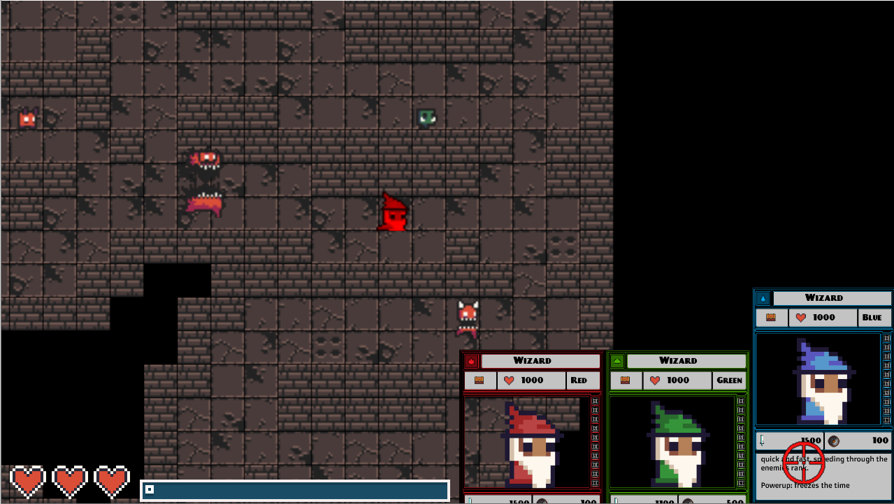
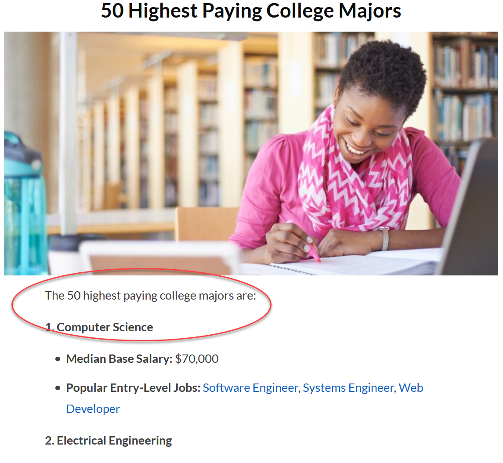
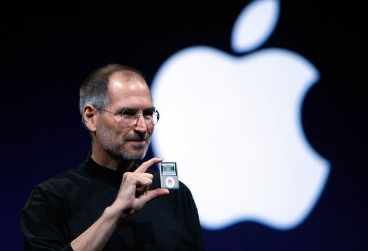

Foreword
========

.. image:: screen1.png
    :width: 27%

.. image:: screen2.png
    :width: 35%

This book teaches programming through creating 2D video games.
It covers all the standard topics in a normal first-semester college class,
but the projects are games. Video
games provide great visual feedback for your
code. Furthermore, programming can be *fun*.

Programming is consistently one of the top paid skills that you can learn.
It is also one of the most
flexible majors you can get. You can take your programming skills to almost
any industry, and any location.

Even if programming isn't going to be your main job, as a skill it can
still enhance your career. Need an interactive website? Need to crunch
sales numbers? What about automatically saving experiment data and graphing
results? Maybe you want your home to
automatically e-mail you if the garage door is left open?
Learning programming, be able to do this and more.

Programming Is For Everyone
---------------------------

With programming you get to *create*. Making beautiful graphics and designing
programs is an art. Good design requires people from all walks of life, and that's
one of the reasons Apple was able to gain a foothold in the computing industry:

.. epigraph::

    Picasso had a saying. He said, "Good artists copy, great artists steal."
    And we have always been shameless about stealing great ideas and I think
    part of what made the Macintosh great was that the people working on it were
    musicians and poets and artists and zoologists and historians who also happened
    to be the best computer scientists in the world.

    *Steve Jobs in PBS's "Triumph of the Nerds: The Rise of Accidental Empires" (1996)*

The artistry behind a program isn't just how it looks, but how it is *designed*.
How the interface between the human and the computer functions:

.. epigraph::

    Design is a funny word. Some people think design means how it looks. But of
    course, if you dig deeper, it's really how it works. The design of the Mac
    wasn't what it looked like, although that was part of it. Primarily, it was
    how it worked.

    *Steve Jobs in Wired's "The Next Insanely Great Thing" (1996)*

Programming requires all kinds of people. Successful programs require idea people,
business people, project people, artists, subject-matter experts, testers, writers,
and more. You may not have ever thought of yourself as a programmer, but you
*can* be.

Programming Pays Well
---------------------

Search up "top paid majors" and you'll see computer science is usually one
of the best paying degrees you can get.

In 2020 the National Association of Colleges and Employers (NACE) says that
`computer science majors are projected to have the highest starting salary <https://www.naceweb.org/job-market/compensation/computer-science-grads-projected-to-be-top-paid-in-major/>`_.
Payscale agrees, says
`computer science is second only to petroleum engineering <https://www.payscale.com/college-salary-report/majors-that-pay-you-back/bachelors>`_.
Learning to program is worth your time.

What Can You Create By The End Of The Course?
---------------------------------------------

Here are some videos of games students have created in prior semesters.
Students who didn't know any programming were able to create these games
by the time they finished the semester.

.. raw:: html

  <figure class='video_float_right'><iframe width="400" height="300" src="https://www.youtube.com/embed/videoseries?list=PLUjR0nhln8uYMKgRRhWk0cDhVd5Ev52T1" frameborder="0" allowfullscreen></iframe><figcaption>Video: Spring 2018 Game Projects</figcaption></figure>

  <figure class='video_float_right'><iframe width="400" height="300" src="https://www.youtube.com/embed/videoseries?list=PLUjR0nhln8ub1tPayFjz7w-LCTQ_gYs7V" frameborder="0" allowfullscreen></iframe><figcaption>Video: Spring 2017 Game Projects</figcaption></figure>

  <figure class='video_float_right'><iframe width='400' height='300' src='https://www.youtube.com/embed/videoseries?list=PLUjR0nhln8uYp9yKJnGdBN-66di_5G4d2' style='border:none;'></iframe><figcaption>Video: Summer 2015 Game Projects</figcaption></figure>

  <figure class='video_float_right'><iframe width='400' height='300' src='https://www.youtube.com/embed/videoseries?list=PLUjR0nhln8ubHF8yQe0kly1_00sM8S8Pv' style='border:none;'></iframe><figcaption>Video: Spring 2015 Game Projects</figcaption></figure>

  <figure class='video_float_right'><iframe width='400' height='300' src='https://www.youtube.com/embed/videoseries?list=PLUjR0nhln8uZmDrHG5TxL_GboYP1I16sr' style='border:none;'></iframe><figcaption>Video: Fall 2014 Game Projects</figcaption></figure>

  <figure class='video_float_right'><iframe width='400' height='300' src='https://www.youtube.com/embed/videoseries?list=PLUjR0nhln8uYkfd5FSGRfPIbA5BbK03Lb' style='border:none;'></iframe><figcaption>Video: Spring 2014 Game Projects</figcaption></figure>

  <figure class='video_float_right'><iframe width='400' height='300' src='https://www.youtube.com/embed/videoseries?list=PLUjR0nhln8uZZjNv16i-v5Sgi_spcoWQS' style='border:none;'></iframe><figcaption>Video: Fall 2013 Game Projects</figcaption></figure>

  <figure class='video_float_right'><iframe width='400' height='300' src='https://www.youtube.com/embed/videoseries?list=PLUjR0nhln8uYtUcblVH0fxKjobSsT32cp' style='border:none;'></iframe><figcaption>Video: Fall 2012 Game Projects</figcaption></figure>

  <figure class='video_float_right'><iframe width='400' height='300' src='https://www.youtube.com/embed/videoseries?list=PL3765F6910B016383' style='border:none;'></iframe><figcaption>Video: Spring 2012 Game Projects</figcaption></figure>

