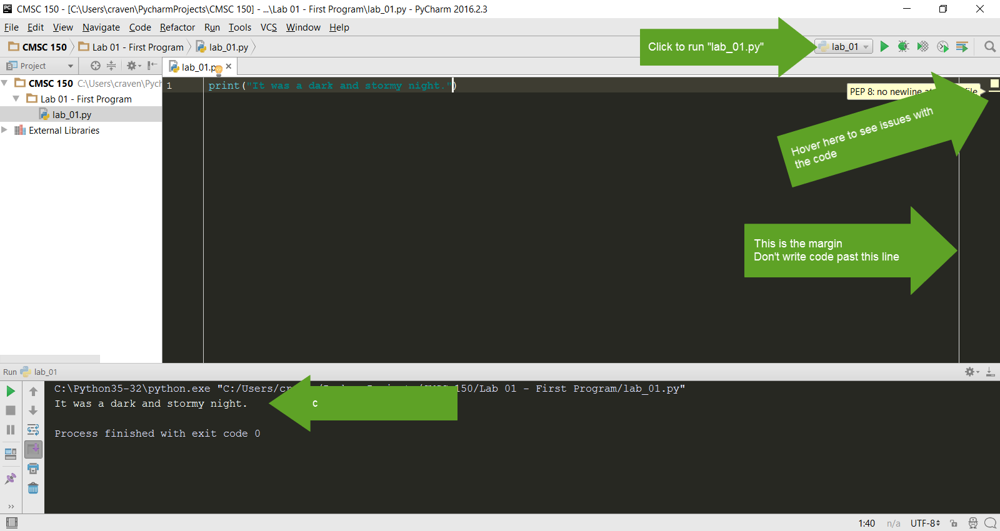

.. _print-function:

The ``print`` Function
----------------------

.. _print-hello-world:

Printing Hello World
^^^^^^^^^^^^^^^^^^^^

We will use a function called ``print`` to print to the screen.
``print`` is called a *function*.

You've already used functions
in mathematics. For example, **sin** and **cos**.
Functions are followed by parentheses: ``( )``.
We put the
function *parameter(s)* inside the parenthesis.

With a sine function, we put in an angle. With
the ``print`` function, we are going to put the text we want to print. Text must be enclosed in quotes.

::

    print("Hello there")

Note that case matters. The following will not work:

::

    Print("Hello there")

Great! Time to run it.
Right-click on the program and select "Run 'lab_01.py'"

Before we go on, note how the PyCharm window is put together.
See the output of your program at the bottom of the screen.
Click the image below to make it bigger and note the:

* Right margin. You can write code past this point, but don’t.
* Where you can hover your mouse for "hints" on how to make your code better.
* Where you can quickly click to run your program again.

Ok, now it's time to update our program. Go back to our program and improve
it by printing multiple lines, while quoting Snoopy's famous story:

.. _print-multiple-lines:

Multiple Print Lines
^^^^^^^^^^^^^^^^^^^^

Let's add additional code:

::

	print("It was a dark and stormy night.")
	print("Suddenly a shot rang out!")

Go ahead and run it to make sure it outputs as expected.

.. _escape-codes:

Escape Codes
^^^^^^^^^^^^

If quotes are used to tell the computer the start and end of the string of text you wish to print, how does a program
print out a set of double quotes? (This is a double quote ``"`` and this is a single quote ``'``.) For example:

.. code-block:: text

    print("I want to print a double quote " for some reason.")

This code doesn't work.
The computer looks at the quote in the middle of the string and thinks that is the end of the text.
Then it has no idea what to do with the commands for some reason and the quote and the end of the string confuses the
computer even further.

It is necessary to tell the computer that we want to treat that middle double quote as text, not as a quote ending the
string. This is easy, just prepend a backslash in front of quotes to tell the computer it is part of a string, not a
character that terminates a string. For example:

.. code-block:: python

    print("I want to print a double quote \" for some reason.")

This combination of the two characters ``\"`` is called an *escape code*. Almost every language has escape codes.
Here's another example:

.. code-block:: python

    print("Audrey Hepburn once said \"Nothing is impossible. The word itself says 'I'm Possible!'.\"")

This will print:

.. code-block:: text

    Audrey Hepburn once said "Nothing is impossible. The word itself says 'I'm Possible!'."

Because the backslash is used as part of an escape code, the backslash itself must be escaped if you want to use
one. For example, this code does not work correctly:

.. code-block:: python

    print("The file is stored in C:\new folder")

Why? Because ``\n`` is an escape code. To print the backslash it is necessary to escape it like so:

.. code-block:: python

    print("The file is stored in C:\\new folder")

There are a few other important escape codes to know. Here is a table of the important escape codes:

=========== =======================================
Escape code	Description
=========== =======================================
``\'``      Single Quote
``\"``	    Double Quote
``\t``	    Tab
``\r``	    CR: Carriage Return (move to the left)
``\n``	    LF: Linefeed (move down)
=========== =======================================

What is a "Carriage Return" and a "Linefeed"? Try this example:

.. code-block:: python

    print("This\nis\nmy\nsample.")

The output from this command is:

::

    This
    is
    my
    sample.

The ``\n`` is a linefeed. It moves "cursor" where the computer will print text down one line. The computer stores all
text in one big long line. It knows to display the text on different lines because of the placement of ``\n`` characters.

To make matters more complex, different operating systems have different standards on what makes a line ending.

=========== =======================================
Escape code	Description
=========== =======================================
``\r\n``    CR+LF: Microsoft Windows
``\n``      LF: UNIX based systems, and newer Macs.
``\r``      CR: Older Mac based systems
=========== =======================================

Ok, now it is time to make this lab yours. Write program that consists of
several print statements. Here is my example:

.. code-block:: python

	print("You can print a statement surrounded by double quotes.")
	print('You can print a statement surrounded by single quotes.')

	print("If you want to print a double quote, you can by prepending it with")
	print("a slash. \"That's great!\" he said.")

	print("If you want to print a backslash, you can by prepending it with")
	print("a slash. So this \\ prints one backslash, and this \\\\ does two.")

	print("You can print a blank line with a empty print statement.")
	print()

	print("You can use a backlash n to print a new line. These\nare\non\nnew\nlines.")
	print("""You can print
	on multiple
	lines using
	triple
	quotes. Just in
	case you wanted to.""")

