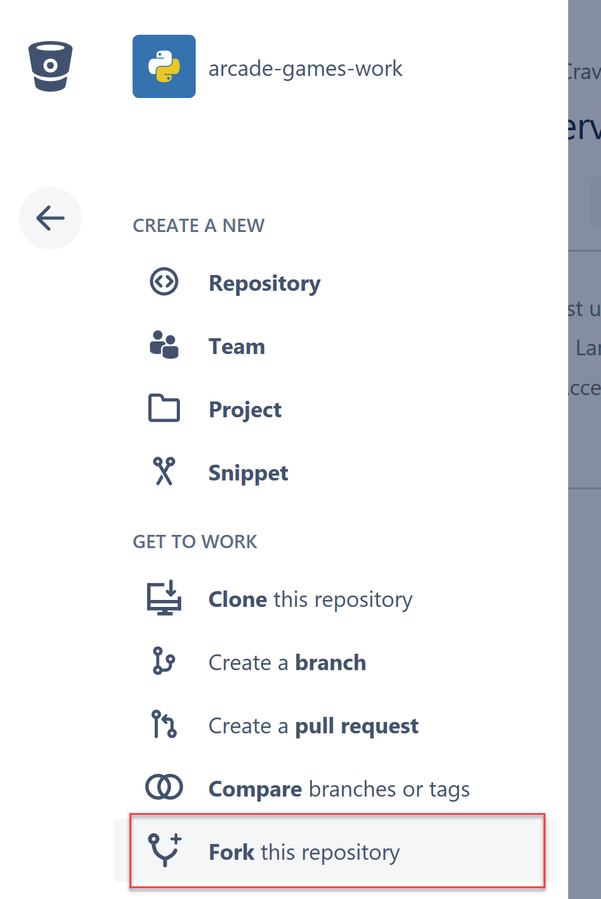
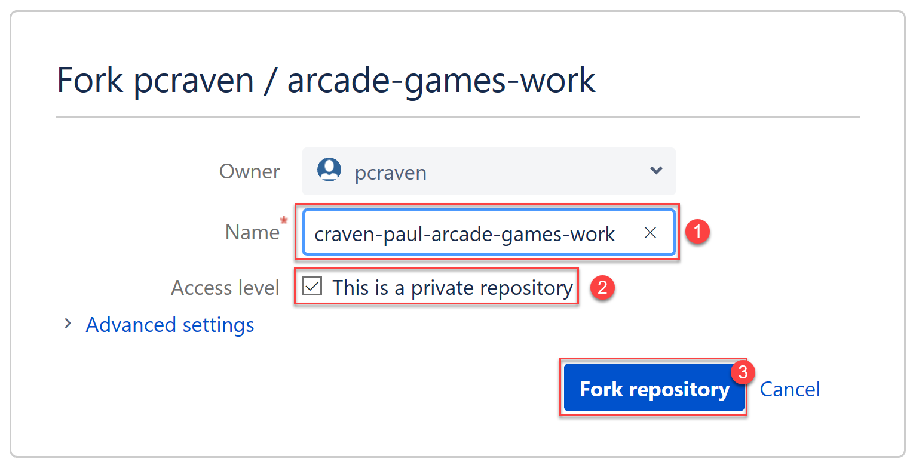
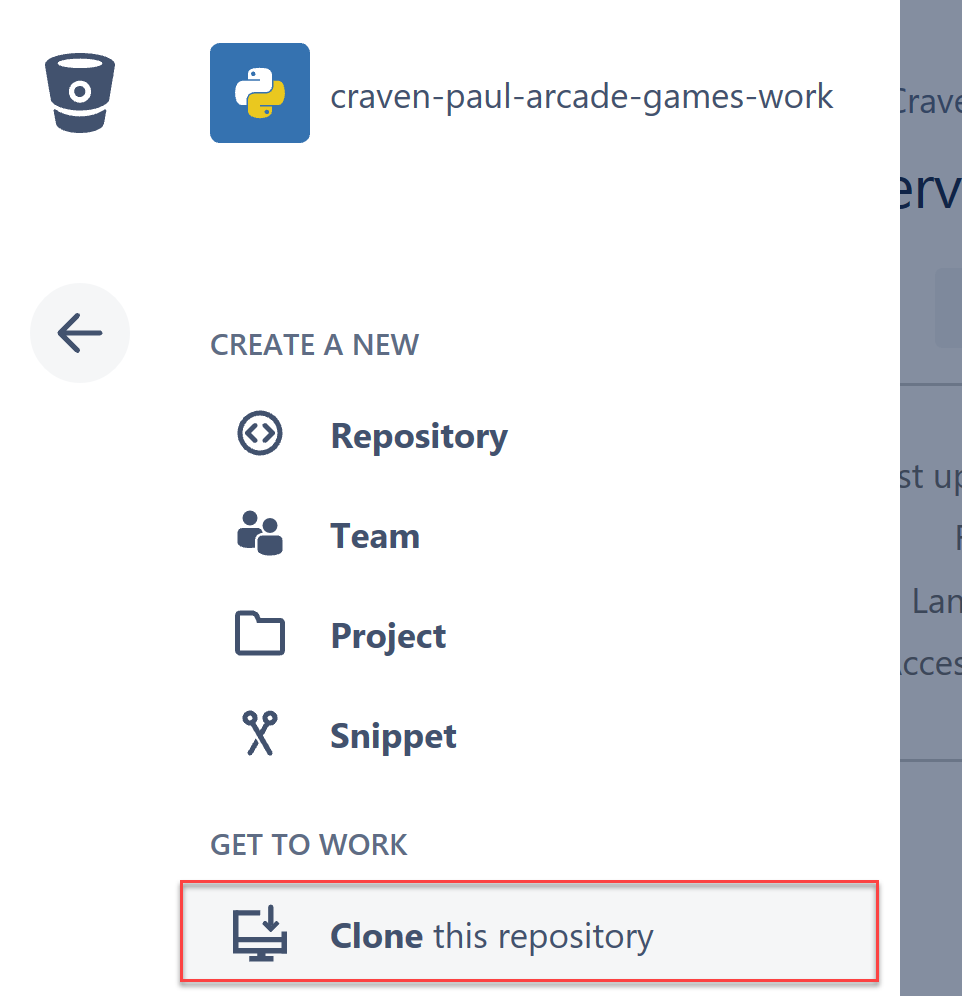
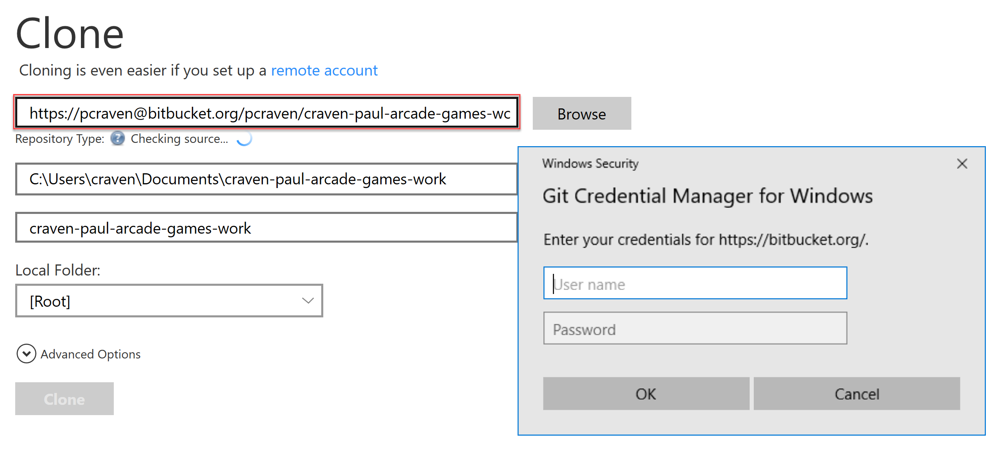
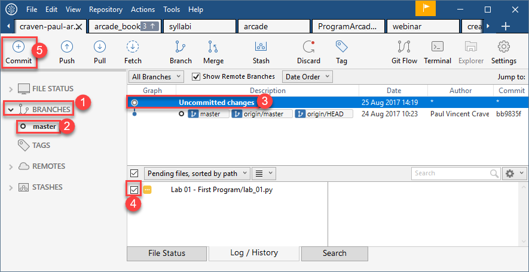
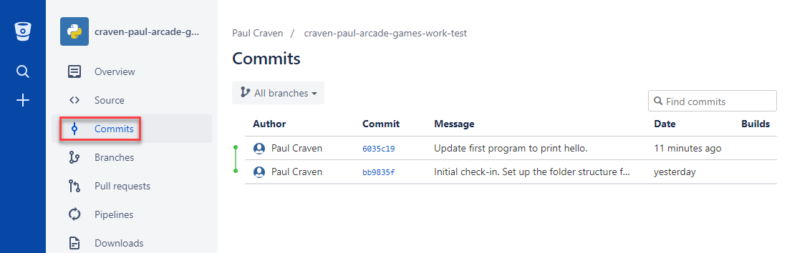
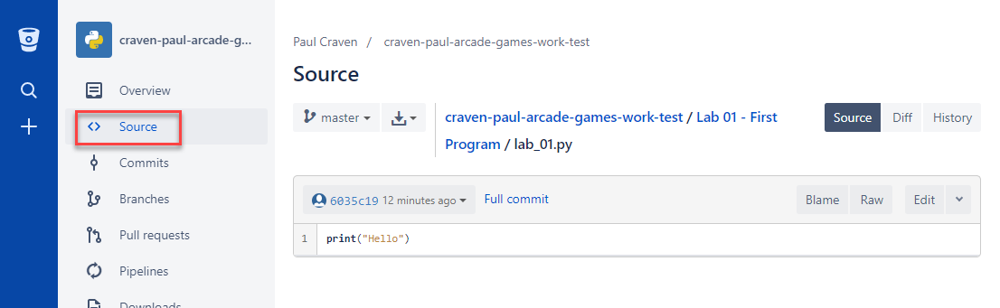
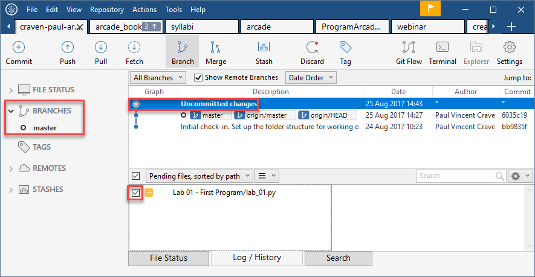
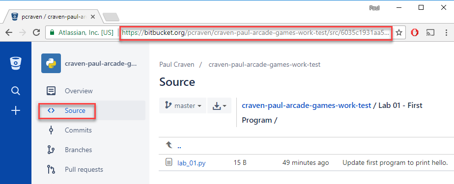

.. sectnum::
    :start: 1

.. _chapter-setup:

Getting Started
===============

Before you begin, you need to install a few things on the computer.
Using a school computer? You may have these already installed. Yay!
Still, read through this part. Make sure you know how the computer
is setup up.

Getting a system set up and ready to program can be a bit frustrating. **Don't give up.** Once you've got a system
set up for programming you don't need to think about it again. You can concentrate on the programming part.
You may get stuck during the setup, so don't hesitate to reach out and get help.

Your development computer will need:

* The Python_ programming language and the Arcade_ code library.
* An editor to type in your programs. (We'll use a program called PyCharm_.
  You can use the community edition for free, or if you have an email
  address that ends in ``.edu`` get can get a free `student license`_ for
  the professional version.)
* A version control system to track and turn in your work. (Git/SourceTree_/BitBucket_)
* A minor configuration tweak so we can see file extensions.

Let's go through these four items in detail.

.. _Python: https://www.python.org/
.. _Arcade: http://arcade.academy/
.. _PyCharm: https://www.jetbrains.com/pycharm/
.. _GitHub: https://github.com/
.. _BitBucket: https://bitbucket.org/

The Python Programming Language
-------------------------------

.. image:: python-logo.svg
    :width: 300px

We will be using the "Python_" computer programming language.
The creator of Python was a fan of `Monty Python`_, hence the name.

.. _Monty Python: https://en.wikipedia.org/wiki/Monty_Python

What is a programming language?
This wouldn't be much of a programming course if you left without
even knowing what a programming language was! So let's get that out of the way.

What is a Programming Language?
^^^^^^^^^^^^^^^^^^^^^^^^^^^^^^^

Computers have a chip called the Central Processing Unit (CPU_) that functions
as the main "brain" of the
computer. For example, right now you might have an Intel i7 or an AMD-FX CPU in
your computer.

.. figure:: Intel_CPU_Core_i7_2600K_Sandy_Bridge_top.jpg
    :width: 300px

    Intel i7 CPU (`Wikipedia Commons: CPU <https://commons.wikimedia.org/wiki/File:Intel_CPU_Core_i7_2600K_Sandy_Bridge_top.jpg>`_)

The CPU gets its instructions by reading a set of numbers. For example
the number "04" might be an instruction to add two other numbers together.

Everything stored on the computer is in the form of numbers.
Some numbers computers store are for data (text, photos, movies),
and some are computer instructions.

.. _CPU: https://en.wikipedia.org/wiki/Central_processing_unit

Machine Code
^^^^^^^^^^^^

In the early days of computing, programmers punched
in numbers that represented commands for the CPU.
Then the programmers punched in the data.

We call these numbers that are instructions `machine code`_. Note that not
all numbers on the computer are machine code (they might just be data),
but all machine code is made of numbers.
Machine code is also called a `First Generation Language`_ (1GL).

Below is an image of the `Altair 8800`_, the first personal computer that regular
people could buy. Notice that it is missing a monitor and a keyboard! The first
computers loaded the instructions by flipping switches. A pattern of switches
represented a machine instruction. So you'd flip lots of switches, then flip
the "Run" switch. And the lights would blink.

.. figure:: Altair_8800.jpg
    :width: 400px

    Source: `Wikipedia: Altair 8800 <https://commons.wikimedia.org/wiki/File:Altair_8800,_Smithsonian_Museum.jpg>`_

While this may not seem very useful (and quite frankly, it wasn't) it was very
popular in the hobbyist community. Those people saw the potential.

Computers *still* run on machine code.
You can still code by punching in numbers if you want. But you'd
be crazy because hand-coding these numbers is *so* tedious.
There's something better. Assembly Language.

.. _First Generation Language: https://en.wikipedia.org/wiki/First-generation_programming_language
.. _machine code: https://en.wikipedia.org/wiki/Machine_code
.. _Altair 8800: https://en.wikipedia.org/wiki/Altair_8800

Assembly Language
^^^^^^^^^^^^^^^^^

In order to make things
easier, computer scientists came up with something called `assembly language`_.
Assembly language is a `Second Generation Language`_ (2GL). Assembly language
looks like this:

.. _assembly language: https://en.wikipedia.org/wiki/Assembly_language
.. _Second Generation Language: https://en.wikipedia.org/wiki/Second-generation_programming_language

.. figure:: Motorola_6800_Assembly_Language.png
    :width: 400px

    Source: `Wikipedia: Motorola 6800 Assembly Language <https://en.wikipedia.org/wiki/File:Motorola_6800_Assembly_Language.png>`_

Don't worry! We aren't coding in assembly language for this class.

Assembly language allows a programmer to edit a file and type in codes like
``LDA`` which
stands for "Load Accumulator Immediate." The programmer types these commands
into a **source file**. We call the commands `source code`_. The computer
can't run the source code as-is. The programmer runs a `compiler`_ that
simply translates the computer commands like ``LDA`` into the corresponding
number of the machine language instruction.

.. _source code: https://en.wikipedia.org/wiki/Source_code
.. _compiler: https://en.wikipedia.org/wiki/Compiler

After I compile the source code into compiled code,
I can run the compiled code. I can give the compiled
code to someone else and they can run it. They do not need the source code
or the compiler.

Assembly language is an improvement over machine language.
But it isn't *that* much of an improvement.
Why? Assembly language instructions are very low-level. There are no commands like
"draw a building here." Or even "print hi." There are only mind-numbingly simple
commands that move bits from one spot to another, add them, and shift them.

Third Generation Languages
^^^^^^^^^^^^^^^^^^^^^^^^^^

.. figure:: Grace_Hopper_and_UNIVAC.jpg
    :width: 400px

    Source: `Wikipedia Grace Hopper and UNIVAC <https://en.wikipedia.org/wiki/Grace_Hopper#/media/File:Grace_Hopper_and_UNIVAC.jpg>`_

`Third Generation Languages`_ (3GL) started with `Grace Hopper`_ creating the
language COBOL_. There are many, many different third generation languages now.
These languages often specialize at certain tasks. For example, the language
C_ is great at creating small, fast programs that can run on minimal hardware.
PHP_ is an easy-to-use language that can build websites.

.. _Grace Hopper: https://en.wikipedia.org/wiki/Grace_Hopper
.. _Third Generation Languages: https://en.wikipedia.org/wiki/Third-generation_programming_language
.. _COBOL: https://en.wikipedia.org/wiki/COBOL
.. _C: https://en.wikipedia.org/wiki/C_(programming_language)
.. _PHP: https://en.wikipedia.org/wiki/PHP

Third generation languages usually fall into one of three categories.

* **Compiled:** The computer takes the original source code, and uses a
  *compiler* to translate it to machine code. The user then run the machine
  code. The original source code is not needed to run the program. "C" is an
  example of a language that works this way. So is the 2GL assembly language
  we just talked about.
* **Interpreted:** The computer looks at the source code and translates/runs
  it line-by-line.
  The compile step is not needed, but the user
  needs both the source code and an interpreter to run the program. Python
  is an example of an interpreted language.
* **Runtime Environment:** Languages such as Java and C# take source code, and
  compile the source code to a machine language. But not the language of your
  actual machine, they compile to a *virtual* machine. This is a separate program
  that acts as a layer between the real machine and the compiled code. This
  allows for better security, portability, and memory management.

Working with a compiled language is like taking a book in Spanish and translating
it to English. You no longer need the Spanish book, and you don't need the
translator. However, if you want to edit or change the book you have to
re-translate everything.

Working with an interpreted language is like working with a interpreter. You can
communicate back and forth with a person that knows both English and Spanish.
You need the original Spanish, the English, and the interpreter. It is easier
to make ad-hoc changes and carry out a dialog. Interpreters often help prevent
computers from running commands that will cause major crashes or common security
issues. Kind of like having a human interpreter that says, "You don't *really*
want to say that."

Using a runtime environment is hard to explain in human terms. It is a hybrid
of the two system. You need source code. You need a compiler. Instead of the compiler
making machine code, it makes for for a **virtual machine**.

What is so great about Python?
^^^^^^^^^^^^^^^^^^^^^^^^^^^^^^

Python is a great language to start programming in.
Python is a Top-5 language in popularity according to the
`TIOBE Index <http://www.tiobe.com/tiobe-index/>`_.
While may be less popular
than Java, it is easier to read and learn. Less work is required to
do graphics. And everything you learn in Python you can also apply when you
learn `C#`_ or Java_.

.. _Java: https://en.wikipedia.org/wiki/Java_(programming_language)
.. _TIOBE Index: http://www.tiobe.com/tiobe-index/
.. _C#: https://en.wikipedia.org/wiki/C_Sharp_(programming_language)

Python a great language for people interested in doing data processing
and `automating boring things <https://automatetheboringstuff.com/>`_.

Python 2.7 vs. Python 3.6
^^^^^^^^^^^^^^^^^^^^^^^^^

There are two main versions of Python. When Python moved to version 3,
there were changes that didn't work with all the currently written Python 2
programs. So both Python 2 and Python 3 were being developed simultaneously.
Some people don't want to move to Python 3 at all.

We use Python 3. Why are you going to care?

* If you search up examples you will find both Python 2 and Python 3 examples.
* Systems such as the Mac and Linux have Python 2 installed by default.

If you see a Python example on the web that has a print statement that looks
like:

.. code-block:: python

  # A "print" statement with Python Version 2.x
  print "Hi"

Instead of:

.. code-block:: python

  # A "print" statement with Python Version 3.x
  print("Hi")

Then you have a Python 2 example and it won't run with what we install and use
in this class.

In the case of the Mac and Linux, it will be important to use Python 3 and
not Python 2. Since Python 2 is installed by default, it can be a bit of a
hassle to make sure they use Python 3.

Setup the Programming Environment
---------------------------------

To get your computer ready for programming, we need to install Python, some Python libraries, and an editor.

.. _installing-python:

Installing Python
^^^^^^^^^^^^^^^^^

In addition to the Python language, we are going to use a library of commands
for drawing on the screen. This is called the "Arcade" library.

Installation for installing Python and the Arcade library are available below:

* `Windows Installation <http://arcade.academy/installation_windows.html>`_
  (Make sure to read the instructions carefully. Do not skip the "Add Python
  to Path" step. This seems to be the most frequent issue.)
* `Mac Installation <http://arcade.academy/installation_mac.html>`_
* `Linux Installation <http://arcade.academy/installation_linux.html>`_

.. _installing-pycharm:

Installing an IDE
^^^^^^^^^^^^^^^^^

We also need an editor. Python comes with an editor called IDLE, but it is
awful and not worth using. We'll use an editor called PyCharm.

PyCharm is a powerful program that lets you do more than just edit the
program, it also includes a large set of tools that programmers need. This
type of environment is called an **Integrated Development Environment**, or **IDE**
for short.

Download and install PyCharm_.
You can use their community edition for free. We won't use the
features in the professional edition. If you decide to
pick the professional edition anyway,
you'll need a license to use it.
But licenses are free for educational use!
If you have an e-mail that ends in ``.edu`` you can
ask for a `student license`_. It can be used on a school computer, or on your own
computer.

What is a text editor? What is an IDE? Read more at
`Understanding and Choosing Text Editors`_.

.. _Understanding and Choosing Text Editors: http://web-development-class.readthedocs.io/en/latest/tutorials/text_editors/text_editors.html
.. _student license: https://www.jetbrains.com/student/

What is a Distributed Version Control System
--------------------------------------------

Now we need to set up the computer to manage the code that we type in. This will allow you to upload the code so that
I can see it and give feedback.

No serious development should be done without version control. In fact, version
control is so important, many developers would argue that almost no development
should be done without version control. Even all my notes for class I keep in
version control.

Version control allows developers to:

* Get any prior version of a project.

  * Released version 1.5 of your program, and now it is crashing? Quick! Go
    back to version 1.4.
  * Did the 'new guy' mess up the project? Revert back!

* Know exactly what changed in the code, when, and by who. See who is actually
  doing the work. If a mistake gets added in, see when it was added and by whom.
* Easily share code between developers.
* Easily work independently of other developers.
* Recover an accidentally deleted or overwritten file.
* Go back and create a bug-fix release on prior versions of a program.
* Work on multiple computers and keep files in sync.

Version control saves untold time and headaches. It used to be that version
control had enough of a learning curve that some developers refused to use it.
Thankfully today's version control tools are so easy to use there's no excuse not to.

There are two main types of version control. The original version control
systems were "centralized." Subversion_ (SVN) is a very popular piece of software
that supports this type of version control. The other type is a "Distributed
Version Control Systems" (DVCS). There are two popular versions of DVCS in use
today, Git_ and Mercurial_. Mercurial is sometimes also known as Hg. Get it? Hg
is the symbol for Mercury. Either Git or Hg works fine, but for this tutorial we will
standardize on Git.

.. _installing-git:

Installing Git
^^^^^^^^^^^^^^

Download and install the 64-bit version of the `Git DVCS`_. This is the version control system.

.. _installing-sourcetree:

Installing SourceTree
^^^^^^^^^^^^^^^^^^^^^

Download and install SourceTree_. This is the visual interface that sits on top of Git. SourceTree requires you to
make a free account for download and use.

.. _SourceTree: https://www.sourcetreeapp.com/
.. _Git DVCS: https://git-scm.com/download/win

.. _Subversion: http://en.wikipedia.org/wiki/Apache_Subversion
.. _Git: http://en.wikipedia.org/wiki/Git_(software)
.. _Mercurial: http://en.wikipedia.org/wiki/Mercurial

Working With Version Control
----------------------------

We are going to create a **repository**. A repository is a set of files
and directories that will contain all your work for this class.

We will only create one repository for this class. If you create any more than
one repository, you are doing something wrong. You might have several "clones"
of the repository. But there will only be one repository. Do **not** repeat
this process for each assignment.

.. _fork-repository:

Forking the Repository
^^^^^^^^^^^^^^^^^^^^^^

.. attention::
    You should only have to fork the code **once** during class. If you do it more than
    once, something is wrong.

1. We are going to store our programs on-line with a website called BitBucket.
   BitBucket and a program called SourceTree are owned by a company called
   Atlassian. They offer enhanced
   accounts for e-mail addresses ending in ``.edu``.
   To use BitBucket, create an account https://bitbucket.org/account/signup/
2. Go to this web address which has a template for the labs we'll create in
   class: https://bitbucket.org/pcraven/arcade-games-work
3. We need to "fork" the repository. This will create your own copy of the
   repository that will be independent of mine. Changes you make to a "fork"
   aren't automatically sent to the original.
   Fork the repository by clicking on the plus button:

.. image:: bitbucket_plus.png
    :width: 400px

4. Then select "Fork":

5. Next, select a name for your fork. Use your last name and first name. Also,
   select that your repository is private, so that you don't share your
   homework answers with the world.

6. Now you have your own fork. It exists on the BitBucket server only.

.. _share-repository:

Share the Repository
^^^^^^^^^^^^^^^^^^^^

1. Give read permission to the instructor ``pcraven`` for your fork so he can
   grade your assignments.

.. image:: invite.png

.. attention::
    Check the feedback on your homework. If the instructor can't get to your
    homework, you'll get a zero. You need to correct this and resubmit
    ASAP.

.. _clone-repository:

Cloning the Repository
^^^^^^^^^^^^^^^^^^^^^^

.. attention::
    You will clone the repository once for each place you want to store your code.

1. Figure out where you want to store your files. You might want to store
   the files on your laptop, a flash drive, or a networked drive. I don't
   recommend saving it onto the lab computer, but that is an option.
2. We want to
   now copy it to your computer. We'll call this a "clone." A "clone" is a copy
   we normally try to keep synced up, which is different than a "fork."
   To clone the repository, hit the "plus" and then select "Clone Repository"

3. Copy the address that it gives you.
4. Start SourceTree. Select File...New:

.. image:: sourcetree_clone_01.png
    :width: 250px

5. Paste the address you copied from the website to SourceTree. When you move
   out of the field you'll be asked for your Atlassian login information.

6. Select the directory where you will be saving your files. If you want to save it on your flash drive or network
   drive, now is the time to select that.
7. Select "Clone". After the cloning finishes, you have a copy of the template on your computer! Now we just
   need to open up our editor.

Opening in PyCharm
^^^^^^^^^^^^^^^^^^

1. Open PyCharm.
2. Select File...Open. Then select the directory that you cloned the repository.

Committing and Pushing Code
^^^^^^^^^^^^^^^^^^^^^^^^^^^

.. attention::
    You will do this for each assignment.

Submitting Your Assignment
^^^^^^^^^^^^^^^^^^^^^^^^^^

Copy the link from BitBucket, and turn it in on Scholar.

Viewing File Extensions
-----------------------
It is a great idea to change your windows configuration to show file extensions.
A file usually has a name like Book ``report.docx`` where the ``.docx`` tells the
computer it is a Microsoft Word compatible document. By default Windows
hides the ``.docx`` extension if there is a program installed to handle it.
If you are programming, this hiding part of the file name can be annoying.

.. raw:: html

  <iframe width="560" height="315" src="https://www.youtube.com/embed/LukHWurpjAc" frameborder="0" allowfullscreen></iframe>

For Windows 7, to show file extensions,
open up your computer's control panel. Find the selection for "Folder Options.""
Click the "View" tab, and then unselect the option for "Hide extensions for
known file types.""

For Windows 8 and 10, bring up a file explorer by hitting the Windows-E key.
Then click the "view" tab and make sure “File name extensions” has been checked.

Great! Now let's make our first program with.

.. _print-function:

The Print Function
------------------

.. _print-hello-world:

Printing Hello World
^^^^^^^^^^^^^^^^^^^^

We will use a function called ``print`` to print to the screen.
``print`` is called a *function*.

You've already used functions
in mathematics. For example, **sin** and **cos**.
Functions are followed by parentheses: ``( )``.
We put the
function *parameter(s)* inside the parenthesis.

With a sine function, we put in an angle. With
the ``print`` function, we are going to put the text we want to print. Text must be enclosed in quotes.

::

    print("Hello there")

Note that case matters. The following will not work:

::

    Print("Hello there")

Great! Time to run it.
Right-click on the program and select "Run 'lab_01.py'"

Before we go on, note how the PyCharm window is put together.
See the output of your program at the bottom of the screen.
Click the image below to make it bigger and note the:

* Right margin. You can write code past this point, but don’t.
* Where you can hover your mouse for "hints" on how to make your code better.
* Where you can quickly click to run your program again.

.. image:: pycharm_window.png

Ok, now it's time to update our program. Go back to our program and improve
it by printing multiple lines, while quoting Snoopy's famous story:

.. _first-commit:

First Commit
^^^^^^^^^^^^

It is time to commit. Wait! You are young and don't want to commit yet?

The cool thing with version control, is that every time you commit, you can go back to the
code at that point in time. Version control lets you take it all back! It is the best type
of commitment ever!

Open SourceTree and:

1. Select "Branches"
2. Select "master" (This is the "master" branch. It will be the only branch we use for this class.)
3. Select "Uncommitted changes". If you don't have any changes, this line won't appear.
4. Select the file we want to commit. All the changed files will be listed here. If a file wasn't changed, it won't
   be listed. Yellow files have been changed, purple files aren't under version control, green files are new, gray
   files are missing, and red files are set to be deleted.
5. Go ahead and hit "commit".

While we hit "commit" in the prior screen, we haven't committed yet.

1. Type in a message so you can track what this commit was.
2. Select that you want to push the code to the server after you commit.
3. Hit the commit button. Not the button in the top left, but the commit button in the lower right. (Confusing, I know.)

.. image:: sourcetree_first_commit_02.png

Go back in SourceTree and see that your commit happened:

.. image:: sourcetree_first_commit_03.png

Did the code get to the BitBucket website? You can go to the website and see the commits:

You can also see the code:

.. _print-multiple-lines:

Multiple Print Lines
^^^^^^^^^^^^^^^^^^^^

Let's add additional code:

::

	print("It was a dark and stormy night.")
	print("Suddenly a shot rang out!")

Go ahead and run it to make sure it outputs as expected.

Once you have that working, let's try committing the change. Flip to SourceTree and select "Uncommitted Changes"
again:

Note that when you select the file, you see both the new and old text:

.. image:: bitbucket_commit_04.png

The red text represents text that you removed. The green text represents text you added. White text is unchanged.
Even if you can see the red text, it is not in the file. This sometimes throws people off when they are looking
at the commit history.

Go ahead and commit the file.

.. _escape-codes:

Escape Codes
^^^^^^^^^^^^

Ok, now it is time to make this lab yours. Write program that consists of
several print statements. Try these features out:

::

	print("You can print a statement surrounded by double quotes.")
	print('You can print a statement surrounded by single quotes.')

	print("If you want to print a double quote, you can by prepending it with")
	print("a slash. \"That's great!\" he said.")

	print("If you want to print a backslash, you can by prepending it with")
	print("a slash. So this \\ prints one backslash, and this \\\\ does two.")

	print("You can print a blank line with a empty print statement.")
	print()

	print("You can use a backlash n to print a new line. These\nare\non\nnew\nlines.")
	print("""You can pring
	on multiple
	lines using
	triple
	quotes. Just in
	case you wanted to.""")

Turning In Your Programs
^^^^^^^^^^^^^^^^^^^^^^^^

When it comes time to turn in one of your programs, copy the URL and turn it into your instructor:

