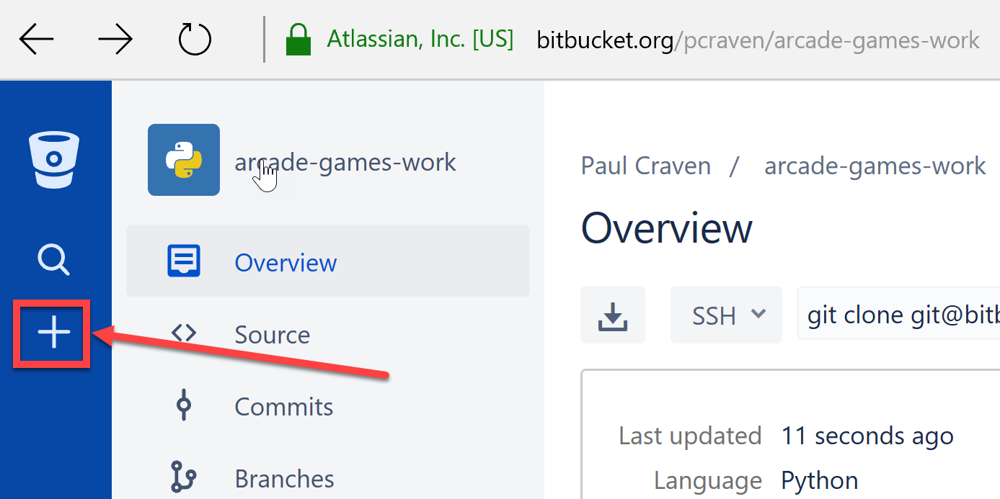
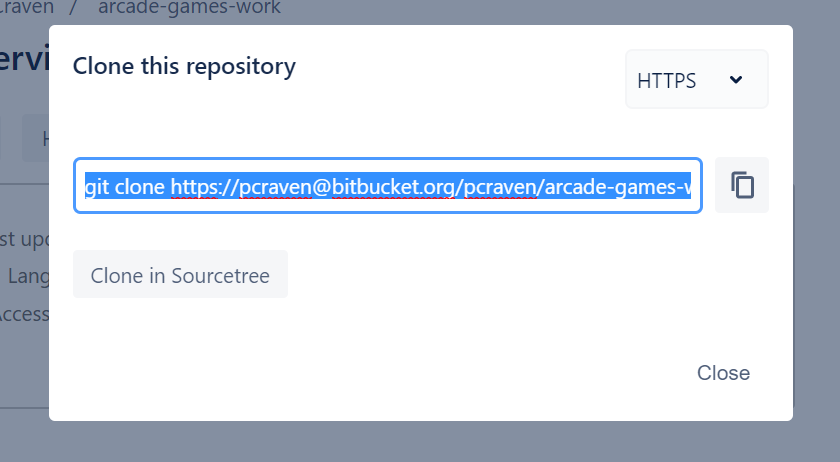
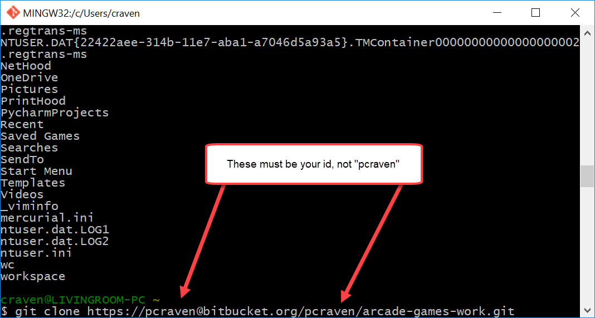

.. _version-control:

Version Control Systems
=======================

What is a Distributed Version Control System
--------------------------------------------

Now we need to set up the computer to manage the code that we type in. This will allow you to upload the code so that
I can see it and give feedback.

No serious development should be done without version control. In fact, version
control is so important, many developers would argue that almost no development
should be done without version control. Even all my notes for class I keep in
version control.

Version control allows developers to:

* Get any prior version of a project.

  * Released version 1.5 of your program, and now it is crashing? Quick! Go
    back to version 1.4.
  * Did the 'new guy' mess up the project? Revert back!

* Know exactly what changed in the code, when, and by who. See who is actually
  doing the work. If a mistake gets added in, see when it was added and by whom.
* Easily share code between developers.
* Easily work independently of other developers.
* Recover an accidentally deleted or overwritten file.
* Go back and create a bug-fix release on prior versions of a program.
* Work on multiple computers and keep files in sync.

Version control saves untold time and headaches. It used to be that version
control had enough of a learning curve that some developers refused to use it.
Thankfully today's version control tools are so easy to use there's no excuse not to.

There are two main types of version control. The original version control
systems were "centralized." Subversion_ (SVN) is a very popular piece of software
that supports this type of version control. The other type is a "Distributed
Version Control Systems" (DVCS). There are two popular versions of DVCS in use
today, Git_ and Mercurial_. Mercurial is sometimes also known as Hg. Get it? Hg
is the symbol for Mercury. Either Git or Hg works fine, but for this tutorial we will
standardize on Git.

.. _Subversion: http://en.wikipedia.org/wiki/Apache_Subversion
.. _Git: http://en.wikipedia.org/wiki/Git_(software)
.. _Mercurial: http://en.wikipedia.org/wiki/Mercurial

The Interactive Git Tutorial
----------------------------

This is a great interactive tutorial to learn how to use ``git``. Go through it now:

https://try.github.io/

.. _installing-git:

Installing Git
--------------

Now that you've learned how to use ``git``, let's install it on your computer.
If you are using a school computer with ``git`` pre-installed, you can skip
this step.

Click the link below and download and install the 64-bit version of the ``git``.

* `Windows Git DVCS <https://git-scm.com/download/win>`_
* `MacOS Git DVCS <https://git-scm.com/download/mac>`_

.. _fork-repository:

Forking the Repository
----------------------

.. attention::
    You should only have to fork the code **once** during class. If you do it more than
    once, something is wrong. Stop before you do this and see the instructor.
    It is a big headache for everyone if your fork more than once.

1. We are going to store our programs on-line with a website called BitBucket.
   BitBucket and a program called SourceTree are owned by a company called
   Atlassian. They offer enhanced
   accounts for e-mail addresses ending in ``.edu``.
   To use BitBucket, create an account https://bitbucket.org/account/signup/
2. Go to this web address which has a template for the labs we'll create in
   class: https://bitbucket.org/pcraven/arcade-games-work
3. We need to "fork" the repository. This will create your own copy of the
   repository that will be independent of mine. Changes you make to a "fork"
   aren't automatically sent to the original.
   Fork the repository by clicking on the plus button:

4. Then select "Fork":

.. image:: bitbucket_fork_01.png
    :width: 300px

5. Next, select a name for your fork. Use your last name and first name. Also,
   select that your repository is private, so that you don't share your
   homework answers with the world.

.. image:: bitbucket_fork_02.png
    :width: 450px

6. Now you have your own fork. It exists on the BitBucket server only.

.. _share-repository:

Share the Repository
--------------------

1. Give read permission to the instructor ``pcraven`` for your fork so he can
   grade your assignments.

.. image:: invite.png

.. attention::
    Check the feedback on your homework. If the instructor can't get to your
    homework, you'll get a zero. You need to correct this and resubmit
    ASAP.

.. _clone-repository:

Cloning the Repository
----------------------

.. note::
    Every time you start working on a new computer, you'll need to create a clone.
    (Unless you use a flash drive.)

1. Run the program "Git Bash" on Windows. Or, if you are on the mac, go under
   "Applications", find "Utilities" and in that run "Terminal".

.. figure:: git_bash.png

   Git Bash Window

2. Figure out where you want to store your files. You might want to store
   the files on your laptop, a flash drive, or a networked drive.
3. Figure out what directory your "Bash" window is in. Do this by typing ``pwd``,
   which is short for "print working directory".

.. image:: pwd.png

4. You can see what files are in the directory by typing ``ls``, short for
   "list files".
5. You can change directories using the ``cd`` command. You should default to
   your "home" directory, which is a great place to put your files. But if you
   want them in a different location, change to that location now.
   There's a lot to the ``cd``
   command, but there are a few variations you need to know:

   * ``cd`` Change to your "home" directory.
   * ``cd mydir`` Change to ``mydir`` directory. That directory must be in the
     same directory you are in now. Also, if you don't want to type the full
     directory name, you can type the first few letters and hit <tab>.
   * ``cd ..`` Go up one directory.

6. We want to
   copy the repository you created to your computer. We'll call this a "clone." A "clone" is a copy
   we normally try to keep synced up, which is different than a "fork."
   To clone the repository, hit the "plus" and then select "Clone Repository"

.. image:: bitbucket_clone.png
    :width: 300px

7. Copy the address that it gives you. It should have **your** name, and **not**
   my name. If you get this wrong, you'll have to restart everything back at
   the clone section. (Not the fork section.)

8. Paste the command it gives you in your command prompt:

Then...

.. image:: after_clone.png

9. There you go! You now have a directory set up where you can do your work.

.. _open-in-pycharm:

Open Project in Pycharm
-----------------------

Go ahead and start PyCharm, then select "File...Open" and select that directory.

.. image:: open_in_pycharm.png
    :width: 75%

Your project should look like the image below. If this isn't what you have,
you might have opened the wrong folder. Hit "File...Open" and try again.

.. image:: open_in_pycharm2.png
    :width: 75%

If you click the arrow next to the folder name, you can see all the folders
in the project folder.

.. image:: open_in_pycharm3.png
    :width: 75%

If you move from computer to computer hand have a flash drive, you can
reopen your project be just doing "File...Open". If you don't have your
flash drive, you'll need to re-clone your repository.

.. _commit:

Commit Your Code
----------------

It is time to commit. Wait! You are young and don't want to commit yet?

The cool thing with version control, is that every time you commit, you can go back to the
code at that point in time. Version control lets you take it all back! It is the best type
of commitment ever!

First, open Git Bash, and switch to the directory with your project using the ``cd`` command:

.. code-block:: text

    craven@DESKTOP-RAUFKMA MINGW64 ~
    $ cd arcade-games-work2/

Optionally, we can use ``git status`` to see what files have changed:

.. code-block:: text

    craven@DESKTOP-RAUFKMA MINGW64 ~/arcade-games-work2 (master)
    $ git status
    On branch master
    Your branch is up-to-date with 'origin/master'.
    Changes not staged for commit:
      (use "git add <file>..." to update what will be committed)
      (use "git checkout -- <file>..." to discard changes in working directory)

            modified:   Lab 01 - First Program/lab_01.py

    no changes added to commit (use "git add" and/or "git commit -a")

Now, add all the files that have changed. The asterisk (``*``) is a wild card character
that means get all changes. Optionally, we could list out each file, but that's a lot
of work and we don't want to leave anything behind anyway.

.. code-block:: text

    craven@DESKTOP-RAUFKMA MINGW64 ~/arcade-games-work2 (master)
    $ git add *

Commit the changes:

.. code-block:: text

    craven@DESKTOP-RAUFKMA MINGW64 ~/arcade-games-work2 (master)
    $ git commit -m "Work on lab 1"
    [master 45028a5] Work on lab 1
     1 file changed, 1 insertion(+)

.. _push-code:

Push Your Code
--------------

And push them to the server:

.. code-block:: text

    craven@DESKTOP-RAUFKMA MINGW64 ~/arcade-games-work2 (master)
    $ git push
    Counting objects: 4, done.
    Delta compression using up to 8 threads.
    Compressing objects: 100% (2/2), done.
    Writing objects: 100% (4/4), 329 bytes | 0 bytes/s, done.
    Total 4 (delta 1), reused 0 (delta 0)
    To bitbucket.org:pcraven/arcade-games-work2.git
       519c361..45028a5  master -> master

    craven@DESKTOP-RAUFKMA MINGW64 ~/arcade-games-work2 (master)
    $

If the message doesn't look like this, there may have been an error.
Skip down to :ref:`cant-push`.

.. _turn-in-program:

Turning In Your Programs
------------------------

When it comes time to turn in one of your programs, copy the URL and turn it into your instructor:

.. image:: bitbucket_copy_url.png

Now go to Scholar and turn in the link.

.. _cant-push:

What If You Can't Push?
-----------------------

What happens if you can't push to the server? If you get an error like what's below?
(See highlighted lines.)

.. code-block:: text
  :emphasize-lines: 4,5

    $ git push
    To bitbucket.org:pcraven/arcade-games-work2.git
     ! [rejected]        master -> master (fetch first)
    error: failed to push some refs to 'git@bitbucket.org:pcraven/arcade-games-work2.git'
    hint: Updates were rejected because the remote contains work that you do
    hint: not have locally. This is usually caused by another repository pushing
    hint: to the same ref. You may want to first integrate the remote changes
    hint: (e.g., 'git pull ...') before pushing again.
    hint: See the 'Note about fast-forwards' in 'git push --help' for details.

Step 1: Make Sure You Have No Pending Changes
^^^^^^^^^^^^^^^^^^^^^^^^^^^^^^^^^^^^^^^^^^^^^

Run a ``git status`` and make sure you have nothing to commit.
It should look like this:

.. code-block:: text

    craven@DESKTOP-RAUFKMA MINGW64 ~/arcade-games-work2 (master)
    $ git status
    On branch master
    Your branch is up-to-date with 'origin/master'.
    nothing to commit, working tree clean

If you do hove code to commit, jump up to :ref:`commit` and then come back here.

.. _pull-changes:

Step 2: Pull Changes From The Server
^^^^^^^^^^^^^^^^^^^^^^^^^^^^^^^^^^^^

Pull changes from the server:

.. code-block:: text

    $ git pull

Normally, this will work fine and you'll be done. But if you have other computers
that you are coding on, the computer will automatically try to merge.

Step 2A: Merging
~~~~~~~~~~~~~~~~

If you get a screen like the image below, the computer automatically
merged your code bases. It now wants you to type in a comment for the
merge. We'll take the default comment.
Hold down the shift key and type ``ZZ``.
If that doesn't work, hit escape, and then try again.

(You are in an editor called **vim** and it is asking you for a comment about
merging the files. Unfortunately vim is really hard to learn. Shift-ZZ is the
command to save, and all we want to do is get out of it and move on.)

.. image:: vi_merge.png

It should finish with something that looks like:

.. code-block:: text

    craven@DESKTOP-RAUFKMA MINGW64 ~/arcade-games-work2 (master)
    Merge made by the 'recursive' strategy.
     Lab 01 - First Program/lab_01.py | 3 ++-
     1 file changed, 2 insertions(+), 1 deletion(-)

If instead you get this:

.. code-block: text
   :emphasize-lines: 9

    $ git pull
    remote: Counting objects: 4, done.
    remote: Compressing objects: 100% (4/4), done.
    remote: Total 4 (delta 1), reused 0 (delta 0)
    Unpacking objects: 100% (4/4), done.
    From bitbucket.org:pcraven/arcade-games-work2
       aeb9cf3..6a8f398  master     -> origin/master
    Auto-merging Lab 01 - First Program/lab_01.py
    CONFLICT (content): Merge conflict in Lab 01 - First Program/lab_01.py
    Automatic merge failed; fix conflicts and then commit the result.

Then we edited the same file in the same spot. We have to tell
the computer if we want our changes, or the changes on the other
computer.

Step 2B: Resolving a Merge Conflict
~~~~~~~~~~~~~~~~~~~~~~~~~~~~~~~~~~~

Do a ``git status``. It should look something like this:

.. code-block:: text
    :emphasize-lines: 13

    $ git status
    On branch master
    Your branch and 'origin/master' have diverged,
    and have 1 and 1 different commits each, respectively.
      (use "git pull" to merge the remote branch into yours)
    You have unmerged paths.
      (fix conflicts and run "git commit")
      (use "git merge --abort" to abort the merge)

    Unmerged paths:
      (use "git add <file>..." to mark resolution)

            both modified:   Lab 01 - First Program/lab_01.py

    no changes added to commit (use "git add" and/or "git commit -a")

The key thing to look for is any file that says ``both modified``.

If you want **your** copy, type:

.. code-block:: text

    $ git checkout --ours "Lab 01 - First Program/lab_01.py"

If instead you want **their** copy (or the copy on the other computer)
type

.. code-block:: text

    $ git checkout --theirs "Lab 01 - First Program/lab_01.py"

Then when you are all done with all merges, type:

.. code-block:: text

    craven@DESKTOP-RAUFKMA MINGW64 ~/arcade-games-work2 (master|MERGING)
    $ git add *

    craven@DESKTOP-RAUFKMA MINGW64 ~/arcade-games-work2 (master|MERGING)
    $ git commit -m"Merged"
    [master e083f36] Merged

    craven@DESKTOP-RAUFKMA MINGW64 ~/arcade-games-work2 (master)
    $ git push
    Counting objects: 5, done.
    Delta compression using up to 8 threads.
    Compressing objects: 100% (5/5), done.
    Writing objects: 100% (5/5), 531 bytes | 0 bytes/s, done.
    Total 5 (delta 2), reused 0 (delta 0)
    To bitbucket.org:pcraven/arcade-games-work2.git
       6a8f398..e083f36  master -> master

Step 3: Try Pushing Again
^^^^^^^^^^^^^^^^^^^^^^^^^

.. code-block:: text

    $ git push
    Counting objects: 6, done.
    Delta compression using up to 8 threads.
    Compressing objects: 100% (4/4), done.
    Writing objects: 100% (6/6), 604 bytes | 0 bytes/s, done.
    Total 6 (delta 2), reused 0 (delta 0)
    To bitbucket.org:pcraven/arcade-games-work2.git
       d66b008..aeb9cf3  master -> master

