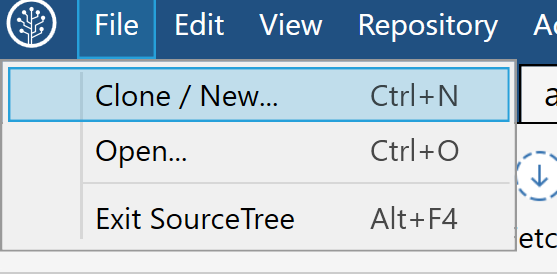
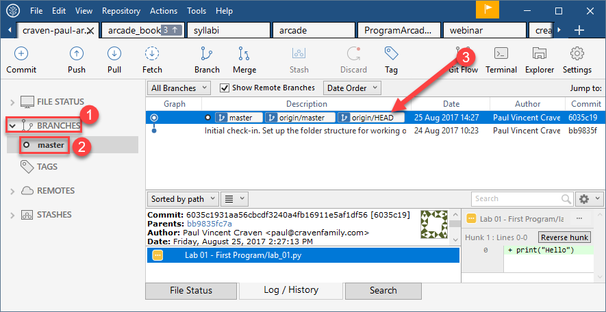
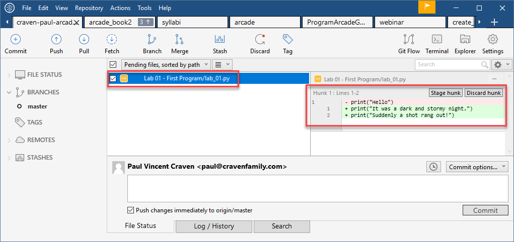

.. _version-control:

Version Control Systems
=======================

What is a Distributed Version Control System
--------------------------------------------

Now we need to set up the computer to manage the code that we type in. This will allow you to upload the code so that
I can see it and give feedback.

No serious development should be done without version control. In fact, version
control is so important, many developers would argue that almost no development
should be done without version control. Even all my notes for class I keep in
version control.

Version control allows developers to:

* Get any prior version of a project.

  * Released version 1.5 of your program, and now it is crashing? Quick! Go
    back to version 1.4.
  * Did the 'new guy' mess up the project? Revert back!

* Know exactly what changed in the code, when, and by who. See who is actually
  doing the work. If a mistake gets added in, see when it was added and by whom.
* Easily share code between developers.
* Easily work independently of other developers.
* Recover an accidentally deleted or overwritten file.
* Go back and create a bug-fix release on prior versions of a program.
* Work on multiple computers and keep files in sync.

Version control saves untold time and headaches. It used to be that version
control had enough of a learning curve that some developers refused to use it.
Thankfully today's version control tools are so easy to use there's no excuse not to.

There are two main types of version control. The original version control
systems were "centralized." Subversion_ (SVN) is a very popular piece of software
that supports this type of version control. The other type is a "Distributed
Version Control Systems" (DVCS). There are two popular versions of DVCS in use
today, Git_ and Mercurial_. Mercurial is sometimes also known as Hg. Get it? Hg
is the symbol for Mercury. Either Git or Hg works fine, but for this tutorial we will
standardize on Git.

Learning Git
------------

https://try.github.io/

.. _installing-git:

Installing Git
^^^^^^^^^^^^^^

Download and install the 64-bit version of the `Git DVCS`_. This is the version control system.

.. _fork-repository:

Forking the Repository
^^^^^^^^^^^^^^^^^^^^^^

.. attention::
    You should only have to fork the code **once** during class. If you do it more than
    once, something is wrong.

1. We are going to store our programs on-line with a website called BitBucket.
   BitBucket and a program called SourceTree are owned by a company called
   Atlassian. They offer enhanced
   accounts for e-mail addresses ending in ``.edu``.
   To use BitBucket, create an account https://bitbucket.org/account/signup/
2. Go to this web address which has a template for the labs we'll create in
   class: https://bitbucket.org/pcraven/arcade-games-work
3. We need to "fork" the repository. This will create your own copy of the
   repository that will be independent of mine. Changes you make to a "fork"
   aren't automatically sent to the original.
   Fork the repository by clicking on the plus button:

.. image:: bitbucket_plus.png
    :width: 400px

4. Then select "Fork":

.. image:: bitbucket_fork_01.png
    :width: 300px

5. Next, select a name for your fork. Use your last name and first name. Also,
   select that your repository is private, so that you don't share your
   homework answers with the world.

.. image:: bitbucket_fork_02.png
    :width: 450px

6. Now you have your own fork. It exists on the BitBucket server only.

.. _share-repository:

Share the Repository
^^^^^^^^^^^^^^^^^^^^

1. Give read permission to the instructor ``pcraven`` for your fork so he can
   grade your assignments.

.. image:: invite.png

.. attention::
    Check the feedback on your homework. If the instructor can't get to your
    homework, you'll get a zero. You need to correct this and resubmit
    ASAP.

.. _clone-repository:

Cloning the Repository
^^^^^^^^^^^^^^^^^^^^^^

.. attention::
    You will clone the repository once for each place you want to store your code.

1. Figure out where you want to store your files. You might want to store
   the files on your laptop, a flash drive, or a networked drive. I don't
   recommend saving it onto the lab computer, but that is an option.
2. We want to
   now copy it to your computer. We'll call this a "clone." A "clone" is a copy
   we normally try to keep synced up, which is different than a "fork."
   To clone the repository, hit the "plus" and then select "Clone Repository"

.. image:: bitbucket_clone.png
    :width: 300px

3. Copy the address that it gives you.
4. Start SourceTree. Select File...New:

5. Paste the address you copied from the website to SourceTree. When you move
   out of the field you'll be asked for your Atlassian login information.

.. image:: sourcetree_clone_02.png
    :width: 620px

6. Select the directory where you will be saving your files. If you want to save it on your flash drive or network
   drive, now is the time to select that.
7. Select "Clone". After the cloning finishes, you have a copy of the template on your computer! Now we just
   need to open up our editor.

First Commit
^^^^^^^^^^^^

It is time to commit. Wait! You are young and don't want to commit yet?

The cool thing with version control, is that every time you commit, you can go back to the
code at that point in time. Version control lets you take it all back! It is the best type
of commitment ever!

Open SourceTree and:

1. Select "Branches"
2. Select "master" (This is the "master" branch. It will be the only branch we use for this class.)
3. Select "Uncommitted changes". If you don't have any changes, this line won't appear.
4. Select the file we want to commit. All the changed files will be listed here. If a file wasn't changed, it won't
   be listed. Yellow files have been changed, purple files aren't under version control, green files are new, gray
   files are missing, and red files are set to be deleted.
5. Go ahead and hit "commit".

.. image:: sourcetree_first_commit_01.png

While we hit "commit" in the prior screen, we haven't committed yet.

1. Type in a message so you can track what this commit was.
2. Select that you want to push the code to the server after you commit.
3. Hit the commit button. Not the button in the top left, but the commit button in the lower right. (Confusing, I know.)

.. image:: sourcetree_first_commit_02.png

Go back in SourceTree and see that your commit happened:

Did the code get to the BitBucket website? You can go to the website and see the commits:

.. image:: bitbucket_commit_01.png

You can also see the code:

.. image:: bitbucket_commit_02.png

Once you have that working, let's try committing the change. Flip to SourceTree and select "Uncommitted Changes"
again:

.. image:: bitbucket_commit_03.png

Note that when you select the file, you see both the new and old text:

The red text represents text that you removed. The green text represents text you added. White text is unchanged.
Even if you can see the red text, it is not in the file. This sometimes throws people off when they are looking
at the commit history.

Go ahead and commit the file.

Turning In Your Programs
------------------------

When it comes time to turn in one of your programs, copy the URL and turn it into your instructor:

.. image:: bitbucket_copy_url.png

More Version Control
--------------------

Editing Elsewhere
^^^^^^^^^^^^^^^^^
Find this file on the BitBucket website. Hit the "Source" icon, and then
browse to the file. Let's try editing this on-line. We could just as easily
edit this on a different computer. Like if you had a home computer and a
work computer. Or two different people working on the same program.

.. image:: edit_online_1.png

Now let's edit this, and improve it by quoting
`A Wrinkle in Time <https://en.wikipedia.org/wiki/A_Wrinkle_in_Time>`_ instead.

.. image:: edit_online_2.png

Commit the change. Add a good comment, don't take the default. Don't create
a "pull request".

Pulling Changes
^^^^^^^^^^^^^^^

Next, let's pull those changes onto our computer with SourceTree:

.. image:: pull.png

Great! Now you should see those changes on your local computer.

This works great until the same line of code is changed in two different places.
Try adding a line 4 on-line first, and a different line 4 on your computer.

When you try to push you get an angry message like this:

.. image:: failed_push.png

Usually students get this message late Sunday night when trying to upload their
homework. And now they can't What to do?

* Hit "Pull"
* Look at your "Uncommitted changed"
* Note the files that have a caution sign.
* To keep your changes and ignore the other changes, right-click select "Resolve
  Conflicts" and select "Resolve Using Mine"
* To keep the changes on the server and remove yours, right-click select
  "Resolve Conflicts" and select "Resolve Using Theirs"
* To manually resolve the conflicts, right-click select "Resolve Conflicts"
  and select "Mark Resolved". Both lines will be there, along with some
  delimiters that look kind of odd. You can edit the file in PyCharm.

.. image:: conflict.png

* After that, select "Commit" so that you commit your merge. (Easy to forget
  this step.)
* Then you can push to the server.

Go ahead and try this out. I'll look for it on-line when I'm grading. It should
look like this:

.. image:: see_merge_online.png

Turning In Your Programs
------------------------

When it comes time to turn in one of your programs, copy the URL and turn it into your instructor:

.. image:: bitbucket_copy_url.png
