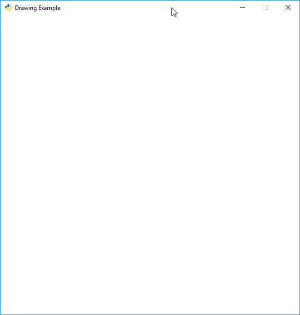

.. sectnum::
    :start: 2

How to draw with your computer
==============================

Comments
--------

When typing in computer code, sometimes we want to be able to write things
that the computer ignores. We want to comment our code. In fact, we do that
a lot with the code examples to explain them.

Below are two ways of adding comments to code in the Python computer language:

.. literalinclude:: comments.py
    :language: python
    :linenos:

If we run the program above, nothing will happen. Since the only code that
we wrote were "comments," there was nothing for the computer to do.

How to open up a window
-----------------------

Before we can draw anything, we need to import a "library" of code that has
commands for drawing.

Computer languages come with a set of built-in commands. Most programs will
require more commands than what the computer language loads by default. These
sets of commands are called **libraries**. Some languages have their own special
term for these libraries. In the case of Python, they are called **modules**.
Thankfully, this is easy. If we want to use they "arcade" library, all we need
to do is add ``import arcade`` at the top of our program.

.. attention::
    Libraries should always be imported at the **top** of your program.

Technically,
you can import libraries elsewhere in your code, as long as they occur before
the library is called. But don't. Only import the library at the top of your
program. The only thing that could be ahead of an ``import`` statement would be
comments.

In the code below, we've imported the arcade library. If you run the code,
nothing will happen. We've gone to the library and checked out the arcade
book, but we haven't done anything with it yet.

.. literalinclude:: import_arcade.py
    :language: python
    :linenos:
    :emphasize-lines: 7

Now it is time to open the window. To begin, we select the arcade library
with ``arcade``. Then we separate the library from the command we want to
call with a period: ``.`` Next, we put in the command. Which happens to be
``open_window``. Commands that we can run are called **functions**.

.. note::

    Commands that we can run are called **functions**.

Just like the sine and cosine functions in math, we surround the function
**parameters** with parenthesis. ``my_function(parameters)`` The data we need
to pass the function are the parameters. In this case, we want to give the command
the text that will appear on the title bar, and the width and height of the window.

Wait, how do we know that it was the ``open_window`` function to call? How did
we know what parameters to use? The names of the functions, the order of the
parameters, is the **Application Program Interface** or "API" for short. You can
click here for the `Arcade API`_.

.. _Arcade API: http://arcade.academy/quick_index.html

Below is an example that will open up a window:

.. literalinclude:: open_window.py
    :language: python
    :linenos:
    :emphasize-lines: 13

Try running the code above. It kind-of works. If you have fast eyes, you might
see the window pop open. But then our program is done! We've run out of code
to execute. So the window closes.

For us to keep the window open, we need to pause until the user hits the
close button. To do this, we'll use the ``run`` command in the Arcade library.
The ``run`` command takes no parameters, but even if a function doesn't take
parameters, you still need to use parenthesis.

.. literalinclude:: open_window_and_pause.py
    :language: python
    :linenos:
    :emphasize-lines: 16

You should get a window that looks something like this:

Clearing the screen
-------------------

Right now we just have a default white as our background.
How do we get a different color? Use the ``set_background_color`` command.

But by itself, the function doesn't work. You need a two more commands. These
tell the Arcade library when you are about to start drawing (`start_render`),
and when you are done drawing (``finish_render``).

See below:

.. literalinclude:: open_window_and_clear_screen.py
    :language: python
    :linenos:
    :emphasize-lines: 16, 19, 24

How did we know what color to pick? I looked at the
`arcade.color API documentation`_.

.. _arcade.color API documentation: http://arcade.academy/arcade.color.html

Specifying colors
-----------------

The coordinate system
---------------------

Drawing a rectangle
-------------------

.. literalinclude:: draw_grass.py
    :language: python
    :linenos:
    :emphasize-lines: 22

.. literalinclude:: final_program.py
    :language: python
    :linenos:

Drawing primitives
------------------

For a program showing all the drawing primitives, see the :ref:`example-drawing-primitives`.
