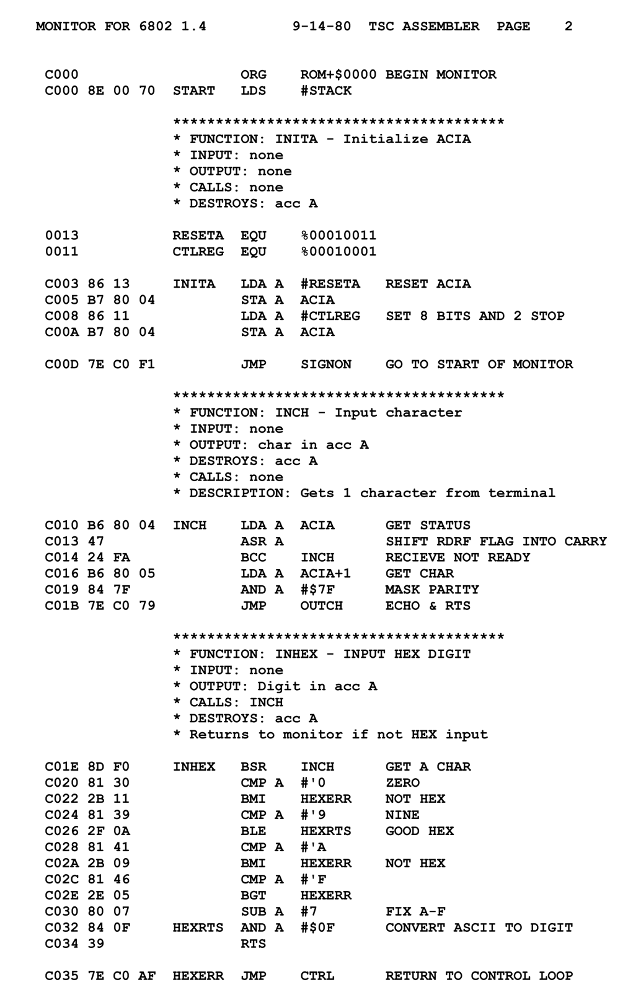

.. _what-is-a-programming-language:

What is a Programming Language?
===============================

What is a programming language?
This wouldn't be much of a programming course if you left without
even knowing what a programming language was! So let's get that out of the way.

.. note:: The CPU is the "brain" of the computer.

Computers have a chip called the Central Processing Unit (CPU_) that functions
as the main "brain" of the
computer. For example, right now you might have an Intel i7 or an AMD-FX CPU in
your computer.

.. figure:: Intel_CPU_Core_i7_2600K_Sandy_Bridge_top.jpg
    :width: 300px

    Intel i7 CPU (`Wikipedia Commons: CPU <https://commons.wikimedia.org/wiki/File:Intel_CPU_Core_i7_2600K_Sandy_Bridge_top.jpg>`_)

The CPU gets its instructions by reading a set of numbers. For example
the number "04" might be an instruction to add two other numbers together.

Everything stored on the computer is in the form of numbers.
Some numbers computers store are for data (text, photos, movies),
and some are computer instructions.

.. _CPU: https://en.wikipedia.org/wiki/Central_processing_unit

Machine Code
^^^^^^^^^^^^

In the early days of computing, programmers punched
in numbers that represented commands for the CPU.
Then the programmers punched in the data.

.. note:: Machine code is the native language of any computer.

We call these numbers that are instructions `machine code`_.
All machine code is made of numbers, but not all numbers are machine code.
Some of the numbers might be data to hold text or images.
Machine code is also called a `First Generation Language`_ (1GL).

Below is an image of the `Altair 8800`_, the first personal computer that regular
people could buy. Notice that it is missing a monitor and a keyboard! The first
computers loaded the instructions by flipping switches. A pattern of switches
represented a machine instruction. So you'd flip lots of switches, then hit
the "Run" switch. And the lights would blink.

.. figure:: Altair_8800.jpg
    :width: 400px

    Source: `Wikipedia: Altair 8800 <https://commons.wikimedia.org/wiki/File:Altair_8800,_Smithsonian_Museum.jpg>`_

While this may not seem very useful (and quite frankly, it wasn't) it was very
popular in the hobbyist community. Those people saw the potential.

Computers *still* run on machine code.
You can still code by punching in numbers if you want. But you'd
be crazy because hand-coding these numbers is *so* tedious.
There's something better. Assembly Language.

.. _First Generation Language: https://en.wikipedia.org/wiki/First-generation_programming_language
.. _machine code: https://en.wikipedia.org/wiki/Machine_code
.. _Altair 8800: https://en.wikipedia.org/wiki/Altair_8800

Assembly Language
^^^^^^^^^^^^^^^^^

In order to make things
easier, computer scientists came up with something called `assembly language`_.
Assembly language is a `Second Generation Language`_ (2GL). Assembly language
looks like this:

.. _assembly language: https://en.wikipedia.org/wiki/Assembly_language
.. _Second Generation Language: https://en.wikipedia.org/wiki/Second-generation_programming_language

    Source: `Wikipedia: Motorola 6800 Assembly Language <https://en.wikipedia.org/wiki/File:Motorola_6800_Assembly_Language.png>`_

Don't worry! We aren't coding in assembly language for this class.

Assembly language allows a programmer to edit a file and type in codes like
``LDA`` which
stands for "Load Accumulator Immediate." The programmer types these commands
into a **source file**. We call the commands `source code`_. The computer
can't run the source code as-is. The programmer runs a `compiler`_ that
simply translates the computer commands like ``LDA`` into the corresponding
number of the machine language instruction.

.. _source code: https://en.wikipedia.org/wiki/Source_code
.. _compiler: https://en.wikipedia.org/wiki/Compiler

.. note:: A compiler turns human-readable code into machine code.

After I compile the source code into compiled code,
I can run the compiled code. I can give the compiled
code to someone else and they can run it. They do not need the source code
or the compiler.

Assembly language is an improvement over machine language.
But it isn't *that* much of an improvement.
Why? Assembly language instructions are very low-level. There are no commands like
"draw a building here." Or even "print hi." There are only mind-numbingly simple
commands that move bits from one spot to another, add them, and shift them.

Third Generation Languages
^^^^^^^^^^^^^^^^^^^^^^^^^^

.. figure:: Grace_Hopper_and_UNIVAC.jpg
    :width: 400px

    Source: `Wikipedia Grace Hopper and UNIVAC <https://en.wikipedia.org/wiki/Grace_Hopper#/media/File:Grace_Hopper_and_UNIVAC.jpg>`_

`Third Generation Languages`_ (3GL) started with `Grace Hopper`_ creating the
language COBOL_. There are many, many different third generation languages now.
These languages often specialize at certain tasks. For example, the language
C_ is great at creating small, fast programs that can run on minimal hardware.
PHP_ is an easy-to-use language that can build websites.

.. note:: Most of the original computer scientists were female.
    See `Grace Hopper`_, `Hedy Lamar`_, and `Ada Lovelace`_ for
    examples. If you want to find other female programmers who code
    in Python, check out
    `@PyLadies <https://twitter.com/PyLadies>`_,
    `@DJangoGirls <https://twitter.com/djangogirls>`_,
    and `@WomenWhoCode <https://twitter.com/WomenWhoCode>`_.

.. _Grace Hopper: https://en.wikipedia.org/wiki/Grace_Hopper
.. _Third Generation Languages: https://en.wikipedia.org/wiki/Third-generation_programming_language
.. _COBOL: https://en.wikipedia.org/wiki/COBOL
.. _C: https://en.wikipedia.org/wiki/C_(programming_language)
.. _PHP: https://en.wikipedia.org/wiki/PHP
.. _Hedy Lamar: https://en.wikipedia.org/wiki/Hedy_Lamarr
.. _Ada Lovelace: https://en.wikipedia.org/wiki/Ada_Lovelace

Third generation languages usually fall into one of three categories.

* **Compiled:** The computer takes the original source code, and uses a
  *compiler* to translate it to machine code. The user then run the machine
  code. The original source code is not needed to run the program. "C" is an
  example of a language that works this way. So is the 2GL assembly language
  we just talked about.
* **Interpreted:** The computer looks at the source code and translates/runs
  it line-by-line.
  The compile step is not needed, but the user
  needs both the source code and an interpreter to run the program. Python
  is an example of an interpreted language.
* **Runtime Environment:** Languages such as Java and C# take source code, and
  compile the source code to a machine language. But not the language of your
  actual machine, they compile to a *virtual* machine. This is a separate program
  that acts as a layer between the real machine and the compiled code. This
  allows for better security, portability, and memory management.

Working with a compiled language is like taking a book in Spanish and translating
it to English. You no longer need the Spanish book, and you don't need the
translator. However, if you want to edit or change the book you have to
re-translate everything.

Working with an interpreted language is like working with a interpreter. You can
communicate back and forth with a person that knows both English and Spanish.
You need the original Spanish, the English, and the interpreter. It is easier
to make ad-hoc changes and carry out a dialog. Interpreters often help prevent
computers from running commands that will cause major crashes or common security
issues. Kind of like having a human interpreter that says, "You don't *really*
want to say that."

Using a runtime environment is hard to explain in human terms. It is a hybrid
of the two system. You need source code. You need a compiler. Instead of the compiler
making machine code, it makes for for a **virtual machine**.

What is so great about Python?
^^^^^^^^^^^^^^^^^^^^^^^^^^^^^^

Python is a great language to start programming in.
Python is a Top-5 language in popularity according to the
`TIOBE Index <http://www.tiobe.com/tiobe-index/>`_.
While may be less popular
than Java, it is easier to read and learn. Less work is required to
do graphics. And everything you learn in Python you can also apply when you
learn `C#`_ or Java_.

.. _Java: https://en.wikipedia.org/wiki/Java_(programming_language)
.. _TIOBE Index: http://www.tiobe.com/tiobe-index/
.. _C#: https://en.wikipedia.org/wiki/C_Sharp_(programming_language)

Python a great language for people interested in
`automating boring things <https://automatetheboringstuff.com/>`_.
Python is also extremely popular in data analytics. Typically researchers will
use the add-ons
`Pandas <https://pandas.pydata.org/>`_ and
`Jupyter Notebooks <http://jupyter.org/>`_.

Python 2.7 vs. Python 3.7
^^^^^^^^^^^^^^^^^^^^^^^^^

There are two main versions of Python. When Python moved to version 3,
there were changes that didn't work with all the currently written Python 2
programs. So both Python 2 and Python 3 were being developed simultaneously.
Some people don't want to move to Python 3 at all.

We use Python 3. Why are you going to care?

* If you search up examples you will find both Python 2 and Python 3 examples.
* Systems such as the Mac and Linux have Python 2 installed by default.

If you see a Python example on the web that has a print statement that looks
like:

.. code-block:: python

  # A "print" statement with Python Version 2.x
  print "Hi"

Instead of:

.. code-block:: python

  # A "print" statement with Python Version 3.x
  print("Hi")

Then you have a Python 2 example and it won't run with what we install and use
in this class.

In the case of the Mac and Linux, it will be important to use Python 3 and
not Python 2. Since Python 2 is installed by default, it can be a bit of a
hassle to make sure they use Python 3.

