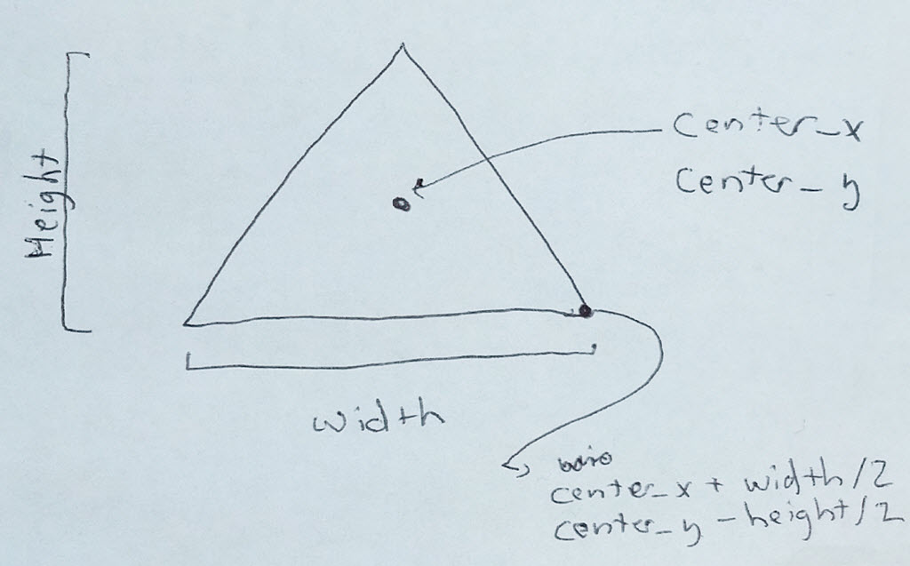

.. sectnum::
    :start: 3

Drawing with Functions
======================

The goal of this chapter is to learn how to create our own functions to draw.
We don't want to be stuck with just ``draw_circle`` commands.
We want to be able to define create our own ``draw_tree`` or ``draw_house``
commands.

A **function** is a block of code that we can **call** with just one line.
Functions give us the ability to write:

* Clear, easy-to-read code.
* The ability to reuse code.

We have already *used* functions. Now we want *define* our own. Defining a
function is like giving a recipe to computer. Once we give the computer a
recipe for banana bread, we just have to tell the computer to "make banana
bread." There's no need to tell it the steps again.

To create our own drawing functions we need to learn three new skills:

* How to define a function
* How to use variables
* How to create simple mathematical expressions

How to Define a Function
------------------------

Defining a function is rather easy.

* Start with the keyword ``def``, which is short for "define."
* Next, give the function a name. There are rules for function names. They must:

  * Start with a lower case letter.
  * After the first letter, only use letters, numbers, and underscores.
  * Spaces are not allowed. Use underscores instead.
  * While upper-case letters can be used, function names are normally all
    lower-case.

* After that, we have a set of parenthesis. Inside the parenthesis will go
  **parameters**. We'll explain those in a bit.
* Next, a colon.
* Everything that is part of the function will be indented four spaces.
* Usually we start a function with a multi-line comment that explains what
  the function does.

Here is an example of a function:

.. code-block:: python

    def draw_grass():
        """
        This function draws the grass.
        """
        arcade.draw_lrtb_rectangle_filled(0, 800, 200, 0, arcade.color.BITTER_LIME)

To call the function, all we need to do is:

.. code-block:: python

    draw_grass()

Below is a full program that defines and uses the function. Notice that
function definitions go *below* the ``import`` statements, and *above* the
rest of the program. While you can put them somewhere else, you shouldn't.

.. literalinclude:: drawing_with_functions_1.py
    :language: python
    :linenos:
    :emphasize-lines: 8-12, 20

Great! Let's make this scene a little better. I've created another function
called ``draw_pine_tree`` which will...you guessed it. Draw a pine tree.

Here's what it will look like:

.. image:: pine_tree.png

And here's the code:

.. literalinclude:: drawing_with_functions_2.py
    :language: python
    :linenos:
    :emphasize-lines: 15-26, 34

Great! But what if I want a forest? I want lots of trees? Do I create a function
for every tree? That's no fun. How can I create a function that allows me to say
where I want the tree? Like what if I wanted to draw three trees and specify
(x, y) coordinates of those trees::

    draw_pine_tree(45, 92)
    draw_pint_tree(220, 95)
    draw_pint_tree(250, 90)

To be able to do this, I need to learn about variables, expressions, and
function parameters.

How to Use Variables
--------------------

A **variable** is a value the computer stores in memory that can change. That
is, it *varies*.

You've used variables in mathematics before. With computer science, we use
them a lot. But in math class, you were given the equation and you had to
solve for the variable. In computer science class, *we* come up with the
equation and the *computer* solves the variable.

Here is a quick example:

.. code-block:: python

    # What will this print?
    x = 5
    print(x)

What will the code above print? It will print ``5``.

The ``=`` is called an **assignment operator**. It assigns the value on the
right side to the variable on the left.

Here's another example. Very similar, but something is different. What will
it print?

.. code-block:: python

    # What will this print?
    x = 5
    print("x")

The code above prints ``x``. Why not ``5``? Because:

* If there are no quotes, the computer evaluates code like a mathematical
  expression.
* If there are quotes, we treat what is between the quotes as a string of
  characters and don't change it.

In fact, that is what we call the characters between the quotes. A **string**,
which is short for "string of characters." We don't call it "text."

The following code won't print at all:

.. code-block:: python

    print(Have a great day!)

The code above will fail because the computer will think that it should evaluate
``Have a great day!`` as a mathematical expression. It isn't, so the computer
gets confused and generates an error. That's why we need quotes:

.. code-block:: python

    print("Have a great day!")

Variable and Function Names
^^^^^^^^^^^^^^^^^^^^^^^^^^^

Variable names and function names follow the same rules. There are
names you *should* use, names you *shouldn't* use, and
names you *can't* use.

Good variable name examples:
    * temperature_in_celsius
    * tree_position
    * car_speed
    * number_of_children
    * simpson

Legal, but bad variable names:
    * temperatueInCelsius - Uses capital letters. Keep it lower case and use underscores.
    * x - Too short, and not descriptive.
    * Simpson - Starts with a capital letter.

Variable names that won't work:
    * tree position - Can't use spaces
    * 4runner - Can't start with a number

Sometimes we want to create a variable that won't change.
We call these variables **constants**.
By convention, these variable names are in all upper case. They are
the only variables that use upper-case. For example:

.. code-block:: python

    PI = 3.14159
    SCREEN_WIDTH = 600
    RED = (255, 0 ,0)

How to Create Expressions
-------------------------

Using Operators in Expressions
^^^^^^^^^^^^^^^^^^^^^^^^^^^^^^

Great! We are part-way there. To really be powerful, variables need to be used
with **expressions**. An expression is simply a mathematical equation like what
you've used in math before. Here's an example:

.. code-block:: python

    # What will this print?
    x = 5 + 10
    print(x)

As you can probably guess, this will print out ``15``. We call the ``+`` sign
an **operator**. Here are some other operators:

========== ==============================
Operator   Description
========== ==============================
\+         Addition
\-         Subtraction
\*         Multiplication
/          Division
//         Integer division (rounds down)
%          Modulus (gives remainder of division)
========== ==============================

There are two things that **don't** work like you'd expect. There is no
"juxtaposition" used to multiply items. And the ``=`` is not an algebraic
equality

Juxtaposition Doesn't Work
^^^^^^^^^^^^^^^^^^^^^^^^^^

Juxtaposition doesn't work for multiplication.
For example, the following will **not** work:

.. code-block:: python

    # The last two lines will error
    x = 3
    y = 2x
    z = 2(3 + x)

You can rewrite the code above to work by explicitly multiplying:

.. code-block:: python

    # This code works. Although it doesn't print anything.
    x = 3
    y = 2 * x
    z = 2 * (3 + x)

Easy enough, just remember to use ``*`` any time you want to multiply.

It isn't an Algebraic Inequality
^^^^^^^^^^^^^^^^^^^^^^^^^^^^^^^^

The ``=`` doesn't work the same as in algebra. The ``=`` evaluates what is on
the right, and puts it in the variable on the left. For example:

.. code-block:: python

    # This works
    x = 3 + 4

    # This doesn't work because the only thing that can be on the left of
    # the = is one variable.
    3 + 4 = x

    # This works
    x = 5
    y = 6
    z = x + 2 * y

    # This doesn't
    x = 5
    y = 6
    2 * z = x + y

This allows us to do some strange things we can't do in algebra!

.. code-block:: python

    # This works, and prints "3"
    x = 3
    print(x)

    # This works too, even if it is invalid in algebra.
    # It takes the value of x (which is 3) and adds one. Then stores
    # the result (4) back in x. So we'll print "4".
    x = x + 1
    print(x)

We can use expressions even in the calls that we make. For example, we have
a ``draw_triangle_filled`` function. It takes three points to draw a triangle.
It needs ``x1, y1, x2, y2, x3, y3``. What if we wanted to center a triangle
around a point, and specify a width and height?

We can use that math when we call our function to draw:

.. code-block:: python

    center_x = 200
    center_y = 200
    width = 30
    height = 30

    arcade.draw_triangle_filled(center_x - width / 2, center_y - width / 2,
                                center_x + width / 2, center_y - width / 2,
                                center_x, center_y + width / 2,
                                arcade.color.FOREST_GREEN)

How to Create a Custom Drawing Function
---------------------------------------

We can call functions with **parameters**.

.. literalinclude:: drawing_with_functions_3.py
    :language: python
    :linenos:
    :emphasize-lines: 15, 46
