.. _version-control:

Version Control Systems
=======================

.. image:: versions.svg
   :width: 80%

We will use a `version control system` to track your work, and allow the
instructor to give feedback. Odds are, this will be the same exact system you'd
use in a large company.

.. _git-quick-ref:

Quick Reference
---------------

This is a quick reference, come back to this when you want to turn in your work.
We'll go over a detailed explanation later.

Commit and Upload
^^^^^^^^^^^^^^^^^

Do this whenever you are done with a session of programming:

1. Open either the "command prompt" on Windows, or "terminal" on MacOS.
2. Type ``cd mydirectoryname`` where the name of the directory will be the same as the name of your repository on
   BitBucket. You can usually type in the first few letters and hit <tab> to fill in the rest of the directory name.
3. Type ``git add *``
4. Type ``git commit -m "Work on lab 1"`` Update the comment between the quotes
   to whatever you did.
5. Type ``git push``

If you get an error while pushing, see :ref:`cant-push`

Turn In Your Work
^^^^^^^^^^^^^^^^^

#. Go to `GitHub <https://github.com/>`_
#. Sign in if needed (Upper right corner. Don't try to sign up again.)
#. Click on your repository on the left side
#. Find the folder with your lab
#. Copy link
#. Go to Scholar/Moodle for the lab
#. Paste link, and turn in

For more commands, see the :ref:`git_command_reference`.

What is a Distributed Version Control System
--------------------------------------------

.. image:: git.svg
    :width: 35%
    :class: right-image

No serious development should be done without version control. In fact, version
control is so important, many developers would argue that almost no development
should be done without version control. Even all my notes for class I keep in
version control.

Version control allows developers to:

* Get any prior version of a project.

  * Released version 1.5 of your program, and now it is crashing? Quick! Go
    back to version 1.4.
  * Did the 'new guy' mess up the project? Revert back!

* Know exactly what changed in the code, when, and by who. See who is actually
  doing the work. If a mistake gets added in, see when it was added and by whom.
* Easily share code between developers.
* Easily work independently of other developers.
* Recover an accidentally deleted or overwritten file.
* Go back and create a bug-fix release on prior versions of a program.
* Work on multiple computers and keep files in sync.

Version control saves untold time and headaches. It used to be that version
control had enough of a learning curve that some developers refused to use it.
Thankfully today's version control tools are so easy to use there's no excuse not to.

There are two main types of version control. The original version control
systems were "centralized" which required a central server. Currently we use
"Distributed Version Control Systems" (DVCS) which don't require a central
server. The software program Git_ is one of the most popular types of DVCS
available today.

.. _Git: http://en.wikipedia.org/wiki/Git_(software)

.. _installing-git:

Installing Git
--------------

Let's install ``git`` on your computer.
If you are using a school computer with ``git`` pre-installed, you can skip
this step.

If you are in Windows, click the link below and download and install the 64-bit version of the ``git``:

* `Windows Git DVCS <https://git-scm.com/download/win>`_

If you are on the Mac:

* Open the "Terminal" window. (Under the 'Utilities' folder in Applications.)
* Type ``git`` at the command prompt.
* You should now be prompted to install some developer tools, which includes ``git``.

.. _fork-repository:

Forking the Repository
----------------------

.. attention::
    You should only have to fork the code **once** during class. If you do it more than
    once, something is wrong. Stop before you do this and see the instructor.
    It is a big headache for everyone if you fork more than once.

1. We are going to store our programs on-line with a website called GitHub.
   Get started by signing up for their website: https://github.com
   As this may become a "portfolio" for your work, choose an account name that
   would work in a professional environment. Feel free to keep it anonymous,
   just avoid something too silly.
2. Go to this web address which has a template for the labs we'll create in
   class: https://github.com/pythonarcade/learn-arcade-work

3. We need to "fork" the repository. This will create your own copy of the
   repository that will be independent of mine. Changes you make to a "fork"
   aren't automatically sent to the original.
   Fork the repository by clicking on the fork button in the upper-right corner:

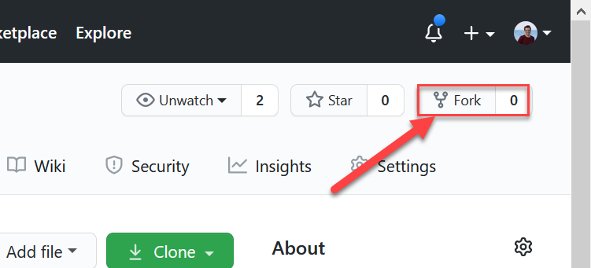

    Forking the repository

4. After grinding away a bit, you should have your own fork. Make sure you are
   on your own fork, and not the original, by looking for your account name:

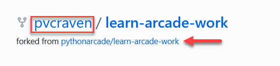

    Verify you are working on your own fork, not the original

6. Now you have your own fork, but it exists on the GitHub server and not
   your computer. We'll fix that in the next section.

.. _clone-repository:

Cloning the Repository
----------------------

.. note::
    Every time you start working on a new computer, you'll need to create a clone.
    (Unless you use a flash drive.)

1. Run the program "Command Prompt" on Windows. Or, if you are on MacOS, go under
   "Applications", find "Utilities" and run "Terminal". You should get something
   like one of the figures below:

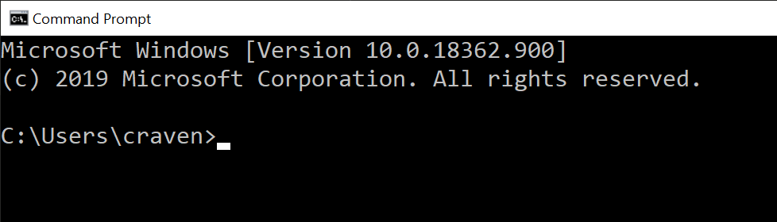

   Windows Command Prompt

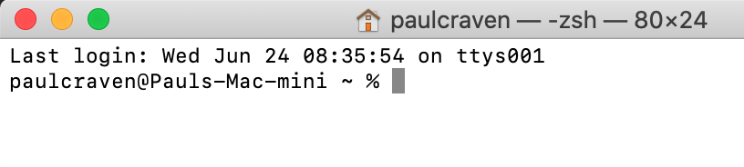

   MacOS Terminal Window

2. Figure out where you want to store your files. You might want to store
   the files on your laptop, a flash drive, or a networked drive. If you aren't
   sure, let's just put them on the Desktop.
3. We need to change our "working directory" to where we want to store our files.
   If you are saving to your desktop, just type ``cd Desktop``. It is case-sensitive
   on MacOS.

.. note::

   You can change directories using the ``cd`` (change directory) command.
   By default, when you
   open a terminal or command prompt you are working in
   your "home" directory. Let's use the
   There's a lot to the ``cd``
   command, but there are a few variations you need to know:

   * ``cd`` - Change to your "home" directory.
   * ``cd mydir`` - Change to ``mydir`` directory. That directory must be in the
     same directory you are in now. Also, if you don't want to type the full
     directory name, you can type the first few letters and hit <tab>.
   * ``cd ..`` - Go up one directory. So if you are in ``C:\home\user\Desktop``
     you'll go up to ``C:\home\user``

4. We want to
   copy the repository you created to your computer. We'll call this a "clone."
   A clone is a copy
   we normally try to keep synced up, which is different than a "fork." Click
   the |code_button| button and see the figure below.
   1) Make sure you are cloning using "HTTPS". 2) Make sure the account shown
   is yours, and not mine or "pythonarcade". 3) Click the copy link button.

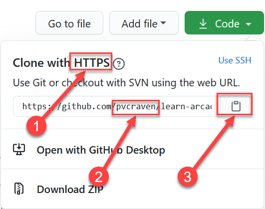

6. Type ``git clone`` followed by a space. Finally, paste the address you copied.
   You might need to use the mouse to paste, as ctrl-v doesn't always paste
   on the command prompt. It should look like this:

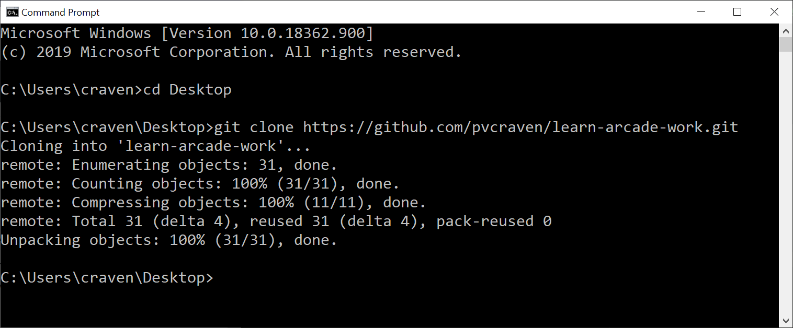

7. Done! You now have a directory set up where you can do your work.

.. _open-in-pycharm:

Open Project in Pycharm
-----------------------

Go ahead and start PyCharm, then select "File...Open". You can select your
Desktop with the non-very-intuitive icon shown in (1) below. Then find the
folder and select it to open as a project as shown in (2).

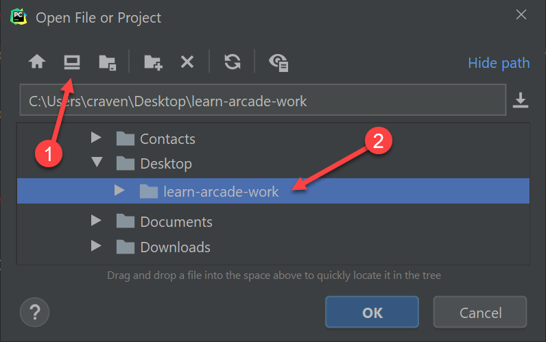

Your project should look like the image below. If this isn't what you have,
you might have opened the wrong folder. Hit "File...Open" and try again.

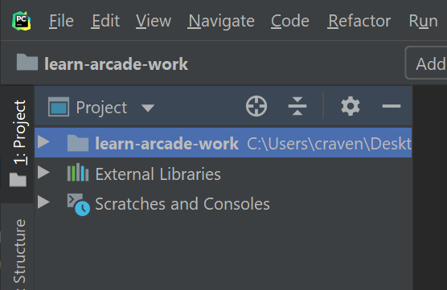

If you click the arrow next to the folder name, you can see all the folders
in the project folder.

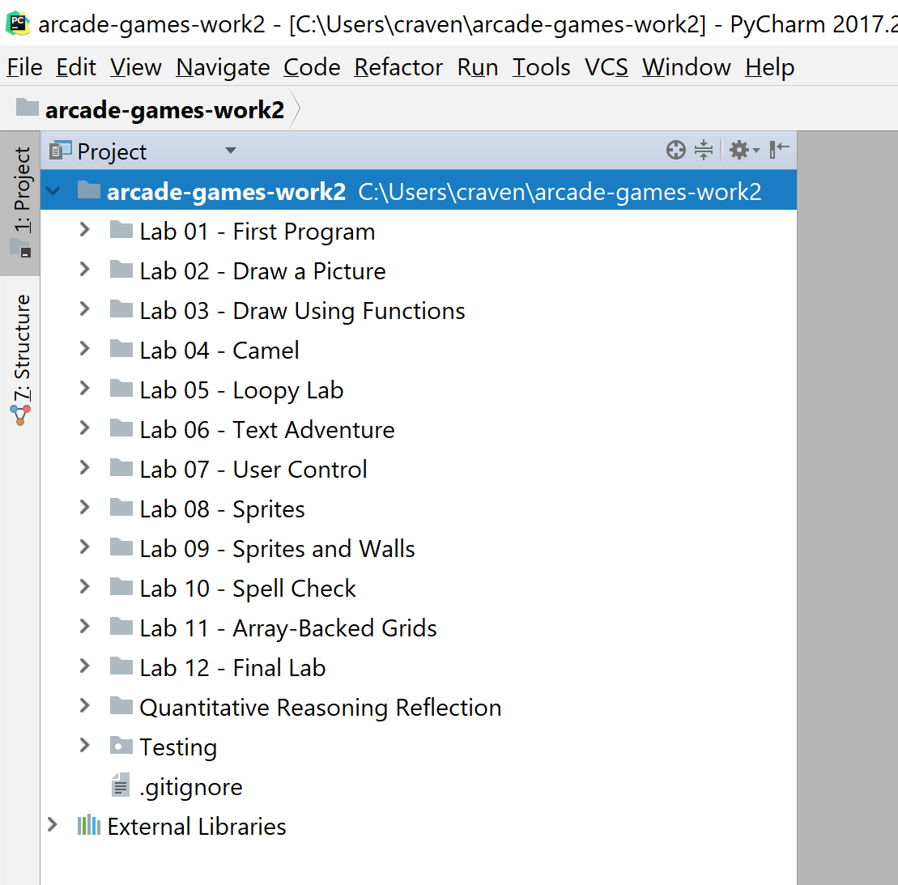

If you plan on moving from computer to computer, try saving onto a flash
drive instead of the desktop. Then you can
reopen your project by just doing "File...Open".

.. _change_file:

Change a File
-------------

Let's practice making a quick change to one of our files. Open your project folder, open the lab 1 folder, then open
lab one. Type in "Hi" or something similar.

.. image:: select_lab_file.png
    :width: 60%

The file will automatically save.

.. _installing-arcade:

Installing Arcade
-----------------

While editing the file, you will likely get a message that looks like this:

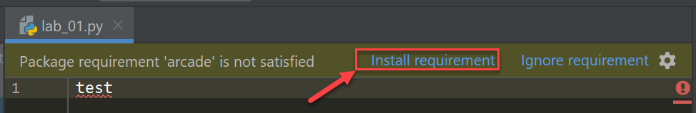

Go ahead and install the 'arcade' library. PyCharm will get everything set up
for you.

.. _commit:

Commit Your Code
----------------

It is time to commit. Wait! You are young and don't want to commit yet?

The cool thing with version control, is that every time you commit, you can go back to the
code at that point in time. Version control lets you take it all back! It is the best type
of commitment ever!

First, open the terminal, and switch to the directory with your project using the ``cd`` command:

.. code-block:: text

    C:\Users\craven\Desktop>cd learn-arcade-work

    C:\Users\craven\Desktop\learn-arcade-work>

Optionally, we can use ``git status`` to see what files have changed:

.. code-block:: text

    C:\Users\craven\Desktop\learn-arcade-work>git status
    On branch master
    Your branch is up to date with 'origin/master'.

    Changes not staged for commit:
      (use "git add <file>..." to update what will be committed)
      (use "git checkout -- <file>..." to discard changes in working directory)

            modified:   Lab 01 - First Program/lab_01.py

    no changes added to commit (use "git add" and/or "git commit -a")

Now, add all the files that have changed. The asterisk (``*``) is a wild card character
that means get all changes. Optionally, we could list out each file, but that's a lot
of work and we don't want to leave anything behind anyway.

.. code-block:: text

    C:\Users\craven\Desktop\learn-arcade-work> git add *

Commit the changes:

.. code-block:: text

    C:\Users\craven\Desktop\learn-arcade-work>git commit -m "Work on lab 1"
    [master 5105a0c] Work on lab 1
     1 file changed, 1 insertion(+)

You might get an error, if the computer doesn't know who you are yet. If you get this error, it will tell you the
commands you need to run. They will look like:

.. code-block:: text

    git config --global user.email "put.your.email.here@my.simpson.edu"
    git config --global user.name "Jane Smith"

Then you can re-run your commit command. You can use the "up" arrow to get commands you typed in
previously so you don't need to retype anything.

.. _push-code:

Push Your Code
--------------

And push them to the server:

.. code-block:: text

    C:\Users\craven\Desktop\learn-arcade-work>git push
    Counting objects: 4, done.
    Delta compression using up to 8 threads.
    Compressing objects: 100% (2/2), done.
    Writing objects: 100% (4/4), 329 bytes | 0 bytes/s, done.
    Total 4 (delta 1), reused 0 (delta 0)
    To bitbucket.org:pcraven/arcade-games-work2.git
       519c361..45028a5  master -> master

Look to see if the message says that there is an "error." The message will probably look a little different than what
you see above, with other objects or threads, but there should not be any errors. If there are errors,
skip down to :ref:`cant-push`.

.. _turn-in-program:

Turning In Your Programs
------------------------

When it comes time to turn in one of your programs, go back to GitHub.
Click on "source", find the lab file, copy the URL:

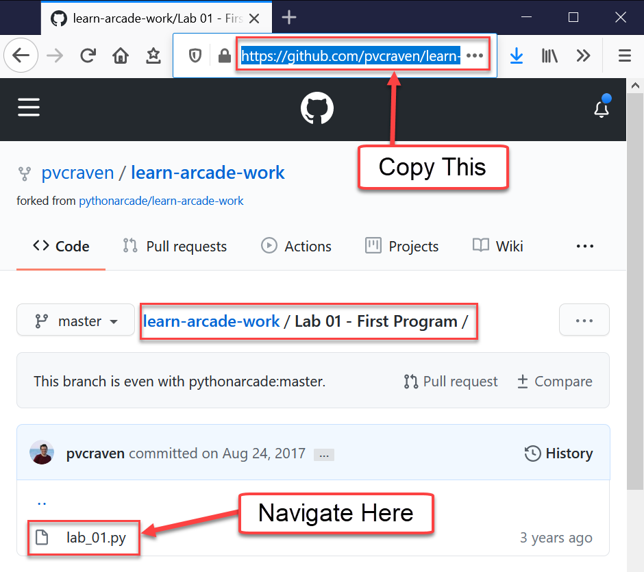

Now go to Scholar and paste the link into the text field for the lab you are are working on.

.. _cant-push:

What If You Can't Push?
-----------------------

What happens if you can't push to the server? If you get an error like what's below?
(See highlighted lines.)

.. code-block:: text
  :emphasize-lines: 4,5

    C:\Users\craven\Desktop\learn-arcade-work> git push
    To bitbucket.org:pcraven/arcade-games-work2.git
     ! [rejected]        master -> master (fetch first)
    error: failed to push some refs to 'git@bitbucket.org:pcraven/arcade-games-work2.git'
    hint: Updates were rejected because the remote contains work that you do
    hint: not have locally. This is usually caused by another repository pushing
    hint: to the same ref. You may want to first integrate the remote changes
    hint: (e.g., 'git pull ...') before pushing again.
    hint: See the 'Note about fast-forwards' in 'git push --help' for details.

You are getting an error because there are changes on the server that aren't on
your computer. You need to pull and merge those changes.

.. _pull-changes:

Step 1: Pull Changes From The Server
^^^^^^^^^^^^^^^^^^^^^^^^^^^^^^^^^^^^

Pull changes from the server:

.. code-block:: text

    git pull

Normally, this will work fine and you'll be done. If so, you can do a
``git push`` and your code will be pushed to the server.

Step 2: Merging
~~~~~~~~~~~~~~~

If you get a screen like the image below, the computer automatically
merged your code bases but it now wants you to type in a comment for the
merge. We'll take the default comment.
Hold down the shift key and type ``ZZ``.
If that doesn't work, hit escape, and then try again.

(You are in an editor called **vim** and it is asking you for a comment about
merging the files. Unfortunately vim is really hard to learn. Shift-ZZ is the
command to save, and all we want to do is get out of it and move on.)

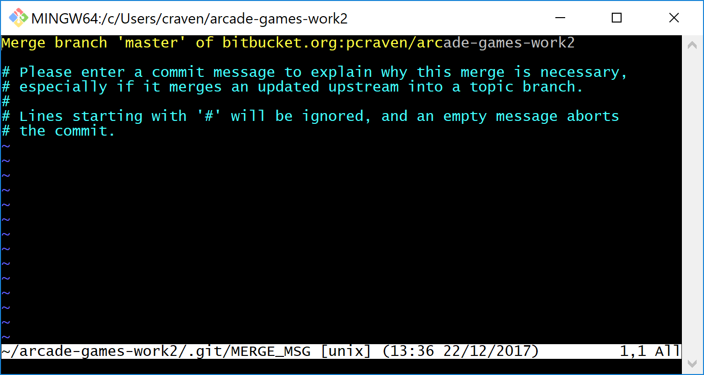

It should finish with something that looks like:

.. code-block:: text

    Merge made by the 'recursive' strategy.
     Lab 01 - First Program/lab_01.py | 3 ++-
     1 file changed, 2 insertions(+), 1 deletion(-)

If instead you get this:

.. code-block: text
   :emphasize-lines: 9

    C:\Users\craven\Desktop\learn-arcade-work> git pull
    remote: Counting objects: 4, done.
    remote: Compressing objects: 100% (4/4), done.
    remote: Total 4 (delta 1), reused 0 (delta 0)
    Unpacking objects: 100% (4/4), done.
    From bitbucket.org:pcraven/arcade-games-work2
       aeb9cf3..6a8f398  master     -> origin/master
    Auto-merging Lab 01 - First Program/lab_01.py
    CONFLICT (content): Merge conflict in Lab 01 - First Program/lab_01.py
    Automatic merge failed; fix conflicts and then commit the result.

Then we edited the same file in the same spot. We have to tell
the computer if we want our changes, or the changes on the other
computer.

Step 3: Resolving a Merge Conflict
~~~~~~~~~~~~~~~~~~~~~~~~~~~~~~~~~~

Do a ``git status``. It should look something like this:

.. code-block:: text
    :emphasize-lines: 13

    C:\Users\craven\Desktop\learn-arcade-work> git status
    On branch master
    Your branch and 'origin/master' have diverged,
    and have 1 and 1 different commits each, respectively.
      (use "git pull" to merge the remote branch into yours)
    You have unmerged paths.
      (fix conflicts and run "git commit")
      (use "git merge --abort" to abort the merge)

    Unmerged paths:
      (use "git add <file>..." to mark resolution)

            both modified:   Lab 01 - First Program/lab_01.py

    no changes added to commit (use "git add" and/or "git commit -a")

The key thing to look for is any file that says ``both modified``.

If you want **your** copy, type:

.. code-block:: text

    git checkout --ours "Lab 01 - First Program/lab_01.py"

If instead you want **their** copy (or the copy on the other computer)
type

.. code-block:: text

    git checkout --theirs "Lab 01 - First Program/lab_01.py"

Then when you are all done with all merges, type:

.. code-block:: text

    C:\Users\craven\Desktop\learn-arcade-work> git add *

    C:\Users\craven\Desktop\learn-arcade-work> git commit -m"Merged"
    [master e083f36] Merged

    C:\Users\craven\Desktop\learn-arcade-work> git push
    Counting objects: 5, done.
    Delta compression using up to 8 threads.
    Compressing objects: 100% (5/5), done.
    Writing objects: 100% (5/5), 531 bytes | 0 bytes/s, done.
    Total 5 (delta 2), reused 0 (delta 0)
    To bitbucket.org:pcraven/arcade-games-work2.git
       6a8f398..e083f36  master -> master

Step 4: Try Pushing Again
^^^^^^^^^^^^^^^^^^^^^^^^^

.. code-block:: text

    C:\Users\craven\Desktop\learn-arcade-work> git push
    Counting objects: 6, done.
    Delta compression using up to 8 threads.
    Compressing objects: 100% (4/4), done.
    Writing objects: 100% (6/6), 604 bytes | 0 bytes/s, done.
    Total 6 (delta 2), reused 0 (delta 0)
    To bitbucket.org:pcraven/arcade-games-work2.git
       d66b008..aeb9cf3  master -> master

.. _git_command_reference:

Longer Git Command Reference
----------------------------

In my experience with 300 level group-project classes, these commands seem to
capture most of what students need to do.

+------------------------------------------------+-------------------------------------------------------------------------------------------------------------------------+
| Command                                        | Description                                                                                                             |
+================================================+=========================================================================================================================+
| ``git status``                                 | See what has changed                                                                                                    |
+------------------------------------------------+-------------------------------------------------------------------------------------------------------------------------+
| ``git fetch``                                  | Grab stuff from the server, but don't merge                                                                             |
+------------------------------------------------+-------------------------------------------------------------------------------------------------------------------------+
| ``git merge --no-commit --no-ff test_branch``  | Merge                                                                                                                   |
+------------------------------------------------+-------------------------------------------------------------------------------------------------------------------------+
| ``git merge --abort``                          | Abort a merge                                                                                                           |
+------------------------------------------------+-------------------------------------------------------------------------------------------------------------------------+
| ``git pull``                                   | Fetch and Merge                                                                                                         |
+------------------------------------------------+-------------------------------------------------------------------------------------------------------------------------+
| ``git add myfile.txt``                         | Add myfile.txt to be committed                                                                                          |
+------------------------------------------------+-------------------------------------------------------------------------------------------------------------------------+
| ``git add .``                                  | Add everything                                                                                                          |
+------------------------------------------------+-------------------------------------------------------------------------------------------------------------------------+
| ``grep -r "<< HEAD" *``                        | Search all files to see if there is merge error text. Do this before committing                                         |
+------------------------------------------------+-------------------------------------------------------------------------------------------------------------------------+
| ``git checkout --ours "myfile.txt"``           | Toss your changes in a merge, use theirs                                                                                |
+------------------------------------------------+-------------------------------------------------------------------------------------------------------------------------+
| ``git checkout --theirs "myfile.txt"``         | Toss their changes, use yours                                                                                           |
+------------------------------------------------+-------------------------------------------------------------------------------------------------------------------------+
| ``git checkout -- .``                          | Remove all your changes, go back to what was last committed. Untracked files are kept.                                  |
+------------------------------------------------+-------------------------------------------------------------------------------------------------------------------------+
| ``git -f clean``                               | Remove untracked files                                                                                                  |
+------------------------------------------------+-------------------------------------------------------------------------------------------------------------------------+
| ``git checkout 44fd``                          | Find the hash of a check-in, and you can go back to that check in. (Don't use 44fd, but replace with the has you want.) |
+------------------------------------------------+-------------------------------------------------------------------------------------------------------------------------+
| ``git checkout master``                        | Go back to most recent check in on the master branch.                                                                   |
+------------------------------------------------+-------------------------------------------------------------------------------------------------------------------------+
| ``git commit -m "My message"``                 | Commit your work. Use a descriptive message or the other people in the class will be irritated with you.                |
+------------------------------------------------+-------------------------------------------------------------------------------------------------------------------------+
| ``git push``                                   | Push commit up to the server.                                                                                           |
+------------------------------------------------+-------------------------------------------------------------------------------------------------------------------------+

Review
------

Review Questions
^^^^^^^^^^^^^^^^

#. What is the *type* of program that allows you to synchronize code between
   multiple people, systems that you are working on, and keep prior versions of
   your work?
#. What is the name of the program for version control we are using in the
   class? (The program, not the website we store the code in.)
#. If you are using a version control system, and get an error trying to "push"
   your code to the central repository, what do you likely need to do before you
   can try pushing again?