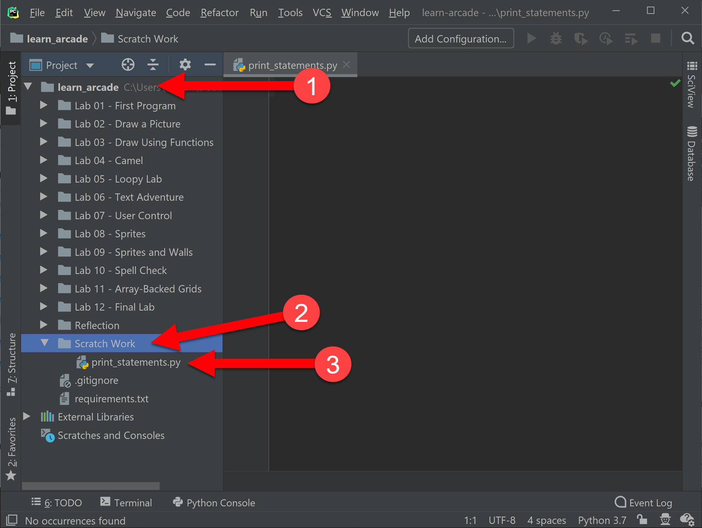

.. _print-function:

The Print Function
==================

.. image:: ../../images/video.svg
    :class: video-image-h1
    :target: https://youtu.be/6KaRu3FS3AA
    :alt: Video link

Prior to this chapter we got our computer ready to start coding in
:ref:`chapter-setup`. We did that by installing the Python programming language
and an integrated development environment (IDE) called PyCharm. You can think
of Python as the engine, and PyCharm as the interface to the engine.

In :ref:`version-control` we began learning `git`.
Version control systems allow us to share code, work on code in groups, and
track changes to the code. We'll use that tool to track and share your code for
every lab you write in this book.

In this chapter we'll write our first programs using the most fundamental of all
tools in the programmer's toolbox, the ``print`` function. This function does
exactly what you'd expect--it prints to the screen.

While a lot of programs are graphics-based, text-only programs are still quite common
with people that manage computers, or who do data analytics. Even for the graphics-based
games we develop in this book, the ``print`` function will be a vital aid in understanding
and debugging our games.

We aren't limited to printing to the screen. Later on in :ref:`saving-high-score`
we'll show how to print to a file so we can save data. Programs can even print
over a network connection, which is the start of what's needed to learn how
to do web programming.

.. _print-hello-world:

Printing "Hello World"
----------------------

.. image:: ../../images/video.svg
    :class: video-image-h2
    :target: https://www.youtube.com/watch?v=6KaRu3FS3AA&t=86s
    :alt: Video link

.. image:: hello_world.svg
    :width: 40%
    :class: right-image

We are going to use a **function** to output text to the screen.
If you've taken a geometry class, you've already used the sine (**sin**)
and cosine (**cos**) functions. In this chapter, we are going to use the
**print** function.

In programming, we use functions *a lot*.
Functions are a basic building block in any computer program.
Just like in math, when we use functions in programming we start with a
**function name**, such as sin, cos, and print.
Immediately after the function name is a pair of parentheses: ``( )``.
We put any function **parameter** inside the parentheses.

In the example below, we have a function,
parenthesis, and a parameter:

.. image:: function_math.svg
   :width: 20%

With a ``sin`` function, we put in an angle as our parameter.
With the ``print`` function, we put the text we want to print as a parameter:

Text *must* be enclosed in quotes, we'll explain why later in
the :ref:`expressions` chapter.

Entering Our Program
--------------------

.. image:: ../../images/video.svg
    :class: video-image-h2
    :target: https://www.youtube.com/watch?v=6KaRu3FS3AA&t=141s
    :alt: Video link

Now that we've seen what the ``print`` function looks like, let's use it to
enter our first program.

The `Hello World`_ program is a simple program that just prints "Hello
World" to the screen. It is often the first program any programmer
creates in a new computer language.

.. _Hello World: https://en.wikipedia.org/wiki/%22Hello,_World!%22_program

First, open PyCharm.
From our work in :ref:`chapter-setup` and :ref:`version-control` we should
already have our PyCharm and our project ready to go. You should be able to run
PyCharm, and see a window like this:

    PyCharm window ready for coding.

First click the triangle next to your project name (1), then find ``Scratch Work``,
(2) then finally ``print_statements.py`` (3).

.. note::

    The most frequent mistake here is to have PyCharm opened to the wrong folder.
    Make sure your all lab folders appear inside the ``learn_arcade`` folder. If they
    don't, select the File...Open menu and reselect your project folder as shown
    in :ref:`open-in-pycharm`. Once selected
    you should not have to do a File...Open again for the rest of the book.

Once you've selected ``print_statements.py``, go ahead and type in your first
program:

.. code-block:: python

    print("Hello World!")

Running Our Program
-------------------

.. image:: ../../images/video.svg
    :class: video-image-h2
    :target: https://www.youtube.com/watch?v=6KaRu3FS3AA&t=216s
    :alt: Video link

After you've typed in your program, right-click on either ``print_statements.py``
or anywhere in the code window and select ``Run 'print_statements.py'``

.. figure:: pycharm_2.png

    Right click on your program, then select run.

You should see the output from your program appear in a window at the bottom of
your computer:

.. figure:: pycharm_3.png

    Output of our Hello World program.

Errors and Warnings
-------------------

.. image:: ../../images/video.svg
    :class: video-image-h2
    :target: https://www.youtube.com/watch?v=6KaRu3FS3AA&t=235s
    :alt: Video link

.. image:: crash.svg
    :width: 40%
    :class: right-image

Programs don't always work on the first try. In fact, they rarely do.
As programmers, we run programs over and over until we find the right code.

If the computer runs into an error that it doesn't know how to handle, it
will generate an error and stop. Don't panic, it's no big deal. We'll
fix it.

In addition to errors where the program doesn't run at all, Python can show us
*warnings*. Warnings occur when the code runs, but something isn't "perfect."

Errors
^^^^^^

.. image:: ../../images/video.svg
    :class: video-image-h2
    :target: https://www.youtube.com/watch?v=6KaRu3FS3AA&t=263s
    :alt: Video link

Let's create an error. Change the ``print`` function to use a capital ``P``: ``Print``.

.. code-block:: Python

    Print("Hello World!")

Run the program. You should get something like this:

.. code-block:: text

    Traceback (most recent call last):
      File "C:/Users/myusername/Documents/learn_arcade/Scratch Work/print_statements.py", line 1, in <module>
        Print("Hello World!")
    NameError: name 'Print' is not defined

    Process finished with exit code 1

.. sidebar:: Exit Codes

    All computer programs return a number called an *exit code* when they are done running.
    An exit code of 0 means the program ran without an error, any other number is a signal
    something went wrong. It is possible to write a program that runs other programs automatically,
    and this exit code is used to track if there was an error.

While it may look confusing, Python is telling you that on line 1 of your ``print_statements.py``
program it encountered a function named ``Print`` with a capital ``P``.
But that function has not yet been "defined."

Python is case-sensitive, which means ``print`` with a lower-case ``p``
and ``Print`` with an upper-case ``P`` are as different as
apples and oranges to the computer.
The lower-case ``print`` function is built into the language, and Python
knows exactly what to do with it. The upper-case ``Print`` function is not built into the language,
and Python complains with a ``NameError`` that it doesn't know what this function is.

Let's try a different error. Go back to using ``print`` with a lower case ``p``, but remove the parentheses:

.. code-block:: python

    print "Hello World"

When you run the program now, you'll get:

.. code-block:: text

    File "C:/Users/myusername/Documents/learn_arcade/Scratch Work/print_statements.py", line 1
        print "Hello World!"
                           ^
    SyntaxError: Missing parentheses in call to 'print'. Did you mean print("Hello World!")?

This is a different type of error, a *syntax error*. The term *syntax* originates with human
languages, not computer languages. Both human and computer languages have an expected structure
to them. A statement in English can take the form of a noun followed by a verb.
"Rob runs." is a valid statement, while "Runs Rob." is not. The computer expects a function
name to be followed by parentheses. If your program doesn't follow that pattern, it
generates a syntax error.

The type of error and the line number are both important clues
on how to solve the mystery what caused the bug.

Warnings
^^^^^^^^

.. image:: ../../images/video.svg
    :class: video-image-h2
    :target: https://www.youtube.com/watch?v=6KaRu3FS3AA&t=357s
    :alt: Video link

It can be possible to write code that runs, but isn't quite perfect.
For example, let's take our Hello World program and add some extra spaces:

.. code-block:: python

    print  ("Hello World!")

Go ahead and run the program. It should run without any errors.

The Python standard is to have *no* spaces between the function name and the
opening parenthesis. However, this code is "close enough" that the computer can
run fine with no errors. In English, if we go to a store and ask
"I'd like to buy one apples please," our sentence isn't grammatically correct.
It is close enough anyone could figure out the intent.

.. sidebar:: PEP-8

    Python has a *style-guide* which lays out how to format your code properly.
    This style-guide is called `PEP-8`_.

.. _PEP-8: https://www.python.org/dev/peps/pep-0008/

Why fix warnings? When finding errors in code, programmers spend a lot of time
looking for things that are out of place. If all code is formatted the same way
it is easier to scan looking for problems. Any inconsistency forces a programmer's
brain to stop and figure out if it is important. Removing those inconsistencies
makes debugging easier.

You can find warnings in your code using PyCharm by looking at the right margin.
Any yellow line is a warning. You can hover over it with your mouse to find the
details.

.. figure:: pycharm_4.png
    :width: 90%

    Warnings are highlighted by yellow lines on the right side of the screen.

Another warning you might encounter in your first program is the Python style
guide states all programs are supposed to have exactly one blank line at the end of the file.
If you get into the habit of fixing these warnings, you'll learn to write
code that will be easier to maintain.

.. note::

    Warnings are not just about style. You might also get a warning about an error that
    could occur before you run the program. For example, if instead of passing a number
    to the ``sin()`` function, you might have written code that passes in text.

    *Weak warnings* are warnings that are mostly just about style or aren't as likely to
    end up being errors. *Strong warnings* are code the computer feels probably points to
    a bug that will end up being an error.

.. _print-multiple-lines:

Multiple Print Lines
--------------------

.. image:: ../../images/video.svg
    :class: video-image-h2
    :target: https://www.youtube.com/watch?v=6KaRu3FS3AA&t=468s
    :alt: Video link

We aren't limited to one ``print`` statement. We can print multiple lines of text with
multiple lines of code. Let's change our Hello World program to the cliché opener for
melodramatic fiction:

.. code-block:: python

    print("It was a dark and stormy night.")
    print("Suddenly a shot rang out!")

Your output should look like:

.. code-block:: text

    It was a dark and stormy night.
    Suddenly a shot rang out!

.. _escape-codes:

Escape Codes
------------

.. image:: ../../images/video.svg
    :class: video-image-h2
    :target: https://www.youtube.com/watch?v=6KaRu3FS3AA&t=493s
    :alt: Video link

If quotes are used to tell the computer the start and end of the string of text you wish
to print, how does a program print out a set of double quotes?

.. note::

    A double-quote is not two quote marks.

    * This is a double quote: ``"``
    * This is a single quote: ``'``
    * This is two double quote marks: ``" "``

This code doesn't work:

.. code-block:: text

    print("Hi! This is a double quote mark: " We use it for printing.")

If we try to run it, we get a syntax error:

.. code-block:: text

    File "S:/Webserver/arcade_book/test.py", line 1
        print("Hi! This is a double quote mark: " We use it for printing.")
                                                  ^
    SyntaxError: invalid syntax

The computer looks at the quote in the middle of the string and thinks that is the end of the text.
Then it has no idea what to do with the text after the quote. It doesn't expect text after a
closing quote, so we end up with an error.

It is necessary to tell the computer that we want to treat that middle double quote as text,
not as a quote ending the string.
To do this, we need to use an **escape code**. An escape code is a sequence of characters that
can be used to print an otherwise unprintable characters.

All escape codes in Python start with a backslash: ``\``. (A backslash leans backwards. A forward
slash ``/`` leans forward.) The escape code for a double quote is ``\"``:

.. code-block:: python

    print("Hi! This is a double quote mark: \" We use it for printing.")

If we run this code, it does not print the backslash, nor does it error. We get:

.. code-block:: text

    Hi! This is a double quote mark: " We use it for printing.

Almost every language has escape codes, and many of them (C, C#, Java) use backslashes
just like Python.

Here's another example:

.. code-block:: python

    print("Audrey Hepburn once said \"Nothing is impossible. The word itself says 'I'm Possible!'.\"")

This will print:

.. code-block:: text

    Audrey Hepburn once said "Nothing is impossible. The word itself says 'I'm Possible!'."

Because the backslash is used as part of an escape code, the backslash itself must be escaped if you want to use
one. For example, this code does not work correctly:

.. code-block:: python

    print("The file is stored in C:\new folder")

Why? Because ``\n`` is an escape code. To print the backslash it is necessary to escape it like so:

.. code-block:: python

    print("The file is stored in C:\\new folder")

There are a few other important escape codes to know. Here is a table of the important escape codes:

=========== =============================================================
Escape code	Description
=========== =============================================================
``\'``      Single Quote
``\"``	    Double Quote
``\t``	    Tab
``\r``	    Carriage Return (Abbreviated as CR, move cursor to the left)
``\n``	    Linefeed (Abbreviated as LF, move cursor down)
=========== =============================================================

What is a "Carriage Return" and a "Linefeed"? Try this example:

.. code-block:: python

    print("This\nis\nmy\nsample.")

The output from this command is:

.. code-block:: text

    This
    is
    my
    sample.

The ``\n`` is a linefeed. It moves "cursor" where the computer will print text down one line. The computer stores all
text in one big long line. It knows to display the text on different lines because of the placement of ``\n`` characters.

Before the Internet became commonplace, computers didn't agree on what characters to use for line endings:

=========== =======================================
Escape code	Description
=========== =======================================
``\r\n``    CR+LF: Microsoft Windows
``\n``      LF: UNIX based systems, and newer Macs.
``\r``      CR: Older Mac based systems
=========== =======================================

Having different standards was annoying when computers were connected on a network. The
post-internet standard is to use ``\n`` for line endings.

If you use an escape code, don't put spaces around it. Don't, unless, you want spaces to be
there.
For example, this code might look better:

.. code-block:: python

    print("This \n is \n my \n sample.")

But it will print with extra spaces before the words:

.. code-block:: text

    This
     is
     my
     sample.

Just because you *can* use a ``\n`` to print multiple lines in a single ``print`` statement
doesn't mean you should. Often it is easier to read two short ``print`` statements rather
than one super-long ``print`` statement with a bunch of ``\n`` escape codes crammed into it.

Triple Quotes
-------------

.. image:: ../../images/video.svg
    :class: video-image-h2
    :target: https://www.youtube.com/watch?v=6KaRu3FS3AA&t=669s
    :alt: Video link

If you have a block of text and don't want to spend a lot of time putting quotes
around each line, you can use triple quotes.

.. code-block:: python

	print("""You can print
	on multiple
	lines using
	triple
	quotes.""")

This code will run and print out like this:

.. code-block:: text

    You can print
    on multiple
    lines using
    triple
    quotes.

It is tempting to put in extra blank lines and indents. Don't do this unless you
want them in the final output. For example, the code in this example looks better
than the code in the previous example:

.. code-block:: python

	print("""You can print
                on multiple
                lines using
                triple
                quotes.""")

But the output will include all those extra spaces:

.. code-block:: text

    You can print
             on multiple
             lines using
             triple
             quotes.

Review
------

.. image:: ../../images/video.svg
    :class: video-image-h2
    :target: https://www.youtube.com/watch?v=6KaRu3FS3AA&t=708s
    :alt: Video link

In this chapter we learned one of the most basic building blocks of a computer
program is the **function**.
The first function we are learning about is the ``print`` function,
used to output information to the screen.
We learned how to use that function by entering and running our first program.
As programs don't always work the first try, we learned about **name errors** and
**syntax errors**. We learned that code has a style guide called
**PEP-8** that defines how code should be formatted.
Printing multiple lines is possible using three techniques: multiple print statements,
**escape codes**, and **triple-quotes**. We learned that escape codes can also be used to
print quotes and tab characters.

Questions
^^^^^^^^^

#. What term refers to the values between the parentheses in function?
#. What type of error are we likely to get, if we mistype a function name?
#. If you forget to use parentheses when using a function, what type of error
   will you get?
#. What is the name of the style-guide for Python?
#. What is the escape code for a double quote?
#. What escape code is most commonly used to go to a new line?
#. What will this print? ``print("Escape codes: \\\\")``
#. What do you use to print a block of text without using multiple print statements
   or ``\n``?

Online Coding Problems
^^^^^^^^^^^^^^^^^^^^^^

Practice on-line by completing the first set of coding problems available here:

https://repl.it/community/classrooms/174286

All problems beginning with ``01`` can be done with the knowledge from this
chapter.

Lab 1
^^^^^

Complete :ref:`lab-01`.

