.. _how-to-draw:

How to Draw with Your Computer
==============================

.. image:: ../../images/video.svg
    :class: video-image-h1
    :target: https://youtu.be/wYofTQaIIlQ
    :alt: Video link

* Video: https://youtu.be/wYofTQaIIlQ
* Slides: https://slides.com/paulcraven/5-how-to-draw-with-your-computer

We've setup our system, learned to use git, and run our first program
using the ``print`` function. Now we are ready to start using
functions to make graphics!

In this chapter we will learn to import a graphics library and call its
functions. By the end of this chapter, you will be able to create your
own art like this:

.. image:: simpson_map.png

You can page through several other examples of student-created art
in :ref:`lab-02`.

We will concentrate on learning to call functions for graphics
in this chapter. The same concepts we learn here also apply to calling functions
for other activities
like robotics, data analytics, and web site programming.

Creating a New Program
----------------------

.. image:: ../../images/video.svg
    :class: video-image-h2
    :target: https://www.youtube.com/watch?v=wYofTQaIIlQ&t=40s?autoplay=1
    :alt: Video link

Open up PyCharm. It should start up with the same set of project files
we used last chapter. We'll use
this project for all our work in this book. Do **not** create new projects for each
lab or program.

We are going to create a lot of code samples as we learn new concepts.
You should already have a folder called ``Scratch Work``. We can put our code
samples there. Create a new sample by:

#. Right-click on ``Scratch Work``
#. Click ``New``
#. Click ``Python File``

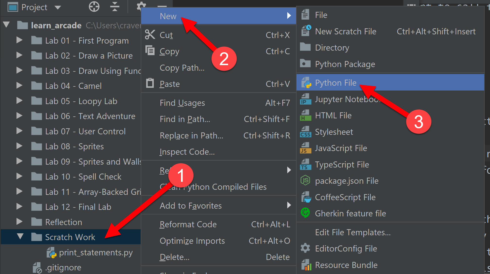

Name the file ``drawing_samples.py``. Make sure it is inside the ``Scratch Work``
folder. If it isn't, drag to move it. The file should appear like the
following:

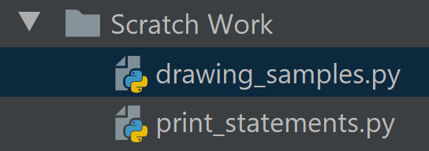

Comment Your Code
-----------------

.. image:: ../../images/video.svg
    :class: video-image-h2
    :target: https://www.youtube.com/watch?v=wYofTQaIIlQ&t=85s
    :alt: Video link

Before we start writing long programs, we need to learn about **code comments**.
When typing in computer code, sometimes we want to be able to write things
for our own benefit, and for anyone else that reads the code. Since this won't be
computer code, we need to tell the computer to ignore it.

Below are two ways of adding comments to code in the Python computer language:

.. literalinclude:: comments.py
    :language: python
    :linenos:

The Python standard is to use multi-line comments with triple quotes
at the start of each source file to explain what the code does.
Use single-line comments everywhere else for now.

Go ahead and try putting in your own comments.

Before we run this program, we need to make
sure we are running the *right* program. Look at the image below. If I select
"run" with the green arrow, I will run ``lab_01.py``, *not* the program I
want to run. You need to right-click on our program and select
"Run ``drawing_sample.py``" instead.

.. image:: running_the_right_program.png

Hey wait! When we finally run our program, nothing happens. That's because
the only code that we wrote were "comments." Comments are ignored.
Therefore, there was nothing for the computer to do. Read on.

Import the Arcade Library
-------------------------

.. image:: ../../images/video.svg
    :class: video-image-h2
    :target: https://www.youtube.com/watch?v=wYofTQaIIlQ&t=152s
    :alt: Video link

Before we can draw anything, we need to import a "library" of code that has
commands for drawing.

Computer languages come with a set of built-in commands. Most programs will
require *more* commands than what the computer language loads by default. These
sets of commands are called **libraries**. Some languages have their own special
term for these libraries. In the case of Python, they are called **modules**.
In the Python world you can use the term library and module interchangeably.

Thankfully, it is easy to import a library of code.
If we want to use the Arcade library, all we need
to do is add ``import arcade`` at the top of our program.

.. attention::
    Libraries should always be imported at the **top** of your program.
    Only comments should appear ahead of an ``import`` statement.
    Technically, you *can* put the ``import`` statement somewhere else,
    just like technically you *can* wear a pair of shorts on your head. But
    don't. Trust me on this.

In the code below, we've imported the Arcade library. If you run the code,
yet again nothing will happen. We've loaded the Arcade
library, but we haven't *done* anything with it yet. That's our next step.

.. literalinclude:: import_arcade.py
    :language: python
    :linenos:
    :emphasize-lines: 7

.. note::
   If you get an error that you can't import the Arcade library, it hasn't been
   installed for your current Python environment. Go back
   and follow the directions in :ref:`installing-arcade`.

How to Open a Window for Drawing
--------------------------------

.. image:: ../../images/video.svg
    :class: video-image-h2
    :target: https://www.youtube.com/watch?v=wYofTQaIIlQ&t=239s
    :alt: Video link

The first Arcade function we are going to learn is open_window_. This
command opens a window with a given size and title.
The code looks like the following:

.. _open_window: https://api.arcade.academy/en/latest/arcade.html#arcade.open_window

.. code-block:: python

    arcade.open_window(600, 600, "Drawing Example")

What does each part mean?

To begin, we select the arcade library
with ``arcade``. Then we separate the library from the function name
with a period: ``.`` Next, we put in the name of the function, ``open_window``.

.. sidebar:: Vocabulary

    We give commands to the computer by using **functions**.
    The **function name**, such as ``print`` or ``open_window``
    is how we identify the function.

    We can import new functions
    by using a **library**. The **library name**, such as ``arcade``
    is how we identify the library.

    A **statement** is a line of code in Python. It includes the
    function name, parentheses, numbers, text and everything else
    required to call the function or perform some other operation.

Just like the ``print`` function, we surround the function
**parameters** with parentheses. For example:

.. code-block:: python

    my_function(parameters)

If we have more than one parameter, we can use commas to separate them.
PEP-8 asks that each comma is followed by a space. If we have a library,
then we specify that up front. For example:

.. code-block:: python

    my_library.my_function(parameter_1, parameter_2)

The ``open_window`` function requires at least three parameters:

* The window width in pixels.
* The window height in pixels.
* The text that will appear on the title bar.

In the case of width and height, the numbers specify the part of the window you
can draw on. The actual
window is larger to accommodate the title bar and borders. So a 600x600 window
is really 602x632 if you count the title bar and borders.

How do we know ``open_window`` is the name of the function to call? How did
we know what parameters to use? The names of the functions, the order of the
parameters, is the **Application Program Interface** or "API" for short. You can
click here for the entire `Arcade API`_ or go straight to the documentation
for open_window_. Any decent library will have API
documentation, and
`example code <https://api.arcade.academy/en/latest/examples/index.html>`_
to show how to use the library.

.. _Arcade API: https://api.arcade.academy/en/latest/quick_index.html

Below is an example program that will open up a window:

.. literalinclude:: open_window.py
    :language: python
    :linenos:
    :emphasize-lines: 13

Try running the code above. It kind-of works. If you have fast eyes, and a slow
computer you might see the window pop open, then immediately close.
If your computer is super-fast, you won't see anything at all because the
window opens and closes faster than your eye can process.
Why does it close? Because our program is done! We've ran out of code
to execute.

To keep the window open, we need to pause until the user hits the
close button. To do this, we'll use the ``run`` command in the Arcade library.
The ``run`` command takes no parameters, but still needs parentheses.

.. literalinclude:: open_window_and_pause.py
    :language: python
    :linenos:
    :emphasize-lines: 16

You should get a window that looks something like this:

.. image:: empty_window.png
    :width: 300px

Clearing the screen
-------------------

.. image:: ../../images/video.svg
    :class: video-image-h2
    :target: https://www.youtube.com/watch?v=wYofTQaIIlQ&t=384s
    :alt: Video link

Right now we have default white as our background.
How do we get a different color? Use the ``set_background_color`` command.

Before we can see the color, we need two more commands. These commands
tell the Arcade library when you are about to start drawing (``start_render``),
and when you are done drawing (``finish_render``).

See below:

.. literalinclude:: open_window_and_clear_screen.py
    :language: python
    :linenos:
    :emphasize-lines: 16, 19, 24

Try running the program. If everything is correct, you should get a window with a
colored background.

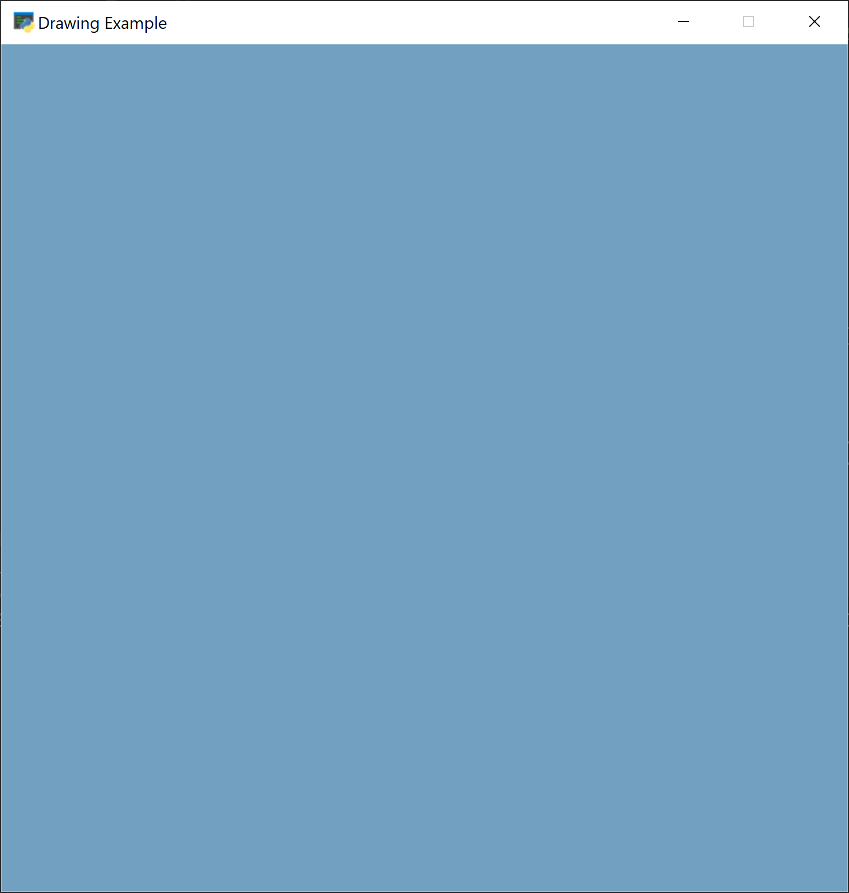

Specifying Colors
-----------------

.. image:: ../../images/video.svg
    :class: video-image-h2
    :target: https://www.youtube.com/watch?v=wYofTQaIIlQ&t=439s
    :alt: Video link

Wait, where did ``arcade.csscolor.SKY_BLUE`` come from? How do I get to choose
the color I want? There are three ways to specify colors:

* Look at the `arcade.color API documentation`_ and specify by name.
* Look at the `arcade.csscolor API documentation`_ and specify by name.
* Specify the RGB or RGBA color.

To specify colors by name, you can look at the color API documentation and
use something like ``arcade.color.AQUAMARINE`` in your program. Those color
names come from the ColorPicker `color chart`_.

The colors in ``arcade.csscolor`` come from the same standard color names used in
creating web pages. Therefore, I suggest using these color names because it
will also help with web development skills.

.. _rgb-values:

RGB Values
^^^^^^^^^^

.. image:: ../../images/video.svg
    :class: video-image-h2
    :target: https://www.youtube.com/watch?v=wYofTQaIIlQ&t=495s
    :alt: Video link

If the color you want isn't in the chart, or you just don't want to use
a chart, you can specify colors by "RGB" value. RGB stands for Red, Green, and
Blue.

Computers, TVs, color changing LEDs, all
work by having three small lights close together. A red light, a green light,
and a blue light. Turn all three lights off and you get black. Turn all three
lights on and you get white. Just turn on the red, and you get red. Turn on
both red and green to get yellow.

RGB based monitors work on an *additive* process. You start with black and
add light to get color.
This is different than
paint or ink, which works on a *subtractive* process. You start with white and
add to get darker colors.

Therefore, keep separate in your mind how light-based RGB color works from how
paint and ink works.

We specify how much red, green, and blue to use by a number range
of 0-255. No light is zero.
Turn the light on all the way on and it is 255.
We need three numbers to specify three colors, so
``(0, 0, 0)`` means no red,
no green, no blue. Black. Here are some other examples:

===== ======= ====== ===========
Red   Green   Blue   Color
===== ======= ====== ===========
0     0       0      Black
255   255     255    White
127   127     127    Gray
255   0       0      Red
0     255     0      Green
0     0       255    Blue
255   255     0      Yellow
===== ======= ====== ===========

There are tools that let you easily find a color, and then get the RGB value for it.
If you go to the Google search engine and type in "`color picker`_" it shows a nice
tool for picking colors. At the bottom of the color picker, the color is shown
in hex, CMYK, and several other formats. Remember, we want the RGB
value.

.. _color picker: https://www.google.com/search?q=color+picker

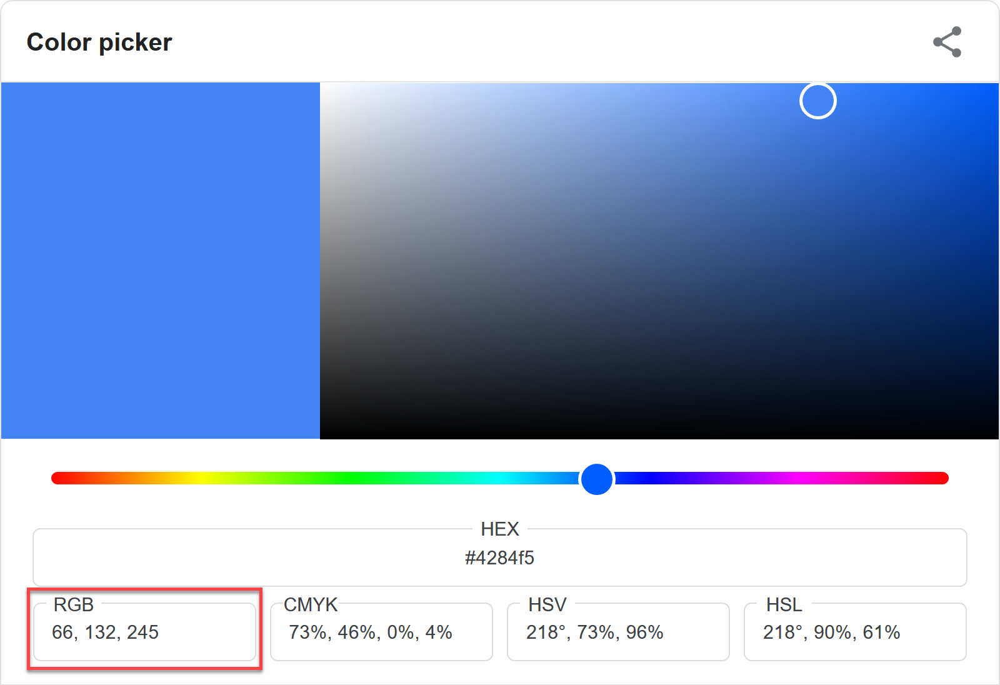

After getting the RGB value, specify the color as a set of three numbers surrounded
by parenthesis, like the following code:

.. code-block:: python

    arcade.set_background_color((189, 55, 180))

In addition to RGB, you can also specify the "Alpha" with an RGBA value.
The "Alpha Channel" controls
how transparent the color is. If you draw a square with an alpha of 255, it will
be solid and hide everything behind it. An alpha of 127 will be in the middle,
you will see some of the items behind the square. An alpha of 0 is completely
transparent and you'll see nothing of the square.

.. _color chart: http://www.colorpicker.com/color-chart/
.. _arcade.csscolor API documentation: https://api.arcade.academy/en/latest/arcade.csscolor.html
.. _arcade.color API documentation: https://api.arcade.academy/en/latest/arcade.color.html

What is a Byte?
^^^^^^^^^^^^^^^

.. image:: ../../images/video.svg
    :class: video-image-h2
    :target: https://www.youtube.com/watch?v=wYofTQaIIlQ&t=650s
    :alt: Video link

Notice how the color values go between 0 and 255? That's strange. Why 255? Why
not 100? Why not 1000?
This requires an explanation of a very important concept of how computers
handle numbers.

You may have heard that computers think in 1's and 0's.
That's true.
Everything to the computer is a switch. If there is electricity, we have a 1. If
there is no electricity we have a 0. Every 1 and 0 is called a **bit**.
We can store those bits in memory.

How do we go from 1's and 0's to numbers we normally use?
We group these 1's and 0's together to form **binary numbers**.
These combinations of 1's and 0's work like combinations
of the digits 0-9 used to form the base-10 numbers we are used to.
Like this:

================ ===========
Binary - Base 2  Base 10
================ ===========
0000             0
0001             1
0010             2
0011             3
0100             4
0101             5
0110             6
0111             7
1000             8
================ ===========

See the pattern? It is the same pattern we use when we count as a kid.
As a kid we learned to go 0 to 9,
then when we hit 9 we go back to 0 and add one to the ten's place. Here we only
have 0 to 1 instead of 0 to 9. And instead of a "ten's place" we have a "two's
place."

You might have used "bases" in math class long ago. Computers work in Base-2
because they only have two ways to count, on or off.
Humans think in Base-10 because we have 10 fingers.

Numbers are stored in **bytes**. A byte is a set of eight bits.
If we were to follow the pattern we started above, the largest number we
could store with eight 1's and 0's is:

.. code-block:: text

    1111 1111

In Base-10 this is 255.

Let's use some math. We have 8 ones and zeros. That give us 2 :sup:`8` = 256
possible combinations. Each combination is a different number.
Since zero a counts as a number, that makes the biggest number 255.

If we had 16 bits, then we'd have 2 :sup:`16` = 65,536 possible combinations. Or a
number from 0-65,535. A 32-bit computer can hold numbers up
to 2 :sup:`32` = 4,294,967,296. A 64-bit computer can hold really large numbers!

So because a computer holds colors with one byte for red, one for green, and one
for blue, each color has a value range from 0 - 255.

The Coordinate System
---------------------

.. image:: ../../images/video.svg
    :class: video-image-h2
    :target: https://www.youtube.com/watch?v=wYofTQaIIlQ&t=826s
    :alt: Video link

We've learned to specify the color of what we want to draw, the next thing
we need to learn is how to position it.
In your math classes, you've probably learned about the Cartesian coordinate
system, which looks like this:

.. figure:: cartesian_coordinate_system.svg
    :width: 350px

    Source: `Wikipedia: Cartesian coordinate system <https://commons.wikimedia.org/wiki/File:Cartesian_coordinate_system_(comma).svg>`_

Our graphics will be drawn using this same system. But there are additional
things to keep in mind:

* We will only draw in the upper right quadrant. So 0,0 will be in the
  lower left of the screen, and all negative coordinates will be off-screen.
* Each "point" will be a pixel. So a window that is 800 pixels wide, will have
  x-coordinates that run from 0 to 799. (Zero is one of the pixels, so 0-799 is
  800 pixels. Off-by-one errors are *very* common in computing.)

Drawing
-------

.. image:: ../../images/video.svg
    :class: video-image-h2
    :target: https://www.youtube.com/watch?v=wYofTQaIIlQ&t=870s
    :alt: Video link

Arcade has "drawing primitives" that allow you to create rectangles, circles,
arcs, lines, and text.

Drawing Rectangles
^^^^^^^^^^^^^^^^^^

.. image:: ../../images/video.svg
    :class: video-image-h2
    :target: https://www.youtube.com/watch?v=wYofTQaIIlQ&t=878s
    :alt: Video link

Our screen currently has a sky-blue color. Let's draw a rectangle in the bottom
half of the screen and make that a grass color.

The function
we will use is draw_lrtb_rectangle_filled_. It stands for "draw
left-right-top-bottom rectangle".

.. _draw_lrtb_rectangle_filled: https://api.arcade.academy/en/latest/arcade.html#arcade.draw_lrtb_rectangle_filled

To make the bottom half of our screen green grass, we'll start
with a left of 0, a right of 599, a top of 300, and a bottom of zero.
The order of the statements is important, make sure you put in your command
after the ``start_render`` and before the ``finish_render``.

.. literalinclude:: draw_rect.py
    :language: python
    :linenos:
    :emphasize-lines: 24

Your window should look like this:

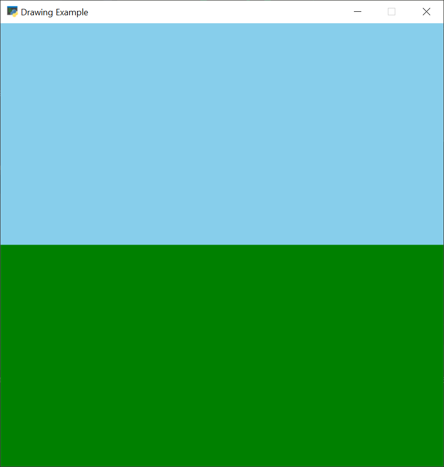

Sometimes we don't want to specify a rectangle by left-right-top-bottom.
There is also an option to specify it by center x, center y, width, and height using the
draw_rectangle_filled_ function. For example
this code displays a tree trunk:

.. _draw_rectangle_filled: https://api.arcade.academy/en/latest/arcade.html#arcade.draw_rectangle_filled

.. code-block:: python

    # Tree trunk
    # Center of 100, 320
    # Width of 20
    # Height of 60
    arcade.draw_rectangle_filled(100, 320, 20, 60, arcade.csscolor.SIENNA)

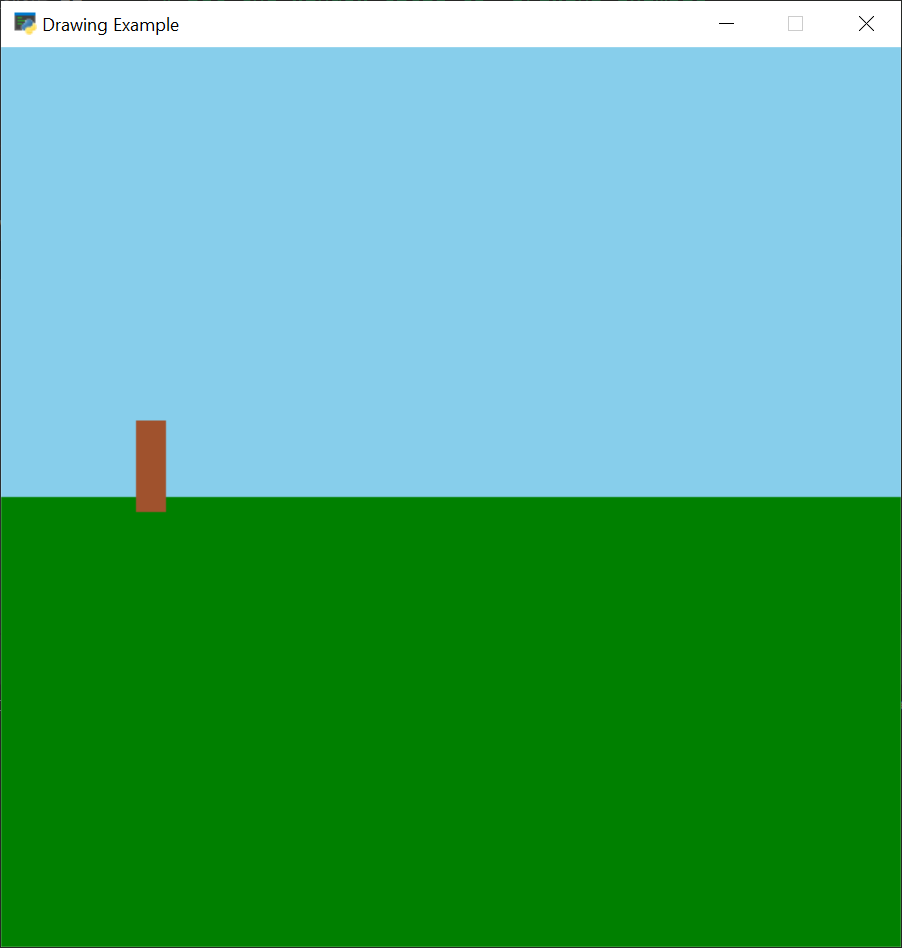

There's also a function to draw the outline of a rectangle called
draw_rectangle_outline_. Both of these functions (and many others)
have an optional parameter to tilt the rectangle to a desired angle.

.. _draw_rectangle_outline: https://api.arcade.academy/en/latest/arcade.html#arcade.draw_rectangle_outline

Drawing Circles
^^^^^^^^^^^^^^^

.. image:: ../../images/video.svg
    :class: video-image-h2
    :target: https://www.youtube.com/watch?v=wYofTQaIIlQ&t=966s
    :alt: Video link

We can draw a circle with draw_circle_filled_. This code will draw a circle
with a center of 100, 350 and a radius of 30 pixels.

.. _draw_circle_filled: https://api.arcade.academy/en/latest/arcade.html#arcade.draw_circle_filled

.. code-block:: python

    # Tree top
    arcade.draw_circle_filled(100, 350, 30, arcade.csscolor.DARK_GREEN)

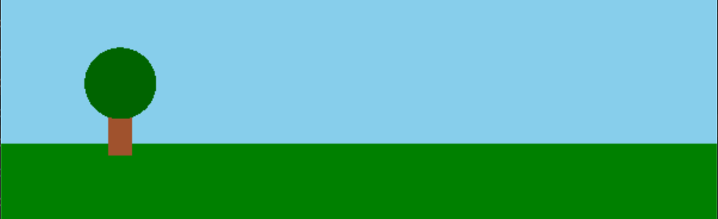

Drawing Ellipses
^^^^^^^^^^^^^^^^

.. image:: ../../images/video.svg
    :class: video-image-h2
    :target: https://www.youtube.com/watch?v=wYofTQaIIlQ&t=987s
    :alt: Video link

If you don't want a perfect circle, you can draw a ellipse. Ellipses are drawn
like rectangles. The "rectangle" forms the bounds of the ellipse that's drawn
inside it. Examine this code sample:

.. code-block:: python

    # Draw an ellipse and rect with
    # a center of (300, 300)
    # width of 350
    # height of 200
    arcade.draw_rectangle_outline(300, 300, 350, 200, arcade.csscolor.BLACK, 3)
    arcade.draw_ellipse_outline(300, 300, 350, 200, arcade.csscolor.RED, 3)

Now look at what it draws to understand the relation between the rectangle and ellipse.

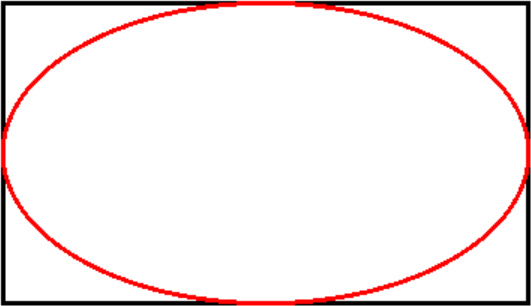

With the ``draw_ellipse_filled`` function we can make a tree out of a tall
ellipse for the top:

.. code-block:: python

    # Another tree, with a trunk and ellipse for top
    arcade.draw_rectangle_filled(200, 320, 20, 60, arcade.csscolor.SIENNA)
    arcade.draw_ellipse_filled(200, 370, 60, 80, arcade.csscolor.DARK_GREEN)

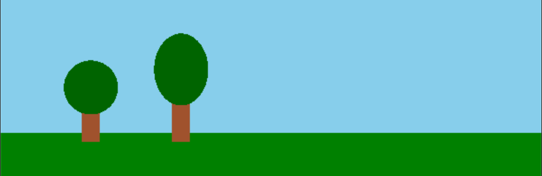

Drawing Arcs
^^^^^^^^^^^^

.. image:: ../../images/video.svg
    :class: video-image-h2
    :target: https://www.youtube.com/watch?v=wYofTQaIIlQ&t=1066s
    :alt: Video link

You can draw an arc with draw_arc_filled_. Drawing an arc works just like an
ellipse, with the additional parameters for a start angle and an end angle.

.. _draw_arc_filled: https://api.arcade.academy/en/latest/arcade.html#arcade.draw_arc_filled

.. code-block:: python

    # Another tree, with a trunk and arc for top
    # Arc is centered at (300, 340) with a width of 60 and height of 100.
    # The starting angle is 0, and ending angle is 180.
    arcade.draw_rectangle_filled(300, 320, 20, 60, arcade.csscolor.SIENNA)
    arcade.draw_arc_filled(300, 340, 60, 100, arcade.csscolor.DARK_GREEN, 0, 180)

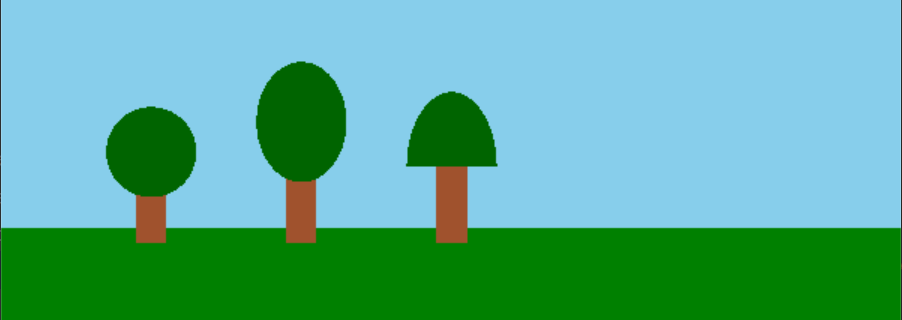

Triangles
^^^^^^^^^

.. image:: ../../images/video.svg
    :class: video-image-h2
    :target: https://www.youtube.com/watch?v=wYofTQaIIlQ&t=1107s
    :alt: Video link

Triangles are drawn by specifying the coordinates of each point with draw_triangle_filled_.
That requires
a bit of thought about where each point goes. I often end up sketching it
out on paper to get it straight. This can be used to make a pine tree.

.. _draw_triangle_filled: https://api.arcade.academy/en/latest/arcade.html#arcade.draw_triangle_filled

.. code-block:: python

    # Another tree, with a trunk and triangle for top
    # Triangle is made of these three points:
    # (400, 400), (370, 320), (430, 320)
    arcade.draw_rectangle_filled(400, 320, 20, 60, arcade.csscolor.SIENNA)
    arcade.draw_triangle_filled(400, 400, 370, 320, 430, 320, arcade.csscolor.DARK_GREEN)

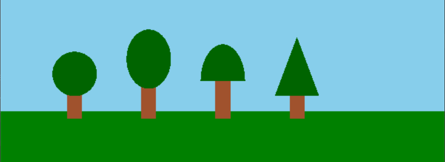

Polygons
^^^^^^^^

.. image:: ../../images/video.svg
    :class: video-image-h2
    :target: https://www.youtube.com/watch?v=wYofTQaIIlQ&t=1140
    :alt: Video link

Polygons are drawn with a list of points and the draw_polygon_filled_ function.
In this example we use five points to create a tree-top.

.. _draw_polygon_filled: https://api.arcade.academy/en/latest/arcade.html#arcade.draw_polygon_filled

.. code-block:: python

    # Draw a tree using a polygon with a list of points
    arcade.draw_rectangle_filled(500, 320, 20, 60, arcade.csscolor.SIENNA)
    arcade.draw_polygon_filled(((500, 400),
                                (480, 360),
                                (470, 320),
                                (530, 320),
                                (520, 360)
                                ),
                               arcade.csscolor.DARK_GREEN)

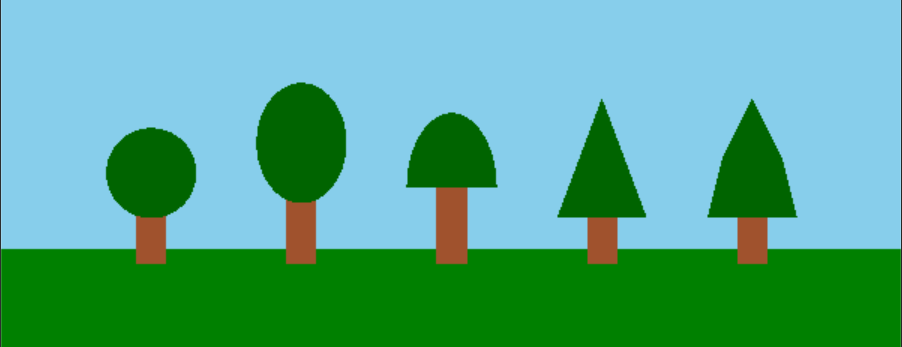

Lines
^^^^^

.. image:: ../../images/video.svg
    :class: video-image-h2
    :target: https://www.youtube.com/watch?v=wYofTQaIIlQ&t=1176
    :alt: Video link

Line drawing with the draw_line_ function involves specifying a start point and and end point.
Optionally, you can specify the line width. You can also use
draw_line_strip_ to draw a continuous multi-point line.

.. _draw_line: https://api.arcade.academy/en/latest/arcade.html#arcade.draw_line
.. _draw_line_strip: https://api.arcade.academy/en/latest/arcade.html#arcade.draw_line_strip

In our sample image, we'll use several lines to draw rays coming out of a sun:

.. code-block:: python

    # Draw a sun
    arcade.draw_circle_filled(500, 550, 40, arcade.color.YELLOW)

    # Rays to the left, right, up, and down
    arcade.draw_line(500, 550, 400, 550, arcade.color.YELLOW, 3)
    arcade.draw_line(500, 550, 600, 550, arcade.color.YELLOW, 3)
    arcade.draw_line(500, 550, 500, 450, arcade.color.YELLOW, 3)
    arcade.draw_line(500, 550, 500, 650, arcade.color.YELLOW, 3)

    # Diagonal rays
    arcade.draw_line(500, 550, 550, 600, arcade.color.YELLOW, 3)
    arcade.draw_line(500, 550, 550, 500, arcade.color.YELLOW, 3)
    arcade.draw_line(500, 550, 450, 600, arcade.color.YELLOW, 3)
    arcade.draw_line(500, 550, 450, 500, arcade.color.YELLOW, 3)

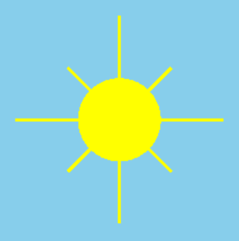

Text
^^^^

.. image:: ../../images/video.svg
    :class: video-image-h2
    :target: https://www.youtube.com/watch?v=wYofTQaIIlQ&t=1202
    :alt: Video link

Text can be drawn with the draw_text_ command.
Just like with the ``print`` function, text must be enclosed in quotes.
The text to draw is the first parameter. The x, y location of the text is
are next two. Finally the color and font size come next.

.. _draw_text: https://api.arcade.academy/en/latest/arcade.html#arcade.draw_text

.. code-block:: python

    # Draw text at (150, 230) with a font size of 24 pts.
    arcade.draw_text("Arbor Day - Plant a Tree!",
                     150, 230,
                     arcade.color.BLACK, 24)

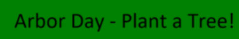

Full Example Drawing Program
^^^^^^^^^^^^^^^^^^^^^^^^^^^^

Here's the full code for our example drawing program.

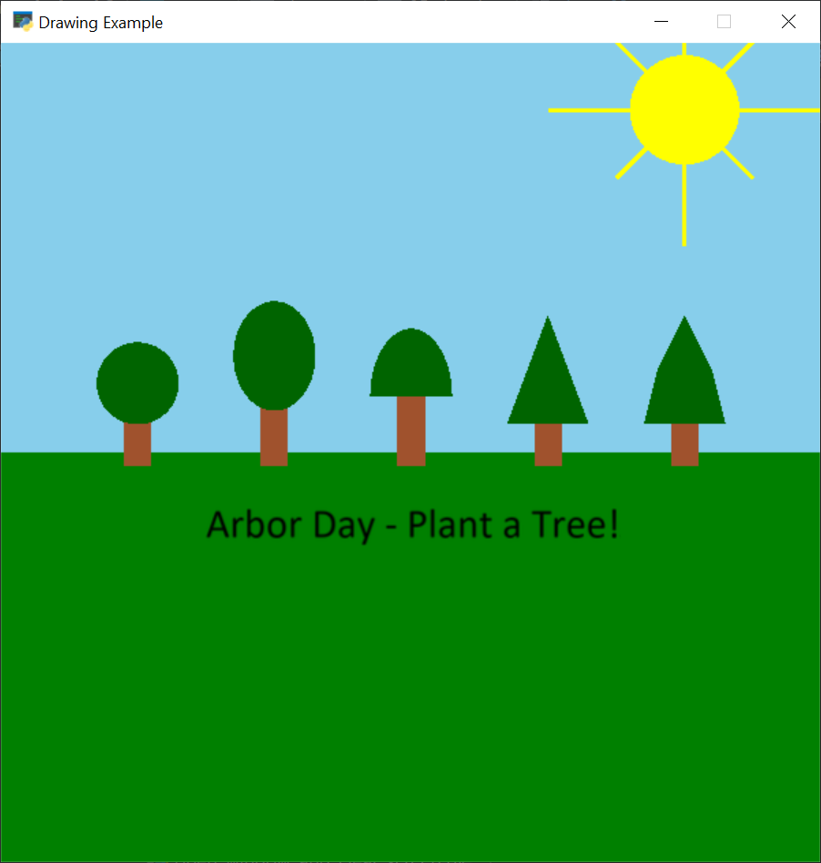

.. literalinclude:: draw_02.py
    :language: python
    :linenos:

Specifying Parameters By Name
-----------------------------

.. image:: ../../images/video.svg
    :class: video-image-h2
    :target: https://www.youtube.com/watch?v=wYofTQaIIlQ&t=1227
    :alt: Video link

It can be confusing to track a lot of parameters given to a function.
For example, here's a call to draw_arc_outline_.

.. _draw_arc_outline: https://api.arcade.academy/en/latest/arcade.html#arcade.draw_arc_outline

.. code-block:: python

    arcade.draw_arc_outline(300,
                            340,
                            60,
                            100,
                            arcade.csscolor.BLACK,
                            0,
                            180,
                            3,
                            45)

It is not easy to track what number goes with what parameter. Yes,
the parameters have an order to them. But unless a programmer memorizes
every order of every function, you can't quickly tell.

Parameters each have a **parameter name** which can be found in the documentation.
We can use that name to specify each value given to a function.
This may take some additional up-front coding time, but the increased readability
may save time later.

.. code-block:: python

    arcade.draw_arc_outline(center_x=300,
                            center_y=340,
                            width=60,
                            height=100,
                            color=arcade.csscolor.BLACK,
                            start_angle=0,
                            end_angle=180,
                            border_width=3,
                            tilt_angle=45)

Future Improvements
-------------------

.. image:: ../../images/video.svg
    :class: video-image-h2
    :target: https://www.youtube.com/watch?v=wYofTQaIIlQ&t=1269
    :alt: Video link

Looking forward, there's a lot we can do to improve this code.

In :ref:`expressions` we'll learn to use variables to store our parameter values
which will enhance the readability of our program, while giving us more
flexibility to update our item's positioning. In :ref:`custom-drawing-function` we'll
create our own functions. That will allow us to create a function like ``draw_tree``.

Improving Graphics Performance
^^^^^^^^^^^^^^^^^^^^^^^^^^^^^^

.. image:: ../../images/video.svg
    :class: video-image-h2
    :target: https://www.youtube.com/watch?v=wYofTQaIIlQ&t=1295
    :alt: Video link

If you create awesome graphics using these commands, you might find
later when creating a game that drawing graphics in this manner is
very slow. Computers redraw the screen about
60 times every second. Complex drawings can have hundreds or thousands of points
of data to draw. Multiply that by 60, and it is quite a bit for even fast computers
to handle.

To speed graphics, computers have separate processors to handle the display.
To use those separate processors we need to draw in two steps.
First, the computer will collect a batch of points, colors, and drawing
information together. Then it will send all of that information to the
graphic processors. If you've experienced a long pause between
levels when playing a game, this is what's happening.

After the graphics information is sent to the graphic processors,
anytime our program wants to draw a tree, house,
or rainbow unicorn, it tells the graphic processors simply 'draw the unicorn'
rather than resend all the individual drawing commands.

As we progress through the class, if you find your drawing commands
to get too slow, keep this in mind. The Arcade library supports
batch drawing with sprites and shape lists. We'll cover how do do
this in future chapters.

Real-World Applications
-----------------------

.. image:: ../../images/video.svg
    :class: video-image-h2
    :target: https://www.youtube.com/watch?v=wYofTQaIIlQ&t=1375
    :alt: Video link

We aren't limited to the Arcade library and its API.
Here are a few other APIs to give you an idea of what's out there.

* `OpenPyXL <https://openpyxl.readthedocs.io/en/stable/>`_ for creating and
  processing spreadsheets.
* `CircuitPython <https://circuitpython.readthedocs.io/projects/bundle/en/latest/drivers.html>`_
  has a set of libraries for controlling LEDs, motors, displays, and robotic servos.
* `NumPy <https://numpy.org/>`_ is a powerful library for working on anything
  related to linear algebra.
* `Beautiful Soup <https://www.crummy.com/software/BeautifulSoup/bs4/doc/>`_
  is a library that allows your program to automatically download pages
  off the web and process the data in them.

Review
------

.. image:: ../../images/video.svg
    :class: video-image-h2
    :target: https://www.youtube.com/watch?v=wYofTQaIIlQ&t=1417
    :alt: Video link

In this chapter we learned how to import a Python module. We learned to call
functions from an imported module. While we are learning how to do graphics
in this chapter, these same skills can be used for importing and calling libraries
of code that manage spreadsheets, images, robotics, and more.

Colors can be specified in RGB format and are stored in bytes. Each byte is a
group of eight bits, and can hold numbers from 0-255.

We learned how do draw ellipses, arcs, rectangles, triangles, polygons, lines
and text. More importantly we learned how to look up these functions out of the
API documentation.

Review Questions
^^^^^^^^^^^^^^^^

#. In Python, a library of code is called what?
#. What do we call a line of code in Python which includes the function name, parentheses,
   numbers, text and everything else required perform an operation?
#. When we call a function that is inside a library,  what character do we use
   to separate the library name and the function name?
#. According to PEP-8, should we put a space after a comma that separates parameters?
#. What function is used to open a window? Just list the function name, don't include
   the library or parameters.
#. What do we call the names of the functions and parameter order that make up
   how we interface with a library?
#. What function name sets the background colors?
#. What function name must happen before you start drawing?
#. What function name happens after drawing?
#. Colors are specified using three numbers that represent what?
#. If a color is turned all the way OFF, what number is used?
#. If a color is turned all the way ON, what number is used?
#. A bit can hold what two numbers?
#. A byte is made up of how many bits?
#. A byte can hold how many different combinations of numbers?

Lab 2: Draw a Picture
^^^^^^^^^^^^^^^^^^^^^

Apply what you've learned here and use the drawing commands to create
your own artwork in :ref:`lab-02`.

.. _Drawing Primitives: https://api.arcade.academy/en/latest/examples/drawing_primitives.html
.. _Quick Index: https://api.arcade.academy/en/latest/quick_index.html#id1
