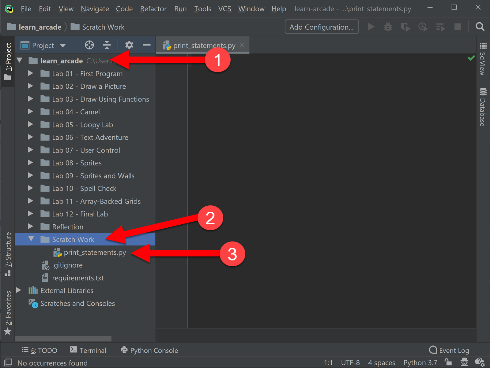
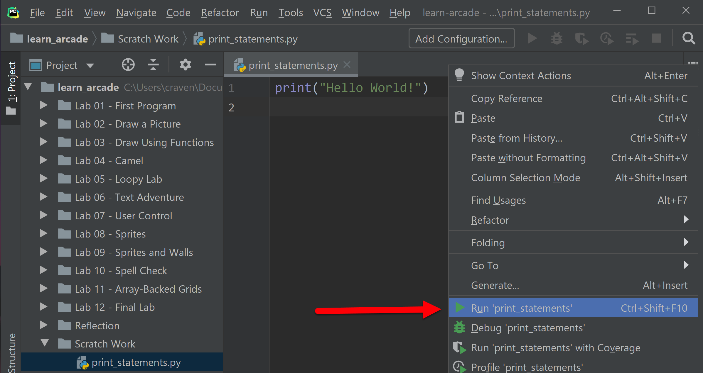
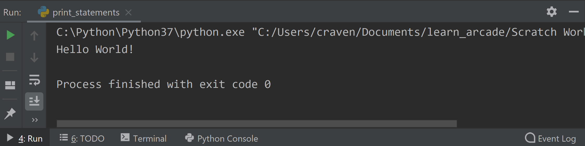
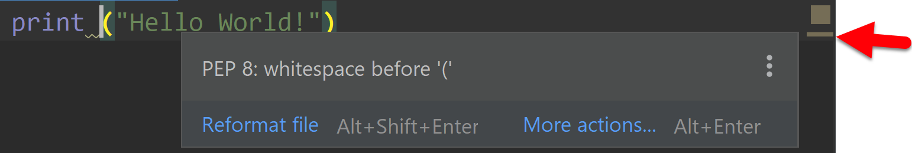

.. _print-function:

The ``print`` Function
======================

Prior to this chapter we got our computer ready to start coding in
:ref:`chapter-setup`. We did that by installing the Python programming language,
and an integrated development environment (IDE) called PyCharm. You can think
of Python as the engine, and PyCharm as the interface to the engine.

In :ref:`version-control` we began learning `git`, a version control system.
Version control systems allow us to share code, work on code in groups, and
track changes to the code. We'll use that tool to track and share your code for
every lab you write in this book.

In this chapter we'll write our first programs using the most fundamental of all
tools in the programmer's toolbox, the ``print`` function. This function does
exactly what you'd expect--it prints to the screen.

While a lot of programs are graphics-based, text-only programs are still quite common
with people that manage computers, or who do data analytics. Even for the graphics-based
games we develop in this book, the ``print`` function will be a vital aid in understanding
and debugging our games.

We aren't limited to printing to the screen. Later on in :ref:`saving-high-score`
we'll show how to print to a file so we can save data. Programs can even print
over a network connection, which is the start of what's needed to learn how
to do web programming.

.. _print-hello-world:

Printing "Hello World"
----------------------

We are going to use a **function** to output text to the screen.
If you've taken a geometry class, you've already used the sine (**sin**)
and cosine (**cos**) functions. In programming, we use functions *a lot*.
Functions are a basic building block in any computer program.
Just like in math, when we use functions in programming we start with a function
name and follow it by a pair of parentheses: ``( )``.
We put any function **parameter** inside the parentheses.

In the :ref:`sin-function` example below, we have a function,
parenthesis, and a parameter:

.. code-block:: text
    :caption: Functions in Math
    :name: sin-function

    sin(0)
    ^ Function name, sin
        ^ Parameter, 0

In the :ref:`print-function1` example below, we also have a function,
parenthesis, and a parameter:

.. code-block:: text
    :caption: Python Print Function
    :name: print-function1

    print("Hello there")
    ^ Function name, print
           ^ Parameter, "Hello there"

With a sine function, we put in an angle as our parameter.
With the ``print`` function, we put the text we want to print as a parameter.
Text *must* be enclosed in quotes, we'll explain why later in
the :ref:`expressions` chapter.

Running Our Program
-------------------

Let's enter the Hello World program and run it.

First, open PyCharm.
From our work in :ref:`chapter-setup` and :ref:`version-control` we should
already have our PyCharm and our project ready to go. You should be able to run PyCharm, and
see a window like this:

    PyCharm window ready for coding.

First click the triangle next to your project name (1), then find ``Scratch Work``,
(2) then finally ``print_statements.py`` (3).

.. note::

    The most frequent mistake here is to have PyCharm opened to the wrong folder.
    Make sure your all lab folders appear inside the ``learn_arcade`` folder. If they
    don't, select the File...Open menu and reselect your project folder as shown
    in :ref:`open-in-pycharm`. Once selected
    you should not have to do a File...Open again for the rest of the book.

Once you've selected ``print_statements.py``, go ahead and type in your first
program:

.. code-block:: python

    print("Hello World!")

After you've typed in your program, right-click on either ``print_statements.py``
or anywhere on the window with the text of that file and
select ``Run 'print_statements.py'``

    Right click on your program, then select run.

You should see the output from your program appear in a window at the bottom of
your computer:

    Output of our Hello World program.

Errors and Warnings
-------------------

Programs don't always work on the first try. If fact, finding errors in programs can sometimes
take hundreds of tries. Rather than being frustrating, I find debugging programs to be
like reading a mystery. Figuring out where the error is can be fun.

In addition to errors where the program doesn't run at all, Python can show us
*warnings*. Warnings occur when the code runs, but something isn't "perfect."

Errors
^^^^^^

Let's create an error. Change the ``print`` function to use a capital letter: ``Print``.

.. code-block:: Python

    Print("Hello World!")

Run the program. You should get something like:

.. code-block:: text

    Traceback (most recent call last):
      File "C:/Users/myusername/Documents/learn_arcade/Scratch Work/print_statements.py", line 1, in <module>
        Print("Hello World!")
    NameError: name 'Print' is not defined

    Process finished with exit code 1

.. sidebar:: Exit Codes

    All computer programs return a number called an *exit code* when they are done running.
    An exit code of 0 means the program ran without an error, any other number is a signal
    something went wrong. It is possible to write a program that runs other programs automatically,
    and this exit code is used to track if there was an error.

While it may look confusing, Python is telling you that on line 1 of your ``print_statements.py``
program it encountered a function named ``Print``. But that function has not yet been
"defined."

Python is case-sensitive, which means ``print`` and ``Print`` are as different as
apples and oranges. The ``print`` function is built into the language, and Python
knows exactly what to do with it. The ``Print`` function is not built into the language,
and Python complains with a ``NameError`` that it doesn't know what this function is.

Let's try a different error. Go back to using ``print``, but remove the parentheses:

.. code-block:: python

    print "Hello World"

When you run the program now, you'll get:

.. code-block:: text

    File "C:/Users/myusername/Documents/learn_arcade/Scratch Work/print_statements.py", line 1
        print "Hello World!"
                           ^
    SyntaxError: Missing parentheses in call to 'print'. Did you mean print("Hello World!")?

This is a different type of error, a *syntax error*. The term *syntax* originates with human
languages, not computer languages. Both human and computer languages have an expected structure
to them. A statement in English can take the form of a noun followed by a verb.
"Rob runs." is a valid statement, while "Runs Rob." is not. The computer expects a function
name to be followed by parentheses. If your program doesn't follow that pattern, it
generates a syntax error.

There are many types of errors that programs can have, that and
the line give you clues on how to solve it.

Warnings
^^^^^^^^

It can be possible to write code that runs, but isn't quite perfect.
For example, let's take our Hello World program and add some extra spaces:

.. code-block:: python

    print  ("Hello World!")

Go ahead and run the program. It should run without any errors.

The Python standard is to have *no* spaces between the function name and the
opening parenthesis. However, this code is "close enough" that the computer can
run fine with no errors. In English, if we go to a store and ask
"I'd like to buy one apples please," our sentence isn't grammatically correct.
It is close enough anyone could figure out the intent.

.. sidebar:: PEP-8

    Python has a *style-guide* which lays out how to format your code properly.
    This style-guide is called `PEP-8`_.

.. _PEP-8: https://www.python.org/dev/peps/pep-0008/

Why fix warnings? When finding errors in code, programmers spend a lot of time
looking for things that are out of place. If all code is formatted the same way
it is easier to scan looking for problems. Any inconsistency forces a programmer's
brain to stop and figure out if it is important. Removing those inconsistencies
makes debugging easier.

You can find warnings in your code using PyCharm by looking at the right margin.
Any yellow line is a warning. You can hover over it with your mouse to find the
details.

    Warnings are highlighted by yellow lines on the right side of the screen.

Another warning you might encounter in your first program is the Python style
guide states all programs are supposed to have exactly one blank line at the end of the file.
If you get into the habit of fixing these warnings, you'll learn to write
code that will be easier to maintain.

.. note::

    Warnings are not just about style. You might also get a warning about an error that
    could occur before you run the program. For example, if instead of passing a number
    to the ``sin()`` function, you might have written code that passes in text.

    *Weak warnings* are warnings that are mostly just about style or aren't as likely to
    end up being errors. *Strong warnings* are code the computer feels probably points to
    a bug that will end up being an error.

.. _print-multiple-lines:
Multiple Print Lines
--------------------

Let's add additional code:

.. code-block:: python

    print("It was a dark and stormy night.")
    print("Suddenly a shot rang out!")

Go ahead and run it to make sure it outputs as expected.

.. _escape-codes:

Escape Codes
------------

If quotes are used to tell the computer the start and end of the string of text you wish to print, how does a program
print out a set of double quotes? (This is a double quote ``"`` and this is a single quote ``'``.) For example:

.. code-block:: text

    print("I want to print a double quote " for some reason.")

This code doesn't work.
The computer looks at the quote in the middle of the string and thinks that is the end of the text.
Then it has no idea what to do with the commands for some reason and the quote and the end of the string confuses the
computer even further.

It is necessary to tell the computer that we want to treat that middle double quote as text, not as a quote ending the
string. This is easy, just prepend a backslash in front of quotes to tell the computer it is part of a string, not a
character that terminates a string. For example:

.. code-block:: python

    print("I want to print a double quote \" for some reason.")

This combination of the two characters ``\"`` is called an *escape code*. Almost every language has escape codes.
Here's another example:

.. code-block:: python

    print("Audrey Hepburn once said \"Nothing is impossible. The word itself says 'I'm Possible!'.\"")

This will print:

.. code-block:: text

    Audrey Hepburn once said "Nothing is impossible. The word itself says 'I'm Possible!'."

Because the backslash is used as part of an escape code, the backslash itself must be escaped if you want to use
one. For example, this code does not work correctly:

.. code-block:: python

    print("The file is stored in C:\new folder")

Why? Because ``\n`` is an escape code. To print the backslash it is necessary to escape it like so:

.. code-block:: python

    print("The file is stored in C:\\new folder")

There are a few other important escape codes to know. Here is a table of the important escape codes:

=========== =======================================
Escape code	Description
=========== =======================================
``\'``      Single Quote
``\"``	    Double Quote
``\t``	    Tab
``\r``	    CR: Carriage Return (move to the left)
``\n``	    LF: Linefeed (move down)
=========== =======================================

What is a "Carriage Return" and a "Linefeed"? Try this example:

.. code-block:: python

    print("This\nis\nmy\nsample.")

The output from this command is:

.. code-block:: text

    This
    is
    my
    sample.

The ``\n`` is a linefeed. It moves "cursor" where the computer will print text down one line. The computer stores all
text in one big long line. It knows to display the text on different lines because of the placement of ``\n`` characters.

To make matters more complex, different operating systems have different standards on what makes a line ending.

=========== =======================================
Escape code	Description
=========== =======================================
``\r\n``    CR+LF: Microsoft Windows
``\n``      LF: UNIX based systems, and newer Macs.
``\r``      CR: Older Mac based systems
=========== =======================================

Ok, now it is time to make this lab yours. Write program that consists of
several print statements. Here is my example:

.. code-block:: python

	print("You can print a statement surrounded by double quotes.")
	print('You can print a statement surrounded by single quotes.')

	print("If you want to print a double quote, you can by prepending it with")
	print("a slash. \"That's great!\" he said.")

	print("If you want to print a backslash, you can by prepending it with")
	print("a slash. So this \\ prints one backslash, and this \\\\ does two.")

	print("You can print a blank line with a empty print statement.")
	print()

	print("You can use a backlash n to print a new line. These\nare\non\nnew\nlines.")
	print("""You can print
	on multiple
	lines using
	triple
	quotes. Just in
	case you wanted to.""")

What We Learned
---------------

* function
* parameter

On-Line Practice
----------------

Where this is used
------------------

Possible Errors
---------------