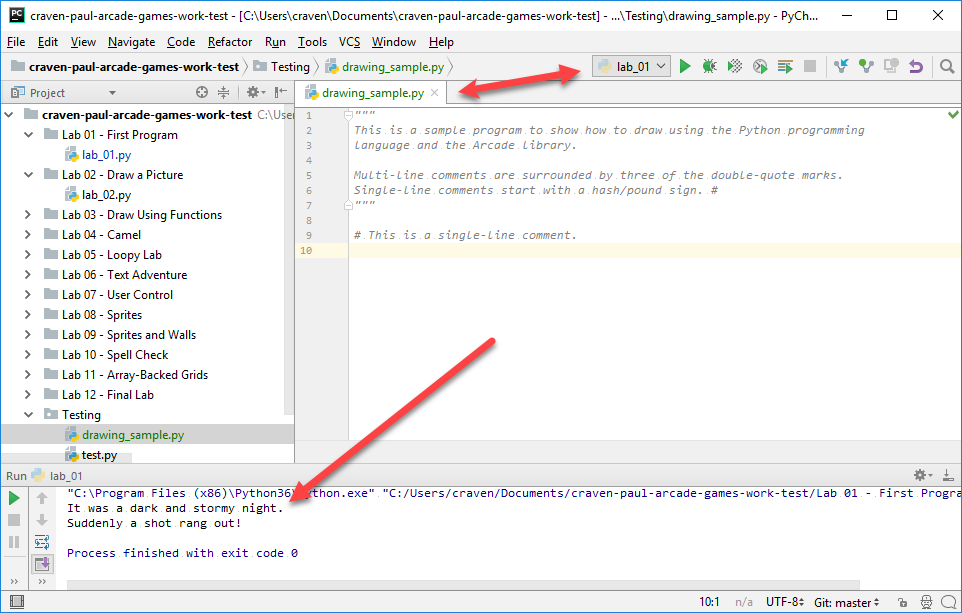

.. _how-to-draw:

How to Draw with Your Computer
==============================

Finally, time to do start making graphics!

By the end of this chapter, you should know how to write programs that will
draw images on the screen. Below is an example of what one student did:

.. image:: simpson_map.png

At the end of :ref:`lab-02` you can page through several other examples
of what students have created for this lab.

Creating a New Program
----------------------

Open up PyCharm to the same project we created earlier. We'll use
it for all our work this semester. Do **not** create new projects for each
lab or program you create in this class. Just use one project for the entire
class.

We are going to create a lot of code samples as we go through the chapters.
Let's create a directory in our project for these samples, away from the labs.
Call it ``Code Samples``. Then create a Python source file for this chapter
called ``drawing_samples.py``. Your system should look like this:

.. image:: create_drawing_source_file.png

Comments
--------

Before we begin learning to draw, we need to learn about **comments** in code.
When typing in computer code, sometimes we want to be able to write things
that the computer ignores. We call this "commenting our code."
You will see a lot of comments in my code examples to explain how they work.

Below are two ways of adding comments to code in the Python computer language:

.. literalinclude:: comments.py
    :language: python
    :linenos:

Go ahead and try it. Multi-line comments usually start each source file
and explain what the code does.

Let's try running the program. But before we run the program, we need to make
sure we are running the *right* program. Look at the image below. If I select
"run" with the green arrow, I will run ``lab_01.py``, *not* the program I
want to run. You need to right-click on our program and select
"Run ``drawing_sample.py``" instead.

Hey wait! When we finally run our program, nothing happens. That's because
the only code that we wrote were "comments." Comments are ignored.
Therefore, there was nothing for the computer to do. Read on.

Import the Arcade Library
-------------------------

Before we can draw anything, we need to import a "library" of code that has
commands for drawing.

Computer languages come with a set of built-in commands. Most programs will
require *more* commands than what the computer language loads by default. These
sets of commands are called **libraries**. Some languages have their own special
term for these libraries. In the case of Python, they are called **modules**.

Thankfully, it is easy to import a library of code.
If we want to use the "arcade" library, all we need
to do is add ``import arcade`` at the top of our program.

.. attention::
    Libraries should always be imported at the **top** of your program.
    Only comments should appear ahead of an ``import`` statement.
    Technically, you *can* put the ``import`` statement somewhere else,
    just like technically you *can* wear a pair of shorts on your head. But
    don't. Trust me on this.

In the code below, we've imported the arcade library. If you run the code,
yet again nothing will happen. We've asked to load the arcade
library, but we haven't *done* anything with it yet. That's our next step.

.. literalinclude:: import_arcade.py
    :language: python
    :linenos:
    :emphasize-lines: 7

How to Open a Window for Drawing
--------------------------------

Now it is time to open the window. See the command below:

How does this command work? To begin, we select the arcade library
with ``arcade``. Then we separate the library from the command we want to
call with a period: ``.`` Next, we put in the name of the command to run.
Which happens to be ``open_window``.

.. note::

    Commands that we can run are called **functions**.

Just like the sine and cosine functions in math, we surround the function
**parameters** with parenthesis. For example:

.. code-block:: python

    my_function(parameters)

The data we need
to pass the function are the parameters. In the case of ``open_window``, we
need three parameters:

* The window width in pixels.
* The window height in pixels.
* The text that will appear on the title bar.

In the case of width and height, the numbers specify the part of the window you
can draw on. The actual
window is larger to accommodate the title bar and borders. So a 600x600 window
is really 602x632 if you count the title bar and borders.

Wait, how do we know that it was the ``open_window`` function to call? How did
we know what parameters to use? The names of the functions, the order of the
parameters, is the **Application Program Interface** or "API" for short. You can
click here for the `Arcade API`_. Any decent code library will have an API and
documentation you can find on the web.

.. _Arcade API: http://arcade.academy/quick_index.html

Below is an example program that will open up a window:

.. literalinclude:: open_window.py
    :language: python
    :linenos:
    :emphasize-lines: 13

Try running the code above. It kind-of works. If you have fast eyes, and a slow
computer you might see the window pop open, then immediately close.
If your computer is fast, you won't see anything at all because the window
closes too fast.
Why does it close? Because our program is done! We've ran out of code
to execute.

To keep the window open, we need to pause until the user hits the
close button. To do this, we'll use the ``run`` command in the Arcade library.
The ``run`` command takes no parameters, but even if a function doesn't take
parameters, you still need to use parenthesis.

.. literalinclude:: open_window_and_pause.py
    :language: python
    :linenos:
    :emphasize-lines: 16

You should get a window that looks something like this:

.. image:: empty_window.png
    :width: 300px

Clearing the screen
-------------------

Right now we just have a default white as our background.
How do we get a different color? Use the ``set_background_color`` command.

But by itself, the function doesn't work. You need a two more commands. These
tell the Arcade library when you are about to start drawing (``start_render``),
and when you are done drawing (``finish_render``).

See below:

.. literalinclude:: open_window_and_clear_screen.py
    :language: python
    :linenos:
    :emphasize-lines: 16, 19, 24

Specifying Colors
-----------------

Wait, where did ``AIR_SUPERIORITY_BLUE`` come from? How do I get to choose
the color I want? There are two ways to specify colors:

* Look at the `arcade.color API documentation`_ and specify by name.
* Specify the RGB or RGBA color.

To specify colors by name, you can look at the color API documentation and
use something like ``arcade.color.AQUAMARINE`` in your program. Then color
names come from the ColorPicker `color chart`_.

If the color you want isn't in the chart, or you just don't want to use
that chart, you can specify colors by "RGB". RGB stands for Red, Green, and
Blue.

Computers, TVs, color changing LEDs, all
work by having three small lights close together. A red light, a green light,
and a blue light. Turn all three lights off and you get black. Turn all three
lights on and you get white. Just turn on the red, and you get red. Turn on
both red and green to get yellow.

RGB based monitors work on an *additive* process. You start with black and
add light to get color.

This is different than
paint or ink, which works on a *subtractive* process. You start with white and
add to get darker colors.

Therefore, keep separate in your mind how light-based RGB color works from how
paint and ink works.

We specify how much red, green, and blue to use using numbers. No light is zero.
Turn the light on all the way and it is 255. So ``(0, 0, 0)`` means no red,
no green, no blue. Black. Here are some other examples:

===== ======= ====== ===========
Red   Green   Blue   Color
===== ======= ====== ===========
0     0       0      Black
255   255     255    White
127   127     127    Gray
255   0       0      Red
0     255     0      Green
0     0       255    Blue
255   255     0      Yellow
===== ======= ====== ===========

There are tools that let you easily find a color, and then get the RGB values.
One I really like, because it is easy to remember is
"`colorpicker.com <http://www.colorpicker.com>`_". You can select the color,
and then get the numbers to use when specifying a color. See the image below:

.. image:: colorpicker.png

After getting the number, specify the color as a set of three numbers surrounded
by parenthesis, like this:

.. code-block:: python

    arcade.set_background_color((189, 55, 180))

In addition to RGB, you can also specify "Alpha." The "Alpha Channel" controls
how transparent the color is. If you draw a square with an alpha of 255, it will
be solid and hide everything behind it. An alpha of 127 will be in the middle,
you will see some of the items behind the square. An alpha of 0 is completely
transparent and you'll see nothing of the square.

.. _color chart: http://www.colorpicker.com/color-chart/
.. _arcade.color API documentation: http://arcade.academy/arcade.color.html

Wait, What Is Up With 255?
^^^^^^^^^^^^^^^^^^^^^^^^^^

Notice how the color values go between 0 and 255? That's strange. Why 255? Why
not 100? Why not 1000?

The reason is important to understand how computers work. Remember how everything
is stored in numbers? They are not just stored in numbers, they are stored in
1's and 0's.

Everything to the compute is a switch. If there is electricity, we have a 1. If
there is no electricity we have a 0. We can store those 1's and 0's in memory.
We call these 1's and 0's **binary numbers**.

How do we go from 1's and 0's to numbers we normally use? For example, a
number like 758? We do that with a combination of 1's and 0's. Like this:

================ ===========
Binary - Base 2  Base 10
================ ===========
0000             0
0001             1
0010             2
0011             3
0100             4
0101             5
0110             6
0111             7
1000             8
================ ===========

See the pattern? It is the same pattern we use when we count as a kid.
As a kid we learned to go 0 to 9,
then when we hit 9 we go back to 0 and add one to the ten's place. Here we only
have 0 to 1 instead of 0 to 9. And instead of a "ten's place" we have a "two's
place."

You might have used "bases" in math class long ago. Computers work in Base-2
because they only have two ways to count, on or off.
Humans think in Base-10 because we have 10 fingers.

Numbers are stored in **bytes**. A byte is a set of eight binary numbers.
If we were to follow the pattern we started above, the largest number we
could store with eight 1's and 0's is::

    1111 1111

In Base-10 this is 255.

Let's use some math. We have 8 ones and zeros. That give us 2 :sup:`8` = 256
possible numbers. Since zero is a combination, that makes the biggest number 255.

If we had 16 bits, then we'd have 2 :sup:`16` = 65,536 possible combinations. Or a
number from 0-65535. A 32-bit computer can hold numbers up
to 2 :sup:`32` = 4,294,967,296. A 64-bit computer can hold really large numbers!

So because a computer holds colors with one byte for red, one for green, and one
for blue, each color has a value range from 0 - 255.

The Coordinate System
---------------------

In your math classes, you've learned about the Cartesian coordinate system,
which looks like this:

.. figure:: cartesian_coordinate_system.svg
    :width: 350px

    Source: `Wikipedia: Cartesian coordinate system <https://commons.wikimedia.org/wiki/File:Cartesian_coordinate_system_(comma).svg>`_

Our graphics will be drawn using this same system. But there are additional
things to keep in mind:

* We will only draw in the upper right quadrant. So 0,0 will be in the
  lower left of the screen, and all negative coordinates will be off-screen.
* Each "Point" will be a pixel. So a window that is 800 pixels wide, will have
  x-coordinates that run from 0 to 800.

Drawing a Rectangle
-------------------

Let's start drawing with a program to draw a rectangle. The function
we will use is ``draw_lrtb_rectangle_filled``. It stands for "draw
left-right-top-bottom rectangle".

We'll use this program to draw a green rectangle:

.. literalinclude:: draw_rect.py
    :language: python
    :linenos:
    :emphasize-lines: 24

There are a lot of shapes we can draw. Try running the program below:

.. literalinclude:: draw_shapes.py
    :language: python
    :linenos:

Drawing Primitives
------------------

For a program showing all the drawing primitives, see the example
`Drawing Primitives`_. Also, see the API documentation's `Quick Index`_.

What's next? Try :ref:`lab-02`.

.. _Drawing Primitives: http://arcade.academy/examples/drawing_primitives.html
.. _Quick Index: http://arcade.academy/quick_index.html#id1
