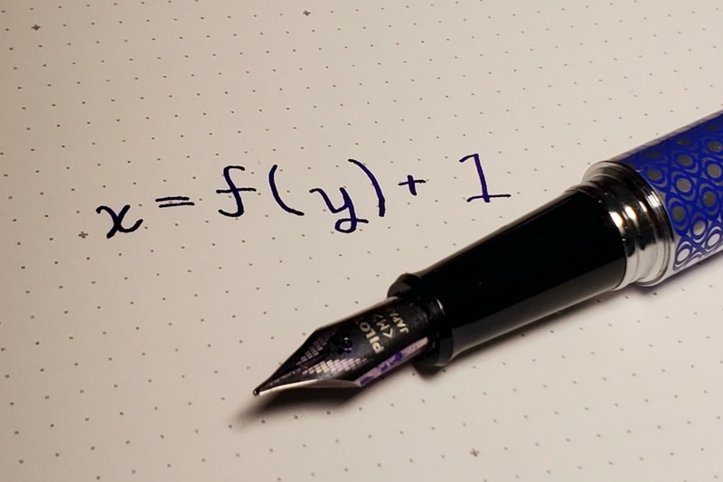
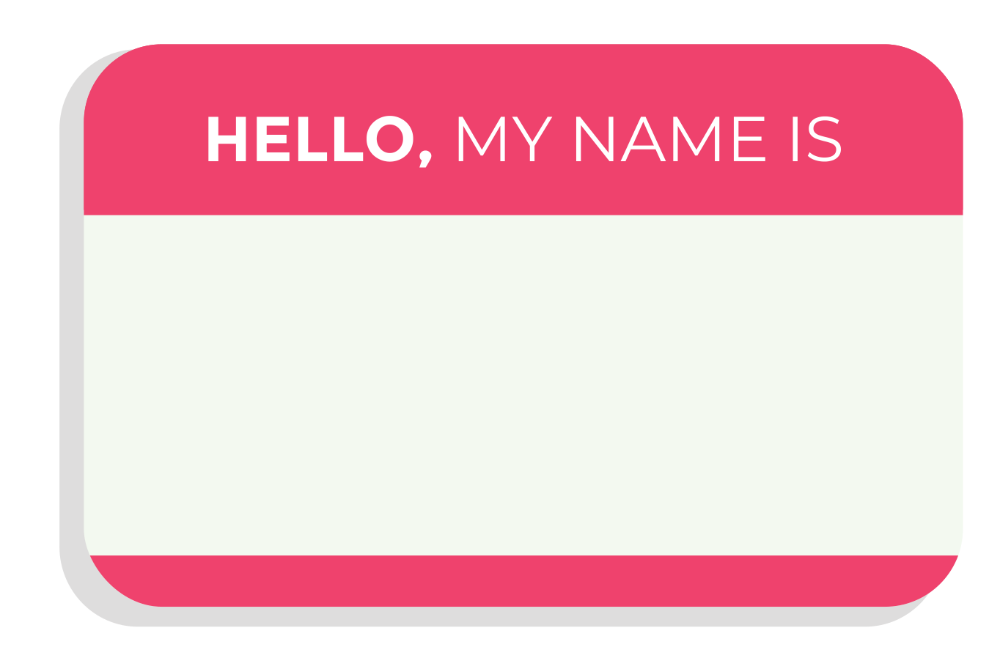
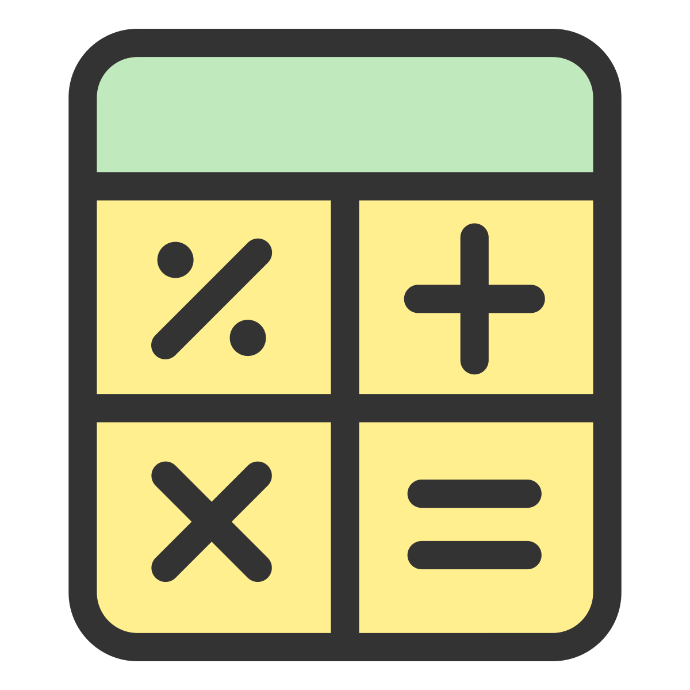
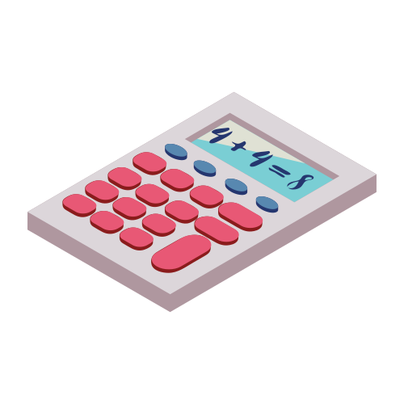

.. _expressions:

Variables and Expressions
=========================

.. image:: ../../images/video.svg
    :class: video-image-h1
    :target: https://youtu.be/K1Lp6uqb5QE
    :alt: Video link

`Link to video for this chapter. <https://youtu.be/K1Lp6uqb5QE>`_

.. image:: drawing.png
    :width: 35%
    :class: right-image

We've learned how to import a library and call functions.
The next step is to make our code more flexible.
What if we could take that drawing code and put it into
our *own* functions? Then we could write custom functions to draw
trees, houses, even rainbows. Our code could look like this:

.. code-block:: python

    draw_tree(225, 35)
    draw_tree(420, 45)
    draw_house(720, 60)
    draw_snow_person(300, 20)

Creating flexible functions isn't just for drawing.
Functions are the basic building block of almost
every type of programming. If you are running a program, it is just functions,
built on top of functions, built on yet more functions.

To be able to create our own functions, we need to cover three things.

* How to use variables (this chapter)
* How to write expressions (this chapter)
* How to create our own functions (the next two chapters)

How to Use Variables
--------------------

A **variable** is a value the computer stores in memory that can change. That
is, it *varies*. Here is a quick example:

.. code-block:: python

    # What will this print?
    x = 5
    print(x)

What will the code above print? It will print ``5``.

``x`` is a variable. The ``=`` is called an **assignment operator**. It assigns the value on the
right side to the variable on the left.

Here's another example. Very similar, but something is different. What will
it print?

.. code-block:: python

    # What will this print?
    x = 5
    print("x")

The code above prints ``x``. Why not ``5``? Because:

* If there are no quotes, the computer evaluates code like a mathematical
  expression.
* If there are quotes, we treat what is between the quotes as a string of
  characters and don't change it.

In fact, that is what we call the characters between the quotes. A **string**,
which is short for "string of characters." We don't call it "text."

The following code won't print at all:

.. code-block:: text

    print(Have a great day!)

The code above will fail because the computer will think that it should evaluate
``Have a great day!`` as a mathematical expression. It isn't, so the computer
gets confused and generates a syntax error. That's why we need quotes:

.. code-block:: python

    print("Have a great day!")

Variable and Function Names
^^^^^^^^^^^^^^^^^^^^^^^^^^^

Variable names and function names follow the same rules. There are
names you *should* use, names you *shouldn't* use, and
names you *can't* use.

Variable names *should* be descriptive, all lower case, and if you have
multiple words, separate the words by an underscore.
Variable names *can't* start with a number nor have a space or any symbol
other than an underscore.
Here are some examples:

Good variables:
    * ``temperature_in_celsius``
    * ``tree_position_1``
    * ``tree_position_2``
    * ``car_speed``
    * ``number_of_children``
    * ``simpson``

Bad variable names that still work:
    * ``temperatueInCelsius`` - Uses capital letters. Keep it lower case and use underscores.
    * ``x`` - Too short, and not descriptive.
    * ``Smith`` - Starts with a capital letter.

Variable names that won't work:
    * ``tree position`` - Can't use spaces
    * ``4runner`` - Can't start with a number

Sometimes we want to create a variable that won't change.
We call these variables **constants**.
By convention, these variable names are in all upper case. They are
the only variables that use upper-case. For example:

.. code-block:: python

    PI = 3.14159
    SCREEN_WIDTH = 600
    RED = (255, 0 ,0)

Good variable names help make code *readable*.

For example, what does this code do? It is hard to tell.

.. code-block:: python

    m = 294 / 10.5
    print(m)

Here we use variables to separate the formula from the numbers.
A bit easier to change the values, and a bit easier to figure out the formula.

.. code-block:: python

    m = 294
    g = 10.5
    m2 = m / g
    print(m2)

Instead of using short variable names, if we use use descriptive variable names
and comments the code is *very* easy to understand.

.. code-block:: python

    # Calculate mpg using good variable names
    miles_driven = 294
    gallons_used = 10.5
    mpg = miles_driven / gallons_used
    print(mpg)

Good variable names make code *readable*. Even a non-programmer could scan
that code and understand what it does. Straightforward code requires less
effort to find problems. Therefore, take the time to name your variables well.

How to Create Expressions
-------------------------

Great! We are part-way there. To manipulate data with a computer, we use
**expressions**. An expression is simply a mathematical equation.

Using Operators in Expressions
^^^^^^^^^^^^^^^^^^^^^^^^^^^^^^

Expressions use **operators**. That's just a fancy word for symbols like
addition (``+``) and subtraction(``-``).
Here's an example:

.. code-block:: python

    # What will this print?
    x = 5 + 10
    print(x)

As you can probably guess, this will print out ``15``. We call the ``+`` sign
an **operator**. Here are some other operators:

========== =====================================
Operator   Description
========== =====================================
``+``      Addition
``-``      Subtraction
``*``      Multiplication
``**``     Exponentiation (raise to the power)
``/``      Division
``//``     Integer division (rounds down)
``%``      Modulus (gives remainder of division)
========== =====================================

There are two things that **don't** work like mathematics. First, there is no
"juxtaposition" used to multiply items. Second, the ``=`` is not an algebraic
equality.

Juxtaposition Doesn't Work
^^^^^^^^^^^^^^^^^^^^^^^^^^

.. sidebar:: Juxtaposition

    **Juxtaposition** is the term used to describe two mathematical terms right next
    to each other. When this happens we assume the terms are multiplied. For example,
    2x means two times the variable *x*. There's no multiplication sign between them.
    This
    also works for parenthesis, 2(y + 1) means two times the result of *y* plus one.

Juxtaposition doesn't work for multiplication.
For example, the following will **not** work:

.. code-block:: python

    # The last two lines will error
    x = 3
    y = 2x
    z = 2(3 + x)

You can rewrite the code above to work by explicitly multiplying:

.. code-block:: python

    # This code works. Although it doesn't print anything.
    x = 3
    y = 2 * x
    z = 2 * (3 + x)

Easy enough, just remember to use ``*`` any time you want to multiply.

Assignment Operators
^^^^^^^^^^^^^^^^^^^^

The ``=`` doesn't work the same as in algebra. The ``=`` takes the expression to
the right and evaluates it. The resulting value is stored into a variable
on the left of the ``=``.
For example this stores a ``7`` into the variable ``x``:

.. code-block:: python

    x = 3 + 4

In algebra, this next line of code would be ok.
It does not work in Python however, because the
only thing that can be on the left is a variable:

.. code-block:: python

    3 + 4 = x

Variables can be used in the expression. This example works fine, and
stores ``17`` into ``z``:

.. code-block:: python

    x = 5
    y = 6
    z = x + 2 * y

This next set of code doesn't work. On the left of the ``=`` in that last line,
there's an expression. We need just a single variable for it to work.
How would you re-write it to work?

.. code-block:: python

    # Last line has more than a variable on the left, doesn't
    # work.
    x = 5
    y = 6
    2 * z = x + y

The fact that the ``=`` sign isn't an algebraic equality allows us to do some
strange expressions that don't make sense in algebra. Look at the this set
of code and the comments that explain it:

.. code-block:: python

    # This works, and prints "3"
    x = 3
    print(x)

    # This works too, even if it is invalid in algebra.
    # It takes the value of x (which is 3) and adds one. Then stores
    # the result (4) back in x. So we'll print "4".
    x = x + 1
    print(x)

.. _incrementing_x:

Increasing a Variable
^^^^^^^^^^^^^^^^^^^^^

What if we want to change a value stored in a variable? We need to use
an assignment operator.

For example, take a look at this code. It prints the number ``4`` twice.
First, we assign ``3`` to ``x``.
Then, every time we print we add one to ``x``.
We *aren't* changing the original value of ``x``, so we don't print ``4`` and
then ``5``. The variable ``x`` only holds the number ``3``.

.. code-block:: python

    # Add one to x, but the number x holds does not change.
    x = 3
    print(x + 1)
    print(x + 1)

Take a look at this example. This example prints ``3``. It *does* add ``1`` to ``x``.
But it does nothing with the result. We don't print it. Just like the prior example,
the number in ``x`` doesn't change.

.. code-block:: python

    # Add one to x, but the number x holds still does not change.
    x = 3
    x + 1
    print(x)

Now look at this example. We use the assignment operator. We store into ``x`` the result
of ``x + 1``. This *does* increase the value stored in ``x`` and therefore we print out
a ``4``.

.. code-block:: python

    x = 3
    x = x + 1
    print(x)

.. note::

   It can be confusing to learn when to use ``x + 1`` and when to use ``x = x + 1``. Remember,
   the former does *not* change the value of ``x``.

Increment/Decrement Operators
^^^^^^^^^^^^^^^^^^^^^^^^^^^^^

The ``=`` symbol isn't the only assignment operator.
Here are the other assignment operators:

========== =====================================
Operator   Description
========== =====================================
``=``      Assignment
``+=``     Increment
``-=``     Decrement
``*=``     Multiply
``/=``     Divide
========== =====================================

Because statements like ``x = x + 1`` are so common, we can shorten this
using the ``+=`` assignment operator. Examine this code to see how it
works:

.. code-block:: python

    # This works, and prints "3"
    x = 3
    print(x)

    # Make x bigger by one using the regular
    # assignment operator.
    x = x + 1
    print(x)

    # Make x bigger by one, using the +=
    # assignment operator.
    x += 1
    print(x)

    # Make x smaller by five using the -=
    # operator.
    x -= 5
    print(x)

Remember, if you want to increase or decrease a variable, you need to use an assignment operator.

Oh, and a common mistake is to mix the ``+`` and ``+=`` operator as shown in this
example. It doesn't just add one to x, it doubles x and adds one.

.. code-block:: python

    # This doubles x, and then adds one.
    # Probably not what the programmer intended.
    x += x + 1

Using Expressions In Function Calls
^^^^^^^^^^^^^^^^^^^^^^^^^^^^^^^^^^^

Expressions are not limited to assignment statements.
We can use expressions as parameters in function calls.
This can be useful when you need a quick calculation.
For example, what if we want
to draw a circle in the center of the screen?

By creating variables for the height and width of the
screen, we can set the screen size, and also do a quick
calculation to find the screen center. In this example
we use constant variables for the screen width and height. Then
use some math to calculate the center of the screen.

.. code-block:: python
    :linenos:
    :emphasize-lines: 3-4, 12-18
    :caption: Calculating the center of the screen

    import arcade

    SCREEN_WIDTH = 800
    SCREEN_HEIGHT = 600

    arcade.open_window(SCREEN_WIDTH, SCREEN_HEIGHT, "Drawing Example")

    arcade.set_background_color(arcade.color.WHITE)

    arcade.start_render()

    # Instead of this:
    # arcade.draw_circle_filled(400, 300, 50, arcade.color.FOREST_GREEN)
    # do this:
    arcade.draw_circle_filled(SCREEN_WIDTH / 2,
                              SCREEN_HEIGHT / 2,
                              50,
                              arcade.color.FOREST_GREEN)

    arcade.finish_render()
    arcade.run()

The great thing about this is that the variables which control the screen size
can be changed, and the circle will automatically be re-centered. Had we simply
coded (400, 300) as the center, we'd need to go and change that number as well.
Perhaps not a big deal with a small program, but as our programs get larger it
saves a lot of time.

Order of Operations
^^^^^^^^^^^^^^^^^^^

Python will evaluate expressions using the same *order of operations*
you learned in math.
For example this expression does not correctly calculate the average:

.. code-block:: python

    average = 90 + 86 + 71 + 100 + 98 / 5

The first operation to be calculated is ``98 / 5``, rather than adding up
the numbers. That is, the computer calculates this equation instead:

.. math::

   90+86+71+100+\frac{98}{5}

What we need is an equation where the division happens last:

.. math::

   \dfrac{90+86+71+100+98}{5}

By using parentheses around the addition in our code, this problem can be fixed:

.. code-block:: python

    average = (90 + 86 + 71 + 100 + 98) / 5

Printing Variables
------------------

How can you print variables and text together? Say you've got a variable ``answer`` and
you want to print it. Based on what we've learned so far, you can do this code:

.. code-block:: python

    answer = "bananas"
    print(answer)

But that just prints out ``bananas`` on a line by itself. Not very descriptive. What
if we wanted:

.. code-block:: text

    The answer is bananas

You can combine the answer with the additional text by using a comma. Here's
an example:

.. code-block:: python

    answer = "bananas"
    print("The answer is", answer)

That example was better. But it is missing punctuation. This code attempts to
add a period at the end:

.. code-block:: python

    answer = "bananas"
    print("The answer is", answer, ".")

Unfortunately, it doesn't work quite right.
We get an extra space before the period:

.. code-block:: text

    The answer is bananas .

The ``,`` adds a space when we use it in a ``print`` statement. We don't
always want that. We can instead use a ``+`` sign as shown in this example:

.. code-block:: python

    answer = "bananas"
    print("The answer is" + answer + ".")

That gets rid of all the spaces:

.. code-block:: text

    The answer isbananas.

So we need to add a space INSIDE the quotes where we want it as shown here:

.. code-block:: python

    answer = "bananas"
    print("The answer is " + answer + ".")

That works until you try an to print a variable that holds a number instead of
text. Try this example:

.. code-block:: python

    answer = 42
    print("The answer is " + answer + ".")

That code generates a brand new error we haven't seen yet, a ``TypeError``.

.. code-block:: text

    Traceback (most recent call last):
      File "C:/arcade_book/test.py", line 2, in <module>
        print("The answer is " + answer + ".")
    TypeError: can only concatenate str (not "int") to str

What is the problem?
The computer doesn't know how to put text and numbers together. If you add two
*numbers*
``20 + 20`` you get ``40``. If you add two *strings* ``"20" + "20"`` you
get ``"2020"``, but the
computer has no idea what to do with a combo of text and numbers. So the fix
is to use the ``str`` function which converts the number to a string (text).
Here's an example:

.. code-block:: python

    answer = 42
    print("The answer is " + str(answer) + ".")

Yes, this is a bit complex. But wait! There's an easier way! We can print
variables using a *formatted string*. Later we will spend a whole
chapter on formatted strings, but here's an example to get started.

.. code-block:: python

    answer = 42
    print(f"The answer is {answer}.")

Note this example starts the string with an ``f`` before the quote, and the variable
we want to print goes in curly braces. This is the way I recommend printing
variables. Again, we'll cover it in more detail in a later chapter.

Review
------

In this chapter we introduced the concept of using **variables** and using them
in **expressions**. Expressions are made up of both variables, and **operators**
which are used to tell the computers how to combine the values. We also
showed how to print variables along with text. We will use this knowledge to
create our own functions in the next chapter.

Review Questions
^^^^^^^^^^^^^^^^

#. What do computer languages use to store changing data?
#. What do we call the ``=`` symbol in Python?
#. When we store text into a variable, what is another name for the text?
#. What are the rules around creating a good variable name?
#. What is an expression?
#. Give an example for each of the seven operators.
#. What is integer division? Explain.
#. What is modulus?
#. Rewrite the expression ``v = 2(3.14r)`` so that it works in Python.
#. What is the code to add 1 to x? (That is, actually change the value of x.)
#. Show how to use the increment operator to add one to x.
#. Give an example of printing a variable, including additional text that labels
   what it is.

