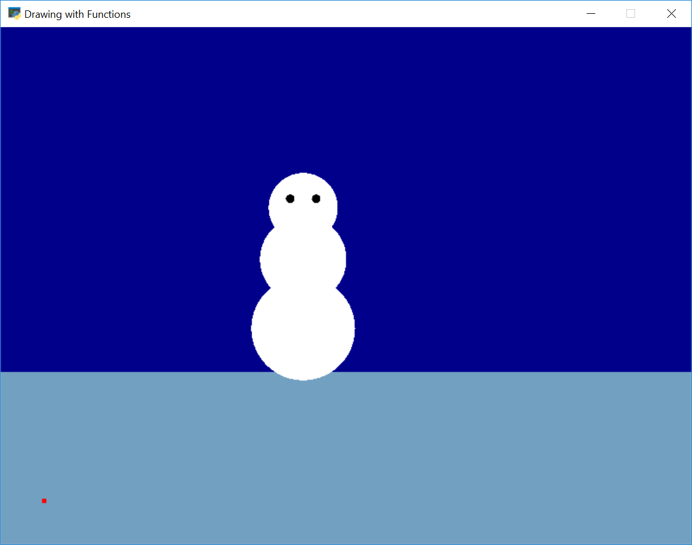

.. _custom-drawing-function:

Drawing With Functions
======================

Here is a set of examples where we take a program that already exists and put
everything in functions.

First the original program:

.. image:: snowman1.png
    :width: 50%

.. literalinclude:: drawing_with_functions_a1.py
    :language: python
    :linenos:

.. _make_the_main_function:

Make The ``main`` Function
--------------------------

Next, create a ``main()`` function. Put everything in it, and call the main
function.

.. literalinclude:: drawing_with_functions_a2.py
    :language: python
    :linenos:

When you do this, run your program and make sure it still works before proceeding.

.. _make_the_drawing_function:

Make The Drawing Functions
--------------------------

Next, pick an item to move to a function. Start with an easy one if you have it.
I chose grass because it was only one line of code, and I wasn't going to ever try
to position it with x, y.

.. literalinclude:: drawing_with_functions_a3.py
    :language: python
    :linenos:
    :emphasize-lines: 7-9, 17

Then, I took a more complex shape and put it in a function.

.. literalinclude:: drawing_with_functions_a4.py
    :language: python
    :linenos:
    :emphasize-lines: 12-22, 31

But this draws the snowman only at one spot. I want to draw lots of snowmen,
anywhere I put them!

To do this, let's add an x and y:

.. literalinclude:: drawing_with_functions_a5.py
    :language: python
    :linenos:
    :emphasize-lines: 12, 19-21, 24-25, 34

But that's not perfect. If you'll note, I added a dot at the x and y. The
snowman draws way off from the dot, because originally I didn't try to draw
it at 0, 0. I need to recenter the snowman on the dot.

We need to re-center the shape onto the spot we are drawing. Typically you'll
need to subtract from all the x and y values the same amount.

.. image:: snowman3.png
    :width: 50%

.. literalinclude:: drawing_with_functions_a6.py
    :language: python
    :linenos:

.. _animate-drawing:

How To Animate A Drawing Function
---------------------------------

We can animate our drawing if we want. Here are the steps.

Create An ``on_draw`` Method
^^^^^^^^^^^^^^^^^^^^^^^^^^^^

Right now our program only draws our image once. We need to move all the drawing code
in our ``main`` to an ``on_draw`` function. Then we'll tell the computer to draw
that over and over.

Continuing from our last example, our program will look like:

.. literalinclude:: animate_1.py
    :language: python
    :linenos:
    :emphasize-lines: 28-34, 41-42

Do this with your own program. Nothing will move, but it should still run.

Add Variable To Control Where We Draw Our Item
^^^^^^^^^^^^^^^^^^^^^^^^^^^^^^^^^^^^^^^^^^^^^^

Next, we are going to create a variable inside of the ``on_draw`` function.
This variable will hold our *x* value.
Each time we call ``on_draw``, we'll change *x* so that it moves to the right.

.. literalinclude:: animate_2.py
    :language: python
    :linenos:
    :emphasize-lines: 33, 36-42

For more information, see the `Bouncing Rectangle Example`_.

.. _Bouncing Rectangle Example: http://arcade.academy/examples/bouncing_rectangle.html