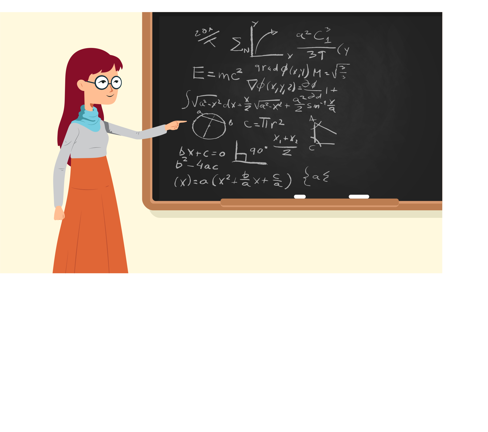
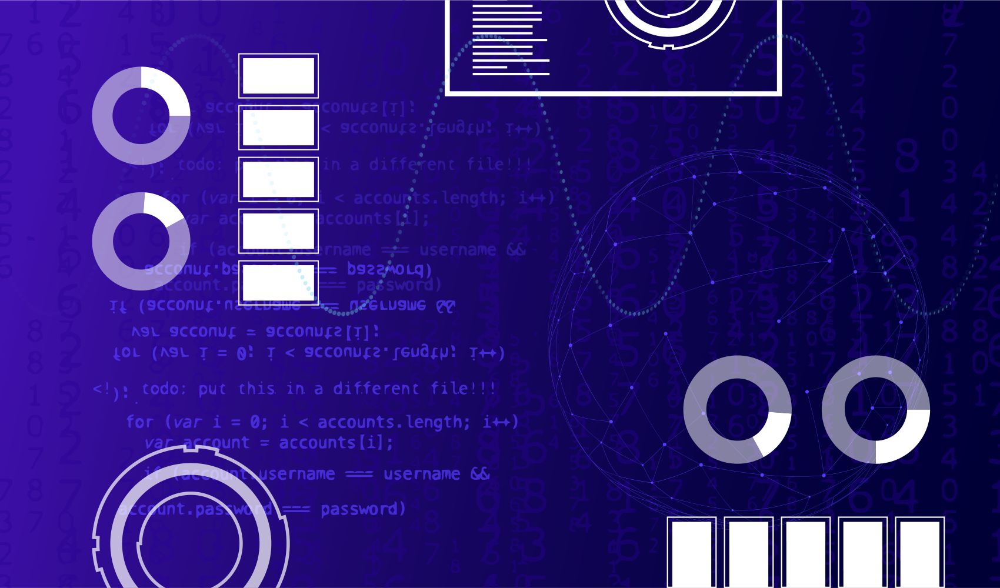
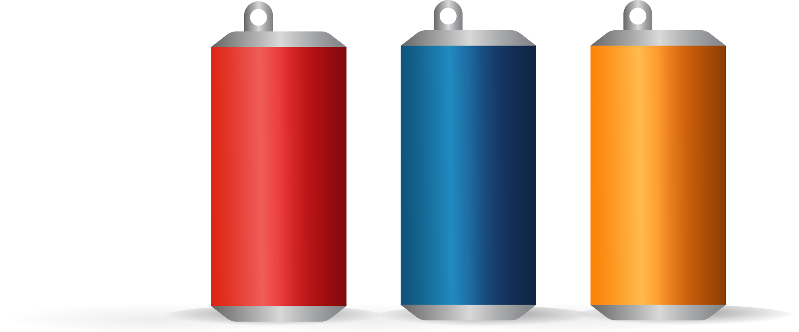

.. _creating_functions:

Creating Functions
==================

.. image:: ../../images/video.svg
    :class: video-image-h1
    :target: https://youtu.be/966lu1_Ht1o
    :alt: Video link

* Video: https://youtu.be/966lu1_Ht1o
* Slides: https://slides.com/paulcraven/deck-adf6d9

In the last chapter we learned how to create variables and use
them in expressions. In this chapter we are going to build on
that knowledge to create **functions**. Functions are groups of commands we
give to the computer.
We've already *used* functions, for example the ``print`` function and the ``draw_line``
function. Now we are going to learn to *make our own* functions.

Functions help us by:

* **Making our code easier to read.** By writing our own functions we can
  have functions to ``draw_tree`` and ``draw_horse`` which is a lot easier
  to read than long blocks of code that just draw lines and rectangles.
* **Abstracting our code.** By using variables, we can abstract our code and
  tell a function *where* to draw a tree, *how big* to draw it, and
  *what color* to draw it. This is a lot more flexible than one set of code
  that can only draw a tree in one exact place and one exact size.
* **Re-using our code.** By calling a function, I can re-use code
  over and over. If it takes ten lines of code to draw a horse,
  I can put that in a function. Then if I want to draw three horses,
  I don't need thirty lines of code to do it.
* **Dividing a complex problem into simpler ones.** The key to programming, and
  a lot of things in life, is to learn how to take a large, overwhelmingly
  complex problem, and divide it into small problems.
  For example,
  we have functions that can display dots on the screen. Then there
  functions that can draw a line using those dots. Then functions that
  can draw triangles using those lines. Then functions that can draw
  trees using those triangles. Then finally a forest function that
  uses the trees function. Drawing a complex forest is
  broken down into simple functions that build off each other.
* **Making code easier to maintain.** If there is a problem in your program,
  it is easier to find when your program is divided into parts. If your
  car isn't moving correctly, and there is a ``move_car`` function, that's
  easy to find. Plus, if all cars move using that function, I can fix
  a problem for every car in my game in one spot.

Creating Simple Functions
-------------------------

Defining a function in Python is easy. Here's an example:

.. code-block:: python
    :linenos:
    :caption: Defining a function.

    def print_hello():
        """ This is a comment that describes the function. """
        print("Hello!")

To write a function:

* Start with the keyword ``def``, which is short for "define."
* Next, give the function a name. Function names follow the same
  rules that variable names follow. They must:

  * Start with a lower case letter. (Or in special cases, an underscore.)
  * After the first letter, only use letters, numbers, and underscores.
  * Spaces are not allowed. Use underscores instead.
  * While upper-case letters can be used, function names are normally all
    lower-case.

* After that, we have a set of parenthesis. Inside the parenthesis will go
  **parameters**. We'll explain those in a bit.
* Next, a colon.
* All the code that goes in the function will be on the following lines.
  That code must be indented four spaces.
  The first line that is not indented, signifies the function is done.
* Usually we start a function with a multi-line comment that explains what
  the function does.

.. Note::

    Function definitions go *below* the ``import`` statements, and *above* the
    rest of the program. While you can put them somewhere else, you shouldn't.

Defining a function doesn't cause the computer to *do* anything. It is like
giving a recipe to the computer. Give someone a recipe for banana bread
and they know how to make it. They haven't actually made it yet, they
just know how.
You have to *tell* them to make banana bread.
That is, after we **define** the function
we must **call** the function before the code in it runs.

To call a function, type the function name and follow it by parenthesis.
Do not use ``def``, that is only used when we define what the function does,
not when we tell the computer to run it.

Below is a program that defines ``print_hello``, then
calls it twice.

.. code-block:: python
    :linenos:
    :caption: Defining and calling a function.

    def print_hello():
        """ This is a comment that describes the function. """
        print("Hello!")

    # This calls our function twice.
    print_hello()
    print_hello()

You can define and use multiple functions. But all function definitions should
go before the main code. In this example, see how we've defined two
functions and then we call them in our main code.

.. code-block:: python
    :linenos:
    :caption: Defining and calling multiple functions.

    def print_hello():
        print("Hello!")

    def print_goodbye():
        print("Bye!")

    # Here is the main code, after all the function
    # definitions.
    print_hello()
    print_goodbye()

.. _create-main-function:

Creating a Main Function
------------------------

Actually, almost *all* code should go in a function. It is a good practice
to put the main starting point of your program in a function called ``main``
and call it.

In this next example, we do just that. See how we took the two function
calls and put them in a ``main`` function. Also, note that we call ``main``
at the end. Without that, our program won't do anything at all.

.. code-block:: python
    :emphasize-lines: 9-12, 15-16
    :linenos:
    :caption: Using a ``main`` function.

    def print_hello():
        print("Hello!")

    def print_goodbye():
        print("Bye!")

    def main():
        """ This is my main program function """
        print_hello()
        print_goodbye()

    # Call (run) the main function
    main()

Remember how our drawing code always starts with ``import arcade``? That
just imports a lot of functions that are defined in the Arcade library
so we can use those functions ourselves. It doesn't run anything, just
imports functions.

Eventually we'll learn to write our own modules we import. Right now,
we couldn't do that with our code because attempting to import the code
would actually *run* it. What we want is simply to make the functions
available for us to use.

With that in mind, a better habit to get into is to check if we are
trying to ``import`` the file before calling the ``main`` function.
The statement, in this next example, looks a little weird.
In fact, it is weird enough I just look it up and copy/paste it any
time I want to use it. Don't worry about understanding *how* it works yet,
just realize it is a good practice and why.

.. code-block:: python
    :linenos:
    :caption: Check to make sure we aren't importing the file before calling ``main``.
    :emphasize-lines: 14-17

    def print_hello():
        print("Hello!")

    def print_goodbye():
        print("Bye!")

    def main():
        print_hello()
        print_goodbye()

    # Only run the main function if we are running this file. Don't run it
    # if we are importing this file.
    if __name__ == "__main__":
        main()

If this is too confusing, just call the ``main()`` method instead. Eventually
we'll learn about imports and ``if`` statements. Then it will make more sense.

Take in Data with Parameters
----------------------------

Functions are even more powerful if we can feed data into them to process.

Here is a simple example that will take in a number and print it. Notice how
I've created a new variable ``my_number`` in between the parenthesis.
This is called a function **parameter**. It is just a variable that
is given a value equal to what is passed in when called.
In the example below, it
is given first a ``55``, then ``25``, and finally an ``8``.

.. code-block:: python
    :linenos:

    def print_number(my_number):
        print(my_number)

    print_number(55)
    print_number(25)
    print_number(8)

You can pass in multiple numbers, just separate them with a comma. In
this case ``a`` will be 11 and ``b`` will be 7.

.. code-block:: python
    :linenos:

    def add_numbers(a, b):
        print(a + b)

    add_numbers(11, 7)

Occasionally, new programmers want to set the parameter values inside the
function. This is wrong. If you do this, the function would only work for those values.
The power is in specifying the numbers *outside* the function. We don't want
the function to be limited to only certain data values.

This example works, but it is wrong. Because if we ever changed line 8 to
pass in different values, the program would ignore those values because on
lines 3 and 4 they are always over written with 11 and 7.

.. code-block:: python
    :linenos:

    # This is wrong
    def add_numbers(a, b):
        a = 11
        b = 7
        print(a + b)

    add_numbers(11, 7)

Returning and Capturing Values
------------------------------

Functions can not only take *in* values, functions can *return* values.

.. _returning-values:

Returning values
^^^^^^^^^^^^^^^^

For example, here is a function that returns two numbers added together.
See how it uses a ``return`` statement on line four to return the result out of the
function.

.. code-block:: python
    :linenos:

    # Add two numbers and return the results
    def sum_two_numbers(a, b):
        result = a + b
        return result

.. note::
    Return is not a function, and does not use parentheses. Don't do
    ``return(result)``.

This only gets us half-way there. Because if we call the function now, not
much happens. Take a look at this example:

.. code-block:: python

    # This doesn't do much, because we don't capture the result
    sum_two_numbers(22, 15)

The numbers get added. They get returned to us. But we do
nothing with the result. So if you run this program, nothing
prints to the screen and we can't tell that anything happened.

.. _capturing_returned_values:

Capturing Returned Values
^^^^^^^^^^^^^^^^^^^^^^^^^

We need to *capture* the result. We do that by setting a variable equal to
the value the function returned. In this next code example we capture the result by
putting a variable to the left of the function call and using the ``=`` (assignment)
operator. Later the code prints the value, but that's not capturing! That is
just *using* the result we captured and printing it.

.. code-block:: python

    # Capture the function's result into a variable
    # by putting "my_result =" in front of it.
    # (Use whatever variable name best describes the data,
    # don't blindly use 'my_result' for everything.)
    my_result = sum_two_numbers(22, 15) # <--- This line CAPTURES the return value

    # Now that I captured the result, print it.
    print(my_result) # <--- This is printing, NOT capturing.

Now the result isn't lost. It is stored in the ``my_result`` variable
which we can print or use some other way.

We will do this *a lot*, so pause for a second and set it sit in your mind.
I'll wait.

Great, now imagine you have an instructor or co-worker watching over your shoulder.
You have a function. It returns a value. The person over your shoulder says,
"Ok, now you just have to capture the value." The pressure is on.

Don't panic! Remember to *capture*
the value returned from a function, put a variable to the left of it and
use an ``=`` operator.

Volume Cylinder Example
^^^^^^^^^^^^^^^^^^^^^^^

Let's use what we learned for something more practical.
Here is a function that returns the volume of a cylinder.
Notice how we take in two parameters and return the result of the
calculation.

.. code-block:: python
    :linenos:

    def volume_cylinder(radius, height):
        pi = 3.141592653589
        volume = pi * radius ** 2 * height
        return volume

Because of the ``return``, this function could be used later on as part of an
equation to calculate the volume of a six-pack like this:

.. code-block:: python

    six_pack_volume = volume_cylinder(2.5, 5) * 6

See how the value returned from ``volume_cylinder`` goes into the equation and is
multiplied by six. We would not be able to chain together calculations like
that if all we could do was ``print``, instead of ``return``.

There is a big difference between a function that *prints* a value and a
function that *returns* a value. Look at the code below. Pause for a bit
and make sure you can follow how it works. Read the comments. This is
a common source of confusion for new programmers, so spend a bit of time
studying it.

.. code-block:: python
    :linenos:

    # This function will print the result
    def sum_print(a, b):
        result = a + b
        print(result)

    # This function will return the result
    def sum_return(a, b):
        result = a + b
        return result

    # This code prints the sum of 4+4, because the function has a print
    sum_print(4, 4)

    # This code prints nothing, because the function returns, and doesn't print
    sum_return(4, 4)

    # This code will not set x1 to the sum.
    # The sum_print function does not have a return statement, so it returns
    # nothing!
    # x1 actually gets a value of 'None' because nothing was returned
    x1 = sum_print(4, 4)
    print("x1 =", x1)

    # This will set x2 to the sum and print it properly.
    x2 = sum_return(4, 4)
    print("x2 =", x2)

This next code example has a very common issue new programmers face.
It is not unusual to get stuck looking at
code like this example below. Your task: how would you print the result of the
function?
See if you can figure it out without looking ahead.

.. code-block:: python

    def calculate_average(a, b):
        """ Calculate an average of two numbers """
        result = (a + b) / 2
        return result

    # Pretend you have some code here
    x = 45
    y = 56

    # Wait, how do I print the result of this?
    calculate_average(x, y)

What's the answer?
How do we print the result of ``calculate_average``?
In the code above, the program can't print
the result because the ``result`` variable only exists inside the function.
Instead, use
a new variable outside the function, and the ``=`` operator
to capture the result:

.. code-block:: python

    def calculate_average(a, b):
        """ Calculate an average of two numbers """
        result = (a + b) / 2
        return result

    # Pretend you have some code here
    x = 45
    y = 56

    average = calculate_average(x, y)
    print(average)

Documenting Functions
---------------------

Functions in Python typically have a comment as the first statement of the
function. This comment is delimited using three double quotes, and is called a
**docstring**. In this case, the docstring is on line 2:

.. code-block:: python
    :linenos:
    :emphasize-lines: 2

    def volume_cylinder(radius, height):
        """Returns volume of a cylinder given radius, height."""
        pi = 3.141592653589
        volume = pi * radius ** 2 * height
        return volume

The great thing about using docstrings in functions is that the comment can be
pulled out and put into a website.
That can be part of a larger website that documents your code.
For example,
`here is the documentation for drawing a circle <https://api.arcade.academy/en/latest/arcade.html#arcade.draw_circle_outline>`_,
generated
automatically from the function comment. In fact, everything on that page is
automatically generated.
Most languages have similar tools that can help make documenting a breeze.
This can save a lot of time as you start working on larger programs.

Variable Scope
--------------

.. image:: telescope.svg
    :width: 25%
    :class: right-image

The use of functions introduces the concept of **scope**. Scope is where in the
code a variable is "alive" and can be accessed. For example, look at the code
below:

.. code-block:: python

    # Define a simple function that sets
    # x equal to 22
    def f():
        x = 22

    # Call the function
    f()
    # This fails, x only exists in f()
    print(x)

The last line will generate an error because ``x`` only exists inside of the ``f()``
function. Every heard the phrase "What happens in Vegas, stays in Vegas?"
Well, variables created in a function stay in the function.
The variable is created when ``f()`` is called and the memory it uses is
freed as soon as ``f()`` finishes.

Here's where it gets complicated.
A more confusing rule is how to access variables created *outside* of the ``f()``
function. In the following code, ``x`` is created before the ``f()`` function, and
thus can be read from inside the ``f()`` function.

.. code-block:: python

    # Create the x variable and set to 44
    x = 44

    # Define a simple function that prints x
    def f():
        print(x)

    # Call the function
    f()

Variables created ahead of a function may be read inside of the function only
if the function does not *change* the value. This code, very similar to the code
above, will fail. The computer will claim it doesn't know what ``x`` is.

.. code-block:: python

    # Create the x variable and set to 44
    x = 44

    # Define a simple function that prints x
    def f():
        x += 1
        print(x)

    # Call the function
    f()

Pass-by-Copy
------------

When you call a function and set a value to a function parameter,
that value is a *copy* of the original. For example take a look at this
code:

.. code-block:: python

    # Define a simple function that prints x
    def f(x):
        x += 1
        print(x)

    # Set y
    y = 10
    # Call the function
    f(y)
    # Print y to see if it changed
    print(y)

The value of ``y`` does not change, even though the ``f()`` function increases the
value passed to it. Each of the variables listed as a parameter in a function
is a brand new variable. The value of that variable is copied from where it is
called.

This is reasonably straight forward in the prior example. Where it gets
confusing is if both the code that calls the function and the function itself
have variables named the same. The code below is identical to the prior listing,
but rather than use ``y`` it uses ``x``.

.. code-block:: python

    # Define a simple function that prints x
    def f(x):
        x += 1
        print(x)

    # Set x
    x = 10
    # Call the function
    f(x)
    # Print x to see if it changed
    print(x)

The output is the same as the program that uses y. Even though both the
function and the surrounding code use x for a variable name, there are
actually two different variables. There is the variable x that exists
inside of the function, and a different variable x that exists outside
the function.

Functions Calling Functions
---------------------------

For each of the examples below, think about what would print. Check to see
if you are right. If you didn't guess correctly, spend to the time to
understand why.

Example 1
^^^^^^^^^

In this example, note that if you don't use a function, it doesn't run.

.. code-block:: python

    # Example 1
    def a():
        print("A")

    def b():
        print("B")

    def c():
        print("C")

    a()

Example 2
^^^^^^^^^

.. code-block:: python

    # Example 2
    def a():
        b()
        print("A")

    def b():
        c()
        print("B")

    def c():
        print("C")

    a()

Example 3
^^^^^^^^^

.. code-block:: python

    # Example 3
    def a():
        print("A")
        b()

    def b():
        print("B")
        c()

    def c():
        print("C")

    a()

Example 4
^^^^^^^^^

.. code-block:: python

    # Example 4
    def a():
        print("A start")
        b()
        print("A end")

    def b():
        print("B start")
        c()
        print("B end")

    def c():
        print("C start and end")

    a()

Example 5
^^^^^^^^^

.. code-block:: python

    # Example 5
    def a(x):
        print("A start, x =", x)
        b(x + 1)
        print("A end, x =", x)

    def b(x):
        print("B start, x =", x)
        c(x + 1)
        print("B end, x =", x)

    def c(x):
        print("C start and end, x =", x)

    a(5)

Example 6
^^^^^^^^^

While line 3 of this example increases ``x``, the ``x`` variable in the function is a different variable than the
``x`` that is in the rest of the program. So that ``x`` never changes.

.. code-block:: python

    # Example 6
    def a(x):
        x = x + 1

    x = 3
    a(x)

    print(x)

Example 7
^^^^^^^^^

This example is similar to the prior example, but we ``return x`` at the end. Turns out, it doesn't matter. Because we
never do anything with the return value. So the global variable ``x`` still doesn't increase. See the next example.

.. code-block:: python

    # Example 7
    def a(x):
        x = x + 1
        return x

    x = 3
    a(x)

    print(x)

Example 8
^^^^^^^^^

This example take the value returned from ``a`` and stores it back into ``x``. How? By doing ``x = a(x)`` instead of
just ``a(x)``.

.. code-block:: python

    # Example 8
    def a(x):
        x = x + 1
        return x

    x = 3
    x = a(x)

    print(x)

Example 9
^^^^^^^^^

.. code-block:: python

    # Example 9
    def a(x, y):
        x = x + 1
        y = y + 1
        print(x, y)

    x = 10
    y = 20
    a(y, x)

Example 10
^^^^^^^^^^

While you can have two ``return`` statements in a function, once you hit the first ``return`` the function ends. In
this case, ``return y`` never runs, because we already returned from the function in the prior line.

.. code-block:: python

    # Example 10
    def a(x, y):
        x = x + 1
        y = y + 1
        return x
        return y

    x = 10
    y = 20
    z = a(x, y)

    print(z)

Example 11
^^^^^^^^^^

This is not something you can do in every programming language. You can return two values by using a comma and listing them.

.. code-block:: python

    # Example 11
    def a(x, y):
        x = x + 1
        y = y + 1
        return x, y

    x = 10
    y = 20
    z = a(x, y)

    print(z)

Example 12
^^^^^^^^^^

If you return two values out of a function, you can capture them this way.

.. code-block:: python

    # Example 12
    def a(x, y):
        x = x + 1
        y = y + 1
        return x, y

    x = 10
    y = 20
    x2, y2 = a(x, y) # Most computer languages don't support this

    print(x2)
    print(y2)

Example 13
^^^^^^^^^^

.. code-block:: python

    # Example 13
    def a(my_data):
        print("function a, my_data =  ", my_data)
        my_data = 20
        print("function a, my_data =  ", my_data)

    my_data = 10

    print("global scope, my_data =", my_data)
    a(my_data)
    print("global scope, my_data =", my_data)

Example 14
^^^^^^^^^^

We will talk more about these next two examples when we talk about "lists" and "classes" later. These examples don't
operate like you might expect at first. Take a look and see what is different. We'll explain why it works differently
later.

.. code-block:: python

    # Example 14
    def a(my_list):
        print("function a, list =  ", my_list)
        my_list = [10, 20, 30]
        print("function a, list =  ", my_list)

    my_list = [5, 2, 4]

    print("global scope, list =", my_list)
    a(my_list)
    print("global scope, list =", my_list)

Example 15
^^^^^^^^^^

.. code-block:: python

    # Example 15
    # New concept!
    # Covered in more detail in a later chapter
    def a(my_list):
        print("function a, list =  ", my_list)
        my_list[0] = 1000
        print("function a, list =  ", my_list)

    my_list = [5, 2, 4]

    print("global scope, list =", my_list)
    a(my_list)
    print("global scope, list =", my_list)

Review
------

This chapter was all about **functions**.
We learned how to define functions using the ``def`` keyword.
We can call functions just by using the function name followed by parenthesis.
Functions can take in data by using **parameters**.
Functions return data using the ``return`` statement.
We can capture that data by setting a variable equal to the function call.
Functions can be documented with comments.
Variables created inside a function cannot be accessed outside the function.
Parameter variables contain *copies* of the original data and can be modified without
changing the original.
Functions can call other functions, which can call yet more functions.
