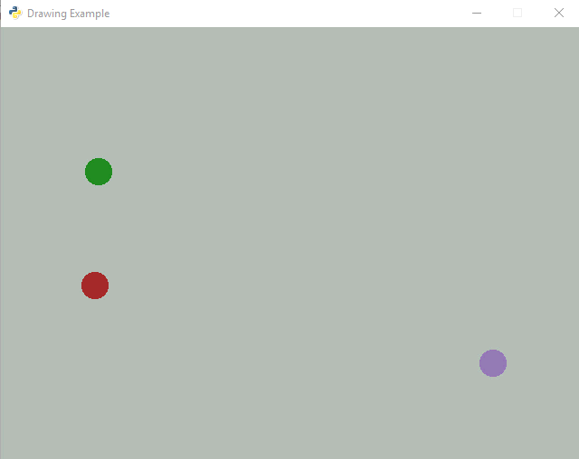
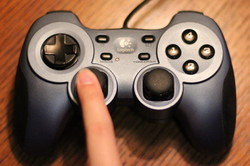
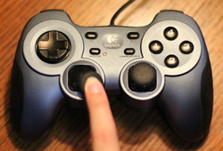

.. _user-control:

Classes, Animation and User Control
===================================

We can use a class to represent our program.
The Arcade library has a built-in class that represents a window on the
screen. We can create our own child class and override functions to handle:

* Start-up and initialization
* Drawing the items on our screen
* Animating/Updating the positions of items on our screen
* Responding to the keyboard
* Responding to the mouse

One of the best ways of learning to program, is to look at sample code. This
chapter has several examples designed to learn how to:

* Open a window using an object-oriented approach
* Animating objects
* Moving objects with the mouse
* Moving objects with the keyboard
* Moving objects with the joystick

Creating a Window with a Class
------------------------------

Up to now, we have used a function called ``open_window`` to open a window.
Here's the code:

.. literalinclude:: open_window_with_function.py
    :caption: open_window_with_function.py
    :language: python
    :emphasize-lines: 8
    :linenos:

We can also create an instance of a class called ``Window`` to open a window.
The code is rather straight-forward:

.. literalinclude:: open_window_with_object.py
    :caption: open_window_with_object.py
    :language: python
    :emphasize-lines: 8
    :linenos:

Function calls, and calls to create an instance of an object look very similar.
The tell-tale clue that we are creating an instance of an object in the second
example is the fact that ``Window`` is capitalized.

Extending the Window Class
--------------------------

Arcade's ``Window`` class has a lot of built-in methods that are automatically
called when needed. Methods for drawing, for responding to the keyboard, the
mouse, and more. You can see all the methods by looking at the
`Window Class Documentation`_.
But by default, these methods don't do anything. We need
to change that.

As we learned from the prior chapter, we can extend the functionality of a class
by creating a child class.
Therefore, we can extend the ``Window`` class by creating
a child class of it. I'm going to call my child class ``MyGame``.

.. _Window Class Documentation: http://arcade.academy/arcade.html#arcade.application.Window

.. literalinclude:: extending_window_class.py
    :caption: extending_window_class.py
    :language: python
    :linenos:
    :emphasize-lines: 4-9, 13

Drawing with the Window Class
-----------------------------

To draw with the ``Window`` class, we need to create our own method called
``on_draw``. This will override the default ``on_draw`` method built into the ``Window``
class. We will put our drawing code in there.

The ``on_draw`` method gets called about 60 times per second. We'll use this
fact when we do animation.

We also need to set the background color. Since we only need to do this once,
we will do that in the ``__init__`` method. No sense setting the background
60 times per second when it isn't changing.

.. literalinclude:: drawing.py
    :caption: drawing.py
    :language: python
    :linenos:
    :emphasize-lines: 11-12, 14-18

The result of this program just looks like:

.. image:: draw_example.png

Animating
---------

By overriding the ``update`` method, we can update our ball position and
animate our scene:

.. literalinclude:: simple_animation.py
    :caption: simple_animation.py
    :language: python
    :linenos:
    :emphasize-lines: 14-16, 22, 24-27

Encapsulating Our Animation Object
^^^^^^^^^^^^^^^^^^^^^^^^^^^^^^^^^^

It doesn't take much imagination to realize that adding more parameters to
the ball, getting it to bounce, or even having several balls on the screen would
make our ``MyApplication`` class very complex.

If only there was a way to encapsulate all that "ball" stuff together. Wait!
There is! Using classes!

Here is a more complex example, but all the logic for the ball has been moved
into a new ``Ball`` class.

.. literalinclude:: ball_class_example.py
    :caption: ball_class_example.py
    :language: python
    :linenos:

Here it is in action:

.. image:: ball_class_example.gif

Animating a List
^^^^^^^^^^^^^^^^

Wouldn't it be nice to animate multiple items? How do we track multiple items?
With a list! This takes our previous example and animates three balls at once.

.. literalinclude:: ball_list_example.py
    :caption: ball_list_example.py
    :language: python
    :linenos:
    :emphasize-lines: 54-65, 71-74, 81-82

User Control
------------

How do we interact with the user? Get the user to move an object on the screen?

We can do this with the mouse, with the keyboard, or with the game controller.

Move with the Mouse
^^^^^^^^^^^^^^^^^^^

The key to managing mouse motion to override the ``on_mouse_motion`` in the
``arcade.Window`` class. That method is called every time the mouse moves.
The method definition looks like this:

.. code-block:: python

    def on_mouse_motion(self, x, y, dx, dy):

The ``x`` and ``y`` are the coordinates of the mouse. the ``dx`` and ``dy``
represent the change in x and y since the last time the method was called.

Often when controlling a graphical item on the screen with the mouse, we do
not want to see the mouse pointer. If you don't want to see the mouse pointer,
in the ``__init__`` method, call the following method in the parent class:

.. code-block:: python

    self.set_mouse_visible(False)

The example below takes our ``Ball`` class, and moves it around the screen with
the mouse.

.. literalinclude:: move_with_mouse.py
    :caption: move_with_mouse.py
    :language: python
    :linenos:

.. _mouse-click:

Mouse Clicks
^^^^^^^^^^^^

You can also process mouse clicks by defining an ``on_mouse_press`` method:

.. code-block:: python

    def on_mouse_press(self, x, y, button, modifiers):
        """ Called when the user presses a mouse button. """

        if button == arcade.MOUSE_BUTTON_LEFT:
            print("Left mouse button pressed at", x, y)
        elif button == arcade.MOUSE_BUTTON_RIGHT:
            print("Right mouse button pressed at", x, y)

Move with the Keyboard
^^^^^^^^^^^^^^^^^^^^^^

Moving with the game controller is similar to our bouncing ball example. There
are just two differences:

* We control the ``change_x`` and ``change_y`` with the keyboard
* When we hit the edge of the screen we stop, rather than bounce.

To detect when a key is hit, we override the ``on_key_press`` method. We might
think of hitting a key as one event. But it is actually two. When the key is
pressed, we start moving. When the key is released we stop moving. That makes
for two events. Releasing a key is controlled by ``on_key_release``.

These methods have a  ``key`` variable as a parameter that can be compared with
an ``if`` statement to the values in
the `arcade.key library <http://arcade.academy/arcade.key.html>`_.

.. code-block:: python

    def on_key_press(self, key, modifiers):
        if key == arcade.key.LEFT:
            print("Left key hit")
        elif key == arcade.key.A:
            print("The 'a' key was hit")

We detect the edge by comparing ``position_x`` with the left and right side
of the screen For example:

.. code-block:: python

    if self.position_x < 0:

But this isn't perfect. Because the position specifies the *center* of the ball,
by the time the x coordinate is 0 we are already have off the screen. It is
better to compare it to the ball's radius:

.. code-block:: python

    if self.position_x < self.radius:

What do we do once it hits the edge? Just set the value back to the edge:

.. code-block:: python

    # See if the ball hit the edge of the screen. If so, change direction
    if self.position_x < self.radius:
        self.position_x = self.radius

Here's a full example:

.. literalinclude:: move_with_keyboard.py
    :caption: move_with_keyboard.py
    :language: python
    :linenos:
    :emphasize-lines: 66-75, 77-82

Moving with the Game Controller
^^^^^^^^^^^^^^^^^^^^^^^^^^^^^^^

Working with game controllers is a bit more complex. A computer might not
have any game controllers, or it might have five controllers plugged in.

We can get a list of all game pads that are plugged in with the
``get_joysticks`` function. This will either return a list, or it will return
nothing at all if there are no game pads.

Below is a block of code that can be put in an ``__init__`` method for your
application that will create an instance variable to represent a game pad
if one exists.

.. code-block:: python

    joysticks = arcade.get_joysticks()
    if joysticks:
        self.joystick = joysticks[0]
        self.joystick.open()
    else:
        print("There are no joysticks.")
        self.joystick = None

Joystick Values
~~~~~~~~~~~~~~~

After this, you can get the position of the game controller joystick by calling
``self.joystick.x`` and ``self.joystick.y``. The values will be between -1 and +1,
with 0 being a centered joystick.

The x-axis numbers will be negative if the stick goes left, positive for right.

The y-axis numbers will be opposite of what you might expect. Negative for up, positive for down.

    Centered (0, 0)

.. figure:: d.jpg

    Down (0, 1)

.. figure:: dl.jpg

    Down/Left (-1, 1)

    Down/Right (1, 1)

.. figure:: u.jpg

    Up (0, -1)

.. figure:: ul.jpg

    Up/Left (-1, -1)

.. figure:: ur.jpg

    Up/Right (1, -1)

Deadzone
~~~~~~~~

Actually, a centered joystick might have a value not at 0, but at 0.0001 or some
small number. This will make for a small "drift" on a person's character. We often
counteract this by having a "dead zone" where if the number is below a certain
value, we just assume it is zero to eliminate the drift.

Example
~~~~~~~

If you want to move faster than one pixel per frame, then just multiply the
``self.joystick.x`` times five and you'll be going five times faster.

Here is a full example:

.. literalinclude:: move_with_game_controller.py
    :caption: move_with_game_controller.py
    :language: python
    :linenos:

Starting Template
-----------------

http://arcade.academy/examples/starting_template.html
