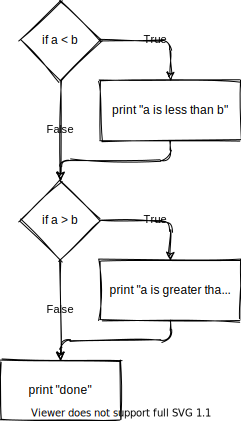

If Statements
=============

* Video: https://youtu.be/CXsOXI24khw
* Slides: https://slides.com/paulcraven/if-statements

.. image:: question_mark_1.svg
    :width: 30%
    :class: right-image

So far we've learned to create expressions, use variables, and make our own functions.

Our next step is to learn how to write code that will only run based on a certain condition.
For example, we may want to draw "Game Over" text on the screen--but only
if the player has run out of lives.

To do this we need to learn how to use an ``if`` statement.
The ``if`` statement is also known as a
*conditional statement*. (You can use the term "conditional statement" when you
want to impress everyone how smart you are.) The ``if`` statement allows a computer
to make a decision. Is it hot outside? Has the spaceship reached the edge of the
screen? Has too much money been withdrawn from the account? A program can
decide which block of code to run based on this statement.

Basic Comparisons
-----------------

.. image:: scale.svg
    :width: 30%
    :class: right-image

Here are two example ``if`` statements.
As you can probably guess, the statements see which variable is smaller,
and which is larger.

.. code-block:: python
    :linenos:
    :caption: Example ``if`` statements: less than, greater than

    # Variables used in the example ``if`` statements
    a = 4
    b = 5

    # Basic comparisons
    if a < b:
        print("a is less than b")

    if a > b:
        print("a is greater than b")

    print("Done")

Try running the code. You should get output that looks like this:

.. code-block:: text
    :caption: Output

    a is less than b
    Done

Since ``a`` is less than ``b``, the first statement will print out if this code
is run. Flip the values, and the second statement will run.
If **both** variables ``a`` and ``b`` were equal to 4, then *neither* of
the two statements would print because 4 is not greater than 4.

Play around with the program by adjusting the values to verify the code continues to do what we expect.

Flowcharts
----------

To show the flow of a program a *flowchart* may be used. Most people can follow a
flowchart even without an introduction to programming. See how the flowchart below
matches with the code we just ran. ``if`` statements go in diamonds and have two
possible paths out of them. Regular statements go in rectangles, and have only one
exit path.

    Flowchart

This book skips an in-depth look at flow-charting, but if you
are curious and want to learn more, Wikipedia has a great article introducing how it works:

http://en.wikipedia.org/wiki/Flowchart

More Comparison Types
---------------------

The prior example checked to see if variables were "greater than" or "less than."
Numbers that were *equal* would *not* pass the test. To check if values are greater than *or equal*,
we use the two characters ``>=`` right next to each other, with no space between.
Let's adjust our prior code sample:

.. code-block:: python
    :linenos:
    :caption: Example ``if`` statements: less than or equal, greater than or equal

    if a <= b:
        print("a is less than or equal to b")

    if a >= b:
        print("a is greater than or equal to b")

The ``<=`` and ``>=`` symbols must be used in order, and there may not be a
space between them. For example, ``=<`` will not work, nor will ``< =``.

When writing these statements out on actual paper, some new programmers like to use the ``≤``
symbol, because that's what we learned in math. For example:

.. code-block:: text

    if a ≤ b:

This ``≤`` symbol doesn't actually work in a program. Plus most people don't
know how to type it on the keyboard. (Just in case you are curious,
to type it hold down the 'alt' key while typing 243 on the number pad.) So when
writing out code, particularly on paper, remember to use the two characters ``<=``
and not the one character ``≤`` symbol. If you encounter a written test or quiz,
make sure to write it out correctly and not lose points.

The next set of code checks to see if two items are equal or not. If we want to
check for equality, we use two equals signs in a row: ``==``.
The operator for not equal is ``!=``. Here they are in action.
Add them to the bottom of the other code we were working on, and try them out.

.. code-block:: python
    :linenos:
    :caption: Example ``if`` statements: "equal" and "not equal"

    # Equal
    if a == b:
        print("a is equal to b")

    # Not equal
    if a != b:
        print("a and b are not equal")

.. attention:: Learn when to use = and ==.

It is very easy to mix up when to use ``==`` and ``=``. Use ``==`` if you
are *asking* if they are equal, use ``=`` if you are *assigning* a value.

The two most common mistakes in mixing the ``=`` and ``==`` operators are
demonstrated below:

.. code-block:: python
    :linenos:

    # This is wrong
    a == 1

    # This is also wrong
    if a = 1:
        print("A is one")

Stop! Please take a moment to go back and carefully study the last two code
examples. Save time later by making sure you understand when to use ``=``
and ``==``. Don't guess.

Indentation
-----------

Indentation matters. Each line under the ``if`` statement that is indented will
only be executed ``if`` the statement is ``True``. In this example, the three lines
indented under the ``if`` statement will run *only* if true, the fourth print statement will
*always* run because it is *not* indented under an ``if`` statement.

.. code-block:: python
    :linenos:

    if a == 1:
        print("If a is one, this will print.")
        print("So will this.")
        print("And this.")

    print("This will always print because it is not indented.")

The indentation amount must be the same. This wandering code doesn't work.

.. code-block:: python
    :linenos:

    if a == 1:
      print("Indented two spaces.")
        print("Indented four. This will generate an error.")
       print("The computer will want you to make up your mind.")

Once an ``if`` statement has been finished, it is not possible to re-indent to
go back to it. The test has to be performed again. So this code example doesn't
work at all:

.. code-block:: python
    :linenos:

    if a == 1:
        print("If a is one, this will print.")
        print("So will this.")

    print("This will always print because it is not indented.")
        print("This will generate an error. Why it is indented?")

If you try running it, you'll get the following ``IndentationError``:

.. code-block:: text

      File "c:/my_code/test.py", line 8
        print("This will generate an error. Why it is indented?")
        ^
    IndentationError: unexpected indent

Using And/Or
------------

An ``if`` statement can check multiple conditions by chaining together
comparisons with ``and`` and ``or``. These are also considered to be
**operators** just like the ``+`` and ``-`` characters are.
Go ahead and create a third variable ``c`` and try using these two new operators
yourself.

.. code-block:: python
    :linenos:
    :caption: Example ``if`` statements, using "and" and "or"

    # And
    if a < b and a < c:
        print("a is less than b and c")

    # Non-exclusive or
    if a < b or a < c:
        print("a is less than either b or c (or both)")

.. hint:: Repeat yourself please.

A common mistake is to omit a variable when checking it against multiple
conditions. You cannot write ``if a < b or c``. Neither will ``if a < b or < c`` work.
The computer does not know
what to check against the variable ``c``. It will not assume to check it
against ``a``. You need the full ``if a < b or a < c`` for it to work correctly.

.. code-block:: python
    :linenos:

    # This is not correct
    if a < b or < c:
        print("a is less than b and c")

Boolean Variables
-----------------

Python supports Boolean variables. What are Boolean variables? Boolean variables
can store a value of either ``True`` or ``False``. `Boolean algebra`_ was
developed by `George Boole`_ back in 1854, well before electronic computers.
Yet his work forms the basis of how computer logic works.
If only he knew how important his work would become!

.. _Boolean algebra: https://en.wikipedia.org/wiki/Boolean_algebra
.. _George Boole: https://en.wikipedia.org/wiki/George_Boole

An ``if`` statement needs an expression to evaluate to ``True`` or ``False``. What
may seem odd is that it does not actually need to do any comparisons if a
variable already evaluates to ``True`` or ``False``.

For example, in this code we set the variable ``a`` to ``True``. Our ``if`` statement
does't need a comparison. If ``a`` is True it will execute the statement, if it is ``False``
it will not.

.. code-block:: python
    :linenos:
    :caption: If statements and Boolean data types

    # Boolean data type. This is legal!
    a = True
    if a:
        print("a is true")

Another operator we can use is the ``not`` operator. You can take any statement or boolean
and flip between True/False. The statement ``if a`` runs if ``a`` is ``True``, the statement
``if not a`` runs if the statement is ``False``.

.. code-block:: python
    :linenos:
    :caption: The not operator example 2

    # How to use the not function
    if not a:
        print("a is false")

It is also possible to use Boolean variables with the ``and`` and ``or`` operators.

.. code-block:: python
    :linenos:
    :caption: Using "and" with Boolean variables

    a = True
    b = False

    if a and b:
        print("a and b are both true")

.. attention:: Who knew True/False could be hard?

It is also possible to assign a variable to the result of a comparison. In the
code below, the variables ``a`` and ``b`` are compared. If they are equal, ``c``
will be ``True``, otherwise ``c`` will be ``False``.

.. code-block:: python
    :linenos:
    :caption: Assigning values to Boolean data types

    a = 3
    b = 3

    # This next line is strange-looking, but legal.
    # c will be true or false, depending if
    # a and b are equal.
    c = a == b

    # Prints value of c, in this case True
    print(c)

.. hint:: Zero means False. Everything else is True.

It is possible to create an ``if`` statement with a condition that does not
evaluate to ``True`` or ``False``. Because this is confusing, we don't use this
fact a lot, but it is
important to understand how the computer handles these values when searching for
problems. These two examples will run, and will cause the text to be printed out
because the values in the ``if`` statement are non-zero:

.. code-block:: python
    :linenos:

    if 1:
        print("1")
    if "A":
        print("A")

The code below will not print out anything because the value in the ``if``
statement is zero which is treated as ``False``.
*Any value other than zero is considered ``True``*.

.. code-block:: python
    :linenos:

    if 0:
        print("Zero")

.. _input-function:

The ``input`` Function
----------------------

Rather than hard-coding values into our program, we can use the ``input``
function to ask the user to type something in. The ``input`` function
is reasonably simple to use:

.. code-block:: python
    :linenos:

    temperature = input("What is the temperature in Fahrenheit? ")
    print("You said the temperature was " + temperature + ".")

.. image:: keyboard.svg
    :width: 30%
    :class: right-image

As a parameter to ``input``, just give it text to use as a prompt. Whatever
the user types in, is stored in the variable on the left.

Note that there is a question mark and a space at the end of that string.
If you didn't have this, what the user types in will run right up next to
the prompt. That looks terrible. The user is tempted to type a space
as the first part of their input, which complicates things for us later.

There's one more thing we have to learn. We can't take what the user
types in and compare it to a number. This program:

.. code-block:: python
    :linenos:

    temperature = input("What is the temperature in Fahrenheit? ")
    if temperature > 90:
        print("It is hot outside.")

...will fail with a ``TypeError``:

.. code-block:: text

    TypeError: '>' not supported between instances of 'str' and 'int'

Whatever the user types in is stored as text. We also call text a "string"
because to the computer it is just a string of characters. This is different
than a number, and the computer does not know how to compare them.

Therefore, we need to convert the input into a number. We can do with with
the ``int`` for integers. If we have floating point numbers, use the
``float`` function.

In this example we get the input, convert it to an integer, and then we can
use it in an ``if`` statement.

.. code-block:: python
    :linenos:

    # Get input from the user
    temperature = input("What is the temperature in Fahrenheit? ")

    # Convert the input to an integer
    temperature = int(temperature)

    # Do our comparison
    if temperature > 90:
        print("It is hot outside.")

You can chain the ``input`` and ``int`` functions on one line if you like, as shown here:

.. code-block:: python
    :linenos:

    # Get input from the user
    temperature = int(input("What is the temperature in Fahrenheit? "))

    # Do our comparison
    if temperature > 90:
        print("It is hot outside.")

Else and Else If
----------------

So far, we've used simple ``if`` statements to run a block of code, or not
run it. What if we want to select between two blocks of code? What if
we want to run one of *four* different blocks?
To do this, we need "else" and "else if" logic.

Let's start with a simple ``if`` statement that prints if it is hot outside:

.. code-block:: python
    :linenos:

    temperature = int(input("What is the temperature in Fahrenheit? "))
    if temperature > 90:
        print("It is hot outside")
    print("Done")

If the programmer wants code to be executed if it is *not* hot, she can use the
``else`` statement. As for indentation, notice how the ``else`` is lined up
with the ``i`` in the ``if``
statement. Also notice how ``else`` is followed by a colon just like the ``if`` statement.
Try running this code. The ``if`` statement will always run one of the two
blocks, but never both.

.. code-block:: python
    :linenos:
    :caption: Example if/else statement

    temperature = int(input("What is the temperature in Fahrenheit? "))
    if temperature > 90:
        print("It is hot outside")
    else:
        print("It is not hot outside")
    print("Done")

In the case of an if...else statement, one block of code will always be
executed. The first block will be executed ``if`` the statement evaluates to
``True``, the second block if it evaluates to ``False``.

It is possible to chain several ``if`` statements together using the else...if
statement. Python abbreviates this as ``elif``. In this example we add a
third possible combination using ``elif``.

.. code-block:: python
    :linenos:
    :caption: Example if/elif/else statement

    temperature = int(input("What is the temperature in Fahrenheit? "))
    if temperature > 90:
        print("It is hot outside")
    elif temperature < 30:
        print("It is cold outside")
    else:
        print("It is not hot outside")
    print("Done")

In this next example, we've made a mistake.
The program will output "It is hot outside" even if the user
types in 120 degrees. Why? How can the code be fixed?

.. code-block:: python
    :linenos:
    :caption: Example of improper ordering if/elif/else

    temperature = int(input("What is the temperature in Fahrenheit? "))
    if temperature > 90:
        print("It is hot outside")
    elif temperature > 110:
        print("Oh man, you could fry eggs on the pavement!")
    elif temperature < 30:
        print("It is cold outside")
    else:
        print("It is ok outside")
    print("Done")

The computer doesn't do a "best-fit", it looks at the ``if`` statement in order.
As 120 is greater than 90, it will run the first condition and skip the rest.
To fix this code, we need to reorder it.

.. code-block:: python
    :linenos:
    :caption: Example of improper ordering if/elif/else

    temperature = int(input("What is the temperature in Fahrenheit? "))
    if temperature > 110:
        print("Oh man, you could fry eggs on the pavement!")
    elif temperature > 90:
        print("It is hot outside")
    elif temperature < 30:
        print("It is cold outside")
    else:
        print("It is ok outside")
    print("Done")

.. _text-comparisons:

Text Comparisons
----------------

It is possible to use an ``if`` statement to check text, as shown in this example.

.. code-block:: python
    :linenos:
    :caption: Case sensitive text comparison

    user_name = input("What is your name? ")
    if user_name == "Paul":
        print("You have a nice name.")
    else:
        print("Your name is ok.")

The prior example will only match if the user enters "Paul" with a capital P.
It will not work if the user enters lower-case "paul" or upper-case "PAUL".

A common mistake is to forget the quotes around the string being compared.
In the example below, the computer will think that Paul is a variable that
stores a value. It will flag an error because it has no idea what is stored
in the variable Paul.

.. code-block:: python
    :linenos:
    :caption: Incorrect comparison

    user_name = input("What is your name? ")
    if user_name == Paul: # This does not work because quotes are missing
        print("You have a nice name.")
    else:
        print("Your name is ok.")

.. _multi-text-comparisons:

Multiple Text Possibilities
^^^^^^^^^^^^^^^^^^^^^^^^^^^

When comparing a variable to multiple possible strings of text, it is important
to remember that the comparison *must* include the variable. For example:

.. code-block:: python

    # This does not work! It will always be true
    if user_name == "Paul" or "Mary":

Instead, the code should read like this:

.. code-block:: python

    # This does work
    if user_name == "Paul" or user_name == "Mary":

Confusingly, the first example will run, but it will *always* trigger the
``if`` statement even if the name isn't Paul or Mary.
This is because for any value other than zero, the computer assumes to mean
``True``. "Mary" isn't zero.
So to the computer "Mary" is the same thing as ``True`` and so it
will run the code in the ``if`` statement.

Case-Insensitive Comparisons
^^^^^^^^^^^^^^^^^^^^^^^^^^^^

If the program needs to match text, and we don't care if it is upper or
lower case, we need a case-insensitive comparison.
The easiest way to do that is to convert everything to lower-case, then compare.
This can be done with the ``lower()`` command.

.. attention:: Learn to be insensitive.

The example below will take whatever the user enters, convert it to lower-case,
and then do the comparison. Important: Don't convert to lower-case and
compare it against a string that has
uppercase! Then you'll never match.

.. code-block:: python
    :linenos:
    :caption: Case-insensitive text comparison

    user_name = input("What is your name? ")
    if user_name.lower() == "paul":
        print("You have a nice name.")
    else:
        print("Your name is ok.")

Review
------

With the introduction of ``if`` statements we've learned how to run code
only if a condition is true. By adding in ``elif`` and ``else`` statements
we can run one of multiple possible code blocks depending upon a condition.

We've learned that we write conditions using **comparison operators** like
``<`` and ``>``. We've learned that ``==`` is the comparison operator
for asking if two items are equal,
while ``=`` is the assignment operator used to set a variable's value.
We can reverse logic using the ``not`` operator.

Finally, we were introduced to **Boolean** values, where variables can store ``True``
or ``False``. The ``if`` statements can operate based on those values.

Example if Statements
^^^^^^^^^^^^^^^^^^^^^

The next set of example code below runs through all the concepts talked about
earlier.

.. literalinclude:: if_statement_examples.py
    :language: python
    :linenos:

Online Coding Problems
^^^^^^^^^^^^^^^^^^^^^^

Practice on-line by completing the first set of coding problems available here:

https://repl.it/community/classrooms/174286

All problems beginning with ``03`` can be done with the knowledge from this
chapter.
