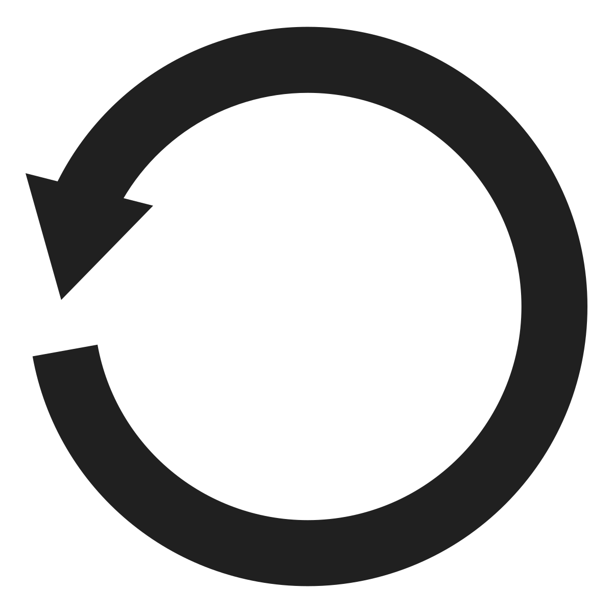
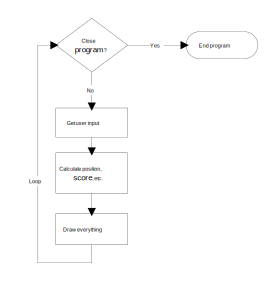
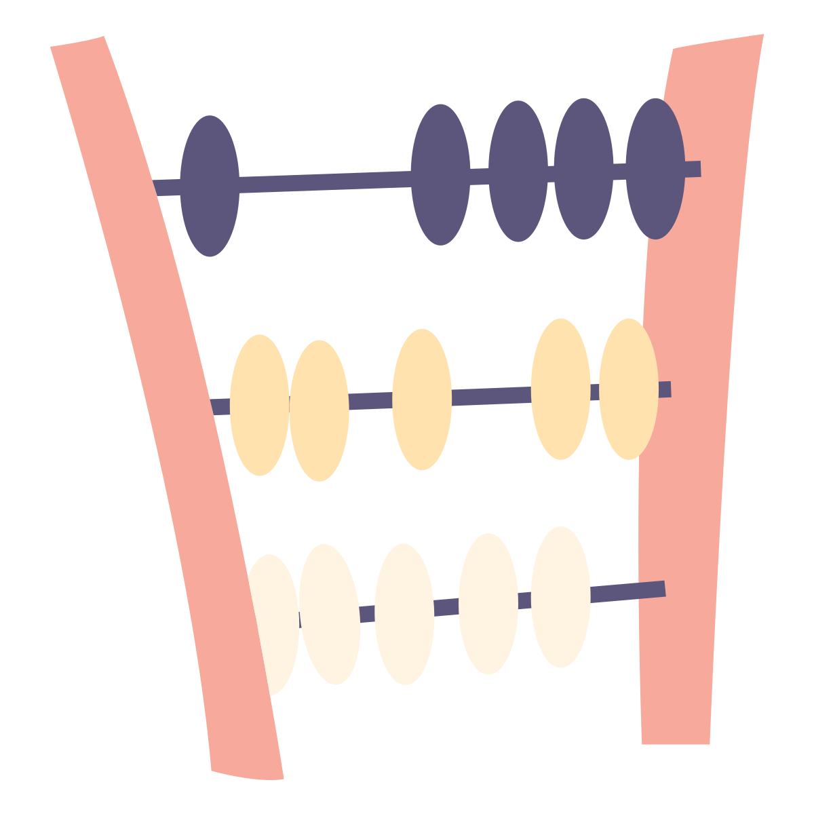

.. _guessing-games:

Guessing Games with Random Numbers and Loops
============================================

Our next step is how to loop a section of code. Most games "loop." They
repeat the same code over and over. For example the number guessing
game below loops for each guess that the user makes:

.. code-block:: text

    Hi! I'm thinking of a random number between 1 and 100.
    --- Attempt 1
    Guess what number I am thinking of: 50
    Too high.
    --- Attempt 2
    Guess what number I am thinking of: 25
    Too high.
    --- Attempt 3
    Guess what number I am thinking of: 17
    Too high.
    --- Attempt 4
    Guess what number I am thinking of: 9
    Too low.
    --- Attempt 5
    Guess what number I am thinking of: 14
    Too high.
    --- Attempt 6
    Guess what number I am thinking of: 12
    Too high.
    --- Attempt 7
    Guess what number I am thinking of: 10
    Too low.
    Aw, you ran out of tries. The number was 11.

(Code for this program is below: :ref:`number-guessing-game-code`)

Wait, what does this looping have to do with graphics and video games? A lot. Each
*frame* the game displays is one time through a loop. You may be familiar with
the frames-per-second (FPS) statistic that games show. The FPS represents the
number of times the computer updates the screen each second. The higher the
rate, the smoother the game. (Although an FPS rate past 60 is faster than
most screens can update, so there isn't much point to push it past that.)
The figure below shows the game Eve Online and a graph showing how many frames
per second the computer is able to display.

.. figure:: fps.png

    FPS in video games

The loop in these games works like the flowchart in the figure below. Despite the
complexities of modern games, the inside of this loop is similar to a
calculator program. Get user input. Perform calculations.
Output the result. In a video game, we try to repeat this up to 60 times per
second.

    Game loop

There can even be loops inside of other loops. A real "loop the loop." Take a
look at the "Draw Everything" box in Figure 4.2. This set of code loops through
and draws each object in the game. That loop is inside of the larger loop that
draws each frame of the game, which looks like the figure below.

.. figure:: draw_everything.svg

    Draw everything loop

There are two major types of loops in Python, ``for`` loops and ``while``
loops. If you want to repeat a certain number of times, use a ``for`` loop. If
you want to repeat until something happens (like the user hits the quit button)
then use a ``while`` loop.

For example, a ``for`` loop can be used to print all student records since the
computer knows how many students there are. A ``while`` loop would need to be used to
check for when a user hits the mouse button since the computer has no idea how
long it will have to wait.

For Loops
---------

The ``for`` loop example below runs the print statement five times. It could
just as easily run 100 or 1,000,000 times just by changing the 5 to the desired
number of times to loop. Note the similarities of how the ``for`` loop is written
to the if statement. Both end in a colon, and both use indentation to specify
which lines are affected by the statement.

.. code-block:: python
    :caption: Loop to print five times
    :linenos:

    for i in range(5):
        print("I will not chew gum in class.")

Output:

.. code-block:: text

    I will not chew gum in class.
    I will not chew gum in class.
    I will not chew gum in class.
    I will not chew gum in class.
    I will not chew gum in class.

The ``i`` on line 1 is a variable that keeps track of how many times the program has
looped. It is a new variable and can be named any legal variable name.
Programmers often use ``i`` as for the variable name, because the ``i`` is short for
*increment*. This variable helps track when the loop should end.

The ``range`` function controls how many times the code in the loop is run.
In this case, five times.

The next example code will print "Please," five times and "Can I go to the
mall?" only once. "Can I go to the mall?" is not indented so it is not part of
the for loop and will not print until the for loop completes.

.. code-block:: python
    :linenos:

    for i in range(5):
        print("Please,")
    print("Can I go to the mall?")

Output:

.. code-block:: text

    Please,
    Please,
    Please,
    Please,
    Please,
    Can I go to the mall?

This next code example takes the prior example and indents line 3. This change
will cause the program to print "Please," and "Can I go to the mall?" five
times. Since the statement has been indented "Can I go to the mall?" is now
part of the for loop and will repeat five times just like the word "Please,".

.. code-block:: python
    :linenos:

    for i in range(5):
        print("Please,")
        print("Can I go to the mall?")

Output:

.. code-block:: text

    Please,
    Can I go to the mall?
    Please,
    Can I go to the mall?
    Please,
    Can I go to the mall?
    Please,
    Can I go to the mall?
    Please,
    Can I go to the mall?

You aren't stuck using a specific number with the ``range`` function. This
example asks the user how many times to print using the ``input`` function
we talked about back in :ref:`input-function`.

.. code-block:: python
    :caption: Loop according to the user input
    :linenos:

    # Ask the user how many times to print
    repetitions = int(input("How many times should I repeat? "))

    # Loop that many times
    for i in range(repetitions):
        print("I will not chew gum in class.")

Or you could write a function, and take in the value by a parameter:

.. code-block:: python
    :caption: Loop according to a function parameter
    :linenos:

    def print_about_gum(repetitions):

        # Loop that many times
        for i in range(repetitions):
            print("I will not chew gum in class.")

    def main():
        print_about_gum(10)

    main()

The code below will print the numbers 0 to 9. Notice that the loop starts at
0 and does not include the number 10. It is natural to assume that
``range(10)`` would include 10, but it stops just short of it.

.. code-block:: python
    :caption: Print the numbers 0 to 9
    :linenos:

    for i in range(10):
        print(i)

Output:

.. code-block:: text

    0
    1
    2
    3
    4
    5
    6
    7
    8
    9

A program does not need to name the variable ``i``, it could be named something
else. For example a programmer might use ``line_number`` if she was processing a
text file.

If a programmer wants to go from 1 to 10 instead of 0 to 9, there are a couple
ways to do it. The first way is to send the ``range`` function two numbers instead
of one. The first number is the starting value, the second is just beyond the
ending value.

It does take some practice to get used to the idea that the for loop will
include the first number, but not the second number listed. The example below
specifies a range of (1, 11), and the numbers 1 to 10 are printed. The starting
number 1 is included, but not the ending number of 11.

.. code-block:: python
    :caption: Print the numbers 1 to 10, version 1
    :linenos:

    for i in range(1, 11):
        print(i)

Output:

.. code-block:: text

    1
    2
    3
    4
    5
    6
    7
    8
    9
    10

Another way to print the numbers 1 to 10 is to still use ``range(10)`` and
have the variable i go from 0 to 9. But just before printing out the variable
the programmer adds one to it. This also works to print the numbers 1 to 10.
Either method works just fine.

.. code-block:: python
    :caption: Print the numbers 1 to 10, version 2
    :linenos:

    # Print the numbers 1 to 10.
    for i in range(10):
        print(i + 1)

Counting By Numbers Other Than One
^^^^^^^^^^^^^^^^^^^^^^^^^^^^^^^^^^

If the program needs to count by 2's or use some other increment, that is easy.
Just like before there are two ways to do it. The easiest is to supply a third
number to the ``range`` function that tells it to count by 2's. The second way to
do it is to go ahead and count by 1's, but multiply the variable by 2. The code
example below shows both methods.

.. code-block:: python
    :caption: Two ways to print the even numbers 2 to 10
    :linenos:

    # Two ways to print the even numbers 2 to 10
    for i in range(2,12,2):
        print(i)

    for i in range(5):
        print((i + 1) * 2)

Output::

    2
    4
    6
    8
    10
    2
    4
    6
    8
    10

It is also possible to count backwards down towards zero by giving the ``range``
function a negative step. In the example below, start at 10, go down to but not
including 0, and do it by -1 increments. The hardest part of creating these
loops is to accidentally switch the start and end numbers. The program starts
at the larger value, so it goes first. Normal for loops that count up start
with the smallest value listed first in the ``range`` function.

.. code-block:: python
    :caption: Count down from 10 to 1
    :linenos:

    for i in range(10, 0, -1):
        print(i)

Output::

    10
    9
    8
    7
    6
    5
    4
    3
    2
    1

If the numbers that a program needs to iterate through don't form an easy
pattern, it is possible to pull numbers out of a list. (A full discussion
of lists is covered in a later chapter. This is just a preview of what you
can do.)

.. code-block:: python
    :caption: Print numbers out of a list
    :linenos:

    for i in [2,6,4,2,4,6,7,4]:
        print(i)

This prints::

    2
    6
    4
    2
    4
    6
    7
    4

Nesting Loops
^^^^^^^^^^^^^

By putting nesting one loop _inside_ another loop, we can expand our processing
beyone one dimension.

Try to predict what the code below will print. Then enter the code and see
if you are correct.

.. code-block:: python
    :linenos:

    # What does this print? Why?
    for i in range(3):
        print("a")
    for j in range(3):
        print("b")

This next block of code is almost identical to the one above. The second for
loop has been indented one tab stop so that it is now nested inside of the
first for loop. This changes how the code runs significantly. Try it and see.

.. code-block:: python
    :linenos:

    # What does this print? Why?
    for i in range(3):
        print("a")
        for j in range(3):
            print("b")

    print("Done")

I'm not going to tell you what the code does, go to a computer and see.

Keeping a Running Total
^^^^^^^^^^^^^^^^^^^^^^^

.. image:: printing_calculator.svg
    :width: 25%
    :class: right-image

A common operation in working with loops is to keep a running total. This
"running total" code pattern is used a lot in this book. Keep a running total
of a score, total a person's account transactions, use a total to find an
average, etc. You might want to bookmark this code listing because we'll
refer back to it several times. In the code below, the user enters five
numbers and the code totals up their values.

.. code-block:: python
    :caption: Keep a Running Total
    :linenos:

    total = 0
    for i in range(5):
        new_number = int(input("Enter a number: " ))
        total = total + new_number
    print("The total is: ", total)

Note that line 1 creates the variable total, and sets it to an initial amount
of zero. It is easy to forget the need to create and initialize the variable to
zero. Without it the computer will complain when it hits line 4. It doesn't
know how to add n``ew_number`` to total because total hasn't been given a value yet.

A common mistake is to use ``i`` to total instead of ``new_number``. Remember,
we are keeping a running total of the values entered by the user, not a running
total of the current loop count.

Speaking of the current loop count, we can use the loop count value to solve
some mathematical operations. For example:

.. math::

    s=\sum\limits_{n=1}^{100}n

If you aren't familiar with this type of formula, it is just a fancy way of
stating:

.. math::

    s=1+2+3+4+5 \ldots 98+99+100

The code below adds all the numbers from 1 to 100. It demonstrates a common
pattern where a running total is kept inside of a loop. This also uses a
separate variable sum to track the running total.

.. code-block:: python
    :caption: Sum all numbers 1 to 100
    :linenos:

    # What is the value of sum?
    total = 0
    for i in range(1, 101):
        total = total + i
    print(total)

Here's a different variation. This takes five numbers from the user and counts
the number of times the user enters a zero:

.. code-block:: python
    :linenos:

    total = 0
    for i in range(5):
        new_number = int(input( "Enter a number: "))
        if new_number == 0:
            total += 1
    print("You entered a total of", total, "zeros")

A programmer that understands the nested for loops and running totals should be
able to predict the output of the code below.

.. code-block:: python
    :linenos:

    # What is the value of a?
    a = 0
    for i in range(10):
        a = a + 1
    print(a)

    # What is the value of a?
    a = 0
    for i in range(10):
        a = a + 1
    for j in range(10):
        a = a + 1
    print(a)

    # What is the value of a?
    a = 0
    for i in range(10):
        a = a + 1
        for j in range(10):
            a = a + 1
    print(a)

Don't go over this section too fast. Give it a try and predict the output of
the code above. Then copy it into a Python program and run it to see if you
are right. If you aren't, figure out why.

Example for Loops
-----------------

This example code covers common for loops and shows how they work.

.. literalinclude:: for_loop_examples.py
    :caption: for_loop_examples.py
    :language: python
    :linenos:

While Loops
-----------

A ``for`` loop is used when a program knows it needs to repeat a block of code for
a certain number of times. A ``while`` loop is used when a program needs to loop
until a particular condition occurs.

Oddly enough, a while loop can be used anywhere a ``for`` loop is used. It can be
used to loop until an increment variable reaches a certain value. Why have a
``for`` loop if a while loop can do everything? The ``for`` loop is simpler to use and
code. A ``for`` loop that looks like this:

.. code-block:: python
    :caption: Using a ``for`` loop to print the numbers 0 to 9
    :linenos:

    for i in range(10):
        print(i)

Can be done with a ``while`` loop that looks like this:

.. code-block:: python
    :caption: Using a while loop to print the numbers 0 to 9
    :linenos:

    i = 0
    while i < 10:
        print(i)
        i = i + 1

Line 1 of the while loop sets up a "sentinel" variable that will be used to
count the number of times the loop has been executed. This happens
automatically in a ``for`` loop eliminating one line of code. Line 2 contains
the actual ``while`` loop. The format of the while loop is very similar to the
if statement. If the condition holds, the code in the loop will repeat.
Line 4 adds to the increment value. In a ``for`` loop this happens automatically,
eliminating another line of code. As one can see from the code, the for loop
is more compact than a ``while`` loop and is easier to read. Otherwise programs
would do everything with a ``while`` loop.

A common mistake is to confuse the ``for`` loop and the ``while`` loop. The code below
shows a programmer that can't quite make up his/her mind between a ``for`` loop or
a ``while`` loop.

.. code-block:: python
    :caption: Example of a confused loop
    :linenos:

    while range(10):
        print(i)

Don't use range with a ``while`` loop!

The ``range`` function only works with the ``for`` loop. Do not use it with the
``while`` loop!

Using Increment Operators
^^^^^^^^^^^^^^^^^^^^^^^^^

Increment operators are often used with ``while`` loops.
It is possible to short-hand the code:

.. code-block:: python

    i = i + 1

With the following:

.. code-block:: python

    i += 1

In the while loop it would look like:

.. code-block:: python
    :linenos:

    i = 0
    while i < 10:
        print(i)
        i += 1

This can be done with subtraction and multiplication as well. For example:

.. code-block:: python

    i *= 2

Is the same as:

.. code-block:: python

    i = i * 2

See if you can figure out what would this print:

.. code-block:: python

    i = 1
    while i <= 2 ** 32:
        print(i)
        i *= 2

Looping Until User Wants To Quit
^^^^^^^^^^^^^^^^^^^^^^^^^^^^^^^^

A very common operation is to loop until the user performs a request to quit:

.. code-block:: python
    :caption: Looping until the user wants to quit
    :linenos:

    quit = "n"
    while quit == "n":
        quit = input("Do you want to quit? ")

There may be several ways for a loop to quit. Using a Boolean variable to
trigger the event is a way of handling that. Here's an example:

.. code-block:: python
    :caption: Looping until the game is over or the user wants to quit
    :linenos:

    done = False
    while not done:
        quit = input("Do you want to quit? ")
        if quit == "y":
            done = True

        attack = input("Does your elf attack the dragon? ")
        if attack == "y":
            print("Bad choice, you died.")
            done = True

This isn't perfect though, because if the user says she wants to quit, the
code will still ask if she wants to attack the dragon. How could you fix this?

Here is an example of using a while loop where the code repeats until the
value gets close enough to zero:

.. code-block:: python
    :linenos:

    value = 0
    increment = 0.5
    while value < 0.999:
        value += increment
        increment *= 0.5
        print(value)

Common Problems With ``while`` Loops
^^^^^^^^^^^^^^^^^^^^^^^^^^^^^^^^^^^^

The programmer wants to count down from 10. What is wrong and how can it be fixed?

.. code-block:: python
    :linenos:

    i = 10
    while i == 0:
        print(i)
        i -= 1

What is wrong with this loop that tries to count to 10? What will happen when
it is run? How should it be fixed?

.. code-block:: python
    :linenos:

    i = 1
    while i < 10:
        print(i)

Example ``while`` Loops
-----------------------

Here's a program that covers the different uses of the while loop that we just talked about.

.. literalinclude:: while_loop_examples.py
    :caption: while_loop_examples.py
    :language: python
    :linenos:

The ``break`` And ``continue`` Statements
-----------------------------------------

If you are in the middle of a loop, and your code encounters a ``break`` statement, you'll immediately exit the
loop.

.. code-block:: python
    :linenos:

    while True: # Loop forever
        quit = input("Do you want to quit? ")
        if quit == "y":
            break

        attack = input("Does your elf attack the dragon? ")
        if attack == "y":
            print("Bad choice, you died.")
            break

If you are in the middle of a loop, and your code encounters a ``continue`` statement, you'll immediately be sent
back up to the top of the loop.

Random Numbers
--------------

Random numbers are heavily used in computer science for programs that involve
games or simulations.

The ``randrange`` Function
^^^^^^^^^^^^^^^^^^^^^^^^^^

By default, Python does not know how to make random numbers. It is necessary
to have Python import a code library that can create random numbers. So to use
random numbers, the first thing that should appear at the top of the program
is an import statement:

.. code-block:: python

    import random

Just like with pygame, it is important not to create a file with the same name
as what is being imported. Creating a file called random.py will cause Python
to start importing that file instead of the system library that creates random
numbers.

After this, random numbers can be created with the ``randrange`` function.
For example, this code creates random numbers from 0 to 49. By default the
lower bound is 0.

.. code-block:: python
    :caption: Random number from 0 to 49

    my_number = random.randrange(50)

The next code example generates random numbers from 100 to 200. Just like the
range function the second parameter specifies an upper-bound that is not
inclusive. Therefore if you want random numbers up to and including 200,
specify 201.

.. code-block:: python
    :caption: Random number from 100 to 200

    my_number = random.randrange(100, 201)

.. _random_chance:

Random Chance
^^^^^^^^^^^^^

Often in games there is a random chance of something happening. How do we program this? It isn't too hard.
Here's an example where we have a 1 in 5 chance of meeting a dragon:

.. code-block:: python
    :caption: Random Chance of Something Happening
    :linenos:

    import random

    # The line below will "roll the dice" 20 times.
    # Don't copy this 'for' loop into your program.
    # It is just here so we can try this example over and over.
    for i in range(20):

        # The line below will roll a random number 0-4.
        # If we roll a '0' then print that we encountered a dragon.
        if random.randrange(5) == 0:
            print("DRAGON!!!")
        else:
            print("No dragon.")

This code repeats twenty times. Inside the loop, we "roll the dice" and get a number between 0 and 4. If we
roll a 0, then we encounter a dragon. Otherwise we don't.

The ``random`` Function
^^^^^^^^^^^^^^^^^^^^^^^

All of the prior code generates integer numbers. If a floating point number
is desired, a programmer may use the ``random`` function.

The code below generates a random number from 0 to 1 such as
0.4355991106620656.

.. code-block:: python
    :caption: Random floating point number from 0 to 1

    my_number = random.random()

With some simple math, this number can be adjusted. For example, the code below generates a random floating point number between 10 and 15:

Random floating point number between 10 and 15

.. code-block:: python

    my_number = random.random() * 5 + 10

.. _number-guessing-game-code:

Number Guessing Game Example
^^^^^^^^^^^^^^^^^^^^^^^^^^^^

Here is the code for the number guessing game at the start of the chapter.

.. literalinclude:: number_guessing_game.py
    :emphasize-lines: 11-13, 22-24
    :language: python
    :linenos:

Mudball Example
^^^^^^^^^^^^^^^

This is a fun text-only game that two players can play. It uses a few concepts
we haven't covered yet.

.. literalinclude:: mudball.py
    :language: python
    :linenos:
