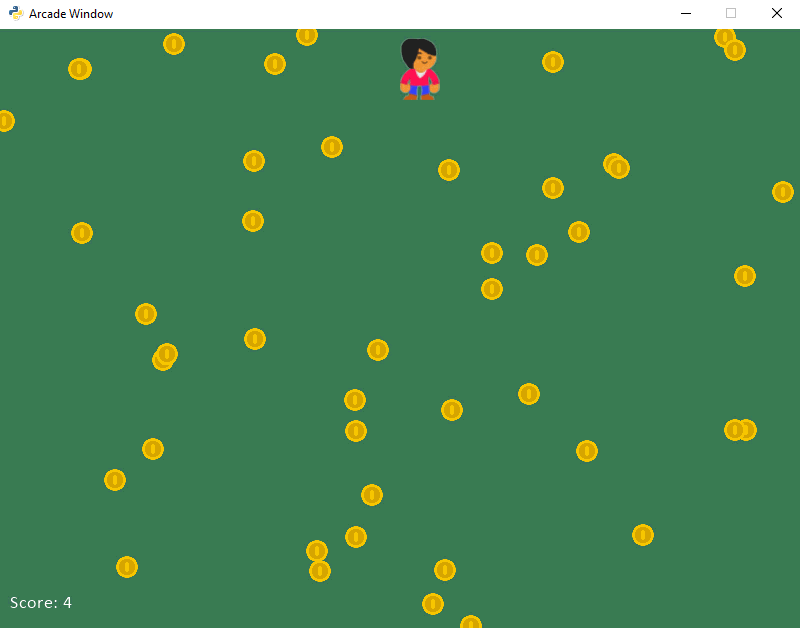
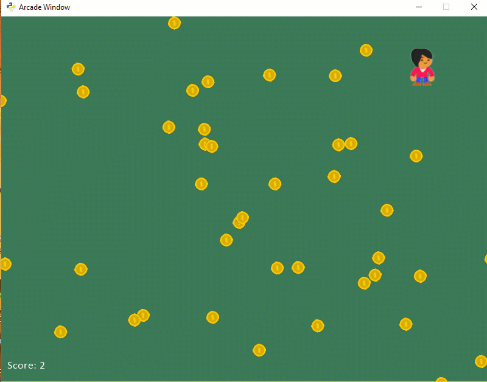
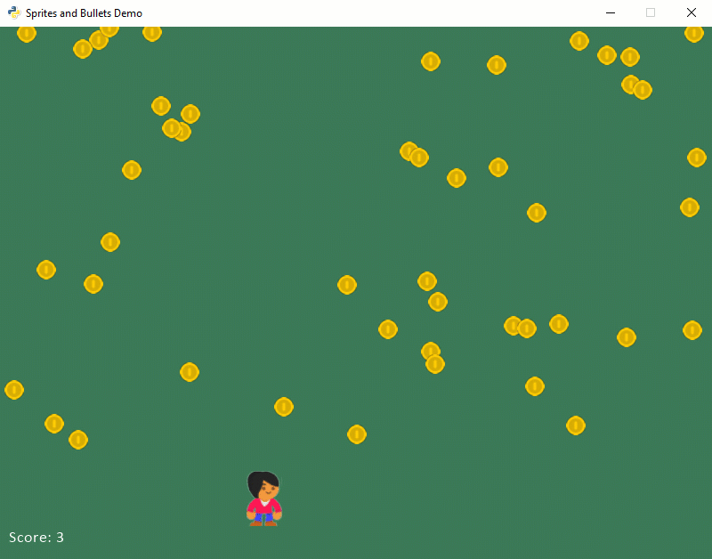

.. sectnum::
    :start: 11

.. _sprites:

Sprites
=======

Our games need support for handling objects that collide. Balls bouncing off
paddles, laser beams hitting aliens, or our favorite character collecting a
coin. All these examples require collision detection.

The Arcade library has support for sprites. A sprite is a two dimensional
image that is part of the larger graphical scene. Typically a sprite will
be some kind of object in the scene that will be interacted with like a car,
frog, or little plumber guy.

.. image:: sprite.png
	:width: 250px

Originally, video game consoles had built-in hardware support for sprites.
Now this specialized hardware support is no longer needed, but we still use
the term "sprite." The `history of sprites`_ is interesting, if you want to
read up more about it.

.. _history of sprites: https://en.wikipedia.org/wiki/Sprite_(computer_graphics)

Basic Sprites and Collisions
----------------------------

Let's step through an example program that uses sprites. This example shows how
to create a screen of sprites that are coins, and collect them using a sprite
that is a character image
controlled by the mouse as shown in the figure below. The program keeps "score"
on how many coins have been collected. The code for this example may be found at:

http://arcade.academy/examples/sprite_collect_coins.html

In this chapter, we'll step through that example.

	Example Sprite Game

Getting the Application Started
^^^^^^^^^^^^^^^^^^^^^^^^^^^^^^^

The first few lines of our program start off like other games we've done. We
import a couple libraries. Set a couple constants for the size of the screen,
and a new constant that we will use to scale our graphics to half their original
size.

.. code-block:: Python
    :caption: Start of our sprite example

	import random
	import arcade

	SPRITE_SCALING = 0.5

	SCREEN_WIDTH = 800
	SCREEN_HEIGHT = 600

	class MyApplication(arcade.Window):
	    # --- Class methods will go here

	window = MyApplication(SCREEN_WIDTH, SCREEN_HEIGHT)
	window.setup()

	arcade.run()

The Constructor
^^^^^^^^^^^^^^^

What's next? We need to add our methods to the ``MyApplication`` class.
We'll start with our ``__init__`` method. This is the method we use to
initialize our variables. Here it is:

.. code-block:: Python
    :caption: Constructor for MyApplication

    def __init__(self, width, height):

    	# Call the parent class initializer
        super().__init__(width, height)

        # Variables that will hold sprite lists
        self.all_sprites_list = None
        self.coin_list = None

        # Set up the player info
        self.player_sprite = None
        self.score = 0

        # Don't show the mouse cursor
        self.set_mouse_visible(False)

        # Set the background color
        arcade.set_background_color(arcade.color.AMAZON)

The variables we are creating:

* ``all_sprites_list``:  This is a special list that we will add all our sprites
  to. By having all the sprites in a single list, we can draw them all in a
  single command.
* ``coin_list``: This is a list of all the coins. We wille be checking if the
  player touches any sprite in this list.
* ``player_sprite``: This points to our player's sprite. It is the sprite
  we will move, and we'll check to see if it
* ``score``: This keeps track of our score.

We use a command built into the parent ``Window`` class called
``set_mouse_visible`` to make the mouse not visible. Finally we set the
background color.

The Setup Function
^^^^^^^^^^^^^^^^^^

Next up, we have a ``setup`` method. In the first code example, we have the
code that calls this function near the end: ``window.setup()``.

This setup code
could be moved into the ``__init__`` method. Why is it separate? Later on
if we want to add the ability to "play again", we can just call the ``setup``
function. If the code to set up the window is mixed with the code to set
up the game, then it is more difficult to program that functionality. Here
we start by keeping them separate.

.. code-block:: Python
    :caption: Setup method for our application

    def setup(self):
        """ Set up the game and initialize the variables. """

        # Sprite lists
        self.all_sprites_list = arcade.SpriteList()
        self.coin_list = arcade.SpriteList()

        # Set up the player
        self.score = 0
        self.player_sprite = arcade.Sprite("images/character.png", SPRITE_SCALING)
        self.player_sprite.center_x = 50
        self.player_sprite.center_y = 50
        self.all_sprites_list.append(self.player_sprite)

        for i in range(50):

            # Create the coin instance
            coin = arcade.Sprite("images/coin_01.png", SPRITE_SCALING / 3)

            # Position the coin
            coin.center_x = random.randrange(SCREEN_WIDTH)
            coin.center_y = random.randrange(SCREEN_HEIGHT)

            # Add the coin to the lists
            self.all_sprites_list.append(coin)
            self.coin_list.append(coin)

How does this code work?

First, we need some lists to hold our sprites. We could do something like
this:

.. code-block:: Python

    all_sprites_list = []

But wait! ``all_sprites_list`` is an instance variable that's part of our class.
we need to prepend it with ``self.``.

.. code-block:: Python

    self.all_sprites_list = []

However, the Arcade library has a class especially for handling sprite lists.
This class is called ``SpriteList``. So instead of creating an empty list with
``[]``, we will create a new instance of the ``SpriteList`` class:

.. code-block:: Python

    self.all_sprites_list = SpriteList()

Except that doesn't work. Why? ``SpriteList`` is in the Arcade library. We
need to prepend any reference to things in the Arcade library with ``arcade``
of course, so now we have:

.. code-block:: Python

    self.all_sprites_list = arcade.SpriteList()

We need a separate list for just coins. This list won't have the player. We also
need to reset our score to 0.

.. code-block:: Python

    self.coin_list = arcade.SpriteList()

    self.score = 0

Now we need to create out sprite. The name of the class that represents sprites
is called ``Sprite``. It takes two paramters. A path to the image we will be
using, and how big to scale it.

.. code-block:: Python

    self.player_sprite = arcade.Sprite("images/character.png", SPRITE_SCALING)

Ok, so if you are following along, you'll need to download the images. You
can right-click on the two images below and save them. The images come from
`kenney.nl`_ who has a lot of free and cheap game image assets that you can
use in your games.

.. _kenney.nl: http://kenney.nl/

.. figure:: character.png

    character.png

.. figure:: coin_01.png

    coin_01.png

Where should you save them? It depends. If you load your sprite with the code
below, the computer will look for the ``character.png`` image in the same
directory as your Python file. Save the image anywhere else, and it won't
be found.

.. code-block:: Python

    self.player_sprite = arcade.Sprite("character.png", SPRITE_SCALING)

I don't like putting my images with my code. By the time I finish a game there's
a lot of images, sounds, and other files all mixed together. Instead I like
to create subdirectories for images and sounds. You can do this by creating
a subdirectory called "images" and them prepending "images/" to your filename.

.. code-block:: Python

    self.player_sprite = arcade.Sprite("images/character.png", SPRITE_SCALING)

The On Draw Method
^^^^^^^^^^^^^^^^^^

How do we draw all our sprites? Really easy. We just override the ``on_draw``
method and call the ``draw`` method in our sprites list. That method will
loop throug all our sprites for us, and draw them.

.. code-block:: Python

    def on_draw(self):

            arcade.start_render()

            # Draw all the sprites.
            self.all_sprites_list.draw()

Woohoo! That was easy.

In addition to drawing the sprites, let's go ahead and
put the score on the screen:

.. code-block:: Python

    # Put the text on the screen.
    output = "Score: " + str(self.score)
    arcade.draw_text(output, 10, 20, arcade.color.WHITE, 14)

Rather than do that ``"Score: " + str(self.score)`` it is possible to do
print formatting if you are using Python 3.6 or later. We'll talk more about
print formatting later, but that code would look like:

.. code-block:: Python

    # Put the text on the screen.
    output = f"Score: {self.score}"
    arcade.draw_text(output, 10, 20, arcade.color.WHITE, 14)

There are three standards for how to format strings in Python, so that whole
subject is a bit confusing.

The On Mouse Motion Method
^^^^^^^^^^^^^^^^^^^^^^^^^^

Moving the player sprite with the mouse is easy. All sprites have instance
variables ``center_x`` and ``center_y``. Just change those values to the mouse's
x and y location to move the sprite.

.. code-block:: Python

    def on_mouse_motion(self, x, y, dx, dy):

        self.player_sprite.center_x = x
        self.player_sprite.center_y = y

The Animate Method
^^^^^^^^^^^^^^^^^^

Our ``animate`` method needs to do three things:

1. Update the sprites
2. Check to see if the player is touching any coins
3. Remove any coins colliding with the player, and update the score.

Each sprite has its own ``update`` method. This allows sprites to move and
animate its images. Right now, our sprite does not have this method. But we
will soon. Rather than call the ``update`` method of each sprite we have,
there is an ``update`` method in each sprite list that will call ``update``
on each sprite in the list. Therefore, just calling ``update`` with our
``all_sprites_list`` will cause all sprites to update.

.. code-block:: Python

    self.all_sprites_list.update()

How do we detect what coins are touching the player? We call the
``check_for_collision_with_list`` method. Pass it in our player sprite,
along with a list of all the coins. That function will return a list of
all colliding sprites. If no sprites collide, the list will be empty.

.. code-block:: Python

    # Generate a list of all sprites that collided with the player.
    hit_list = arcade.check_for_collision_with_list(self.player_sprite,
                                                    self.coin_list)

What do we do with this ``hit_list`` we get back? We loop through it. We add one
to the score for each sprite hit.

We also need to get rid of the sprite. The sprite class has a method called
``kill``. This method will remove the sprite from existance.

.. code-block:: Python

    # Loop through each colliding sprite, remove it, and add to the score.
    for coin in hit_list:
        coin.kill()
        self.score += 1

Here's the whole ``animate`` method put together:

.. code-block:: Python

    def animate(self, delta_time):
        """ Movement and game logic """

        # Call update on all sprites (The sprites don't do much in this
        # example though.)
        self.all_sprites_list.update()

        # Generate a list of all sprites that collided with the player.
        hit_list = arcade.check_for_collision_with_list(self.player_sprite,
                                                        self.coin_list)

        # Loop through each colliding sprite, remove it, and add to the score.
        for coin in hit_list:
            coin.kill()
            self.score += 1

Moving Sprites
--------------

How do we get sprites to move?
Start the examples from our original example here:

http://arcade.academy/examples/sprite_collect_coins.html

To customize our sprite's behavior, we need to subclass the ``Sprite`` class
with our own child class. This is easy:

.. code-block:: Python

    class Coin(arcade.Sprite):

We need to provide each sprite with a
``update`` method. The ``update`` method is automatically called to update
the sprite's position.

.. code-block:: Python

    class Coin(arcade.Sprite):

        def update(self):
            # Code to move goes here

Wait! We have a new class called Coin, but we aren't using it. Find in our
original code this line:

.. code-block:: Python

    coin = arcade.Sprite("images/coin_01.png", SPRITE_SCALING / 3)

See how it is creating an instance of ``Sprite``? We want to create an instance
of our new ``Coin`` class instead:

.. code-block:: Python

    coin = Coin("images/coin_01.png", SPRITE_SCALING / 3)

Now, how do we get the coin to move?

Moving down
^^^^^^^^^^^

To get the sprites to "fall" down the screen, we need to make their y location
smaller. This is easy. Over-ride ``update`` in the sprite and subtract from
y each frame:

.. code-block:: Python

    class Coin(arcade.Sprite):

        def update(self):
            self.center_y -= 1

This causes the coins to move down. But once they move off the screen they
keep going into negative-coordinate land. We can't see them any more. Sad.

.. figure:: coins_down_1.gif

    Coins moving down

We can get the coins to reset to the top with this code:

.. code-block:: Python

        def update(self):
            self.center_y -= 1
            if self.center_y < 0:
                self.center_y = SCREEN_HEIGHT

This code is a start. But it isn't great. If you have sharp eyes, the coins
don't slide off or slide on smoothly. That's because we aren't accounting for the
fact that coordinate is at the center. It isn't sliding all the way off before
we reset it.
We need to let the object center slide
into the negative, and we need to create the new object just above the screen:

If the object was 40 pixels high, then we could go 20 pixels above and below the
center:

.. code-block:: Python

    def update(self):
        self.center_y -= 1
        if self.center_y < -20:
            self.center_y = SCREEN_HEIGHT + 20

That works if our sprite is 40 high. But that's just a guess. Is there an
easier way? There is! Not only does a sprite have a ``center_y`` value, it also
has a ``top``, ``bottom``, ``left``, and ``right`` that we can set. So I can
check to see if the top of the sprite slides off the screen, and set the
sprite bottom to be at the top of the screen when it slides off:

.. code-block:: Python

    def update(self):
        self.center_y -= 1
        if self.top < 0:
            self.bottom = SCREEN_HEIGHT

The only problem with just resetting the coins to the top, is that they end up
in a repeating pattern. See the image below:

.. figure:: pattern.gif

    Coins in a repeating pattern

We can get rid of that pattern by randomizing a bit where the coins reappear:

.. code-block:: Python

    def update(self):
        self.center_y -= 1
        if self.top < 0:
            self.bottom = SCREEN_HEIGHT
            self.center_x = random.randrange(SCREEN_WIDTH)

Great! But when we collect all our coins, then we are just left with an empty
screen. How do we get more coins? Well, instead of killing the coin, we could
just move it above the screen so it appears again:

.. code-block:: Python

    for coin in hit_list:
        self.score += 1
        # coin.kill()
        coin.bottom = SCREEN_HEIGHT
        coin.center_x = random.randrange(SCREEN_WIDTH)

Although, now we've got the same code in two different spots. And because we
are only randomizing x, the coins tend to clump. So we can make this better
by creating a reset function and using it:

.. code-block:: Python

    class Coin(arcade.Sprite):

        def reset(self):
            self.bottom = SCREEN_HEIGHT + random.randrange(SCREEN_HEIGHT)
            self.center_x = random.randrange(SCREEN_WIDTH)

        def update(self):
            self.center_y -= 1
            if self.top < 0:
                self.reset

And then later:

.. code-block:: Python

        for coin in hit_list:
            self.score += 1
            coin.reset()

Bouncing Movement
-----------------

.. figure:: sprites_bouncing.gif

    Sprites Bouncing

.. literalinclude:: sprites_bouncing.py
    :caption: sprites_bouncing.py
    :language: python
    :linenos:

Circle Movement
---------------

    Sprites Moving in a Circle

.. literalinclude:: sprites_circle.py
    :caption: sprites_circle.py
    :language: python
    :linenos:

Bullets
-------

    Shooting Sprites

.. literalinclude:: sprites_bullet.py
    :caption: sprites_bullet.py
    :language: python
    :linenos:
