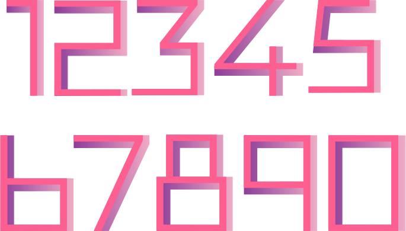
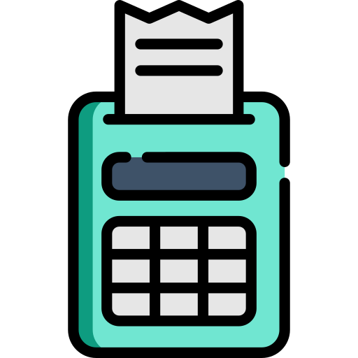

.. _for-loops:

For Loops
=========

.. image:: loop2.svg
    :width: 15%
    :class: right-image

In the last chapter, we added the ``if`` statement
to our skill set, enabling the computer to choose which
set of code to run. In this chapter we learn how to **loop**.
Rather than have our programs run straight though, we
can run a section of code however many times we like.

This chapter covers ``for`` loops which allow us to  loop a certain
number of times. The next chapter covers ``while`` loops which will loop
until a certain condition (such as game over) occurs.

Introduction to Looping
-----------------------

Most games loop. Most programs of *any* kind loop.
For example, think of the simple number guessing game.
One person thinks of a number from 1 to 100, and
a different person tries to guess it.

This is an easy game to program on the computer using
loops. Start with code that will take in a guess from the
user, and then tell the user if they are too high, too low, or
correct using the ``if`` statements we learned about in
the last chapter. Then, we just need to loop that code until
the user guess correctly, or runs out of guesses.

Here's an example run of just such a program:

.. code-block:: text

    Hi! I'm thinking of a random number between 1 and 100.
    --- Attempt 1
    Guess what number I am thinking of: 50
    Too high.
    --- Attempt 2
    Guess what number I am thinking of: 25
    Too high.
    --- Attempt 3
    Guess what number I am thinking of: 17
    Too high.
    --- Attempt 4
    Guess what number I am thinking of: 9
    Too low.
    --- Attempt 5
    Guess what number I am thinking of: 14
    Too high.
    --- Attempt 6
    Guess what number I am thinking of: 12
    Too high.
    --- Attempt 7
    Guess what number I am thinking of: 10
    Too low.
    Aw, you ran out of tries. The number was 11.

(The code for this program: :ref:`number-guessing-game-code`)

Wait, what does this simple text game have to do with advanced graphical
games? A lot.
You may be familiar with
the frames-per-second (FPS) statistic that games show. The FPS represents the
number of times the computer updates the screen each second.
Each *frame* in a video game is one time through a loop.  The higher the
rate, the smoother the game. (Although an FPS rate past 60 is faster than
most screens can update, so there's not much point to go faster.)
The figure below shows the game Eve Online and a graph showing how many frames
per second the computer displaying.

.. figure:: fps.png

    FPS in video games

The loop in these games works like the flowchart in the figure below.

.. figure:: game_loop.svg

    Game loop

Despite the
complexities of modern games, the inside of these loops all have three common steps:

1. Get user input.
2. Perform calculations.
3. Output the result.

In a video game, we try to repeat this 60 times per second.

There can even be loops *inside* of loops.
Take a look at the "Draw Everything" flowchart below.
This set of code loops through and draws each object in the game.
You can put this loop inside the larger loop that
draws each frame of the game (outputs the result).

.. figure:: draw_everything.svg

    Draw everything loop

There are two major types of loops in Python, ``for`` loops and ``while``
loops. If you want to repeat a certain number of times, use a ``for`` loop. If
you want to repeat until something happens (like the user hits the quit button)
then use a ``while`` loop.

For example, a ``for`` loop can be used to print all student records since the
computer knows how many students there are. A ``while`` loop would need to be used to
check for when a user hits the mouse button since the computer has no idea how
long it will have to wait.

For Loops
---------

.. image:: loop.svg
    :width: 20%
    :class: right-image

The ``for`` loop example below runs the ``print`` statement five times. It could
just as easily run 100 or 1,000,000 times by changing the 5 to the desired
number of times to loop. Note the similarities of how the ``for`` loop is written
to the ``if`` statement. Both end in a colon, and both use indentation to specify
which lines are affected by the statement.

.. code-block:: python
    :caption: Loop to print five times
    :linenos:

    for i in range(5):
        print("I will not chew gum in class.")

Output:

.. code-block:: text

    I will not chew gum in class.
    I will not chew gum in class.
    I will not chew gum in class.
    I will not chew gum in class.
    I will not chew gum in class.

The ``i`` on line 1 is a variable that keeps track of how many times the program has
looped. It is a new variable and can be named any legal variable name.
Programmers often use ``i`` as for the variable name, because the ``i`` is short for
*increment*. This variable helps track when the loop should end.

The ``range`` function controls how many times the code in the loop is run.
In this case, five times.

The next example code will print "Please," five times and "Can I go to the
mall?" only once. "Can I go to the mall?" is not indented so it is not part of
the ``for`` loop and will not print until the ``for`` loop completes.

.. code-block:: python
    :linenos:

    for i in range(5):
        print("Please,")
    print("Can I go to the mall?")

Output:

.. code-block:: text

    Please,
    Please,
    Please,
    Please,
    Please,
    Can I go to the mall?

This next code example takes the prior example and indents line 3. This change
will cause the program to print "Please," and "Can I go to the mall?" five
times. Since the statement has been indented "Can I go to the mall?" is now
part of the ``for`` loop and will repeat five times just like the word "Please,".

.. code-block:: python
    :linenos:

    for i in range(5):
        print("Please,")
        print("Can I go to the mall?")

Output:

.. code-block:: text

    Please,
    Can I go to the mall?
    Please,
    Can I go to the mall?
    Please,
    Can I go to the mall?
    Please,
    Can I go to the mall?
    Please,
    Can I go to the mall?

You aren't stuck using a specific number with the ``range`` function. This
next example asks the user how many times to print using the ``input`` function
we talked about last chapter in :ref:`input-function`.

.. code-block:: python
    :caption: Loop according to the user input
    :linenos:

    # Ask the user how many times to print
    repetitions = int(input("How many times should I repeat? "))

    # Loop that many times
    for i in range(repetitions):
        print("I will not chew gum in class.")

Or you could write a function, and take in the value by a parameter:

.. code-block:: python
    :caption: Loop according to a function parameter
    :linenos:

    def print_about_gum(repetitions):

        # Loop that many times
        for i in range(repetitions):
            print("I will not chew gum in class.")

    def main():
        print_about_gum(10)

    main()

You can use the increment variable in the ``for`` loop to track
your loop. Try running this code, which prints ``i``.

.. code-block:: python
    :caption: Print the numbers 0 to 9
    :linenos:

    for i in range(10):
        print(i)

With a range of 10, you might expect that the code prints the numbers 1 to 10.
It doesn't. It prints the numbers 0 to 9.
It is natural to assume that ``range(10)`` would include 10, but it doesn't.

.. code-block:: text

    0
    1
    2
    3
    4
    5
    6
    7
    8
    9

.. image:: mug.png
    :width: 20%
    :class: right-image

In computer programming, we typically start counting at zero rather
than one. Most computer languages use this convention.
An old computer joke is to get your friend a mug that says "World's
#1 programmer." Then get yourself a mug that says "World's #0
programmer."

If a programmer wants to go from 1 to 10 instead of 0 to 9, there are a couple
ways to do it. The first way is to send the ``range`` function two numbers instead
of one. The first number is the starting value, the second value we'll count up
to, but not equal to. Here's an example:

.. code-block:: python
    :caption: Print the numbers 1 to 10, version 1
    :linenos:

    for i in range(1, 11):
        print(i)

Give it a try. It should print the numbers 1 to 10 like so.

.. code-block:: text

    1
    2
    3
    4
    5
    6
    7
    8
    9
    10

It does take some practice to get used to the idea that the for loop *will*
include the first number, but *will not* include the second. The example
specifies a range of (1, 11), and the numbers 1 to 10 are printed. The starting
number 1 is included, but *not* the ending number of 11.

Another way to print the numbers 1 to 10 is to still use ``range(10)`` and
have the variable ``i`` go from 0 to 9. But just before printing out the variable,
add one to it. This also works to print the numbers 1 to 10, as shown in our next
example.

.. code-block:: python
    :caption: Print the numbers 1 to 10, version 2
    :linenos:

    # Print the numbers 1 to 10.
    for i in range(10):
        # Add one to i, just before printing
        print(i + 1)

Counting By Numbers Other Than One
^^^^^^^^^^^^^^^^^^^^^^^^^^^^^^^^^^

.. image:: counting.svg
    :width: 25%
    :class: right-image

If the program needs to count by 2's or use some other increment, that is easy.
Just like before there are two ways to do it. The easiest is to supply a third
number to the ``range`` function that tells it to count by 2's.
See this code example:

.. code-block:: python
    :linenos:

    # One way to print the even numbers 2 to 10
    for i in range(2, 12, 2):
        print(i)

The second way to
do it is to go ahead and count by 1's, but multiply the variable by 2
as shown in the next example.

.. code-block:: python
    :linenos:

    # Another way to print the numbers 2 to 10
    for i in range(5):
        print((i + 1) * 2)

Both examples will output the numbers 2 to 10::

    2
    4
    6
    8
    10

.. image:: rocket.svg
    :width: 12%
    :class: right-image

It is also possible to count *backwards*--for example 10 down to zero.
This is done by giving the ``range``
function a negative step. In the example below we start at 10 and go down to, but not
including, zero. (To include zero, the second number would need to be a -1.)
We do this by an increment of -1.

.. code-block:: python
    :caption: Count down from 10 to 1
    :linenos:

    for i in range(10, 0, -1):
        print(i)

The hardest part of creating these backwards-counting loops is to accidentally
switch the start and end numbers.
Normal ``for`` loops that count *up* start with the *smallest* value.
When you count *down* the program starts at the *largest* value.

Output::

    10
    9
    8
    7
    6
    5
    4
    3
    2
    1

If the numbers that a program needs to iterate through don't form an easy
pattern, it is possible to pull numbers out of a list as shown in the next example.
A full discussion of lists will be covered in :ref:`intro-to-lists`.

.. code-block:: python
    :caption: Print numbers out of a list
    :linenos:

    for item in [2, 6, 4, 2, 4, 6, 7, 4]:
        print(item)

This prints::

    2
    6
    4
    2
    4
    6
    7
    4

Nesting Loops
-------------

.. image:: nesting.svg
    :width: 25%
    :class: right-image

By putting nesting one loop *inside* another loop, we can expand our processing
beyond one dimension.

Try to predict what the following code, which is not nested, below will print.
Then enter the code and see if you are correct.

.. code-block:: python
    :linenos:

    # What does this print? Why?
    for i in range(3):
        print("a")
    for j in range(3):
        print("b")

Did you guess right? It will print three a's and 3 b's.

This next block of code is almost identical to the one above. The second ``for``
loop has been indented one tab stop so that it is now nested *inside* of the
first ``for`` loop. It is a **nested** loop.
This changes how the code runs significantly. Look at it and see if you can
guess how the output will change.

.. code-block:: python
    :linenos:

    # What does this print? Why?
    for i in range(3):
        print("a")
        for j in range(3):
            print("b")

    print("Done")

Did you guess right? We still get three a's, but now we get nine b's. The
inside ``for`` loop is run three times.

Complicated? Not really.
You've already *lived* a loop like this. This is how a clock works.
The 1-12 hour is the outside loop, and the 0-59 minute is the inside loop.
Later on in :ref:`clock-example` we'll show how to format the output and
make it look good.

.. code-block:: python
    :linenos:

    # Loop from 1:00 to 12:59
    for hour in range(1, 13):
        for minute in range(60):
            print(hour, minute)

Keep a Running Total
--------------------

A common operation in working with loops is to keep a running total. This
"running total" code pattern is used a lot in this book. Keep a running total
of a score, total a person's account transactions, use a total to find an
average, etc. You might want to bookmark this code listing because we'll
refer back to it several times. In the code below, the user enters five
numbers and the code totals up their values.

.. code-block:: python
    :caption: Keep a Running Total
    :linenos:

    total = 0
    for i in range(5):
        new_number = int(input("Enter a number: " ))
        total = total + new_number
    print("The total is: ", total)

Note that line 1 creates the variable ``total``, and sets it to an initial amount
of zero. It is easy to forget the need to create and initialize the variable to
zero. Without it the computer will complain when it hits line 4. It doesn't
know how to add ``new_number`` to total because ``total`` hasn't been given a value yet.

A common mistake is to use ``i`` to total instead of ``new_number``. Remember,
we are keeping a running total of the values entered by the user, not a running
total of the current loop count.

Speaking of the current loop count, we can use the loop count value to solve
some mathematical operations. For example:

.. math::

    s=\sum\limits_{n=1}^{100}n

If you aren't familiar with this type of formula, it is just a fancy way of
stating:

.. math::

    s=1+2+3+4+5 \ldots 98+99+100

The code below adds all the numbers from 1 to 100. It is another demonstration of
a running total is kept inside of a loop.

.. code-block:: python
    :caption: Sum all numbers 1 to 100
    :linenos:

    # What is the value of sum?
    total = 0
    for i in range(1, 101):
        total = total + i
    print(total)

Here's a different variation. This takes five numbers from the user and counts
the number of times the user enters a zero:

.. code-block:: python
    :linenos:

    total = 0
    for i in range(5):
        new_number = int(input( "Enter a number: "))
        if new_number == 0:
            total += 1
    print("You entered a total of", total, "zeros")

A programmer that understands the nested for loops and running totals should be
able to predict the output of the code below.

.. code-block:: python
    :linenos:

    # What is the value of a?
    a = 0
    for i in range(10):
        a = a + 1
    print(a)

    # What is the value of a?
    a = 0
    for i in range(10):
        a = a + 1
    for j in range(10):
        a = a + 1
    print(a)

    # What is the value of a?
    a = 0
    for i in range(10):
        a = a + 1
        for j in range(10):
            a = a + 1
    print(a)

Don't go over this section too fast. Give it a try and predict the output of
the code above. Then copy it into a Python program and run it to see if you
are right. If you aren't, figure out why.

Review
------

In this chapter we talked about looping and how to use``for`` loops
to count up or down by any number.
We learned how loops can be **nested**. We learned how we can use a loop
to keep a running total.

Review Questions
^^^^^^^^^^^^^^^^

Open up an empty file and practice writing code that use ``for`` loops to:

1. Print "Hi" 10 times.
2. Print 'Hello' 5 times and 'There' once
3. Print 'Hello' and 'There' 5 times, on different lines
4. Print the numbers 0 to 9
5. Two ways to print the numbers 1 to 10
6. Two ways to print the even numbers 2 to 10
7. Count down from 10 down to 1 (not zero)
8. Print numbers out of a list

Answer the following:

9. What does this print? Why?

.. code-block:: python

    for i in range(3):
        print("a")
        for j in range(3):
            print("b")

10. What is the value of a?

.. code-block:: python

    a = 0
    for i in range(10):
        a = a + 1
    print(a)

11. What is the value of a?

.. code-block:: python

    a = 0
    for i in range(10):
        a = a + 1
    for j in range(10):
        a = a + 1
    print(a)

12. What is the value of a?

.. code-block:: python

    a = 0
    for i in range(10):
        a = a + 1
        for j in range(10):
            a = a + 1
    print(a)

13. What is the value of sum?

.. code-block:: python

    total = 0
    for i in range(1, 101):
        total = total + i

On-line Review Problems
^^^^^^^^^^^^^^^^^^^^^^^

Practice on-line by completing the ``for`` loop problems starting with ``04`` available here:

https://repl.it/community/classrooms/174286

