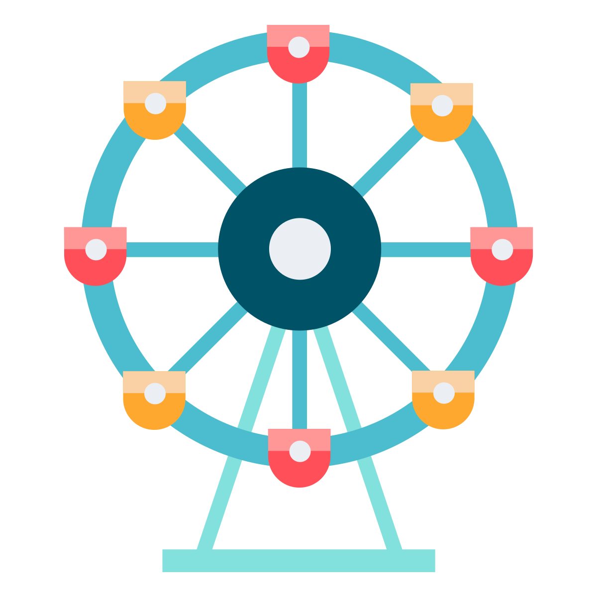

.. _while-loops:

While Loops
===========

A ``for`` loop is used when a program knows it needs to repeat a block of code for
a certain number of times. A ``while`` loop is used when a program needs to loop
*until a particular condition occurs*. Use a ``for`` loop when you know how many
times to loop, use a ``while`` loop when you want to loop until something
happens.

Oddly enough, a ``while`` loop can be used anywhere a ``for`` loop is used
because OUR "condition" can be a count. That is, the ``while`` loop can
loop until a variable reaches a certain value. If that's the case, why have a
``for`` loop if a ``while`` loop can do everything?

Because the ``for`` loop is simpler to use and code.
A ``for`` loop that looks like this:

.. code-block:: python
    :caption: Using a ``for`` loop to print the numbers 0 to 9
    :linenos:

    for i in range(10):
        print(i)

...can be done with a ``while`` loop that looks like this:

.. code-block:: python
    :caption: Using a while loop to print the numbers 0 to 9
    :linenos:

    i = 0
    while i < 10:
        print(i)
        i = i + 1

.. image:: carousel.svg
    :width: 25%
    :class: right-image

Line 1 of the while loop sets up a "sentinel" variable that will be used to
count the number of times the loop has been executed. This happens
automatically in a ``for`` loop eliminating one line of code. Line 2 contains
the actual ``while`` loop. The format of the while loop is very similar to the
if statement. If the condition holds, the code in the loop will repeat.
Line 4 adds to the increment value. In a ``for`` loop this happens automatically,
eliminating another line of code. As one can see from the code, the for loop
is more compact than a ``while`` loop and is easier to read. Otherwise programs
would do everything with a ``while`` loop.

A common mistake is to confuse the ``for`` loop and the ``while`` loop. The code below
shows a programmer that can't quite make up his/her mind between a ``for`` loop or
a ``while`` loop.

.. code-block:: python
    :caption: Example of a confused loop
    :linenos:

    while range(10):
        print(i)

Don't use range with a ``while`` loop!

The ``range`` function only works with the ``for`` loop. Do not use it with the
``while`` loop!

Using Increment Operators
-------------------------

Remember that back in Back in :ref:`increment_decrement_operators`
we learned it is possible to short-hand the code:

.. code-block:: python

    i = i + 1

With the following:

.. code-block:: python

    i += 1

In the ``while`` loop it would look like:

.. code-block:: python
    :linenos:

    i = 0
    while i < 10:
        print(i)
        i += 1

This can be done with subtraction and multiplication as well. For example:

.. code-block:: python

    i *= 2

Is the same as:

.. code-block:: python

    i = i * 2

See if you can figure out what would this print:

.. code-block:: python

    i = 1
    while i <= 2 ** 32:
        print(i)
        i *= 2

Common Problems With ``while`` Loops
------------------------------------

The programmer wants to count down from 10. What is wrong and how can it be fixed?

.. code-block:: python
    :linenos:

    i = 10
    while i == 0:
        print(i)
        i -= 1

What is wrong with this loop that tries to count to 10? What will happen when
it is run? How should it be fixed?

.. code-block:: python
    :linenos:

    i = 1
    while i < 10:
        print(i)

Looping Until User Wants To Quit
--------------------------------

A very common operation is to loop until the user performs a request to quit.
Give this code example a try.

.. code-block:: python
    :caption: Looping until the user wants to quit
    :linenos:

    quit = "n"
    while quit == "n":
        quit = input("Do you want to quit? ")

It isn't perfect. It will loop if the use types "no", "N", or "NO!". She must
type exactly "n". Go back and review :ref:`text-comparisons` if you want to
make the match more flexible.

.. image:: dragon.svg
    :width: 25%
    :class: right-image

We can expand this pattern to use a Boolean ``done`` variable to trigger an
exit from the loop.

Here's an example where we can exit the game by quitting, or attacking the
dragon:

.. code-block:: python
    :caption: Looping until the game is over or the user wants to quit
    :linenos:

    done = False
    while not done:
        quit = input("Do you want to quit? ")
        if quit == "y":
            done = True

        attack = input("Does your elf attack the dragon? ")
        if attack == "y":
            print("Bad choice, you died.")
            done = True

This isn't perfect though, because if the user says she wants to quit, the
code will *still* ask if she wants to attack the dragon. How could you fix this?
Take a look at this example.

.. code-block:: python
    :caption: Looping until the game is over or the user wants to quit
    :linenos:

    done = False
    while not done:
        quit = input("Do you want to quit? ")
        if quit == "y":
            done = True

        if not done:
            attack = input("Does your elf attack the dragon? ")
            if attack == "y":
                print("Bad choice, you died.")
                done = True

        if not done:
            attack = input("Does your elf attempt to steal the gold? ")
            if attack == "y":
                print("Bad choice, you died.")
                done = True

The ``break`` And ``continue`` Statements
-----------------------------------------

.. image:: stop.svg
    :width: 15%
    :class: right-image

If you are in the middle of a ``for`` or ``while`` loop, and your code
encounters a ``break`` statement, you'll immediately exit the loop.

.. code-block:: python
    :linenos:

    while True: # Loop forever
        quit = input("Do you want to quit? ")
        if quit == "y":
            break

        attack = input("Does your elf attack the dragon? ")
        if attack == "y":
            print("Bad choice, you died.")
            break

        attack = input("Does your elf attempt to steal the gold? ")
        if attack == "y":
            print("Bad choice, you died.")
            break

If you are in the middle of a loop, and your code encounters a ``continue``
statement, you'll immediately be sent back up to the top of the loop.

Review
------

Review Questions
^^^^^^^^^^^^^^^^

1. Write a ``while`` loop that will run the same as the following code:

.. code-block:: python

    for i in range(10):
        print(i)

2. What will this code print, and why?

.. code-block:: python

    i = 1
    while i <= 2**32:
        print(i)
        i *= 2

3. Write a simple loop that asks the user if they wants to keep looping. Loop
   until they says "no".

4. The programmer wants to count down from 10. What is wrong and how to fix it?

.. code-block:: python

    i = 10
    while i == 0:
        print(i)
        i -= 1

5. What is wrong with this loop that tries to count to 10? What will happen when it is run?

.. code-block:: python

    i = 1
    while i < 10:
        print(i)

On-line Review Problems
^^^^^^^^^^^^^^^^^^^^^^^

Practice on-line by completing the ``while`` loop problems starting with ``04`` available here:

https://repl.it/community/classrooms/174286