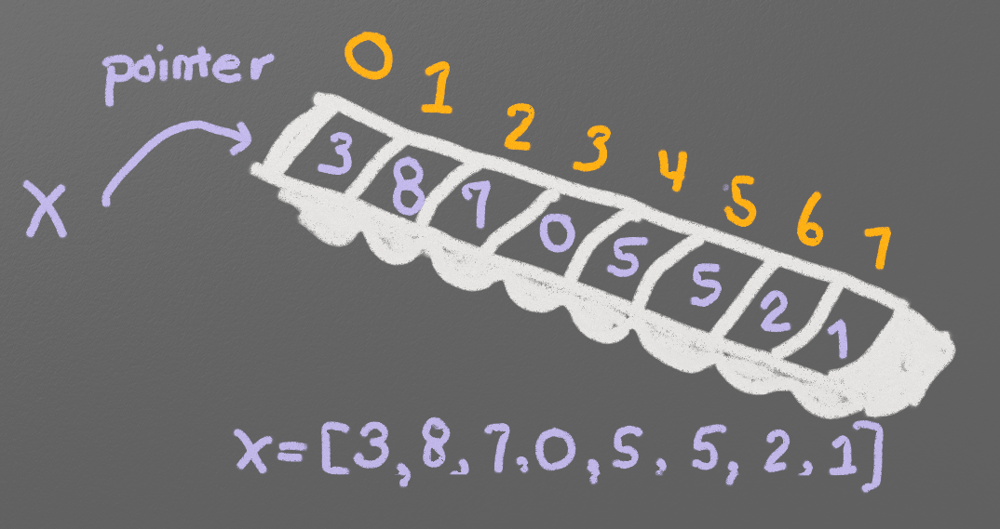
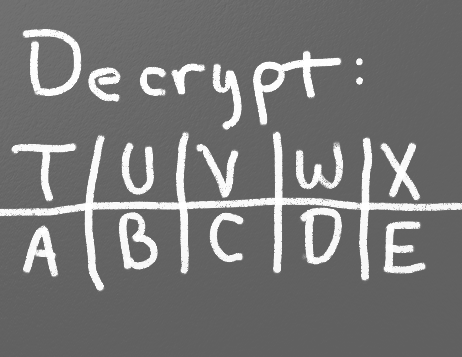

.. _intro-to-lists:

Introduction to Lists
=====================

Data Types
----------

.. raw:: html

    <iframe width="560" height="315" src="https://www.youtube.com/embed/yi67wRWH_mc" frameborder="0" allowfullscreen></iframe>

So far this book has shown four types of data:

* String (a string is short for "string of characters," which normal people think of as text.)
* Integer
* Floating point
* Boolean

Python can display what type of data a value is with the ``type`` function.
For example, what type of data is a ``3``?

.. code-block:: python

    # Print the type of data a 3 is:
    print(type(3))

.. code-block:: text

   <class 'int'>

This type function isn't useful for other programming in this book, but it is
good to demonstrate the types of data introduced so far.

Here we set x to the four types of data we've used so far, and call the
``type`` command to see how Python classifies that data:

.. code-block:: python

    x = 3
    print("x =", x, "and is of type:", type(x))

    x = 3.145
    print("x =", x, "and is of type:", type(x))

    x = "Hi there"
    print("x =", x, "and is of type:", type(x))

    x = True
    print("x =", x, "and is of type:", type(x))

The output:

.. code-block:: text

    x = 3 and is of type: <class 'int'>
    x = 3.145 and is of type: <class 'float'>
    x = Hi there and is of type: <class 'str'>
    x = True and is of type: <class 'bool'>

.. note::

    More than one coin to collect? Use a list!

The two new types of data introduced in this chapter are Lists and Tuples.
Lists are similar to another data structure called an array. A list can be
resized, but an array can not. A course in data structures will teach you the
details, but it that is beyond the scope of this book. Try running the following
commands in the interactive Python shell and see what is displayed:

.. code-block:: python

    x = (2, 3, 4, 5)
    print("x =", x, "and is of type:", type(x))

    x = [2, 3, 4, 5]
    print("x =", x, "and is of type:", type(x))

The output:

.. code-block:: text

    x = (2, 3, 4, 5) and is of type: <class 'tuple'>
    x = [2, 3, 4, 5] and is of type: <class 'list'>

Working With Lists
------------------

You've created grocery lists, to-do lists, bucket lists, but how do you create
a list on the computer?

.. figure:: grocery_list.png

    Even computers use lists

To create a list and print it out,
try the following:

.. code-block:: python

    x = [1, 2]
    print(x)

The output:

.. code-block:: text

    [1, 2]

To print an individual element in a list:

.. code-block:: python

    print(x[0])

The output:

.. code-block:: text

    1

This number with the item's location is called the index. Note that list
locations start at zero. So a list or array with 10 elements does not have an
element in spot [10]. Just spots [0] through [9]. It can be very confusing to
create an list of 10 items and then not have an item 10, but most computer
languages start counting at 0 rather than 1.

Think of a list as an ice cube tray that holds numbers, as shown in Figure 7.2.
The values are stored inside each tray spot, and written on the side of the tray
are numbers starting at zero that identify the location of each spot.

.. attention::

    Don't mix the index and the value!

Remember, there are two sets of numbers to consider when working with a list of
numbers: the position and the value. The position, also known as index, refers
to where a value is. The value is the actual number stored at that location.
When working with a list or array, make sure to think if you need the location
or the value.

It is easy to get the value given the location, but it is harder to get the
location given the value. Chapter 15 is dedicated to answering how to find the
location of a particular value.

    Lists are like ice cube trays

A program can assign new values to an individual element in a list. In the case
below, the first spot at location zero (not one) is assigned the number 22.

.. code-block:: python

    x = [1, 2]
    print(x)

    x[0] = 22
    print(x)

.. code-block:: text

    [1, 2]
    [22, 2]

Also, a program can create a "tuple." This data type works just like a list, but
with two differences. First, it is created with parentheses rather than square
brackets. Second, it is not possible to change the tuple once created. See below:

.. code-block:: python

    x = (1, 2)
    print(x)

    x[0] = 22
    print(x)

.. code-block:: text

    [1, 2]
    Traceback (most recent call last):
      File "<pyshell#18>", line 4, in <module>
        x[0] = 22
    TypeError: 'tuple' object does not support item assignment

As can be seen from the output of the code above, we can't assign an item in
the tuple a new value. Why would we want this limitation? First, the computer
can run faster if it knows the value won't change. Second, some lists we don't
want to change, such as a list of RGB colors for red. The color red doesn't
change, therefore an immutable tuple is a better choice.

.. _create-an-empty-list:

Create an Empty List
--------------------

Occasionally we need to create a list that is empty. We'll use this in a bit when
we start with an empty list and build on it. How do I create an empty list? Easy:

.. code-block:: python

    # Create an empty list
    my_list = []

Iterating (Looping) Through a List
----------------------------------

.. raw:: html

    <iframe width="560" height="315" src="https://www.youtube.com/embed/t8isonIrfRM?ecver=1" frameborder="0" allowfullscreen></iframe>

If a program needs to iterate through each item in a list, such as to print it
out, there are two types of for loops that can do this.

The first method to iterate through each item in a loop is by using a "for-each"
loop. This type of loop takes a collection of items, and loops the code once
per item. It will take a copy of the item and store it in a variable for
processing.

The format of the command:

.. code-block:: python

    for item_variable in list_name:

Here are some examples:

.. code-block:: python

    my_list = [101, 20, 10, 50, 60]
    for item in my_list:
        print(item)

.. code-block:: text

    101
    20
    10
    50
    60

Programs can store strings in lists too:

.. code-block:: python

    my_list = ["Spoon", "Fork", "Knife"]
    for item in my_list:
        print(item)

.. code-block:: text

    Spoon
    Knife
    Fork

Lists can even contain other lists. This iterates through each item in the main
list, but not in sublists.

.. code-block:: python

    my_list = [[2, 3], [4, 3], [6, 7]]
    for item in my_list:
        print(item)

.. code-block:: text

    [2,3]
    [4,3]
    [6,7]

The other way to iterate through a list is to use an index variable and
directly access the list rather than through a copy of each item. To use an
index variable, the program counts from 0 up to the length of the list. If there
are ten elements, the loop must go from 0 to 9 for a total of ten elements.

The length of a list may be found by using the len function. Combining that with
the range function allows the program to loop through the entire list.

.. code-block:: python

    my_list = [101, 20, 10, 50, 60]
    for index in range(len(my_list)):
        print(my_list[index])

.. code-block:: text

    101
    20
    10
    50
    60

This method is more complex, but is also more powerful. Because we are working
directly with the list elements, rather than a copy, the list can be modified.
The for-each loop does not allow modification of the original list.

Looping With Both An Index And Element
--------------------------------------

If you want both the index, like a ``for i in range`` gives you, and the element, like a ``for item in my_list``
gives you, the proper Python-ic way to use the ``enumerate`` function like this:

.. code-block:: python

    for index, value in enumerate(my_list):
        print(index, value)

.. _append_to_list:

Adding to a List
----------------

New items may be added to a list (but not a tuple) by using the append command.
For example:

.. code-block:: python

    my_list = [2, 4, 5, 6]
    print(my_list)
    my_list.append(9)
    print(my_list)

.. code-block:: text

    [2, 4, 5, 6]
    [2, 4, 5, 6, 9]

.. raw:: html

    <iframe width="560" height="315" src="https://www.youtube.com/embed/L0FnUlifwWQ?ecver=1" frameborder="0" allowfullscreen></iframe>

Side note: If performance while appending is a concern, it is very important to
understand how a list is being implemented. For example, if a list is
implemented as an *array data type*, then appending an item to the list is a lot
like adding a new egg to a full egg carton. A new egg carton must be built with
thirteen spots. Then twelve eggs are moved over. Then the thirteenth egg is
added. Finally the old egg carton is recycled. Because this can happen behind
the scenes in a function, programmers may forget this and let the computer do
all the work. It would be more efficient to simply tell the computer to make an
egg carton with enough spots to begin with. Thankfully, Python does not
implement a list as an array data type. But it is important to pay attention to
your next semester data structures class and learn how all of this works.

To create a list from scratch, it is necessary to create a blank list and then
use the ``append`` function to build it based upon user input:

.. code-block:: python
    :caption: Creating a list of numbers from user input

    # Create an empty list
    my_list = []

    for i in range(5):
        user_input = input( "Enter an integer: ")
        user_input = int(user_input)
        my_list.append(user_input)
        print(my_list)

.. code-block:: text

    Enter an integer: 4
    [4]
    Enter an integer: 5
    [4, 5]
    Enter an integer: 3
    [4, 5, 3]
    Enter an integer: 1
    [4, 5, 3, 1]
    Enter an integer: 8
    [4, 5, 3, 1, 8]

If a program needs to create an array of a specific length, all with the same
value, a simple trick is to use the following code:

.. code-block:: python
    :caption: Create an array with 100 zeros
    :linenos:

    # Create an array with 100 zeros.
    my_list = [0] * 100

Summing or Modifying a List
---------------------------

.. raw:: html

    <iframe width="560" height="315" src="https://www.youtube.com/embed/JKiW4K4Dm0c?ecver=1" frameborder="0" allowfullscreen></iframe>

Creating a running total of an array is a common operation. Here's how it is done:

.. code-block:: python
    :caption: Summing the values in a list v1
    :linenos:

    # Copy of the array to sum
    my_list = [5, 76, 8, 5, 3, 3, 56, 5, 23]

    # Initial sum should be zero
    list_total = 0

    # Loop from 0 up to the number of elements
    # in the array:
    for index in range(len(my_list)):
        # Add element 0, next 1, then 2, etc.
        list_total += my_list[index]

    # Print the result
    print(list_total)

The same thing can be done by using a ``for`` loop to iterate the array, rather
than count through a range:

.. code-block:: python
    :linenos:
    :caption: Summing the values in a list v2

    # Copy of the array to sum
    my_list = [5, 76, 8, 5, 3, 3, 56, 5, 23]

    # Initial sum should be zero
    list_total = 0

    # Loop through array, copying each item in the array into
    # the variable named item.
    for item in my_list:
        # Add each item
        list_total += item

    # Print the result
    print(list_total)

Numbers in an array can also be changed by using a ``for`` loop:

.. code-block:: python
    :linenos:
    :caption: Doubling all the numbers in a list

    # Copy of the array to modify
    my_list = [5, 76, 8, 5, 3, 3, 56, 5, 23]

    # Loop from 0 up to the number of elements
    # in the array:
    for index in range(len(my_list)):
        # Modify the element by doubling it
        my_list[index] = my_list[index] * 2

    # Print the result
    print(my_list)

However version 2 does not work at doubling the values in an array. Why?
Because ``item`` is a *copy* of an element in the array. The code below doubles the
copy, not the original array element.

.. code-block:: python
    :linenos:
    :caption: Bad code that doesn't double all the numbers in a list

    # Copy of the array to modify
    my_list = [5, 76, 8, 5, 3, 3, 56, 5, 23]

    # Loop through each element in myArray
    for item in my_list:
        # This doubles item, but does not change the array
        # because item is a copy of a single element.
        item = item * 2

    # Print the result
    print(my_list)

Slicing Strings
---------------

.. raw:: html

    <iframe width="560" height="315" src="https://www.youtube.com/embed/06hozIAwNc4?ecver=1" frameborder="0" allowfullscreen></iframe>

Strings are actually lists of characters. They can be treated like lists with
each letter a separate item. Run the following code with both versions of x:

.. code-block:: python
    :linenos:
    :caption: Accessing a string as a list

    x = "This is a sample string"
    #x = "0123456789"

    print("x=", x)

    # Accessing a single character
    print("x[0]=", x[0])
    print("x[1]=", x[1])

    # Accessing from the right side
    print("x[-1]=", x[-1])

    # Access 0-5
    print("x[:6]=", x[:6])
    # Access 6
    print("x[6:]=", x[6:])
    # Access 6-8
    print("x[6:9]=", x[6:9])

Strings in Python may be used with some of the mathematical operators. Try the
following code and see what Python does:

.. code-block:: python
    :linenos:
    :caption: Adding and multiplying strings

    a = "Hi"
    b = "There"
    c = "!"
    print(a + b)
    print(a + b + c)
    print(3 * a)
    print(a * 3)
    print((a * 2) + (b * 2))

It is possible to get a length of a string. It is also possible to do this with
any type of array.

.. code-block:: python
    :linenos:
    :caption: Getting the length of a string or list

    a = "Hi There"
    print(len(a))

    b = [3, 4, 5, 6, 76, 4, 3, 3]
    print(len(b))

Since a string is an array, a program can iterate through each character element
just like an array:

.. code-block:: python

    for character in "This is a test.":
        print(character)

Exercise: Starting with the following code:

.. code-block:: python
    :linenos:

    months = "JanFebMarAprMayJunJulAugSepOctNovDec"
    n = int(input("Enter a month number: "))

Print the three month abbreviation for the month number that the user enters.
(Calculate the start position in the string, then use the info we just learned
to print out the correct substring.)

Secret Codes
------------

This code prints out every letter of a string individually:

.. code-block:: python
    :linenos:

    plain_text = "This is a test. ABC abc"

    for c in plain_text:
        print(c, end=" ")

.. raw:: html

    <iframe width="560" height="315" src="https://www.youtube.com/embed/sxFIxD8Gd3A?ecver=1" frameborder="0" allowfullscreen></iframe>

Computers do not actually store letters of a string in memory; computers store
a series of numbers. Each number represents a letter. The system that computers
use to translate numbers to letters is called *Unicode*. The full name for the
encoding is Universal Character Set Transformation Format 8-bit, usually
abbreviated ``UTF-8``.

The Unicode chart covers the Western alphabet using the numbers 0-127. Each
Western letter is represented by one byte of memory. Other alphabets, like
Cyrillic, can take multiple bytes to represent each letter. A partial copy of
the Unicode chart is below:

+-------+-----------+-------+-----------+-------+-----------+-------+-----------+
| Value | Character | Value | Character | Value | Character | Value | Character |
+-------+-----------+-------+-----------+-------+-----------+-------+-----------+
| 40    | (         | 61    | =         | 82    | R         | 103   | g         |
+-------+-----------+-------+-----------+-------+-----------+-------+-----------+
| 41    | )         | 62    | >         | 83    | S         | 104   | h         |
+-------+-----------+-------+-----------+-------+-----------+-------+-----------+
| 42    | *         | 63    | ?         | 84    | T         | 105   | i         |
+-------+-----------+-------+-----------+-------+-----------+-------+-----------+
| 43    | +         | 64    | @         | 85    | U         | 106   | j         |
+-------+-----------+-------+-----------+-------+-----------+-------+-----------+
| 44    | ,         | 65    | A         | 86    | V         | 107   | k         |
+-------+-----------+-------+-----------+-------+-----------+-------+-----------+
| 45    | -         | 66    | B         | 87    | W         | 108   | l         |
+-------+-----------+-------+-----------+-------+-----------+-------+-----------+
| 46    | .         | 67    | C         | 88    | X         | 109   | m         |
+-------+-----------+-------+-----------+-------+-----------+-------+-----------+
| 47    | /         | 68    | D         | 89    | Y         | 110   | n         |
+-------+-----------+-------+-----------+-------+-----------+-------+-----------+
| 48    | 0         | 69    | E         | 90    | Z         | 111   | o         |
+-------+-----------+-------+-----------+-------+-----------+-------+-----------+
| 49    | 1         | 70    | F         | 91    | [         | 112   | p         |
+-------+-----------+-------+-----------+-------+-----------+-------+-----------+
| 50    | 2         | 71    | G         | 92    | \         | 113   | q         |
+-------+-----------+-------+-----------+-------+-----------+-------+-----------+
| 51    | 3         | 72    | H         | 93    | ]         | 114   | r         |
+-------+-----------+-------+-----------+-------+-----------+-------+-----------+
| 52    | 4         | 73    | I         | 94    | ^         | 115   | s         |
+-------+-----------+-------+-----------+-------+-----------+-------+-----------+
| 53    | 5         | 74    | J         | 95    | _         | 116   | t         |
+-------+-----------+-------+-----------+-------+-----------+-------+-----------+
| 54    | 6         | 75    | K         | 96    | \`        | 117   | u         |
+-------+-----------+-------+-----------+-------+-----------+-------+-----------+
| 55    | 7         | 76    | L         | 97    | a         | 118   | v         |
+-------+-----------+-------+-----------+-------+-----------+-------+-----------+
| 56    | 8         | 77    | M         | 98    | b         | 119   | w         |
+-------+-----------+-------+-----------+-------+-----------+-------+-----------+
| 57    | 9         | 78    | N         | 99    | c         | 120   | x         |
+-------+-----------+-------+-----------+-------+-----------+-------+-----------+
| 58    | :         | 79    | O         | 100   | d         | 121   | y         |
+-------+-----------+-------+-----------+-------+-----------+-------+-----------+
| 59    | ;         | 80    | P         | 101   | e         | 122   | z         |
+-------+-----------+-------+-----------+-------+-----------+-------+-----------+
| 60    | <         | 81    | Q         | 102   | f         |       |           |
+-------+-----------+-------+-----------+-------+-----------+-------+-----------+

For more information about ASCII (which has the same values as Unicode for the
Western alphabet) see:

http://en.wikipedia.org/wiki/ASCII

For a video that explains the beauty of Unicode, see here:

http://hackaday.com/2013/09/27/utf-8-the-most-elegant-hack

This next set of code converts each of the letters in the prior example to its
ordinal value using UTF-8:

.. code-block:: python

    plain_text = "This is a test. ABC abc"

    for c in plain_text:
        print(ord(c), end=" ")

This next program takes each UTF-8 value and adds one to it. Then it prints the
new UTF-8 value, then converts the value back to a letter.

.. code-block:: python

    plain_text = "This is a test. ABC abc"

    for c in plain_text:
        x = ord(c)
        x = x + 1
        c2 = chr(x)
        print(c2, end="")

The next code listing takes each UTF-8 value and adds one to it, then converts
the value back to a letter.

.. image:: encrypt.png

.. code-block:: python
    :linenos:
    :caption: simple_encryption.py

    # Sample Python/Pygame Programs
    # Simpson College Computer Science
    # http://programarcadegames.com/
    # http://simpson.edu/computer-science/

    # Explanation video: http://youtu.be/sxFIxD8Gd3A

    plain_text = "This is a test. ABC abc"

    encrypted_text = ""
    for c in plain_text:
        x = ord(c)
        x = x + 1
        c2 = chr(x)
        encrypted_text = encrypted_text + c2
    print(encrypted_text)

Finally, the last code takes each UTF-8 value and subtracts one from it, then
converts the value back to a letter. By feeding this program the output of the
previous program, it serves as a decoder for text encoded by the prior example.

.. code-block:: python
    :linenos:
    :caption: simple_decryption.py

    # Sample Python/Pygame Programs
    # Simpson College Computer Science
    # http://programarcadegames.com/
    # http://simpson.edu/computer-science/

    # Explanation video: http://youtu.be/sxFIxD8Gd3A

    encrypted_text = "Uijt!jt!b!uftu/!BCD!bcd"

    plain_text = ""
    for c in encrypted_text:
        x = ord(c)
        x = x - 1
        c2 = chr(x)
        plain_text = plain_text + c2
    print(plain_text)

Associative Arrays
------------------

Python is not limited to using numbers as an array index. It is also possible
to use an associative array. An associative array works like this:

.. code-block:: python
    :linenos:

    # Create an empty associative array
    # (Note the curly braces.)
    x = {}

    # Add some stuff to it
    x["fred"] = 2
    x["scooby"] = 8
    x["wilma"] = 1

    # Fetch and print an item
    print(x["fred"])

You won't really need associative arrays for this class, but I think it is
important to point out that it is possible.

