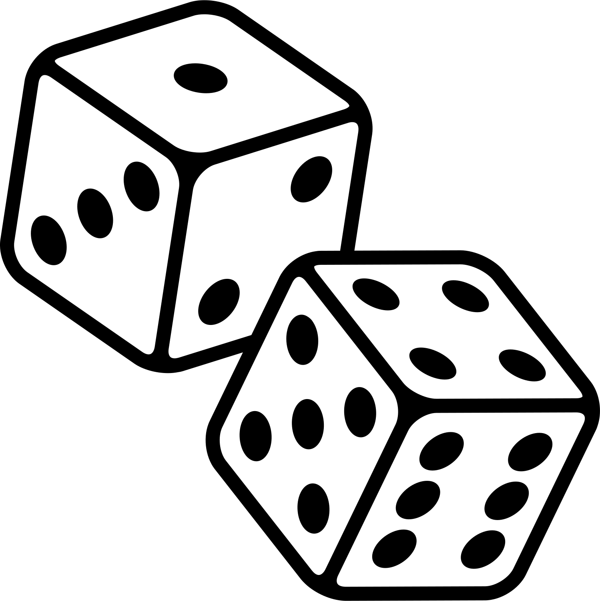

.. _random-numbers:

Random Numbers
==============

Now if our games do the same thing each time the game runs, that's
not very interesting. At the end of this chapter we'll introduce
**random numbers**. That is, we can have the computer roll the
dice to change up the game each time we run it.

Random numbers are heavily used in computer science for programs that involve
games or simulations.

The ``randrange`` Function
^^^^^^^^^^^^^^^^^^^^^^^^^^

By default, Python does not know how to make random numbers. It is necessary
to have Python import a code library that can create random numbers. So to use
random numbers, the first thing that should appear at the top of the program
is an import statement:

.. code-block:: python

    import random

Just like with pygame, it is important not to create a file with the same name
as what is being imported. Creating a file called random.py will cause Python
to start importing that file instead of the system library that creates random
numbers.

After this, random numbers can be created with the ``randrange`` function.
For example, this code creates random numbers from 0 to 49. By default the
lower bound is 0.

.. code-block:: python
    :caption: Random number from 0 to 49

    my_number = random.randrange(50)

The next code example generates random numbers from 100 to 200. Just like the
range function the second parameter specifies an upper-bound that is not
inclusive. Therefore if you want random numbers up to and including 200,
specify 201.

.. code-block:: python
    :caption: Random number from 100 to 200

    my_number = random.randrange(100, 201)

.. _random_chance:

Random Chance
^^^^^^^^^^^^^

Often in games there is a random chance of something happening. How do we program this? It isn't too hard.
Here's an example where we have a 1 in 5 chance of meeting a dragon:

.. code-block:: python
    :caption: Random Chance of Something Happening
    :linenos:

    import random

    # The line below will "roll the dice" 20 times.
    # Don't copy this 'for' loop into your program.
    # It is just here so we can try this example over and over.
    for i in range(20):

        # The line below will roll a random number 0-4.
        # If we roll a '0' then print that we encountered a dragon.
        if random.randrange(5) == 0:
            print("DRAGON!!!")
        else:
            print("No dragon.")

This code repeats twenty times. Inside the loop, we "roll the dice" and get a number between 0 and 4. If we
roll a 0, then we encounter a dragon. Otherwise we don't.

The ``random`` Function
^^^^^^^^^^^^^^^^^^^^^^^

All of the prior code generates integer numbers. If a floating point number
is desired, a programmer may use the ``random`` function.

The code below generates a random number from 0 to 1 such as
0.4355991106620656.

.. code-block:: python
    :caption: Random floating point number from 0 to 1

    my_number = random.random()

With some simple math, this number can be adjusted. For example, the code below generates a random floating point number between 10 and 15:

Random floating point number between 10 and 15

.. code-block:: python

    my_number = random.random() * 5 + 10

.. _number-guessing-game-code:

Number Guessing Game Example
^^^^^^^^^^^^^^^^^^^^^^^^^^^^

Here is the code for the number guessing game at the start of the chapter.

.. literalinclude:: number_guessing_game.py
    :emphasize-lines: 11-13, 22-24
    :language: python
    :linenos:

Mudball Example
^^^^^^^^^^^^^^^

This is a fun text-only game that two players can play. It uses a few concepts
we haven't covered yet.

.. literalinclude:: mudball.py
    :language: python
    :linenos:

