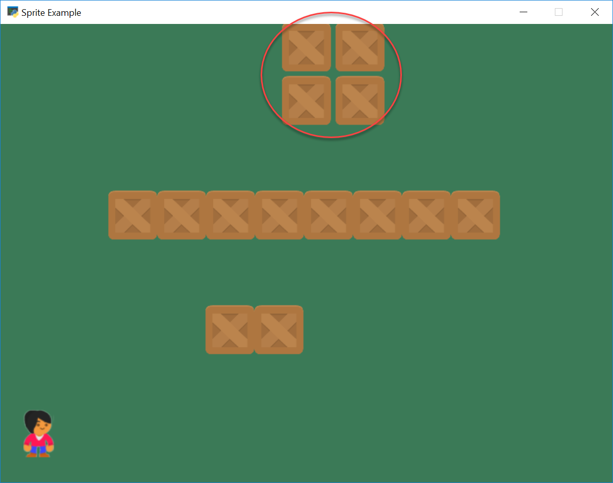

.. _sprites-and-walls:

Sprites and Walls
=================

(Note: Show how to place individual blocks. Blocks in a row, in a column. Use a list.)

Setup
-----

Many games with sprites often have "walls" that the character can't move
through. There are rather straight-forward to create.

To begin with, let's get a couple images. Our character, and a box that will
act as a blocking wall. Both images are from `kenney.nl`_.

.. _kenney.nl: http://kenney.nl/

.. figure:: images/character.png
    :width: 50px

    images/character.png

.. figure:: images/boxCrate_double.png
    :width: 50px

    images/boxCrate_double.png

Start with a default file:

.. literalinclude:: start_file.py
    :caption: sprite_move_walls.py start
    :language: python
    :linenos:

In the ``__init__`` method, let's create some variables to hold our sprites:

.. code-block:: python

    # Sprite lists
    self.all_sprites_list = None
    self.wall_list = None

    # Set up the player
    self.player_sprite = None

    # This variable holds our simple "physics engine"
    self.physics_engine = None

In the ``setup`` method, let's create our sprite lists:

.. code-block:: python

    # Sprite lists
    self.all_sprites_list = arcade.SpriteList()
    self.wall_list = arcade.SpriteList()

Then reset the score and create the player:

.. code-block:: python

    # Reset the score
    self.score = 0

    # Create the player
    self.player_sprite = arcade.Sprite("images/character.png", SPRITE_SCALING_PLAYER)
    self.player_sprite.center_x = 50
    self.player_sprite.center_y = 64
    self.all_sprites_list.append(self.player_sprite)

Then go ahead and draw everything in our ``on_draw``:

.. code-block:: python

    def on_draw(self):
        arcade.start_render()
        self.all_sprites_list.draw()

Run the program and make sure it works.

.. image:: just_player.png

Individually Placing Walls
--------------------------
In our ``setup`` method, we can position individual boxes to be used as "walls":

.. code-block:: python

    # Manually create and position a box at 300, 200
    wall = arcade.Sprite("images/boxCrate_double.png", SPRITE_SCALING_BOX)
    wall.center_x = 300
    wall.center_y = 200
    self.wall_list.append(wall)
    self.all_sprites_list.append(wall)

    # Manually create and position a box at 364, 200
    wall = arcade.Sprite("images/boxCrate_double.png", SPRITE_SCALING_BOX)
    wall.center_x = 364
    wall.center_y = 200
    self.wall_list.append(wall)
    self.all_sprites_list.append(wall)

Go ahead and try it out. It should look like:

.. image:: with_two_boxes.png

Full listing below:

.. literalinclude:: step_2.py
    :caption: sprite_move_walls.py Step 2
    :language: python
    :linenos:

Placing Walls With A Loop
-------------------------

In our ``setup`` method, we can create a row of box sprites using a ``for``
loop. In the code below, our y value is always 350, and we change the x value
from 173 to 650. We put a box every 64 pixels because each box happens to be
64 pixels wide.

.. code-block:: python

    # Place boxes inside a loop
    for x in range(173, 650, 64):
        wall = arcade.Sprite("images/boxCrate_double.png", SPRITE_SCALING_BOX)
        wall.center_x = x
        wall.center_y = 350
        self.wall_list.append(wall)
        self.all_sprites_list.append(wall)

.. image:: boxes_loop.png

Placing Walls With A List
-------------------------

You could even create a list of coordinates, and then just loop through that list creating walls:

.. code-block:: python

    # --- Place walls with a list
    coordinate_list = [[400, 500],
                       [470, 500],
                       [400, 570],
                       [470, 570]]

    # Loop through coordinates
    for coordinate in coordinate_list:
        wall = arcade.Sprite("images/boxCrate_double.png", SPRITE_SCALING_BOX)
        wall.center_x = coordinate[0]
        wall.center_y = coordinate[1]
        self.wall_list.append(wall)
        self.all_sprites_list.append(wall)

Full listing below:

.. literalinclude:: step_3.py
    :caption: sprite_move_walls.py Step 3
    :language: python
    :linenos:

Physics Engine
--------------

First, we need to hook the keyboard up to the player:

.. code-block:: python

    def on_key_press(self, key, modifiers):
        """Called whenever a key is pressed. """

        if key == arcade.key.UP:
            self.player_sprite.change_y = MOVEMENT_SPEED
        elif key == arcade.key.DOWN:
            self.player_sprite.change_y = -MOVEMENT_SPEED
        elif key == arcade.key.LEFT:
            self.player_sprite.change_x = -MOVEMENT_SPEED
        elif key == arcade.key.RIGHT:
            self.player_sprite.change_x = MOVEMENT_SPEED

    def on_key_release(self, key, modifiers):
        """Called when the user releases a key. """

        if key == arcade.key.UP or key == arcade.key.DOWN:
            self.player_sprite.change_y = 0
        elif key == arcade.key.LEFT or key == arcade.key.RIGHT:
            self.player_sprite.change_x = 0

Now, we need to add a way to stop the player from running into walls.

The Arcade Library has a built in "physics engine." A physics engine handles
the interactions between the virtual physical objects in the game.
For example, a physics engine might be several balls running into each other,
a character sliding down a hill, or a car making a turn on the road.

Physics engines have made impressive gains on what they can simulate. For our
game, we'll just keep things simple and make sure our character can't walk
through walls.

We'll create variable to hold our physics engine in the ``__init__``:

.. code-block:: python

    # This variable holds our simple "physics engine"
    self.physics_engine = None

We can create the actual physics engine in our ``setup`` method with the following
code:

.. code-block:: python

    self.physics_engine = arcade.PhysicsEngineSimple(self.player_sprite, self.wall_list)

This identifies the player character (``player_sprite``), and a list of sprites
(``wall_list``) that the player character isn't allowed to pass through.

Before, we updated all the sprites with a ``self.all_sprites_list.update()``
command. With the physics engine, we will instead update the sprites by using
the physics engine's update:

.. code-block:: python

    def update(self, delta_time):
        self.physics_engine.update()

The simple physics engine follows the following algorithm:

* Move the player in the x direction according to the player's ``change_x``
  value.
* Check the player against the wall list and see if there are any collisions.
* If the player is colliding:

    * If the player is moving right, set the player's right edge to the wall's
      left edge.
    * If the player is moving left, set the player's left edge to the wall's
      right edge.
    * If the player isn't moving left or right, print out a message that we
      are confused how we hit something when we aren't moving.

* Then we just do the same thing, except with the y coordinates.

You can see the `physics engine source code`_ on GitHub.

.. _physics engine source code: https://github.com/pvcraven/arcade/blob/master/arcade/physics_engines.py

Here's the full example:

.. literalinclude:: step_4.py
    :caption: sprite_move_walls.py
    :language: python
    :linenos:

Using a View Port for Scrolling
-------------------------------

What if one screen isn't enough to hold your maze of walls? We can have a
world that is larger than just our window. We do this by adjusting the
*view port*. Normally coordinate (0, 0) is the lower left corner of our screen.
We can change that! We could have an entire world stretch from (0, 0) to
(3000, 3000), and have a smaller view port that was 800x640 that scrolled
around that.

The command for using the view port is ``set_viewport``. This command takes
four arguments. The first two are the left and bottom boundaries of the window.
By default these are zero. That is why (0, 0) is in the lower left of the
screen. The next two commands are the top and right coordinates of the screen.
By default these are the screen width and height, minus one. So an 800
pixel-wide window would have x-coordinates from 0 - 799.

A command like this would shift the whole "view" of the window 200 pixels to
the right:

.. code-block:: python

    arcade.set_viewport(200, 0, 200 + SCREEN_WIDTH - 1, SCREEN_HEIGHT - 1)

So with a 800 wide pixel window, we would show x-coordinates 200 - 999 instead
of 0 - 799.

Instead of hard-coding the shift at 200 pixels, we need to use a variable
and have rules around when to shift the view. In our next example, we will
create two new instance variables in our application class that hold the left
and bottom coordinates for our view port. We'll default to zero.

.. code-block:: python

    self.view_left = 0
    self.view_bottom = 0

We are also going to create two new constants. We don't want the player to
reach the edge of the screen before we start scrolling. Because then the player
would have no idea where she is going. In our example we will set a "margin" of
40 pixels. When the player is 40 pixels from the edge of the screen, we'll move
the view port so she can see at least 40 pixels around her.

.. code-block:: python

    VIEWPORT_MARGIN = 40

Next, in our update method, we need to see if the user has moved too close to
the edge of the screen and we need to update the boundaries.

.. code-block:: python

    # Keep track of if we changed the boundary. We don't want to call the
    # set_viewport command if we didn't change the view port.
    changed = False

    # Scroll left
    left_bndry = self.view_left + VIEWPORT_MARGIN
    if self.player_sprite.left < left_bndry:
        self.view_left -= left_bndry - self.player_sprite.left
        changed = True

    # Scroll right
    right_bndry = self.view_left + SCREEN_WIDTH - VIEWPORT_MARGIN
    if self.player_sprite.right > right_bndry:
        self.view_left += self.player_sprite.right - right_bndry
        changed = True

    # Scroll up
    top_bndry = self.view_bottom + SCREEN_HEIGHT - VIEWPORT_MARGIN
    if self.player_sprite.top > top_bndry:
        self.view_bottom += self.player_sprite.top - top_bndry
        changed = True

    # Scroll down
    bottom_bndry = self.view_bottom + VIEWPORT_MARGIN
    if self.player_sprite.bottom < bottom_bndry:
        self.view_bottom -= bottom_bndry - self.player_sprite.bottom
        changed = True

    # Make sure our boundaries are integer values. While the view port does
    # support floating point numbers, for this application we want every pixel
    # in the view port to map directly onto a pixel on the screen. We don't want
    # any rounding errors.
    self.view_left = int(self.view_left)
    self.view_bottom = int(self.view_bottom)

    # If we changed the boundary values, update the view port to match
    if changed:
        arcade.set_viewport(self.view_left,
                            SCREEN_WIDTH + self.view_left - 1,
                            self.view_bottom,
                            SCREEN_HEIGHT + self.view_bottom - 1)

The full example is below:

.. literalinclude:: step_5.py
    :caption: sprite_move_scrolling.py
    :language: python
    :linenos:
