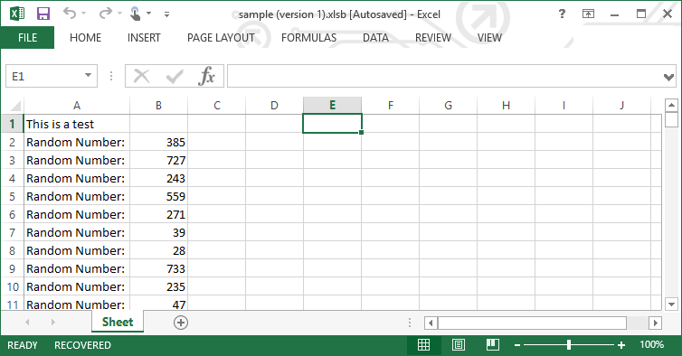
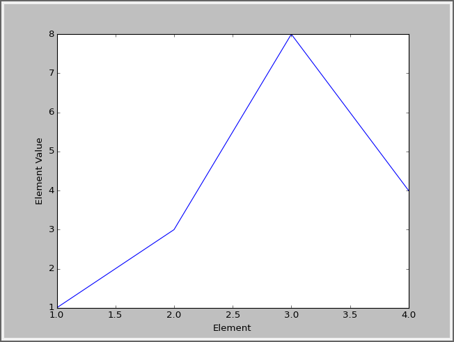
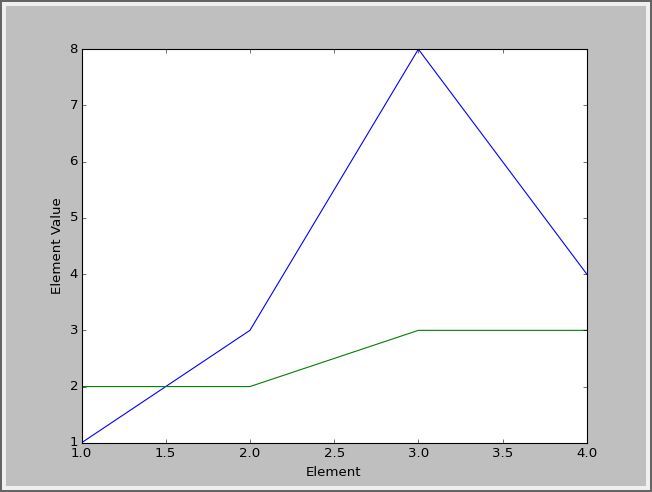
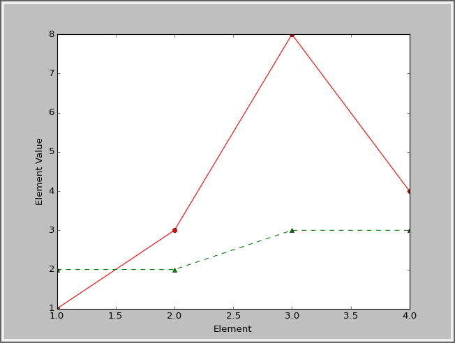
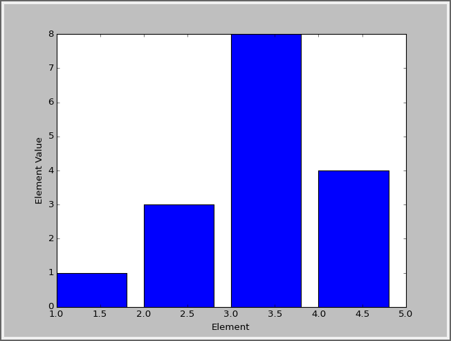
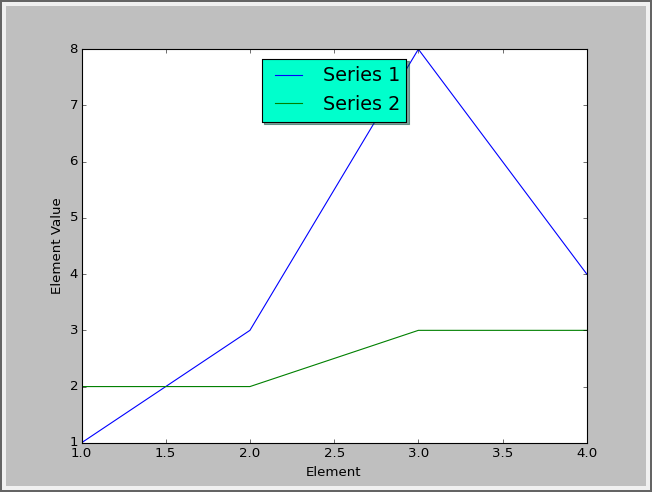
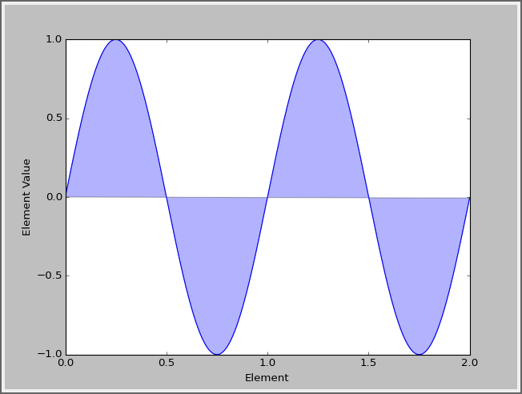
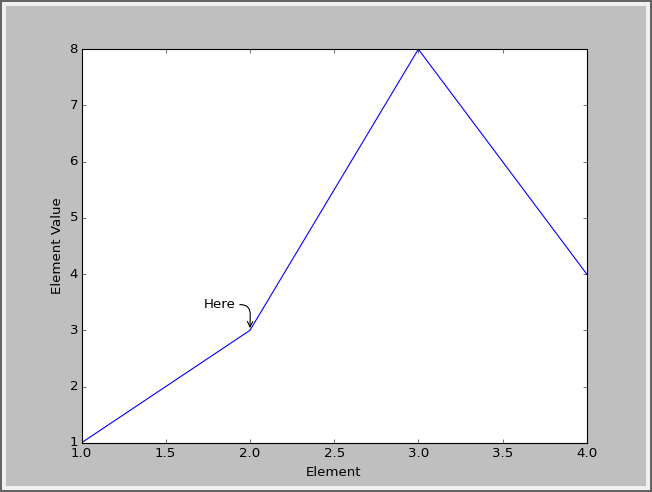
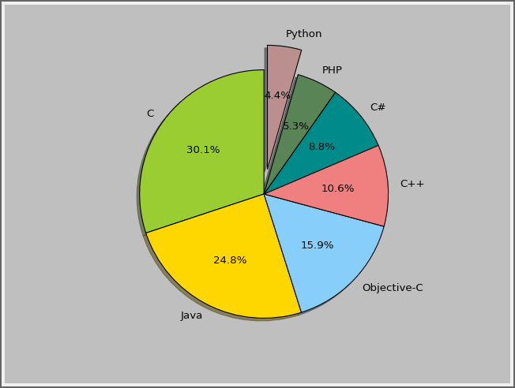

.. sectnum::
    :start: 14

Libraries and Modules
=====================

A *library* is a collection of code for functions and classes. Often, these
libraries are written by someone else and brought into the project so that
the programmer does not have to "reinvent the wheel." In Python the term used
to describe a library of code is module.

By using ``import pygame`` and ``import random``, the programs created so far have
already used modules. A library can be made up of multiple modules that can be
imported. Often a library only has one module, so these words can sometimes be
used interchangeably.

Modules are often organized into groups of similar functionality. In this class
programs have already used functions from the ``math`` module, the ``random`` module,
and the ``arcade`` library. Modules can be organized so that individual modules
contain other modules. For example, the ``arcade`` module contains submodules for
``arcade.key``, and ``arcade.color``.

Modules are not loaded unless the program asks them to. This saves time and
computer memory. This chapter shows how to create a module, and how to import
and use that module.

Why Create a Library?
---------------------

There are three major reasons for a programmer to create his or her own
libraries:

1. It breaks the code into smaller, easier to use parts.
2. It allows multiple people to work on a program at the same time.
3. The code written can be easily shared with other programmers.

Some of the programs already created in this book have started to get rather
long. By separating a large program into several smaller programs, it is
easier to manage the code. For example, in the prior chapter's sprite example,
a programmer could move the sprite class into a separate file. In a complex
program, each sprite might be contained in its own file.

If multiple programmers work on the same project, it is nearly impossible to
do so if all the code is in one file. However, by breaking the program into
multiple pieces, it becomes easier. One programmer could work on developing
an "Orc" sprite class. Another programmer could work on the "Goblin" sprite
class. Since the sprites are in separate files, the programmers do not run
into conflict.

Modern programmers rarely build programs from scratch. Often programs are
built from parts of other programs that share the same functionality. If
one programmer creates code that can handle a mortgage application form,
that code will ideally go into a library. Then any other program that needs
to manage a mortgage application form at that bank can call on that library.

Creating Your Own Module/Library File
-------------------------------------

.. raw:: html

    <iframe width="560" height="315" src="https://www.youtube.com/embed/3zSrkC6c1aU" frameborder="0" allowfullscreen></iframe>

Video: Libraries

In this example we will break apart a short program into multiple files. Here
we have a function in a file named ``test.py``, and a call to that function:

.. code-block:: python
    :linenos:
    :caption: test.py with everything in it

    # Foo function
    def foo():
        print("foo!")

    # Foo call
    foo()

Yes, this program is not too long to be in one file. But if both the function
and the main program code were long, it would be different. If we had several
functions, each 100 lines long, it would be time consuming to manage that
large of a file. But for this example we will keep the code short for clarity.

We can move the ``foo`` function out of this file. Then this file would be left
with only the main program code. (In this example there is no reason to
separate them, aside from learning how to do so.)

To do this, create a new file and copy the ``foo`` function into it. Save the
new file with the name ``my_functions.py``. The file must be saved to the same
directory as ``test.py``.

.. code-block:: python
    :linenos:
    :caption: my_functions.py

    # Foo function
    def foo():
        print("foo!")

.. code-block:: python
    :linenos:
    :caption: test.py that doesn't work

    # Foo call that doesn't work
    foo()

Unfortunately it isn't as simple as this. The file ``test.py`` does not know to
go and look at the ``my_functions.py`` file and import it. We have to add the
command to import it:

.. code-block:: python
    :linenos:
    :caption: test.py that imports but still doesn't work

    # Import the my_functions.py file
    import my_functions

    # Foo call that still doesn't work
    foo()

That still doesn't work. What are we missing? Just like when we import
arcade, we have to put the package name in front of the function. Like this:

.. code-block:: python
    :linenos:
    :caption: test.py that finally works

    # Import the my_functions.py file
    import my_functions

    # Foo call that does work
    my_functions.foo()

This works because ``my_functions.`` is prepended to the function call.

Namespace
---------

.. raw:: html

    <iframe width="560" height="315" src="https://www.youtube.com/embed/vcYcFX9yqiY" frameborder="0" allowfullscreen></iframe>

Video: Namespace

A program might have two library files that need to be used. What if the
libraries had functions that were named the same? What if there were two
functions named print_report, one that printed grades, and one that printed
an account statement? For instance:

.. code-block:: python
    :linenos:
    :caption: student_functions.py

    def print_report():
        print("Student Grade Report:" )

.. code-block:: python
    :linenos:
    :caption: financial_functions.py

    def print_report():
        print("Financial Report:" )

How do you get a program to specify which function to call? Well, that is
pretty easy. You specify the *namespace*. The namespace is the work that
appears before the function name in the code below:

.. code-block:: python
    :linenos:
    :caption: test.py that calls different print_report functions

    import student_functions
    import financial_functions

    student_functions.print_report()
    financial_functions.print_report()

So now we can see why this might be needed. But what if you don't have name
collisions? Typing in a namespace each and every time can be tiresome. You
can get around this by importing the library into the *local namespace*. The
local namespace is a list of functions, variables, and classes that you
don't have to prepend with a namespace. Going back to the ``foo`` example,
let's remove the original import and replace it with a new type of import:

.. code-block:: python
    :linenos:
    :caption: test.py

    # import foo
    from my_functions import *

    foo()

This works even without ``my_functions.`` prepended to the function call. The
asterisk is a wildcard that will import all functions from ``my_functions``.
A programmer could import individual ones if desired by specifying the
function name.

Third Party Libraries
---------------------

When working with Python, it is possible to use many libraries that are built
into Python. Take a look at all the libraries that are available here:

http://docs.python.org/3/py-modindex.html

It is possible to download and install other libraries. There are libraries
that work with the web, complex numbers, databases, and more.

* Pygame: The library used to create games. http://www.pygame.org/docs/
* wxPython: Create GUI programs, with windows, menus, and more. http://www.wxpython.org/
* pydot: Generate complex directed and non-directed graphs http://code.google.com/p/pydot/
* NumPy: Sophisticated library for working with matrices. http://numpy.scipy.org/

A wonderful list of Python libraries and links to installers for them is available here:

http://www.lfd.uci.edu/~gohlke/pythonlibs/

Going through lists of libraries that are available can help you brainstorm
what types of programs you can create. Most programming involves assembling
large parts, rather than writing everything from scratch.

Examples: OpenPyXL Library
^^^^^^^^^^^^^^^^^^^^^^^^^^

This example uses a library called OpenPyXL to write an Excel file. It is also
easy to read from an Excel file.
You can install OpenPyXL from the Windows command prompt by typing
``pip install openpyxl``.
If you are on the Mac or a Linux machine, you can type ``sudo pip3 install openpyxl``.

.. note::

    When starting the command prompt, you might need to right-click on it and select "Run as administrator" if
    you get permission errors when installing.
    And if you are working on a lab computer, you might not have permission to install libraries.

.. literalinclude:: openpyxl_example.py
    :caption: openpyxl_example.py
    :language: python
    :linenos:

The output of this program is an Excel file:

Examples: Beautiful Soup Library
^^^^^^^^^^^^^^^^^^^^^^^^^^^^^^^^

This example grabs information off a web page.
You can install Beautiful Soup from the Windows command prompt by typing
``pip install bs4``. If you are on the Mac or a Linux machine, you can type
``sudo pip3 install bs4``.

.. literalinclude:: bs4_example.py
    :caption: bs4_example.py
    :language: python
    :linenos:

Examples: Matplotlib Library
^^^^^^^^^^^^^^^^^^^^^^^^^^^^
Here is an example of what you can do with the third party library "Matplotlib."
You can install Matplotlib from the Windows command prompt by typing
``pip install matplotlib``. If you are on the Mac or a Linux machine, you can
type ``pip3 install matplotlib``.
To start with, here is the code to create a simple line chart with four values:

.. figure:: matplotlib_01.png
    :width: 300px

    Simple Line Graph

.. literalinclude:: matplotlib_01.py
    :caption: Example 1
    :language: python
    :linenos:

Note that you can zoom in, pan, and save the graph. You can even save the graph
in vector formats like ps and svg that import into documents without loss of
quality like raster graphics would have.

The x value for Example 1, defaults to start at zero. You can
change this default and specify your own x values to go with the y values.
See Example 2 below.

    Specifying the x values

.. literalinclude:: matplotlib_02.py
    :caption: Example 2
    :language: python
    :linenos:

It is trivial to add another data series to the graph.

    Graphing two data series

.. literalinclude:: matplotlib_03.py
    :caption: Example 3
    :language: python
    :linenos:

You can add a legend to the graph:

    Adding a legend

.. literalinclude:: matplotlib_04.py
    :caption: Example 4
    :language: python
    :linenos:

You can add annotations to a graph:

    Adding annotations

.. literalinclude:: matplotlib_05.py
    :caption: Example 5
    :language: python
    :linenos:

Don't like the default lines styles for the graph? That can be changed by
adding a third parameter to the plot command.

.. figure:: matplotlib_06.png
    :width: 300px

    Specifying the line style

.. literalinclude:: matplotlib_06.py
    :caption: Example 6
    :language: python
    :linenos:

A bar chart is as easy as changing plot to bar.

    Bar chart

.. literalinclude:: matplotlib_07.py
    :caption: Example 7
    :language: python
    :linenos:

You can add labels to axis values.

.. figure:: matplotlib_08.png
    :width: 300px

    X-axis labels

.. literalinclude:: matplotlib_08.py
    :caption: Example 8
    :language: python
    :linenos:

You can graph functions as well. This uses a different package called
numpy to graph a sine function.

    Graphing a sine function

.. literalinclude:: matplotlib_09.py
    :caption: Example 9
    :language: python
    :linenos:

You can fill in a graph if you like.

    Filling in a graph

.. literalinclude:: matplotlib_10.py
    :caption: Example 10
    :language: python
    :linenos:

Create a pie chart.

    Pie chart

.. literalinclude:: matplotlib_11.py
    :caption: Example 11
    :language: python
    :linenos:

You can do really fancy things, like pull stock data from the web and create a
candlestick graph for Apple Computer:

.. figure:: matplotlib_12.png
    :width: 300px

    Candlestick chart

.. literalinclude:: matplotlib_12.py
    :caption: Example 12
    :language: python
    :linenos:

There are many more things that can be done with matplotlib. Take a look at
the thumbnail gallery:

http://matplotlib.org/gallery.html
