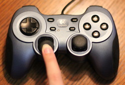

.. _user-control:

User Control
============

How do we interact with the user? Get the user to move an object on the screen?

We can do this with the mouse, with the keyboard, or with the game controller.

Move with the Mouse
-------------------

The key to managing mouse motion to override the ``on_mouse_motion`` in the
``arcade.Window`` class. That method is called every time the mouse moves.
The method definition looks like this:

.. code-block:: python

    def on_mouse_motion(self, x, y, dx, dy):

The ``x`` and ``y`` are the coordinates of the mouse. the ``dx`` and ``dy``
represent the change in x and y since the last time the method was called.

Often when controlling a graphical item on the screen with the mouse, we do
not want to see the mouse pointer. If you don't want to see the mouse pointer,
in the ``__init__`` method, call the following method in the parent class:

.. code-block:: python

    self.set_mouse_visible(False)

The example below takes our ``Ball`` class, and moves it around the screen with
the mouse.

.. literalinclude:: move_with_mouse.py
    :caption: move_with_mouse.py
    :language: python
    :linenos:
    :emphasize-lines: 30, 42-45

.. _mouse-click:

Mouse Clicks
------------

You can also process mouse clicks by defining an ``on_mouse_press`` method:

.. code-block:: python

    def on_mouse_press(self, x, y, button, modifiers):
        """ Called when the user presses a mouse button. """

        if button == arcade.MOUSE_BUTTON_LEFT:
            print("Left mouse button pressed at", x, y)
        elif button == arcade.MOUSE_BUTTON_RIGHT:
            print("Right mouse button pressed at", x, y)

Move with the Keyboard
----------------------

Moving with the game controller is similar to our bouncing ball example. There
are just two differences:

* We control the ``change_x`` and ``change_y`` with the keyboard
* When we hit the edge of the screen we stop, rather than bounce.

To detect when a key is hit, we override the ``on_key_press`` method. We might
think of hitting a key as one event. But it is actually two. When the key is
pressed, we start moving. When the key is released we stop moving. That makes
for two events. Releasing a key is controlled by ``on_key_release``.

These methods have a  ``key`` variable as a parameter that can be compared with
an ``if`` statement to the values in
the `arcade.key library <http://arcade.academy/arcade.key.html>`_.

.. code-block:: python

    def on_key_press(self, key, modifiers):
        if key == arcade.key.LEFT:
            print("Left key hit")
        elif key == arcade.key.A:
            print("The 'a' key was hit")

We can use this in a program to move a ball around the screen. See the highlighted
lines in the program below:

.. literalinclude:: move_with_keyboard_simple.py
    :caption: move_with_keyboard_simple.py
    :language: python
    :linenos:
    :emphasize-lines: 5, 53-62, 64-69

Keep From Moving Off Screen
^^^^^^^^^^^^^^^^^^^^^^^^^^^

Unfortunately in the prior program, there is nothing that keeps the player
from moving off-screen. If we want to stop the player from moving off-screen
we need some additional code.

We detect the edge by comparing ``position_x`` with the left and right side
of the screen For example:

.. code-block:: python

    if self.position_x < 0:

But this isn't perfect. Because the position specifies the *center* of the ball,
by the time the x coordinate is 0 we are already have off the screen. It is
better to compare it to the ball's radius:

.. code-block:: python

    if self.position_x < self.radius:

What do we do once it hits the edge? Just set the value back to the edge:

.. code-block:: python

    # See if the ball hit the edge of the screen. If so, change direction
    if self.position_x < self.radius:
        self.position_x = self.radius

Here's a full example:

.. literalinclude:: move_with_keyboard_edge_detect.py
    :caption: move_with_keyboard_edge_detect.py
    :language: python
    :linenos:
    :emphasize-lines: 28-39

Moving with the Game Controller
-------------------------------

Working with game controllers is a bit more complex. A computer might not
have any game controllers, or it might have five controllers plugged in.

We can get a list of all game pads that are plugged in with the
``get_joysticks`` function. This will either return a list, or it will return
nothing at all if there are no game pads.

Below is a block of code that can be put in an ``__init__`` method for your
application that will create an instance variable to represent a game pad
if one exists.

.. code-block:: python

    joysticks = arcade.get_joysticks()
    if joysticks:
        self.joystick = joysticks[0]
        self.joystick.open()
    else:
        print("There are no joysticks.")
        self.joystick = None

Joystick Values
---------------

After this, you can get the position of the game controller joystick by calling
``self.joystick.x`` and ``self.joystick.y``.

Try this, combined with the initialization code from above:

.. literalinclude:: move_with_game_controller_print.py
    :caption: move_with_game_controller_print.py
    :language: python
    :linenos:
    :emphasize-lines: 62-69, 77-81

Run the program and see the values it prints out for your game controller
as you move the joystick on it around.

* The values will be between -1 and +1, with 0 being a centered joystick.
* The x-axis numbers will be negative if the stick goes left, positive for right.
* The y-axis numbers will be opposite of what you might expect. Negative for up, positive for down.

.. figure:: c.jpg

    Centered (0, 0)

    Down (0, 1)

.. figure:: dl.jpg

    Down/Left (-1, 1)

.. figure:: dr.jpg

    Down/Right (1, 1)

.. figure:: u.jpg

    Up (0, -1)

.. figure:: ul.jpg

    Up/Left (-1, -1)

.. figure:: ur.jpg

    Up/Right (1, -1)

We can move the ball by adding the following code to the ``update``:

.. code-block:: python
    :emphasize-lines: 7-8

    def update(self, delta_time):

        # Update the position according to the game controller
        if self.joystick:
            print(self.joystick.x, self.joystick.y)

            self.ball.change_x = self.joystick.x
            self.ball.change_y = -self.joystick.y

Notice the ``-`` we put in front of setting the y vector. If we don't do this,
the ball will move opposite of what we expect when going up/down. This is because
the joystick has y values mapped opposite of how we'd normally expect. There's
a long story to that, which I will not bore you with now.

But with this code our ball moves *so slow*. How do we speed it up? We can
make it run five times faster by multiplying by five if we want.

.. code-block:: python
    :emphasize-lines: 7-8

    def update(self, delta_time):

        # Update the position according to the game controller
        if self.joystick:
            print(self.joystick.x, self.joystick.y)

            self.ball.change_x = self.joystick.x * 5
            self.ball.change_y = -self.joystick.y * 5

Or better
yet, define a constant variable at the top of your program and use that.
In our final example below, we'll do just that.

Deadzone
--------

What if your ball 'drifts' when you have the joystick centered?

Joysticks are mechanical.
A centered joystick might have a value not at 0, but at 0.0001 or some
small number. This will make for a small "drift" on a person's character. We often
counteract this by having a "dead zone" where if the number is below a certain
value, we just assume it is zero to eliminate the drift.

See the highlighted lines for how we take care of the dead zone:

.. literalinclude:: move_with_game_controller.py
    :caption: move_with_game_controller.py
    :language: python
    :linenos:
    :emphasize-lines: 6, 82-92

