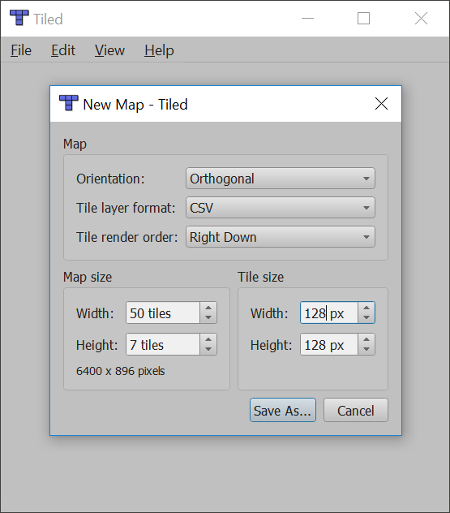
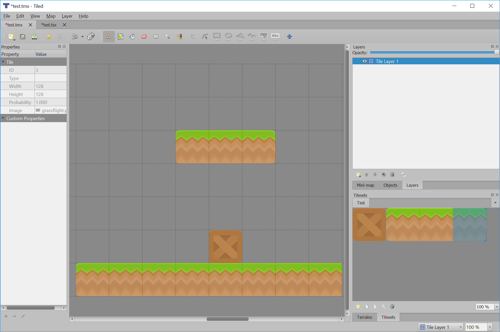

.. sectnum::
    :start: 17

.. _platformers:

Platformers
===========

Ever wanted to create your own platformer? It isn't too hard! Here's an example to get started.

Map File
--------

First, we need a map. This is a "map" file created with the Tiled_ program. The program is free. You can
download it and use it to create your map file.

In this map file the numbers represent:

.. _Tiled: http://www.mapeditor.org/

======= ==================
Number  Item
======= ==================
-1      Empty square
0       Crate
1       Left grass corner
2       Middle grass corner
3       Right grass corner
======= ==================

You can download these tiles (originally from kenney.nl) here:

.. image:: boxCrate_double.png

.. image:: grassLeft.png

.. image:: grassMid.png

.. image:: grassRight.png

Of course, you'll need a character to jump around the map:

.. image:: character.png

Here is the map file:

.. literalinclude:: map.csv
    :caption: map.csv
    :language: text
    :linenos:

The Tiled_ program takes some getting used to. You start off with a screen like this:

Most of the tiles from kenney.nl are 128x128 pixels. In the image above I've got a 7 tile high, by 50 pixel wide
side-scroll map.

After this, you have to create a new "tile set." These will be all the images for your map, and the numbers they
associate with:

.. image:: tiled_new_tileset.png
    :width: 75%

The numbers of the tiles correspond to the order you added the tiles. I don't think you can change the mapping
after you create the tileset.

Next, you "paint" your map:

When you are done, you can "Export as" a CSV file.

Python Program
--------------

.. literalinclude:: sprite_tiled_map.py
    :caption: sprite_tiled_map.py
    :language: python
    :linenos:

