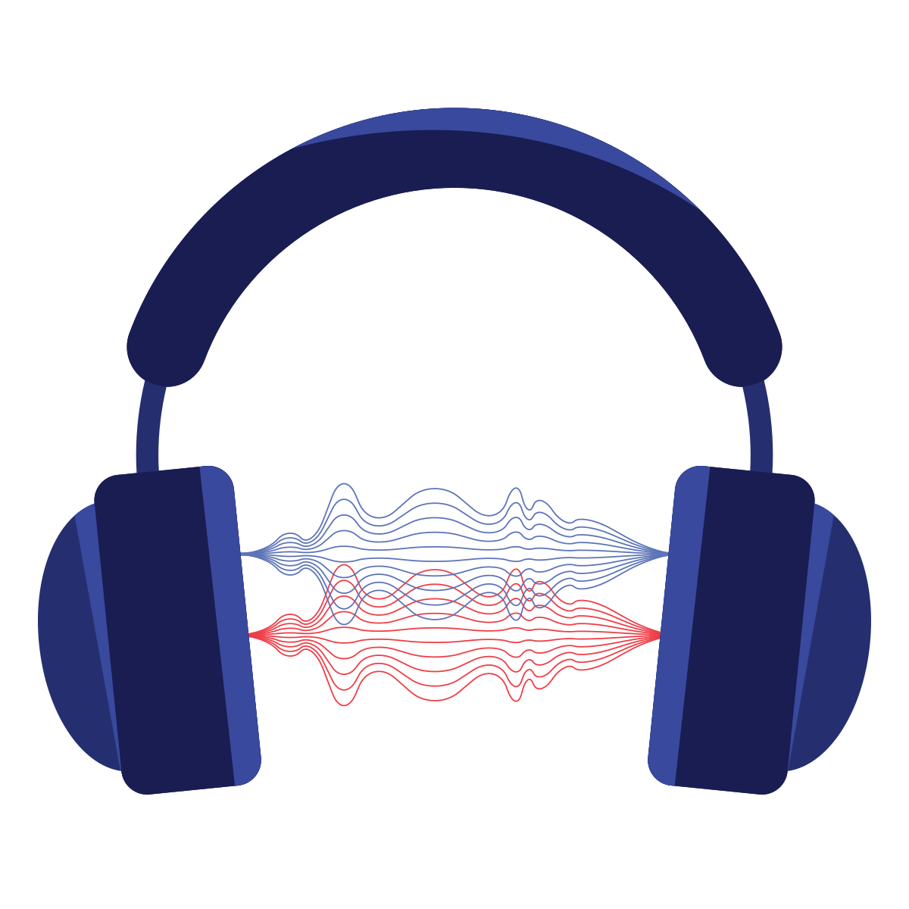
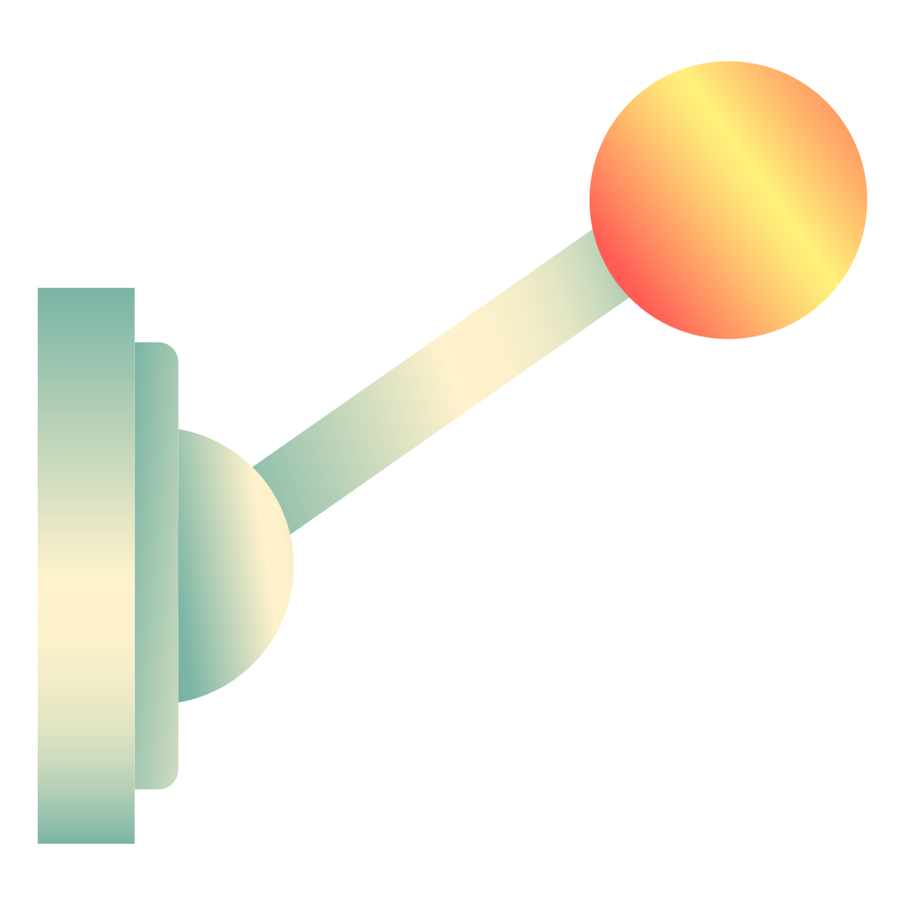

.. _sounds:

Sound Effects
=============

.. image:: sounds.svg
    :width: 35%
    :class: right-image

Adding sound to your game isn't too hard. There are two steps:

1. Load the sound
2. Play the sound

For these examples, I'm using a sound file called ``laser.ogg`` that you can
`download here <../../_static/laser.ogg>`_. Make sure you save the file in
the same directory as any Python program that tries to use it.

Loading Sounds
--------------

The code below creates a new variable called ``laser_sound``. It calls
arcades ``load_sound`` function. It passes the filename of our sound.

.. code-block:: python

    laser_sound = arcade.load_sound("laser.ogg")

For this to work, you need to have a sound downloaded and named ``laser.ogg``
in the same directory as your Python file. The computer will not find the
sound if it is in a different directory.

This loads the sound, but does not play it. We only want to load the sound
once. We don't want to load the sound off the disk every time we play it.
It can be kept in memory.

Playing Sounds
--------------

The code to play sounds is straight-forward. Just call the ``play_sound``
function, and pass in the variable that we set equal to the sound we loaded:

.. code-block:: python

    arcade.play_sound(laser_sound)

Putting the two together, you might think we could do this to play sounds:

.. code-block:: python

    import arcade

    laser_sound = arcade.load_sound("laser.ogg")
    arcade.play_sound(laser_sound)

But that doesn't work. The program ends before the sound has a chance to play.
The ``play_sound`` button doesn't pause while the sound plays, it returns
right away and keeps going. This was a similar issue that we had when we opened
a window, and we can solve it the same way:

.. code-block:: python
    :linenos:

    import arcade

    arcade.open_window(300, 300, "Sound Demo")
    laser_sound = arcade.load_sound("laser.ogg")
    arcade.play_sound(laser_sound)
    arcade.run()

For this reason, I recommend loading the sound in
the ``__init__`` method of the class that will play the sound.

Triggering Sounds
-----------------

We want to play the sound when something happens. So this example loads the
sound once during the ``__init__``. When the user hits the space bar, that
is when we trigger the sound to play.

.. code-block:: python
    :linenos:
    :emphasize-lines: 10, 16

    import arcade

    class MyApplication(arcade.Window):

        def __init__(self, width, height):
            super().__init__(width, height, "Trigger Sound With Key")

            # Load the sound when the application starts
            self.laser_sound = arcade.load_sound("laser.ogg")

        def on_key_press(self, key, modifiers):

            # If the user hits  the space bar, play the sound that we loaded
            if key == arcade.key.SPACE:
                arcade.play_sound(self.laser_sound)

    def main():
        window = MyApplication(300, 300)
        arcade.run()

    main()

Finding Sounds
--------------

Great places to find free sounds to use in your program:

* `OpenGameArt.org <http://opengameart.org/art-search-advanced?keys=&field_art_type_tid%5B%5D=13&sort_by=count&sort_order=DESC>`_
* `www.freesound.org <http://www.freesound.org/>`_ is ok, but requires a login,
  which is a pain.
* `Kenney.nl <http://kenney.nl/assets?q=audio>`_ has a few free sound packs you
  can download, and several that are cheap.

Sound File Formats
------------------

.. image:: waves.svg
    :width: 35%
    :class: right-image

There are several types of `sound file formats`_ that you can find sounds in:

.. _sound file formats: https://en.wikipedia.org/wiki/Audio_file_format

* ``.wav`` - This is a raw "wave" format. The sound is not compressed at all. You do not need a special library
  to decompress the sound, but the sound file itself can be rather large.
* ``.mp3`` - MPEG Layer III Audio (mp3) is one of the most popular compressed sound file formats. This file format is what enabled on-line
  music to become popular. However some of the compression algorithms have patents on them, making it not as suitable
  for free software.
* ``.m4a`` - Apple's file format for compressed, but unprotected audio.
* ``.ogg`` - A open-source sound file that uses Ogg-Vorbis for compression. A less popular but patent-free method of sound
  storage.

Arcade should be able to play files in either the mp3 or ogg format. If you have issues getting it to work, try
converting the sound to a raw wav format.

If you need to convert file formats, or trim a sound file, I suggest using the program Audacity_.

.. _Audacity: http://www.audacityteam.org/home/
