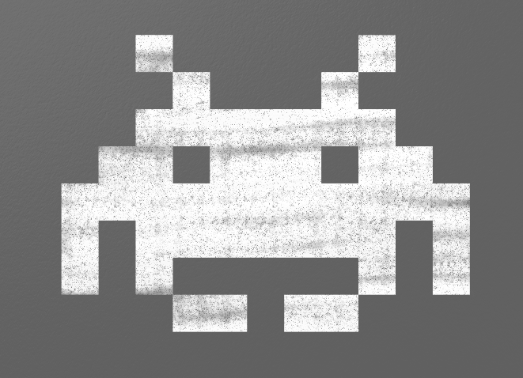

.. _sprites:

Sprites
=======

Our games need support for handling objects that collide. Balls bouncing off
paddles, laser beams hitting aliens, or our favorite character collecting a
coin. All these examples require collision detection.

The Arcade library has support for sprites. A sprite is a two-dimensional
image that is part of the larger graphical scene. Typically a sprite will
be some kind of object in the scene that will be interacted with like a car,
frog, or little plumber guy.

Originally, video game consoles had built-in hardware support for sprites.
Now this specialized hardware support is no longer needed, but we still use
the term "sprite." The `history of sprites`_ is interesting, if you want to
read up more about it.

.. _history of sprites: https://en.wikipedia.org/wiki/Sprite_(computer_graphics)

Finding Images for Sprites
--------------------------

There are several image formats that computers use:

* ``.bmp`` - Bitmap. This is an uncompressed image that normally uses three bytes to represent each dot in the image.
  These files can be very large. Because there are so many better options, this format is not used often. It is,
  however, the simplest format to use.
* ``.png`` - Great patent-free format for line art and clip art. Not great for photos. Can't hold animations.
* ``.gif`` - Great format for line art and clip art. Has had issues with patents (now expired). Can do animations.
* ``.jpg`` - Great file format for photos. Terrible for clip-art. Don't use for sprites.
* ``.svg`` - File format for storing line-art images that can scale to any resolution. Not compatible with the
  "arcade" library.

If you use Google's `advanced image search`_ you can find images that are "icon" sized, and either png or gif file
format.

.. _advanced image search: https://www.google.com/advanced_image_search

There's also a great source for images from `kenney.nl`_. He has a lot of free and cheap game image assets.
That's where the following images come from that we will use in our examples:

.. _kenney.nl: http://kenney.nl/

.. figure:: character.png

    character.png

.. figure:: coin_01.png

    coin_01.png

Where to Save Images
^^^^^^^^^^^^^^^^^^^^

Where should you save them? If you load your sprite with the code
below, the computer will look for the ``character.png`` image in the same
directory as your Python file. Save the image anywhere else, and it won't
be found.

How to Reference Images
^^^^^^^^^^^^^^^^^^^^^^^

If you create your own game that you publish, you need to:

* Create your own images
* Hire someone to create your images
* Buy your own images with a license to use them in your own game
* Find images that are public domain or licensed for public use

If you are just creating a game for class that won't be used in public, then right
before you load the image leave a comment with the source. I'll show this in a bit.

.. attention::
    Do not list "Google" as a source. That's like using "The Library" as a source in your report. Find
    the source of the image that Google is pointing to.

Basic Sprites and Collisions
----------------------------

Let's step through an example program that uses sprites. This example shows how
to create a screen of sprites that are coins, and collect them using a sprite
that is a character image
controlled by the mouse as shown in the figure below. The program keeps "score"
on how many coins have been collected. The code for this example may be found at:

http://arcade.academy/examples/sprite_collect_coins.html

In this chapter, we'll step through that example.

.. figure:: collect_coins.gif

	Example Sprite Game

Getting the Application Started
^^^^^^^^^^^^^^^^^^^^^^^^^^^^^^^

The first few lines of our program start off like other games we've done. We
import a couple libraries. Set a couple constants for the size of the screen,
and a couple new constants that we will use to scale our graphics.

The example below should have nothing new, it just creates a window and sets a
background color. We'll add in the new stuff soon.

.. literalinclude:: sprite_sample_start.py
    :caption: Sprite Sample Start
    :language: python
    :linenos:

The Constructor
^^^^^^^^^^^^^^^

What's next? We need to add our attributes to the ``MyGame`` class.
We add our attributes to the ``__init__`` method. Here is our
code with the expanded ``__init__``:

.. literalinclude:: sprite_sample_expanded_init.py
    :caption: Expanded Init
    :language: python
    :emphasize-lines: 23-34
    :linenos:

The variables we are creating:

* ``player_list``:  When working with sprites, we normally put them into
  lists. Other game engines might call these sprite groups, or sprite layers.
  Our game will have one list for the player, and one list for the coins.
  Even if there is only one sprite, we should still put it in a list because
  there is a lot of code in ``SpriteList`` to optimize drawing.
* ``coin_list``: This is a list of all the coins. We will be checking if the
  player touches any sprite in this list.
* ``player_sprite``: This points to our player's sprite. It is the sprite
  we will move.
* ``score``: This keeps track of our score.

We use a command built into the parent ``Window`` class called
``set_mouse_visible`` to make the mouse not visible. Finally we set the
background color.

The `setup` Function
^^^^^^^^^^^^^^^^^^^^

Next up, we will create a ``setup`` method. This will create our sprites and get
our game set up. We do this in a different method than ``__init__`` so that
if we ever want to restart the game, we can just call ``setup`` again.

The ``setup`` method is not called automatically.
Therefore in the example below, note we have added the
code that calls the ``setup`` function near the end: ``window.setup()``.

.. literalinclude:: sprite_sample_player.py
    :caption: Sprite Sample With Player
    :language: python
    :emphasize-lines: 36-51, 56-64, 70
    :linenos:

How does the code above work?

First, we need some lists to hold our sprites. We could do use a list like
this:

.. code-block:: Python

    coin_list = []

But wait! ``coin_list`` is an instance variable that's part of our class.
we need to prepend it with ``self.``.

.. code-block:: Python

    self.coin_list = []

However, the Arcade library has a class especially for handling sprite lists.
This class is called ``SpriteList``.
For more information, check out the SpriteList_ documentation.
So instead of creating an empty list with
``[]``, we will create a new instance of the ``SpriteList`` class:

.. _SpriteList: http://arcade.academy/arcade.html#arcade.sprite.SpriteList

.. code-block:: Python

    self.coin_list = SpriteList()

Except that doesn't work. Why? ``SpriteList`` is in the Arcade library. We
need to prepend any reference to things in the Arcade library with ``arcade``
of course, so now we have:

.. code-block:: Python

    self.coin_list = arcade.SpriteList()

We need a separate list for just coins. This list won't have the player. We also
need to reset our score to 0.

.. code-block:: Python

    self.coin_list = arcade.SpriteList()

    self.score = 0

Now we need to create our sprites. The name of the class that represents sprites
is called ``Sprite``. You can read more about it by looking at the Sprite_
documentation.
The Sprite constructor takes two parameters. A path to the image we will be
using, and how big to scale it.

For class, please source the image right before you load it. If you drew your own image, please note that as well.

.. _Sprite: http://arcade.academy/arcade.html#arcade.sprite.Sprite

.. code-block:: Python

    # Character image from kenney.nl
    self.player_sprite = arcade.Sprite("character.png", SPRITE_SCALING_PLAYER)

How do we draw all our sprites? Really easy. Just call the ``draw`` method that
exists for us in the ``SpriteList`` class. We just need to do this for each of
our sprite lists.

.. code-block:: Python

    def on_draw(self):

            arcade.start_render()

            # Draw all the sprite lists.
            self.coin_list.draw()
            self.player_list.draw()

Wait. We don't have many sprites. There are no coins, and we have just the player.
Let's add a ``for`` loop to our program and create a bunch of coins:

.. literalinclude:: sprite_sample_coins.py
    :caption: Sprite Sample With Player And Coins
    :language: python
    :emphasize-lines: 54-65
    :linenos:

Drawing The Score
^^^^^^^^^^^^^^^^^

In addition to drawing the sprites, let's go ahead and
put the score on the screen:

.. code-block:: Python

    # Put the text on the screen.
    output = "Score: " + str(self.score)
    arcade.draw_text(output, 10, 20, arcade.color.WHITE, 14)

Rather than do that ``"Score: " + str(self.score)`` it is possible to do
print formatting if you are using Python 3.6 or later. We'll talk more about
print formatting later, but that code would look like:

.. code-block:: Python

    # Put the text on the screen.
    output = f"Score: {self.score}"
    arcade.draw_text(output, 10, 20, arcade.color.WHITE, 14)

There are three standards for how to format strings in Python, so that whole
subject is a bit confusing.

The On Mouse Motion Method
^^^^^^^^^^^^^^^^^^^^^^^^^^

Moving the player sprite with the mouse is easy. All sprites have instance
variables ``center_x`` and ``center_y``. Just change those values to the mouse's
x and y location to move the sprite.

.. code-block:: Python

    def on_mouse_motion(self, x, y, dx, dy):

        self.player_sprite.center_x = x
        self.player_sprite.center_y = y

Now, our whole program looks like:

.. literalinclude:: sprite_sample_with_mouse_motion.py
    :caption: Sprite Sample With Mouse Motion And Score
    :language: python
    :emphasize-lines: 73-75, 77-82
    :linenos:

The Update Method
^^^^^^^^^^^^^^^^^

Our ``update`` method needs to do three things:

1. Update each of the sprites
2. Check to see if the player is touching any coins
3. Remove any coins colliding with the player, and update the score.

Each sprite has its own ``update`` method. This allows sprites to move and
animate its images. Right now, our sprite does not have this method. But we
will soon. Rather than call the ``update`` method of each sprite we have,
there is an ``update`` method in each sprite list that will call ``update``
on each sprite in the list. Therefore, just calling ``update`` with our
``coin_list`` will cause all coin sprites to update.

.. code-block:: Python

    self.coin_list.update()

How do we detect what coins are touching the player? We call the
``check_for_collision_with_list`` method. Pass it in our player sprite,
along with a list of all the coins. That function will return a list of
all colliding sprites. If no sprites collide, the list will be empty.

.. code-block:: Python

    # Generate a list of all sprites that collided with the player.
    coins_hit_list = arcade.check_for_collision_with_list(self.player_sprite, self.coin_list)

What do we do with this ``hit_list`` we get back? We loop through it. We add one
to the score for each sprite hit.

We also need to get rid of the sprite. The sprite class has a method called
``kill``. This method will remove the sprite from existence.

.. code-block:: Python

    # Loop through each colliding sprite, remove it, and add to the score.
    for coin in coins_hit_list:
        coin.kill()
        self.score += 1

Here's the whole ``update`` method put together:

.. literalinclude:: sprite_sample_with_update.py
    :caption: Sprite Sample With Update Method
    :language: python
    :emphasize-lines: 84-98
    :linenos:

Moving Sprites
--------------

How do we get sprites to move?

To customize our sprite's behavior, we need to subclass the ``Sprite`` class
with our own child class. This is easy:

.. code-block:: Python

    class Coin(arcade.Sprite):

We need to provide each sprite with a
``update`` method. The ``update`` method is automatically called to update
the sprite's position.

.. code-block:: Python

    class Coin(arcade.Sprite):

        def update(self):
            # Code to move goes here

Wait! We have a new class called Coin, but we aren't using it. Find in our
original code this line:

.. code-block:: Python

    coin = arcade.Sprite("coin_01.png", COIN_SPRITE_SCALING)

See how it is creating an instance of ``Sprite``? We want to create an instance
of our new ``Coin`` class instead:

.. code-block:: Python

    coin = Coin("coin_01.png", COIN_SPRITE_SCALING)

Now, how do we get the coin to move?

Moving Sprites Down
^^^^^^^^^^^^^^^^^^^

To get the sprites to "fall" down the screen, we need to make their y location
smaller. This is easy. Over-ride ``update`` in the sprite and subtract from
y each frame:

.. code-block:: Python

    class Coin(arcade.Sprite):

        def update(self):
            self.center_y -= 1

Next, create an instance of the ``Coin`` class instead of a ``Sprite`` class.

.. literalinclude:: sprite_sample_move_down.py
    :caption: Sprite Sample Move Down
    :language: python
    :emphasize-lines: 15-18, 64
    :linenos:

This causes the coins to move down. But once they move off the screen they
keep going into negative-coordinate land. We can't see them any more. Sad.

.. figure:: coins_down_1.gif

    Coins moving down

Resetting to the Top
~~~~~~~~~~~~~~~~~~~~

We can get around this by resetting the coins up to the top. Here's how its
done:

.. code-block:: Python

    class Coin(arcade.Sprite):

        def update(self):
            self.center_y -= 1

            # See if we went off-screen
            if self.center_y < 0:
                self.center_y = SCREEN_HEIGHT

But this isn't perfect. Because if your eyes are fast, you can see the coin
'pop' in and out of existence at the edge. It doesn't smoothly slide off. This is
because we move it when the *center* of the coin is at the edge. Not the top of
the coin has slid off.

There are a couple ways we can do this. Here's one. We'll check at -20 instead
of 0. As long as the coin radius is 20 or less, we are good.

.. code-block:: Python

    class Coin(arcade.Sprite):

        def update(self):
            self.center_y -= 1

            # See if we went off-screen
            if self.center_y < -20:
                self.center_y = SCREEN_HEIGHT + 20

There's another way. In addition to ``center_y``, sprites have other
members that are useful in these cases. They are ``top``, ``bottom``,
``left`` and ``right``. So we can do this:

.. code-block:: Python

    class Coin(arcade.Sprite):

        def update(self):
            self.center_y -= 1

            # See if we went off-screen
            if self.top < 0:
                self.bottom = SCREEN_HEIGHT

Doing this allows the coins to smoothly slide on and off the screen. But since
they reappear at the top, we get repeating patters. See the image below:

.. figure:: pattern.gif

    Coins repeating in a pattern

Instead we can randomize it a bit:

.. code-block:: Python

    def update(self):

        # Move the coin
        self.center_y -= 1

        # See if the coin has fallen off the bottom of the screen.
        # If so, reset it.
        if self.top < 0:
            # Reset the coin to a random spot above the screen
            self.center_y = random.randrange(SCREEN_HEIGHT + 20,
                                             SCREEN_HEIGHT + 100)
            self.center_x = random.randrange(SCREEN_WIDTH)

Never Ending Coins
~~~~~~~~~~~~~~~~~~

This works, but when we we collect all the coins we are done. What if it was
a never-ending set of coins? Instead of "killing" the coin, let's reset it to
the top of the screen.

.. code-block:: Python

    def update(self, delta_time):
        """ Movement and game logic """

        self.coin_list.update()

        hit_list = arcade.check_for_collision_with_list(self.player_sprite, self.coin_list)

        for coin in hit_list:
            self.score += 1

            # Reset the coin to a random spot above the screen
            coin.center_y = random.randrange(SCREEN_HEIGHT + 20,
                                             SCREEN_HEIGHT + 100)
            coin.center_x = random.randrange(SCREEN_WIDTH)

We can even take that common code, and move it to a method. Here's a full example:

.. literalinclude:: sprite_sample_move_down_full.py
    :caption: Full Move Down Sprite Sample
    :language: python
    :linenos:
    :emphasize-lines: 15-36

Bouncing Coins
^^^^^^^^^^^^^^

Instead of always adding one to the y-coordinate and have the sprites move
down, we can keep a vector by using ``change_x`` and ``change_y``. By
using these, we can have the sprite bounce around the screen:

.. figure:: sprites_bouncing.gif

    Coins bouncing around

.. literalinclude:: sprite_sample_move_bouncing.py
    :caption: sprites_sample_move_bouncing.py
    :language: python
    :emphasize-lines: 21-22, 24-41, 92-93
    :linenos:

TODO: Put in some text about spawning a sprite too close to the edge. Also make a refer to it from the final
project.

Take what you've learned from the example above, and see if you can replicate
this:

.. figure:: Test_Pattern.gif

    Test Pattern

Coins Moving In Circles
^^^^^^^^^^^^^^^^^^^^^^^

.. figure:: sprites_circle.gif

    Coins moving in a circle

.. literalinclude:: sprites_circle.py
    :caption: sprites_circle.py
    :language: python
    :linenos:

Rotating Sprites
----------------

Sprites can easily be rotated by setting their ``angle`` attribute. Angles are
in degrees. So the following will flip the player upside down:

.. code-block:: Python

    self.player_sprite.angle = 180

If you put this in the coin's ``update`` method, it would cause the coins to
spin:

.. code-block:: Python

    self.angle += 1

    # If we rotate past 360, reset it back a turn.
    if self.angle > 359:
        self.angle -= 360

