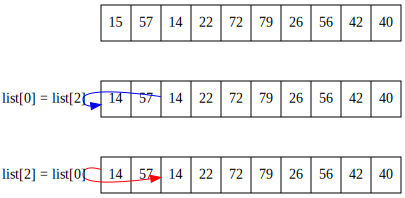
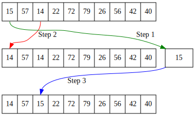
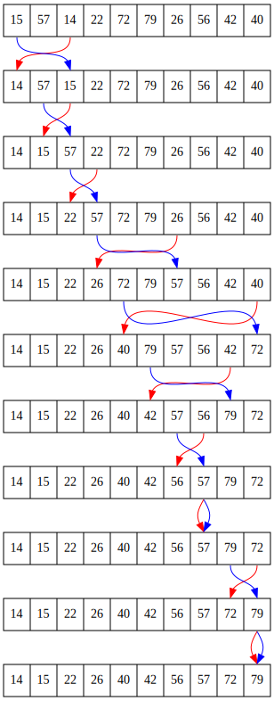

.. sectnum::
    :start: 18

Sorting
=======

Binary searches only work on lists that are in order. So how do programs get a
list in order? How does a program sort a list of items when the user clicks a
column heading, or otherwise needs something sorted?

There are several algorithms that do this. The two easiest algorithms for
sorting are the *selection sort* and the *insertion sort*. Other sorting
algorithms exist as well, such as the shell, merge, heap, and quick sorts.

The best way to get an idea on how these sorts work is to watch them. To
see common sorting algorithms in action visit this excellent website:

http://www.sorting-algorithms.com

Each sort has advantages and disadvantages. Some sort a list quickly if the
list is almost in order to begin with. Some sort a list quickly if the list is
in a completely random order. Other lists sort fast, but take more memory.
Understanding how sorts work is important in selecting the proper sort for
your program.

Swapping Values
---------------

.. raw:: html

    <iframe width="560" height="315" src="https://www.youtube.com/embed/3COTY4tAwsw" frameborder="0" allowfullscreen></iframe>

Before learning to sort, we need to learn how to swap values between two
variables. This is a common operation in many sorting algorithms. Suppose a
program has a list that looks like the following:

.. code-block:: python

    my_list = [15,57,14,33,72,79,26,56,42,40]

The developer wants to swap positions 0 and 2, which contain the numbers 15
and 14 respectively. See Figure 18.1.

.. figure:: sortgraph1.svg

    Figure 18.1: Swapping values in an array

A first attempt at writing this code might look something like this:

.. code-block:: python

    my_list[0] = my_list[2]
    my_list[2] = my_list[0]

    Figure 18.2: Incorrect attempt to swap array values

See Figure 18.2 to get an idea on what would happen. This clearly does not
work. The first assignment ``list[0] = list[2]`` causes the value 15 that exists
in position 0 to be overwritten with the 14 in position 2 and irretrievably
lost. The next line with ``list[2] = list[0]`` just copies the 14 back to
cell 2 which already has a 14.

To fix this problem, swapping values in an array should be done in three
steps. It is necessary to create a temporary variable to hold a value during
the swap operation. See Figure 18.3. The code to do the swap looks like the
following:

.. code-block:: python
    :caption: Swapping two values in an array

    temp = my_list[0]
    my_list[0] = my_list[2]
    my_list[2] = temp

The first line copies the value of position 0 into the ``temp`` variable. This
allows the code to write over position 0 with the value in position 2
without data being lost. The final line takes the old value of position 0,
currently held in the ``temp`` variable, and places it in position 2.

    Figure 18.3: Correct method to swap array values

Selection Sort
--------------

.. raw:: html

    <iframe width="560" height="315" src="https://www.youtube.com/embed/pyO71AiAKz0" frameborder="0" allowfullscreen></iframe>

The selection by looking at element 0. Then code next scans the rest of
the list from element 1 to n-1 to find the smallest number. The smallest
number is swapped into element 0. The code then moves on to element 1,
then 2, and so forth. Graphically, the sort looks like Figure 18.4.

    Figure 18.4: Selection Sort

The code for a selection sort involves two nested loops. The outside loop
tracks the current position that the code wants to swap the smallest value
into. The inside loop starts at the current location and scans to the right
in search of the smallest value. When it finds the smallest value, the swap
takes place.

.. code-block:: python
    :caption: Selection sort
    :linenos:

    def selection_sort(my_list):
        """ Sort a list using the selection sort """

        # Loop through the entire array
        for cur_pos in range(len(my_list)):
            # Find the position that has the smallest number
            # Start with the current position
            min_pos = cur_pos

            # Scan left to right (end of the list)
            for scan_pos in range(cur_pos + 1, len(my_list)):

                # Is this position smallest?
                if my_list[scan_pos] < my_list[min_pos]:

                    # It is, mark this position as the smallest
                    min_pos = scan_pos

            # Swap the two values
            temp = my_list[min_pos]
            my_list[min_pos] = my_list[cur_pos]
            my_list[cur_pos] = temp

The outside loop will always run :math:`n` times. The inside loop will
run an average of :math:`\frac{n}{2}` times per run of the outside loop.
Therefore the inside loop will run a total of :math:`n \cdot \frac{n}{2}` or
:math:`\frac{n^2}{2}` times.

This will be the case regardless if the list is in order or not. The loops'
efficiency may be improved by checking if ``min_pos`` and ``cur_pos`` are equal
before line 20. If those variables are equal, there is no need to do the
three lines of swap code.

In order to test the selection sort code above, the following code may be
used. The first function will print out the list. The next code will create
a list of random numbers, print it, sort it, and then print it again. On
line 5 the print statement right-aligns the numbers to make the column
of numbers easier to read. Formatting ``print`` statements will be covered in
a later chapter.

.. code-block:: python
    :caption: Code to create and print list to sort
    :linenos:

    # Before this code, paste the selection sort and import random

    def print_list(my_list):
        for item in my_list:
            print("{:3}".format(item), end="")
        print()

    # Create a list of random numbers
    my_list = []
    for i in range(10):
        my_list.append(random.randrange(100))

    # Try out the sort
    print_list(my_list)
    selection_sort(my_list)
    print_list(my_list)

See an animation of the selection sort at:

http://www.sorting-algorithms.com/selection-sort

For a truly unique visualization of the selection sort, search YouTube
for "selection sort dance" or use this link:

http://youtu.be/Ns4TPTC8whw

You also can trace through the code using `Selection Sort on Python Tutor`_.

.. _Selection Sort on Python Tutor: http://pythontutor.com/visualize.html#code=import+random%0A%0A%23+The+selection+sort%0Adef+selection_sort(list)%3A%0A+%0A++++%23+Loop+through+the+entire+array%0A++++for+curPos+in+range(+len(list)+)%3A%0A++++++++%23+Find+the+position+that+has+the+smallest+number%0A++++++++%23+Start+with+the+current+position%0A++++++++minPos+%3D+curPos%0A+%0A++++++++%23+Scan+left+to+right+(end+of+the+list)%0A++++++++for+scan_pos+in+range(curPos%2B1,+len(list)+)%3A%0A+%0A++++++++++++%23+Is+this+position+smallest%3F%0A++++++++++++if+list%5Bscan_pos%5D+%3C+list%5BminPos%5D%3A%0A+%0A++++++++++++++++%23+It+is,+mark+this+position+as+the+smallest%0A++++++++++++++++minPos+%3D+scan_pos%0A+%0A++++++++%23+Swap+the+two+values%0A++++++++temp+%3D+list%5BminPos%5D%0A++++++++list%5BminPos%5D+%3D+list%5BcurPos%5D%0A++++++++list%5BcurPos%5D+%3D+temp%0A+++++++++%0A%23+Create+a+list+of+random+numbers%0Alist+%3D+%5B%5D%0Afor+i+in+range(10)%3A%0A++++list.append(random.randrange(100))%0A+%0A%23+Try+out+the+sort%0Aselection_sort(list)%0A&mode=display&cumulative=false&heapPrimitives=false&drawParentPointers=false&textReferences=false&showOnlyOutputs=false&py=3&curInstr=0

Insertion Sort
--------------

.. raw:: html

    <iframe width="560" height="315" src="https://www.youtube.com/embed/KmAVDWJx35A" frameborder="0" allowfullscreen></iframe>

The insertion sort is similar to the selection sort in how the outer
loop works. The insertion sort starts at the left side of the array and
works to the right side. The difference is that the insertion sort does
not select the smallest element and put it into place; the insertion
sort selects the next element to the right of what was already sorted.
Then it slides up each larger element until it gets to the correct
location to insert. Graphically, it looks like Figure 18.5.

.. figure:: sortgraph4.svg

    Figure 18.5: Insertion Sort

The insertion sort breaks the list into two sections, the "sorted"
half and the "unsorted" half. In each round of the outside loop, the
algorithm will grab the next unsorted element and insert it into the list.

In the code below, the ``key_pos`` marks the boundary between the sorted and
unsorted portions of the list. The algorithm scans to the left of ``key_pos``
using the variable ``scan_pos``. Note that in the insertion sort, ``scan_pos``
goes down to the left, rather than up to the right. Each cell location
that is larger than ``key_value`` gets moved up (to the right) one location.

When the loop finds a location smaller than ``key_value``, it stops and
puts ``key_value`` to the left of it.

The outside loop with an insertion sort will run :math:`n` times. For each run of
the outside loop, the inside loop will run an average of :math:`\frac{n}{4}`
times if the loop is randomly shuffled. In total, the inside loop would
run :math:`n\cdot\frac{n}{4}` times, or simplified,  :math:`\frac{n^2}{4}` times.

What's really important: If
the loop is close to a sorted loop already, then the inside loop does
not run very much, and the sort time is closer to *n*. The insertion sort
is the fastest sort for nearly-sorted lists. If the list is reversted, then
the insertion sort is terrible.

The selection sort doesn't really care what order the list is in to begin
with. It performs the same regardless.

.. code-block:: python
    :caption: Insertion sort
    :linenos:

    def insertion_sort(my_list):
        """ Sort a list using the insertion sort """

        # Start at the second element (pos 1).
        # Use this element to insert into the
        # list.
        for key_pos in range(1, len(my_list)):

            # Get the value of the element to insert
            key_value = my_list[key_pos]

            # Scan from right to the left (start of list)
            scan_pos = key_pos - 1

            # Loop each element, moving them up until
            # we reach the position the
            while (scan_pos >= 0) and (my_list[scan_pos] > key_value):
                my_list[scan_pos + 1] = my_list[scan_pos]
                scan_pos = scan_pos - 1

            # Everything's been moved out of the way, insert
            # the key into the correct location
            my_list[scan_pos + 1] = key_value

See an animation of the insertion sort at:

http://www.sorting-algorithms.com/insertion-sort

For another dance interpretation, search YouTube for "insertion sort dance"
or use this link:

http://youtu.be/ROalU379l3U

You can trace through the code using `Insertion Sort on Python Tutor`_.

.. _Insertion Sort on Python Tutor: http://pythontutor.com/visualize.html#code=import+random%0A%0Adef+insertion_sort(list)%3A%0A+%0A++++%23+Start+at+the+second+element+(pos+1).%0A++++%23+Use+this+element+to+insert+into+the%0A++++%23+list.%0A++++for+key_pos+in+range(1,+len(list))%3A%0A+%0A++++++++%23+Get+the+value+of+the+element+to+insert%0A++++++++key_value+%3D+list%5Bkey_pos%5D%0A+%0A++++++++%23+Scan+from+right+to+the+left+(start+of+list)%0A++++++++scan_pos+%3D+key_pos+-+1%0A+%0A++++++++%23+Loop+each+element,+moving+them+up+until%0A++++++++%23+we+reach+the+position+the%0A++++++++while+(scan_pos+%3E%3D+0)+and+(list%5Bscan_pos%5D+%3E+key_value)%3A%0A++++++++++++list%5Bscan_pos+%2B+1%5D+%3D+list%5Bscan_pos%5D%0A++++++++++++scan_pos+%3D+scan_pos+-+1%0A+%0A++++++++%23+Everything's+been+moved+out+of+the+way,+insert%0A++++++++%23+the+key+into+the+correct+location%0A++++++++list%5Bscan_pos+%2B++1%5D+%3D+key_value%0A+++++++++%0A%23+Create+a+list+of+random+numbers%0Alist+%3D+%5B%5D%0Afor+i+in+range(10)%3A%0A++++list.append(random.randrange(100))%0A+%0A%23+Try+out+the+sort%0Ainsertion_sort(list)%0A&mode=display&cumulative=false&heapPrimitives=false&drawParentPointers=false&textReferences=false&showOnlyOutputs=false&py=3&curInstr=0

.. _full_sorting_example

Full Sorting Example
--------------------

.. literalinclude:: sorting_example.py
    :caption: sorting_example.py
    :language: python
    :linenos:
