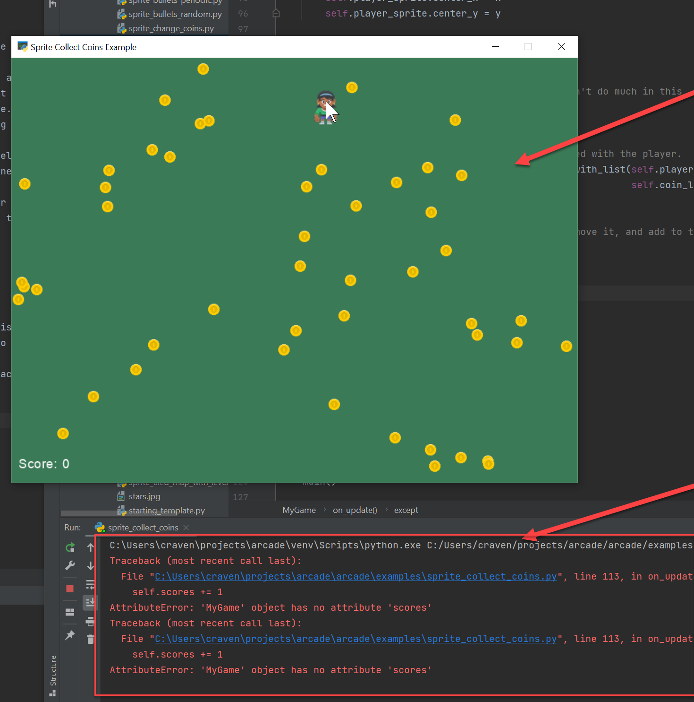
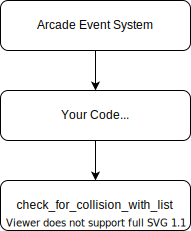

Debugging Programs
==================

Programs almost never run correctly the first time you try them.
It isn't unusual to try fixing an error dozens of times before getting it right.
How can you reduce the time it takes to debug a program?
There are several techniques that can help.

Verify Which Program is Running
-------------------------------

.. image:: frustrated.svg
    :width: 25%
    :class: right-image

A very common issue with debugging is that the computer is running a *different* program than the
one you are editing.
For example, you might create a copy of Lab 8 and move it to Lab 9 because they are similar.
Then you start editing Lab 9, but when you hit run the computer thinks you still want to run Lab 8.
No matter what you do, nothing seems to change.
I've seen students waste hours of time editing one program and running another.

This is *very* common issue if you do web development. The web browser even likes to "cache" web pages
and save time by not asking the server for a new copy.

If it seems like the computer is ignoring your new code, put in a print statement or some other change that will
be very easy to see. Put a print statement at the very start of a function you are debugging to make sure
that function is being called.

Understanding a Stack Trace
---------------------------

.. image:: magnifying-glass.svg
    :width: 25%
    :class: right-image

If your program prints out a **stack trace**, it is a wonderful clue that often points right
towards a bug in your program. In Python, stack traces are also called **tracebacks**.
The two keys to using a stack traces to debug are:

* Noticing that your program is printing a stack trace.
* Understanding how to read a stack trace.

Our first task is even to notice there's a stack trace to look at. In some cases our program might look
like it is running fine,
but a stack trace appears in the console window of your IDE.
It is important to take care of this as soon as it appears, don't ignore it.

In the figure below, there's an exception being printed in the console window. It will be
easier for us to debug as soon as the error appears, rather than later.

   Notice the red text with the stack trace back behind the running program.

The second task is to learn to read a stack trace. Simple stack traces might look like
this:

.. code-block:: text
    :caption: Simple stack trace
    :linenos:

    C:\Users\craven\projects\arcade_book\venv\Scripts\python.exe C:/Users/craven/projects/arcade_book/source/test.py
    Traceback (most recent call last):
      File "C:\Users\craven\projects\arcade_book\source\test.py", line 3, in <module>
        print(my_list[8])
    IndexError: list index out of range

    Process finished with exit code 1

There is a lot of information here:

* Line 1: This shows what Python we are running. There can be many versions of Python installed on a computer.
  Python can have its own "virtual environment" that holds a collection of libraries. The first half of
  this line shows what directory this is stored in. The fact that ``venv`` is in the path tells me it is a
  virtual environment. The second half tells me what program is being run. Quite useful in case I'm running
  the wrong code.
* Line 2: This tells me I'm about to see a traceback. This is tells me where
  the computer detected something was wrong.
* Line 3: This states the file, and the line number where the error occurred.
  Many IDEs, such as PyCharm, will make the error into a link. You just need to click on the error and
  the it will take you straight to the line of code!
* Line 5: This is the type of exception that occurred. We'll learn more about exceptions in a later
  chapter, but you can get an idea of what type of error occurred. In this case, and IndexError happens
  when you try to access array location 8, in an array of items numbered 0 to 7.
  For a full list of exceptions built into Python and their meaning, see:
  `Built-in Exceptions <https://docs.python.org/3/library/exceptions.html>`_.
* Line 7: An exit code of 1 means the program finished with an error. An exit code of 0 is used
  when a program exits without an error. It is possible to have one program run a different program,
  and "exit codes" are a way for the first program to tell if the second program finished successfully.
  We won't use them in this book, but they are really useful if you automate tasks or maintain
  a server.

Multi-Layer Stack Traces
^^^^^^^^^^^^^^^^^^^^^^^^

Not all stack traces are that easy to read. Here is one that is so long it can be scary to look at:

.. code-block:: text

    C:\Users\craven\projects\arcade\venv\Scripts\python.exe C:/Users/craven/projects/arcade/arcade/examples/sprite_collect_coins.py
    Traceback (most recent call last):
      File "C:\Users\craven\projects\arcade\arcade\examples\sprite_collect_coins.py", line 123, in <module>
        main()
      File "C:\Users\craven\projects\arcade\arcade\examples\sprite_collect_coins.py", line 119, in main
        arcade.run()
      File "C:\Users\craven\projects\arcade\arcade\window_commands.py", line 267, in run
        pyglet.app.run()
      File "c:\users\craven\projects\pyglet\pyglet\app\__init__.py", line 107, in run
        event_loop.run(interval)
      File "c:\users\craven\projects\pyglet\pyglet\app\base.py", line 181, in run
        timeout = self.idle()
      File "c:\users\craven\projects\pyglet\pyglet\app\base.py", line 242, in idle
        self.clock.call_scheduled_functions(dt)
      File "c:\users\craven\projects\pyglet\pyglet\clock.py", line 274, in call_scheduled_functions
        item.func(now - item.last_ts, *item.args, **item.kwargs)
      File "C:\Users\craven\projects\arcade\arcade\application.py", line 240, in _dispatch_updates
        self.dispatch_event('on_update', delta_time)
      File "c:\users\craven\projects\pyglet\pyglet\window\__init__.py", line 1311, in dispatch_event
        super().dispatch_event(*args)
      File "c:\users\craven\projects\pyglet\pyglet\event.py", line 429, in dispatch_event
        self._raise_dispatch_exception(event_type, args, getattr(self, event_type), exception)
      File "c:\users\craven\projects\pyglet\pyglet\event.py", line 483, in _raise_dispatch_exception
        raise exception
      File "c:\users\craven\projects\pyglet\pyglet\event.py", line 422, in dispatch_event
        if getattr(self, event_type)(*args):
      File "C:\Users\craven\projects\arcade\arcade\examples\sprite_collect_coins.py", line 106, in on_update
        coins_hit_list = arcade.check_for_collision_with_list(self.coin_list,
      File "C:\Users\craven\projects\arcade\arcade\sprite_list\spatial_hash.py", line 299, in check_for_collision_with_list
        raise TypeError(
    TypeError: Parameter 1 is not an instance of the Sprite class, it is an instance of <class 'arcade.sprite_list.sprite_list.SpriteList'>.

    Process finished with exit code 1

What's going on here?

As we've learned, we can write our code using functions and methods. Functions can call other functions.
A lot of programs, including our video games, are written with layers of these functions and methods.

Arcade has its own code. It runs all the time, periodically calling functions like ``on_draw`` and ``on_update``
as needed.

Our own code calls functions such as ``check_for_collision_with_list``:

There is a "stack" of function calls. We need to identify the code we are writing out of that stack,
as that's most likely where the problem is. See the highlighted lines below:

.. code-block:: text
   :emphasize-lines: 27-28

    C:\Users\craven\projects\arcade\venv\Scripts\python.exe C:/Users/craven/projects/arcade/arcade/examples/sprite_collect_coins.py
    Traceback (most recent call last):
      File "C:\Users\craven\projects\arcade\arcade\examples\sprite_collect_coins.py", line 123, in <module>
        main()
      File "C:\Users\craven\projects\arcade\arcade\examples\sprite_collect_coins.py", line 119, in main
        arcade.run()
      File "C:\Users\craven\projects\arcade\arcade\window_commands.py", line 267, in run
        pyglet.app.run()
      File "c:\users\craven\projects\pyglet\pyglet\app\__init__.py", line 107, in run
        event_loop.run(interval)
      File "c:\users\craven\projects\pyglet\pyglet\app\base.py", line 181, in run
        timeout = self.idle()
      File "c:\users\craven\projects\pyglet\pyglet\app\base.py", line 242, in idle
        self.clock.call_scheduled_functions(dt)
      File "c:\users\craven\projects\pyglet\pyglet\clock.py", line 274, in call_scheduled_functions
        item.func(now - item.last_ts, *item.args, **item.kwargs)
      File "C:\Users\craven\projects\arcade\arcade\application.py", line 240, in _dispatch_updates
        self.dispatch_event('on_update', delta_time)
      File "c:\users\craven\projects\pyglet\pyglet\window\__init__.py", line 1311, in dispatch_event
        super().dispatch_event(*args)
      File "c:\users\craven\projects\pyglet\pyglet\event.py", line 429, in dispatch_event
        self._raise_dispatch_exception(event_type, args, getattr(self, event_type), exception)
      File "c:\users\craven\projects\pyglet\pyglet\event.py", line 483, in _raise_dispatch_exception
        raise exception
      File "c:\users\craven\projects\pyglet\pyglet\event.py", line 422, in dispatch_event
        if getattr(self, event_type)(*args):
      File "C:\Users\craven\projects\myproject\my_code.py", line 106, in on_update
        coins_hit_list = arcade.check_for_collision_with_list(self.coin_list,
      File "C:\Users\craven\projects\arcade\arcade\sprite_list\spatial_hash.py", line 299, in check_for_collision_with_list
        raise TypeError(
    TypeError: Parameter 1 is not an instance of the Sprite class, it is an instance of <class 'arcade.sprite_list.sprite_list.SpriteList'>.

    Process finished with exit code 1

It can be a lot to sift through. Just look for the name of the file that has your code as a quick way of
narrowing it down.

As you get more advanced, you can use this to look at the code in other libraries to understand what
is going on, and possibly even spot bugs in their code.

Use Print Statements
--------------------

.. image:: printout.svg
    :width: 25%
    :class: right-image

One of the most useful debugging tricks is to use the ``print`` statement. This can give you insight
as to what is happening with your program.

Here's an example. Say you are trying to move your player by using the number pad. You want the
player direction to move with the numbers 1-9.

.. image:: numpad.svg
    :width: 25%

But when you use the number pad, your player isn't moving.
You've got code for it in ``on_key_press``:

.. code-block::

    def on_key_press(self, key, modifiers):
        if key == arcade.key.KEY_8:
            self.player_sprite.change_y = MOVEMENT_SPEED
        elif key == arcade.key.KEY_2:
            self.player_sprite.change_y = -MOVEMENT_SPEED
        elif key == arcade.key.KEY_4:
            self.player_sprite.change_x = -MOVEMENT_SPEED
        elif key == arcade.key.KEY_6:
            self.player_sprite.change_x = MOVEMENT_SPEED

First step, add a ``print`` statement to see if we are even getting called:

.. code-block::
    :emphasize-lines: 2

    def on_key_press(self, key, modifiers):
        print("Key pressed!")
        if key == arcade.key.KEY_8:
            self.player_sprite.change_y = MOVEMENT_SPEED
        elif key == arcade.key.KEY_2:
            self.player_sprite.change_y = -MOVEMENT_SPEED
        elif key == arcade.key.KEY_4:
            self.player_sprite.change_x = -MOVEMENT_SPEED
        elif key == arcade.key.KEY_6:
            self.player_sprite.change_x = MOVEMENT_SPEED

.. sidebar:: Use polite language

   Debug statements always find their way into "production" code.

   A common new-programmer mistake it so take express their frustration and put cuss-words
   into the ``print`` statements. Then those print statements make it into production code and
   your customers are cussed at. That's no good.

   I get frustrated too, but never write anything that isn't ok for everyone to see.

We run the program. The print statement runs, and ``Key pressed!`` is output to the screen.
So it turns out, we *are* getting that function called. So let's add another ``print`` statement to see
if our ``if`` statement is getting triggered.

.. code-block::
    :emphasize-lines: 4

    def on_key_press(self, key, modifiers):
        print("Key pressed!")
        if key == arcade.key.KEY_8:
            print("Up key 8 hit!")
            self.player_sprite.change_y = MOVEMENT_SPEED
        elif key == arcade.key.KEY_2:
            self.player_sprite.change_y = -MOVEMENT_SPEED
        elif key == arcade.key.KEY_4:
            self.player_sprite.change_x = -MOVEMENT_SPEED
        elif key == arcade.key.KEY_6:
            self.player_sprite.change_x = MOVEMENT_SPEED

If we run that, turns out the ``if`` statement ISN'T running when we hit the 8 key. So what is the
key that is coming across? Update our ``print`` statement to print the value of ``key``:

.. code-block::
    :emphasize-lines: 2

    def on_key_press(self, key, modifiers):
        print("Key pressed!", key)
        if key == arcade.key.KEY_8:
            print("Up key 8 hit!")
            self.player_sprite.change_y = MOVEMENT_SPEED
        elif key == arcade.key.KEY_2:
            self.player_sprite.change_y = -MOVEMENT_SPEED
        elif key == arcade.key.KEY_4:
            self.player_sprite.change_x = -MOVEMENT_SPEED
        elif key == arcade.key.KEY_6:
            self.player_sprite.change_x = MOVEMENT_SPEED

.. note::

   Eventually we will cover print formatting. A better way to write this line using that would be:

   .. code-block::

       print(f"Key pressed! {key=}")

Depending on if our number lock is on or off, we might get 65362, or a combo of 65407, 65464, 65407!

So the ``KEY_8`` constant in ``arcade.key`` isn't matching. There are a couple ways we can search this up. If you
are using an IDE like Pycharm, you can simply hit "Ctrl-B" while your cursor is on KEY_8 and it will take
you to the definition of ``KEY_8``. Or you can look it up in the arcade documentation at
`arcade.key <https://api.arcade.academy/en/latest/arcade.key.html>`_.

Searching that file, we can see ``KEY_8`` has the number 58, but ``NUM_8`` and ``NUM_UP`` match the numbers we
are getting from our number pad. So we can update our code to:

.. code-block::

    def on_key_press(self, key, modifiers):
        if key == arcade.key.NUM_8 or arcade.key.NUM_UP:
            self.player_sprite.change_y = MOVEMENT_SPEED

Make sure to take out the print statements when you are done. If you don't want to delete them, you can
comment them out. With IDEs like Pycharm, you can just hit Ctrl-/ to quickly comment out any lines you have selected.

Use Logging Commands
--------------------

While ``print`` statements are great for debugging, there disadvantages:

* When you are done, you have to delete your ``print`` statements.
* Sometimes, errors pop up again. Then you need to add your ``print`` statements back.
* You might want debug information to print out for your programmers and testers, but not your customers.
* If there's a problem, you might want to dynamically turn on debugging information so a customer can send you more info.
* You might want to save the debug information in a file, or send it over the network to a monitoring computer.

Most languages have "logging" libraries with functions to do just that.
This has noting to do with logs from trees, but everything to do with logging information.
The easiest way in Python to get
started is to import the logging library at the top of your screen:

.. code-block::

   import logging

Then, instead of using ``print`` use:

.. code-block::

   logging.warning("Key has been pressed.")

And you'll get output that looks like:

.. code-block:: text

    WARNING:root:Key has been pressed.

Logging messages can have several "levels" of important. You can do:

.. code-block::

    # By default these will NOT print
    logging.debug("Debug message.")
    logging.info("Info message.")

    # By default these WILL print
    logging.warning("Warning message.")
    logging.error("Error message.")
    logging.critical("Critical message.")

If you want the less-important debug and info messages to print, at the top of your program you need:

.. code-block::

    logging.basicConfig(level=logging.DEBUG)

You can just put this at the top of your code, or in your ``main()`` function.
But note that you might get debug messages from other libraries you are using!

Group the Logging
^^^^^^^^^^^^^^^^^

To "group" error messages, you can create your own custom logger with a name associated with it.
For example, put this at the top of your program, and you'll have your own custom ``logger``
variable:

.. code-block::

    # Default is set to WARN level for everyone
    logging.basicConfig(level=logging.WARN)
    # Create my own logger
    logger = logging.getLogger("My Game")
    # My logger is set to DEBUG level of detail
    logger.setLevel(logging.DEBUG)

Then you can user ``logger`` instead of ``logging`` when you print debug messages:

.. code-block::

    logger.debug("Debug message.")

...and control if the debug messages are printed by the ``setLevel`` command at the top of your
screen.

Formatting the Log Output
^^^^^^^^^^^^^^^^^^^^^^^^^

You can also format the log output, and add extra information. For example, this complex config command:

.. code-block::

    logging.basicConfig(format='%(asctime)s,%(msecs)d %(levelname)-8s [%(filename)s:%(lineno)d] %(message)s',
        datefmt='%Y-%m-%d:%H:%M:%S',
        level=logging.WARN)

...will produce output that includes the time the message was logged, and the line number of the log message:

.. code-block:: text

    2021-07-29:10:30:56,396 DEBUG    [sprite_move_keyboard.py:106] Debug message.

Google the Error
----------------

.. image:: question.svg
    :width: 25%
    :class: right-image

A lot of times you can plug the error into a search engine and get a result:

.. code-block::

  IndexError: list index out of range

It can also help to put quote marks around the error, as that forces the search engine to not just
look for words in the error, but that exact phrase in that exact order:

.. code-block::

  "IndexError: list index out of range"

You can also add in additional keywords to narrow down the search. Such as the language, and maybe the
library that you are working with.

.. code-block::

  "IndexError: list index out of range" python

At times you might see posts on a message board where someone has had the same error as you, but
there is no follow-up post so you don't know if they solved it. Or worse, they posted they solved
the error but not how.

A website called `Stack Overflow <https://stackoverflow.com/>`_ was put together as a site where
people could keep an archive of these posted questions and their answers.
Many of your searches will end up here. It is a wonderful place to find answers. It is not, however,
always a friendly place to ask your own questions. Which leads us to out next topic.

.. _how_to_ask_questions:

How to Ask Questions
--------------------

Another key skill to debugging code is to learn how to ask a question.
As you are asking someone else to volunteer their time to answer your question, you've got to
make it as easy for them as possible. Otherwise they'll find something better to do.

**Make your question detailed.** For example, a new programmer saying "My program doesn't work, can someone help me?"
forces another person to ask detailed questions, such as: What is wrong? Is it crashing? Is it just operating incorrectly?
What error do you get? What did you expect to happen? What does your code look like?

It takes a lot of time and effort to extract that information, and will usually discourage anyone from following up.
Particularly, because they might not know the answer, so it is a waste of time for everyone.

Spend time detailing all of this. In fact, many programmers (myself included) find that the process of preparing
a question can often lead to the answer without having to actually bother someone else.
This is called `rubber duck programming <https://en.wikipedia.org/wiki/Rubber_duck_debugging>`_ after a
famous story in a book called the *Pragmatic Programmer* where a developer carried around a rubber duck to
explain how his code worked. This thinking process often helped him find his bug. If not, it got him
ready to explain the issue to another developer.

Using the Debugger
------------------

Modern IDEs include a **debugger**. A debugger allows you to step through your code line-by-line and inspect
the values stored in variables. This can be quicker than adding in ``print`` statements.

Debuggers are very powerful tools, but each IDE is a bit different. To get the basics of how PyCharm works,
check out the first part of their `debugger tutorial <https://www.jetbrains.com/help/pycharm/part-1-debugging-python-code.html#summary>`_.
