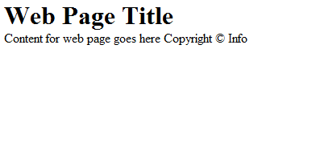
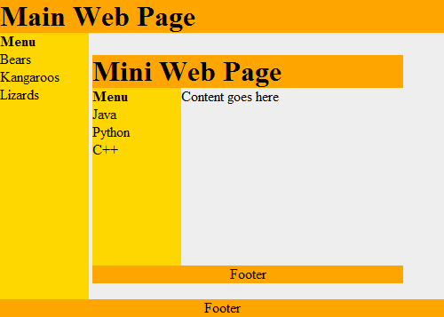
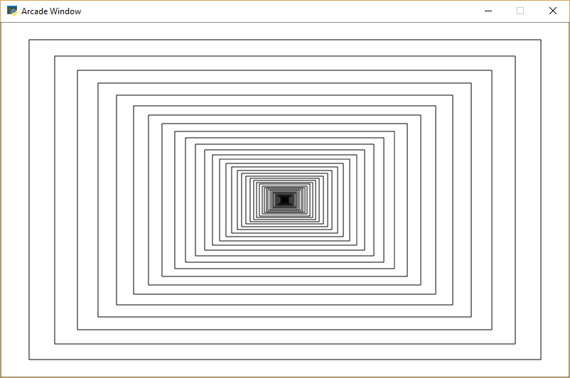
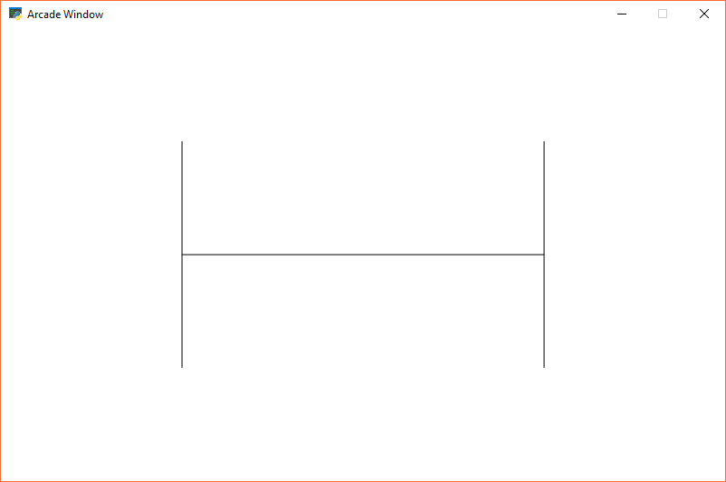
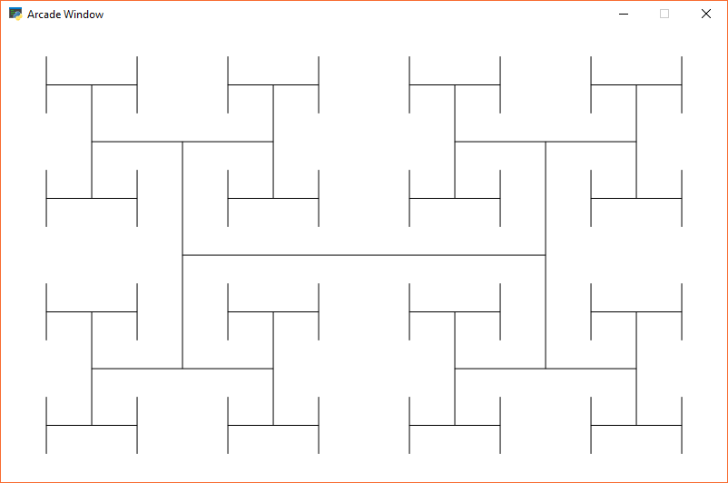
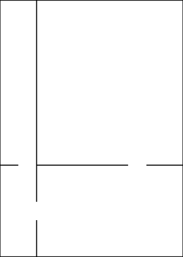
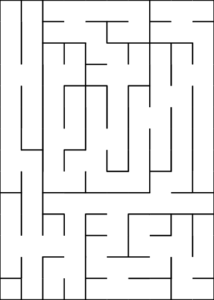

.. sectnum::
    :start: 20

Recursion
=========

.. code-block:: text

    A child couldn't sleep, so her mother told her a story about a little frog,
      who couldn't sleep, so the frog's mother told her a story about a little bear,
        who couldn't sleep, so the bear's mother told her a story about a little weasel...
          who fell asleep.
        ...and the little bear fell asleep;
      ...and the little frog fell asleep;
    ...and the child fell asleep.

(Source: http://everything2.com/title/recursion)

Recursion is an object or process that is defined in terms of itself.
Mathematical patterns such as factorials and the Fibonacci series are
recursive. Documents that can contain other documents, which themselves
can contain other documents, are recursive. Fractal images, and even certain
biological processes are recursive in how they work.

Where is Recursion Used?
------------------------

Documents, such as web pages, are naturally recursive. For example,
Figure 20.1 shows a simple web document.

    Figure 20.1: Web page

That web document can be contained in a "box," which can help layout the
page as shown in Figure 20.2.

.. figure:: webpage2.png

    Figure 20.2: Web page with tables

This works recursively. Each box can contain a web page, that can have a box, which could contain another web page as shown in Figure 20.3.

    Figure 20.3: Web page with recursion

Recursive functions are often used with advanced searching and sorting
algorithms. We'll show some of that here and if you take a "data structures"
class you will see a lot more of it.

Even if a person does not become a programmer, understanding the concept of
recursive systems is important. If there is a business need for recursive
table structures, documents, or something else, it is important to know how
to specify this to the programmer up front.

For example, a person might specify that a web program for recipes needs the
ability to support ingredients and directions. A person familiar with
recursion might state that each ingredient could itself be a recipes with
other ingredients (that could be recipes.) The second system is considerably
more powerful.

How is Recursion Coded?
-----------------------

In prior chapters, we have used functions that call other functions. For example:

.. code-block:: python
    :linenos:
    :caption: Functions calling other functions

    def f():
        g()
        print("f")

    def g():
        print("g")

    f()

It is also possible for a function to call itself. A function that calls itself is using a concept called recursion. For example:

.. code-block:: python
    :linenos:
    :caption: Recursion

    def f():
        print("Hello")
        f()

    f()

The example above will print Hello and then call the ``f()`` function
again. Which will cause another Hello to be printed out and another call
to the ``f()`` function. This will continue until the computer runs out
of something called stack space. When this happens, Python will output a
long error that ends with:

``RuntimeError: maximum recursion depth exceeded``

The computer is telling you, the programmer, that you have gone too far
down the rabbit hole.

Controlling Recursion Depth
---------------------------

To successfully use recursion, there needs to be a way to prevent the
function from endlessly calling itself over and over again. The example
below counts how many times it has been called, and uses an if statement
to exit once the function has called itself ten times.

.. code-block:: python
    :linenos:
    :caption: Controlling recursion levels

    def f(level):
        # Print the level we are at
        print("Recursion call, level",level)
        # If we haven't reached level ten...
        if level < 10:
            # Call this function again
            # and add one to the level
            f(level+1)

    # Start the recursive calls at level 1
    f(1)

.. code-block:: text
    :linenos:
    :caption: Output

    Recursion call, level 1
    Recursion call, level 2
    Recursion call, level 3
    Recursion call, level 4
    Recursion call, level 5
    Recursion call, level 6
    Recursion call, level 7
    Recursion call, level 8
    Recursion call, level 9
    Recursion call, level 10

Recursion Factorial Calculation
-------------------------------

Any code that can be done recursively can be done without using
recursion. Some programmers feel that the recursive code is easier
to understand.

Calculating the factorial of a number is a classic example of using
recursion. Factorials are useful in probability and statistics. For example:

Recursively, this can be described as:

Below are two example functions that calculate . The first one is non-recursive, the second is recursive.

.. code-block:: python
    :linenos:
    :caption: Non-recursive factorial

    # This program calculates a factorial
    # WITHOUT using recursion
    def factorial_nonrecursive(n):
        answer = 1
        for i in range(2, n + 1):
            answer = answer * i
        return answer

.. code-block:: python
    :linenos:
    :caption: Recursive factorial

    # This program calculates a factorial
    # WITH recursion
    def factorial_recursive(n):
        if n == 1:
            return 1
        elif n > 1:
            return n * factorial_recursive(n - 1)

The functions do nothing by themselves. Below is an example where we put it all together. This example also adds some print statements inside the function so we can see what is happening.

.. code-block:: python
    :linenos:
    :caption: Trying out recursive functions

    # This program calculates a factorial
    # WITHOUT using recursion

    def factorial_nonrecursive(n):
        answer = 1
        for i in range(2, n + 1):
            print(i, "*", answer, "=", i * answer)
            answer = answer * i
        return answer

    print("I can calculate a factorial!")
    user_input = input("Enter a number:")
    n = int(user_input)
    answer = factorial_nonrecursive(n)
    print(answer)

    # This program calculates a factorial
    # WITH recursion

    def factorial_recursive(n):
        if n == 1:
            return 1
        else:
            x = factorial_recursive(n - 1)
            print( n, "*", x, "=", n * x )
            return n * x

    print("I can calculate a factorial!")
    user_input = input("Enter a number:")
    n = int(user_input)
    answer = factorial_recursive(n)
    print(answer)

.. code-block:: text
    :linenos:
    :caption: Output

    I can calculate a factorial!
    Enter a number:7
    2 * 1 = 2
    3 * 2 = 6
    4 * 6 = 24
    5 * 24 = 120
    6 * 120 = 720
    7 * 720 = 5040
    5040
    I can calculate a factorial!
    Enter a number:7
    2 * 1 = 2
    3 * 2 = 6
    4 * 6 = 24
    5 * 24 = 120
    6 * 120 = 720
    7 * 720 = 5040
    5040

Recursive Rectangles
--------------------

Recursion is great to work with structured documents that are themselves recursive. For example, a web document can have a table divided into rows and columns to help with layout. One row might be the header, another row the main body, and finally the footer. Inside a table cell, might be another table. And inside of that can exist yet another table.

Another example is e-mail. It is possible to attach another person's e-mail to a your own e-mail. But that e-mail could have another e-mail attached to it, and so on.

Can we visually see recursion in action in one of our Pygame programs? Yes! Figure 19.4 shows an example program that draws a rectangle, and recursively keeps drawing rectangles inside of it. Each rectangle is 20% smaller than the parent rectangle. Look at the code. Pay close attention to the recursive call in the recursive_draw function.

    Figure 20.4: Recursive Rectangles

.. literalinclude:: recursive_rectangles.py
    :caption: recursive_rectangles.py
    :language: python
    :linenos:

Fractals
--------

Fractals are defined recursively. Here is a very simple fractal, showing
how it changes depending on how "deep" the recursion goes.

    Figure 20.5: Recursive Fractal Level 0

.. figure:: recursive_h_01.png

    Figure 20.6: Recursive Fractal Level 1

    Figure 20.7: Recursive Fractal Level 2

.. figure:: recursive_h_05.png

    Figure 20.8: Recursive Fractal Level 5

Here is the source code for the "H" fractal:

.. literalinclude:: recursive_h_05.py
    :caption: recursive_h.py
    :language: python
    :linenos:

You can explore fractals on-line:

* https://www.chromeexperiments.com/fractal
* http://usefuljs.net/fractals/
* http://hirnsohle.de/test/fractalLab/

If you want to program your own fractals, you can get
ideas of easy fractals
by looking at Chapter 8 of `The Nature of Code`_ by Daniel Shiffman.

.. _The Nature of Code: http://natureofcode.com/book/chapter-8-fractals/

Recursive Mazes
---------------

There are maze generation algrithms. Wikipedia has a nice `Maze generation algorithm`_ article that details
some. One way is the *recursive division method*.

The algorithm is described below. Images are from Wikipedia.

.. figure:: chamber.svg
    :width: 25%

    Begin with the maze's space with just the outside walls. Call this a chamber.

.. figure:: chamber-division.svg
    :width: 25%

    Divide the chamber with one random horizontal wall, and one random vertical wall.

    Pick three of the four walls and put a randomly position opening in it.

.. figure:: chamber-subdivision.svg
    :width: 25%

    Subdivide each of the four sections. Call each a chamber. Recursively call this function. In this image, the
    top left chamber has been subdivided.

    Finished maze.

This method results in mazes with long straight walls crossing their space, making it easier to see which areas to avoid.

.. figure:: recursive_maze.gif

    Recursive maze generation. Source: Wikipedia `Maze generation algorithm`_.

.. _Maze generation algorithm: https://en.wikipedia.org/wiki/Maze_generation_algorithm

Here is sample Python code that creates a maze using this method:

.. literalinclude:: recursive_maze_example.py
    :caption: Recursive Maze Example
    :language: python
    :linenos:

Recursive Binary Search
-----------------------

Recursion can be also be used to perform a binary search. Here is a non-recursive binary search from Chapter 15:

.. code-block:: python
    :linenos:
    :caption: Non-recursive binary search

    def binary_search_nonrecursive(search_list, key):
        lower_bound = 0
        upper_bound = len(search_list) - 1
        found = False
        while lower_bound < upper_bound and found == False:
            middle_pos = (lower_bound + upper_bound) // 2
            if search_list[middle_pos] < key:
                lower_bound = middle_pos + 1
            elif search_list[middle_pos] > key:
                upper_bound = middle_pos
            else:
                found = True

        if found:
            print( "The name is at position",middle_pos)
        else:
            print( "The name was not in the list." )

    binary_search_nonrecursive(name_list,"Morgiana the Shrew")

This same binary search written in a recursive manner:

.. code-block:: python
    :linenos:
    :caption: Recursive binary search

    def binary_search_recursive(search_list, key, lower_bound, upper_bound):
        middle_pos = (lower_bound + upper_bound) // 2
        if search_list[middle_pos] < key:
            binary_search_recursive(search_list,
                                    key,
                                    middle_pos + 1,
                                    upper_bound)
        elif search_list[middle_pos] > key:
            binary_search_recursive(search_list,
                                    key,
                                    lower_bound,
                                    middle_pos )
        else:
            print("Found at position", middle_pos)

    lower_bound = 0
    upper_bound = len(name_list) - 1
    binary_search_recursive(name_list,
                            "Morgiana the Shrew",
                            lower_bound,
                            upper_bound)
