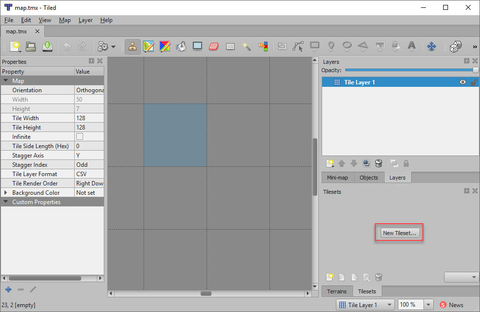
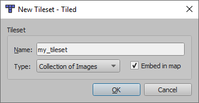
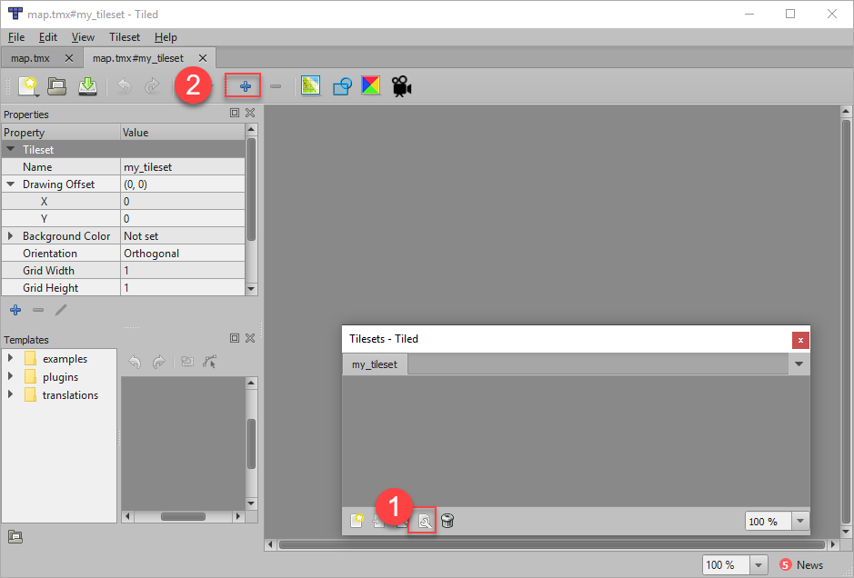

.. _platformers:

Platformers
===========

Ever wanted to create your own platformer?
It isn't too hard! Here's an example to get started.

Map File The Hard Way
---------------------

Creating The Map
~~~~~~~~~~~~~~~~

First, we need a map. This is a "map" file created with the Tiled_ program. The program is free. You can
download it and use it to create your map file.

In this map file the numbers represent:

.. _Tiled: http://www.mapeditor.org/

======= ==================
Number  Item
======= ==================
-1      Empty square
0       Crate
1       Left grass corner
2       Middle grass corner
3       Right grass corner
======= ==================

You can download these tiles (originally from kenney.nl) here:

.. image:: boxCrate_double.png

.. image:: grassLeft.png

.. image:: grassMid.png

.. image:: grassRight.png

Of course, you'll need a character to jump around the map:

.. image:: character.png

Here is the map file:

.. literalinclude:: map.csv
    :caption: map.csv
    :language: text
    :linenos:

The Tiled_ program takes some getting used to. You start off with a screen like
this, and you can create a new map here:

.. image:: tiled_new_map.png
    :width: 50%

Then set up your map like this, adjusting the size of the map and the size of your
images accordingly. (All your images need to be the same size. Don't guess
this number, look at the properties of the image and find how big it is.)

.. image:: tiled_new_file.png
    :width: 50%

Most of the tiles from kenney.nl are 128x128 pixels. In the image above I've got a 7 tile high, by 50 pixel wide
side-scroll map.

After this, you have to create a new "tile set." Find the button for that:

I use these settings:

You can add the images as tiles to your tileset. I don't find this obvious, but
you click the wrench icon, then the plus icon:

These "tiles" will be all the images for your map, and the numbers they
associate with:

.. image:: tiled_new_tileset.png
    :width: 75%

The numbers of the tiles correspond to the order you added the tiles. I don't think you can change the mapping
after you create the tileset.

Next, you "paint" your map:

.. image:: tiled_make_map.png
    :width: 100%

When you are done, you can "Export as" a CSV file.

Reading The Map
~~~~~~~~~~~~~~~

Next, we want to read in this grid of numbers where each number is separated
by a comma. We know how to read in a file,
but how do you process a comma delimited file?

We've learned how to take a string and use the functions:

* ``upper()``
* ``lower()``
* ``strip()``

There's another function called ``split()``. This function will split apart
a string into a list based on a delimiter. For example:

.. code-block:: python
    :linenos:

    # A comma delimited string of numbers
    my_text_string = "23,34,1,3,5,10"

    # Split the string into a list, based on the comma as a delimiter
    my_list = my_text_string.split(",")

    # Print the result
    print(my_list)

This prints:

.. code-block:: text

    ['23', '34', '1', '3', '5', '10']

Which is close to what we want, except the list is a list of text, not numbers.

We can convert the list by:

.. code-block:: python

    # Convert from list of strings to list of integers
    for i in range(len(my_list)):
        my_list[i] = int(my_list[i])

We haven't covered it a lot, but you can also use ``enumerate`` to do the
same thing:

.. code-block:: python

    # Convert from list of strings to list of integers
    for index, item in enumerate(my_list):
        my_list[index] = int(item)

Or use a list comprehension:

.. code-block:: python

    # Convert from list of strings to list of integers
    my_list = [int(item) for item in my_list]

Python does have built-in code for working with csv files. If you want, you
can read about the `csv library` in the official documentation.

.. _csv library: https://docs.python.org/3/library/csv.html

In the listing below, we've put this into a function called ``get_map``.
We use that grid and position our sprites based on the grid. See the highlighted
sections below:

Python Program
--------------

.. literalinclude:: sprite_tiled_map_simple.py
    :caption: Platformer example, simple
    :language: python
    :linenos:
    :emphasize-lines: 25-56, 99-130

Other Examples
--------------

* If you are looking for platforms that move, see `Sprite Moving Platforms`_.
* If you are looking to be able to create ramps you can run up and down, see `Sprite Ramps`_.

.. _Sprite Moving Platforms: http://arcade.academy/examples/sprite_moving_platforms.html

.. _Sprite Ramps: http://arcade.academy/examples/sprite_ramps.html#sprite-ramps
