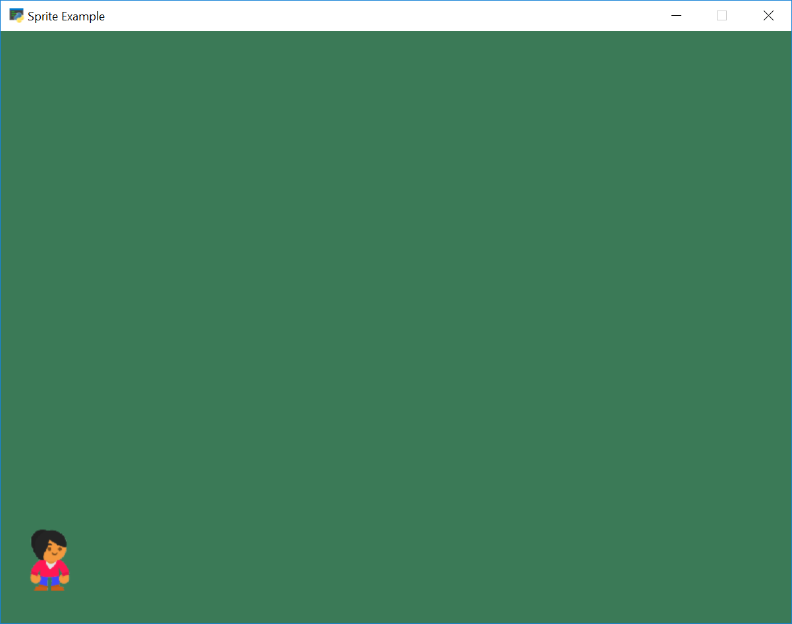

.. _sprites-and-walls:

Sprites and Walls
=================

Setup
-----

Many games with sprites often have "walls" that the character can't move
through. There are rather straight-forward to create.

To begin with, let's get a couple images. Our character, and a box that will
act as a blocking wall. Both images are from `kenney.nl`_.

.. _kenney.nl: http://kenney.nl/

.. figure:: images/character.png
    :width: 50px

    images/character.png

.. figure:: images/boxCrate_double.png
    :width: 50px

    images/boxCrate_double.png

Start with a default file:

.. literalinclude:: start_file.py
    :caption: sprite_move_walls.py start
    :language: python
    :linenos:

In the ``__init__`` method, let's create some variables to hold our sprites:

.. code-block:: python

    # Sprite lists
    self.player_list = None
    self.wall_list = None

    # Set up the player
    self.player_sprite = None

    # This variable holds our simple "physics engine"
    self.physics_engine = None

In the ``setup`` method, let's create our sprite lists:

.. code-block:: python

    # Sprite lists
    self.player_list = arcade.SpriteList()
    self.wall_list = arcade.SpriteList()

Then reset the score and create the player:

.. code-block:: python

    # Reset the score
    self.score = 0

    # Create the player
    self.player_sprite = arcade.Sprite("images/character.png", SPRITE_SCALING_PLAYER)
    self.player_sprite.center_x = 50
    self.player_sprite.center_y = 64
    self.player_list.append(self.player_sprite)

Then go ahead and draw everything in our ``on_draw``:

.. code-block:: python

    def on_draw(self):
        arcade.start_render()
        self.wall_list.draw()
        self.player_list.draw()

Run the program and make sure it works.

.. _individual_wall_placement:

Individually Placing Walls
--------------------------
In our ``setup`` method, we can position individual boxes to be used as "walls":

.. code-block:: python

    # Manually create and position a box at 300, 200
    wall = arcade.Sprite("images/boxCrate_double.png", SPRITE_SCALING_BOX)
    wall.center_x = 300
    wall.center_y = 200
    self.wall_list.append(wall)

    # Manually create and position a box at 364, 200
    wall = arcade.Sprite("images/boxCrate_double.png", SPRITE_SCALING_BOX)
    wall.center_x = 364
    wall.center_y = 200
    self.wall_list.append(wall)

Go ahead and try it out. It should look like:

.. image:: with_two_boxes.png

Full listing below:

.. literalinclude:: step_2.py
    :caption: sprite_move_walls.py Step 2
    :language: python
    :linenos:

.. _loop_wall_placement:

Placing Walls With A Loop
-------------------------

In our ``setup`` method, we can create a row of box sprites using a ``for``
loop. In the code below, our y value is always 350, and we change the x value
from 173 to 650. We put a box every 64 pixels because each box happens to be
64 pixels wide.

.. code-block:: python

    # Place boxes inside a loop
    for x in range(173, 650, 64):
        wall = arcade.Sprite("images/boxCrate_double.png", SPRITE_SCALING_BOX)
        wall.center_x = x
        wall.center_y = 350
        self.wall_list.append(wall)

.. image:: boxes_loop.png

.. _list_wall_placement:

Placing Walls With A List
-------------------------

You could even create a list of coordinates, and then just loop through that list creating walls:

.. code-block:: python

    # --- Place walls with a list
    coordinate_list = [[400, 500],
                       [470, 500],
                       [400, 570],
                       [470, 570]]

    # Loop through coordinates
    for coordinate in coordinate_list:
        wall = arcade.Sprite("images/boxCrate_double.png", SPRITE_SCALING_BOX)
        wall.center_x = coordinate[0]
        wall.center_y = coordinate[1]
        self.wall_list.append(wall)

.. image:: list.png

Full listing below:

.. literalinclude:: step_3.py
    :caption: sprite_move_walls.py Step 3
    :language: python
    :linenos:

Physics Engine
--------------

First, we need to hook the keyboard up to the player:

.. code-block:: python

    def on_key_press(self, key, modifiers):
        """Called whenever a key is pressed. """

        if key == arcade.key.UP:
            self.player_sprite.change_y = MOVEMENT_SPEED
        elif key == arcade.key.DOWN:
            self.player_sprite.change_y = -MOVEMENT_SPEED
        elif key == arcade.key.LEFT:
            self.player_sprite.change_x = -MOVEMENT_SPEED
        elif key == arcade.key.RIGHT:
            self.player_sprite.change_x = MOVEMENT_SPEED

    def on_key_release(self, key, modifiers):
        """Called when the user releases a key. """

        if key == arcade.key.UP or key == arcade.key.DOWN:
            self.player_sprite.change_y = 0
        elif key == arcade.key.LEFT or key == arcade.key.RIGHT:
            self.player_sprite.change_x = 0

Now, we need to add a way to stop the player from running into walls.

The Arcade Library has a built in "physics engine." A physics engine handles
the interactions between the virtual physical objects in the game.
For example, a physics engine might be several balls running into each other,
a character sliding down a hill, or a car making a turn on the road.

Physics engines have made impressive gains on what they can simulate. For our
game, we'll just keep things simple and make sure our character can't walk
through walls.

We'll create variable to hold our physics engine in the ``__init__``:

.. code-block:: python

    # This variable holds our simple "physics engine"
    self.physics_engine = None

We can create the actual physics engine in our ``setup`` method with the following
code:

.. code-block:: python

    self.physics_engine = arcade.PhysicsEngineSimple(self.player_sprite, self.wall_list)

This identifies the player character (``player_sprite``), and a list of sprites
(``wall_list``) that the player character isn't allowed to pass through.

Before, we updated all the sprites with a ``self.all_sprites_list.update()``
command. With the physics engine, we will instead update the sprites by using
the physics engine's update:

.. code-block:: python

    def update(self, delta_time):
        self.physics_engine.update()

The simple physics engine follows the following algorithm:

* Move the player in the x direction according to the player's ``change_x``
  value.
* Check the player against the wall list and see if there are any collisions.
* If the player is colliding:

    * If the player is moving right, set the player's right edge to the wall's
      left edge.
    * If the player is moving left, set the player's left edge to the wall's
      right edge.
    * If the player isn't moving left or right, print out a message that we
      are confused how we hit something when we aren't moving.

* Then we just do the same thing, except with the y coordinates.

You can see the `physics engine source code`_ on GitHub.

.. _physics engine source code: https://github.com/pvcraven/arcade/blob/master/arcade/physics_engines.py

Here's the full example:

.. literalinclude:: step_4.py
    :caption: sprite_move_walls.py
    :language: python
    :linenos:

Using a Camera for Scrolling
----------------------------

What if one screen isn't enough to hold your maze of walls? We can have a
world that is larger than just our window.
Then we simply move a **camera** that defines what part of the world we
want to see.

Normally coordinate (0, 0) is the lower left corner of our screen.
We can change that! We could have an entire world stretch from (0, 0) to
(3000, 3000), and have a smaller camera view that is 800x600, which we scrolled
around that large view.

There is also part of the view that we typically *don't* want to have scroll
around the screen. For example, we may want the score to show in the lower left
corner of the screen. We want it fixed there no matter where our view into
the world is. To do that, we'll have not one, but *two* cameras. One for the
larger world, and one for our score (or anything in the heads-up-display.)

To do this, let's create two cameras in our Window class's ``__init__`` method.
Both of these cameras will have a field-of-view set to the same size as the window.

.. code-block:: python

    # Create the cameras. One for the GUI, one for the sprites.
    # We scroll the 'sprite world' but not the GUI.
    self.camera_for_sprites = arcade.Camera(SCREEN_WIDTH, SCREEN_HEIGHT)
    self.camera_for_gui = arcade.Camera(SCREEN_WIDTH, SCREEN_HEIGHT)

Now we have cameras. We just need to use the cameras. In the Window's ``draw`` method,
select which camera we want to use before we draw.

.. code-block:: python

    def on_draw(self):
        arcade.start_render()

        # Select the scrolled camera for our sprites
        self.camera_for_sprites.use()

        # Draw the sprites
        self.wall_list.draw()
        self.player_list.draw()

        # Select the (unscrolled) camera for our GUI
        self.camera_for_gui.use()
        arcade.draw_text(f"Score: {self.score}", 10, 10, arcade.color.WHITE, 24)

At this point the program should run, but since we haven't moved the camera, it will still look
the same.

To scroll the camera, we'll add code to calculate the coordinates of the lower-left corner of our camera.
Then call the camera's ``move_to`` method to scroll there.

.. code-block:: python

    def on_update(self, delta_time):
        """ Movement and game logic """

        # Call update on all sprites (The sprites don't do much in this
        # example though.)
        self.physics_engine.update()

        # Scroll the screen to the player
        self.scroll_to_player()

        # Scroll the window to the player.
        #
        # If CAMERA_SPEED is 1, the camera will immediately move to the desired position.
        # Anything between 0 and 1 will have the camera move to the location with a smoother
        # pan.
        CAMERA_SPEED = 1
        lower_left_corner = (self.player_sprite.center_x - self.width / 2,
                             self.player_sprite.center_y - self.height / 2)
        self.camera_for_sprites.move_to(lower_left_corner, CAMERA_SPEED)

The full example is below:

.. literalinclude:: step_5.py
    :caption: sprite_move_scrolling.py
    :language: python
    :linenos:

Another example is to just keep the user in a "box" and allow her to move inside that box without scrolling.

https://api.arcade.academy/en/latest/examples/sprite_move_scrolling_box.html