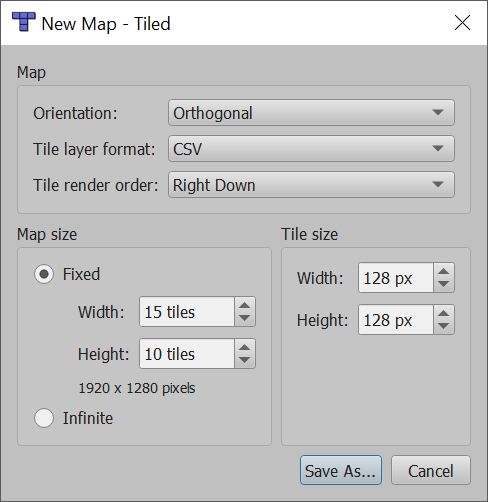
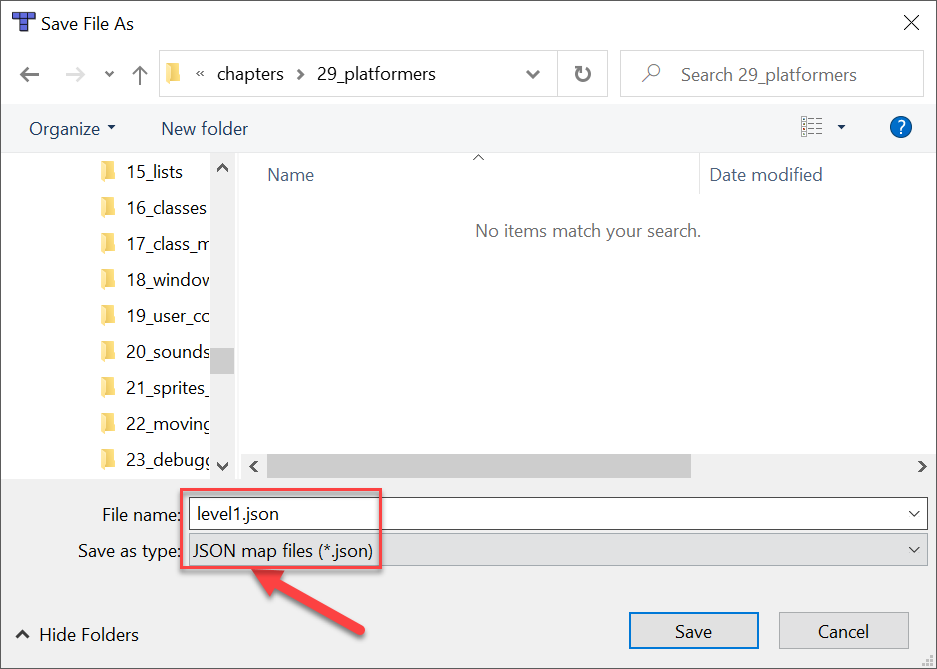

.. _platformers:

Platformers
===========

In :ref:`sprites-and-walls` we learned how to keep sprites from moving through walls. How can we expand on that
to create a side-scrolling platformer game? We'd need an easier way to position our tiles, a way to add in gravity,
and a way to jump.

For full tutorials on how to do this, see:

* See the `Simple Platformer Tutorial <https://api.arcade.academy/en/latest/examples/platform_tutorial/index.html>`_.
* For more advanced usage, see `Platformer with Physics <https://api.arcade.academy/en/latest/tutorials/pymunk_platformer/index.html>`_.

Using the Tiled Map Editor
--------------------------

Download/install tiled from here:
https://www.mapeditor.org/

Create a new map:

Use your own same-sized tiles, or download from resources tab on class website.
I highly recommend the resource packs from Kenney.nl. Most of his resources are 128x128 pixels.

Make sure tileset and map are stored in JSON format. Currently the Tiled program defaults to the .tmx
format both for the map and the tileset.

Before you can do anything with your map, you'll ned a set of tiles to put them down.

.. image:: noew_tileset.png

Loading the Tiled Map
---------------------

To get your map up and working, start with this code:
https://api.arcade.academy/en/latest/examples/sprite_move_scrolling.html

Remove the code in ``setup`` that places the blocks, and replace it with code to load our map:

.. code-block:: python

    # Set this to the name of your map.
    # Make sure it is saved in the same directory as your program.
    map_name = "level1.json"

    # Read in the tiled map
    self.tile_map = arcade.load_tilemap(map_name, scaling=TILE_SCALING)

    # Set wall SpriteList and any others that you have.
    self.wall_list = self.tile_map.sprite_lists["Walls"]
    # self.coin_list = self.tile_map.sprite_lists["Coins"]

    # Set the background color to what is specified in the map
    if self.tile_map.background_color:
        arcade.set_background_color(self.tile_map.background_color)

    # Keep player from running through the wall_list layer
    self.physics_engine = arcade.PhysicsEnginePlatformer(
        self.player_sprite, self.wall_list, gravity_constant=GRAVITY
    )

Then

.. code-block:: python

    def on_key_press(self, key, modifiers):
        """ Called whenever a key is pressed. """

        # Does the player want to jump?
        if key == arcade.key.SPACE:
            # See if there is a floor below us
            if self.physics_engine.can_jump():
                self.player_sprite.change_y = JUMP_SPEED
        elif key == arcade.key.LEFT:
            self.player_sprite.change_x = -PLAYER_MOVEMENT_SPEED
        elif key == arcade.key.RIGHT:
            self.player_sprite.change_x = PLAYER_MOVEMENT_SPEED

.. literalinclude:: main_better.py
    :caption: platformer_example.py
    :language: python
    :linenos: