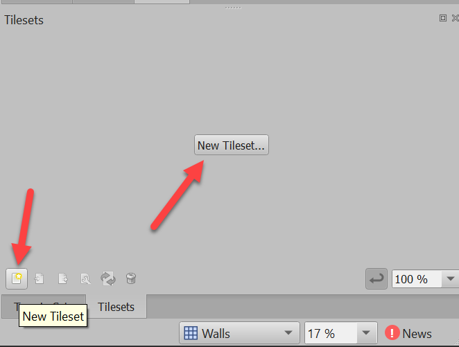
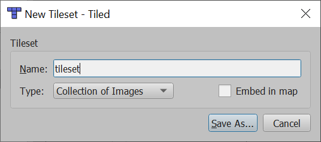
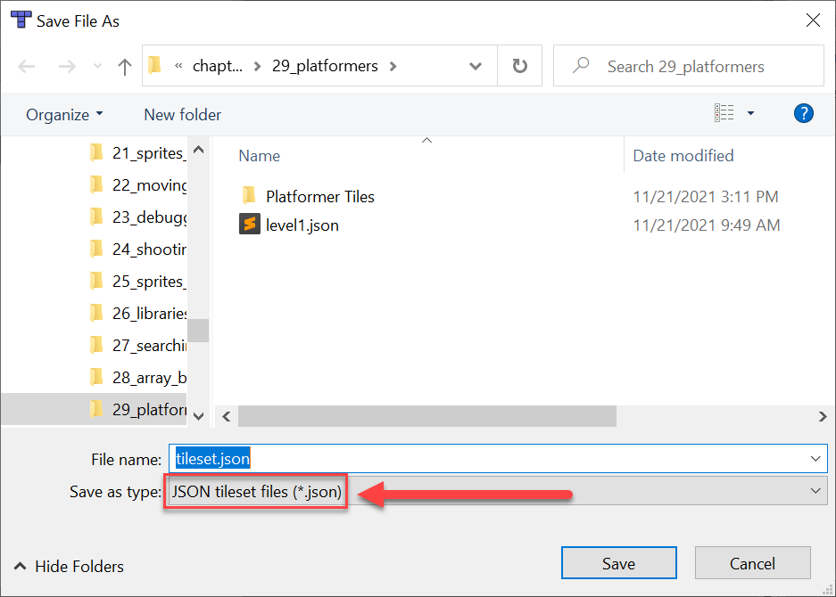
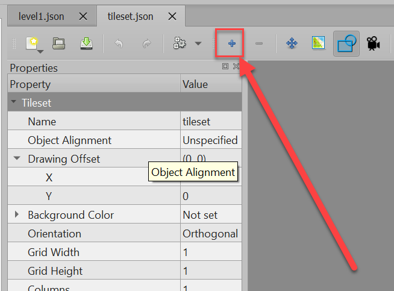
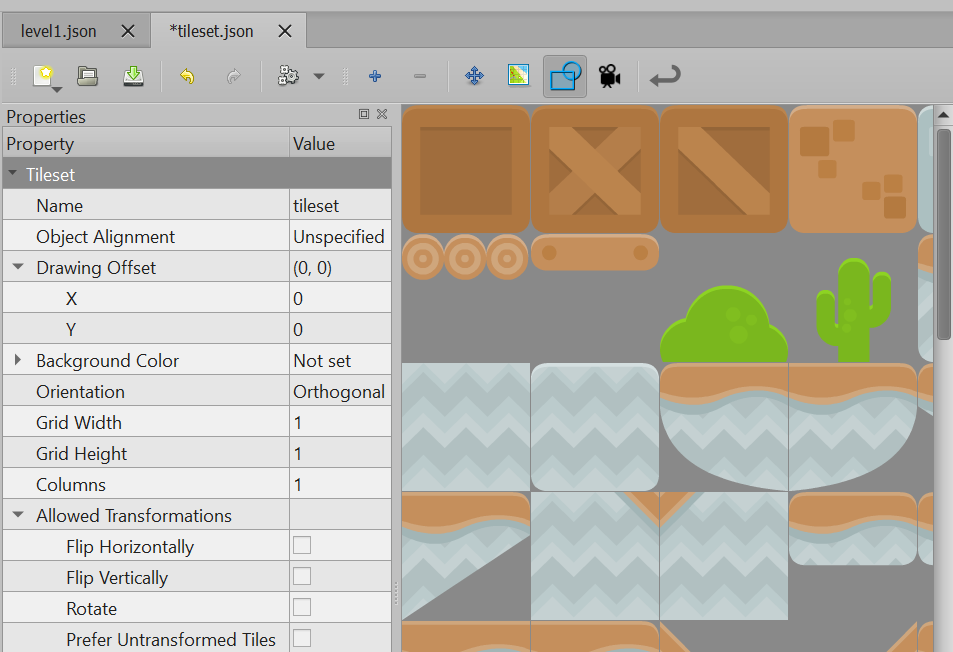
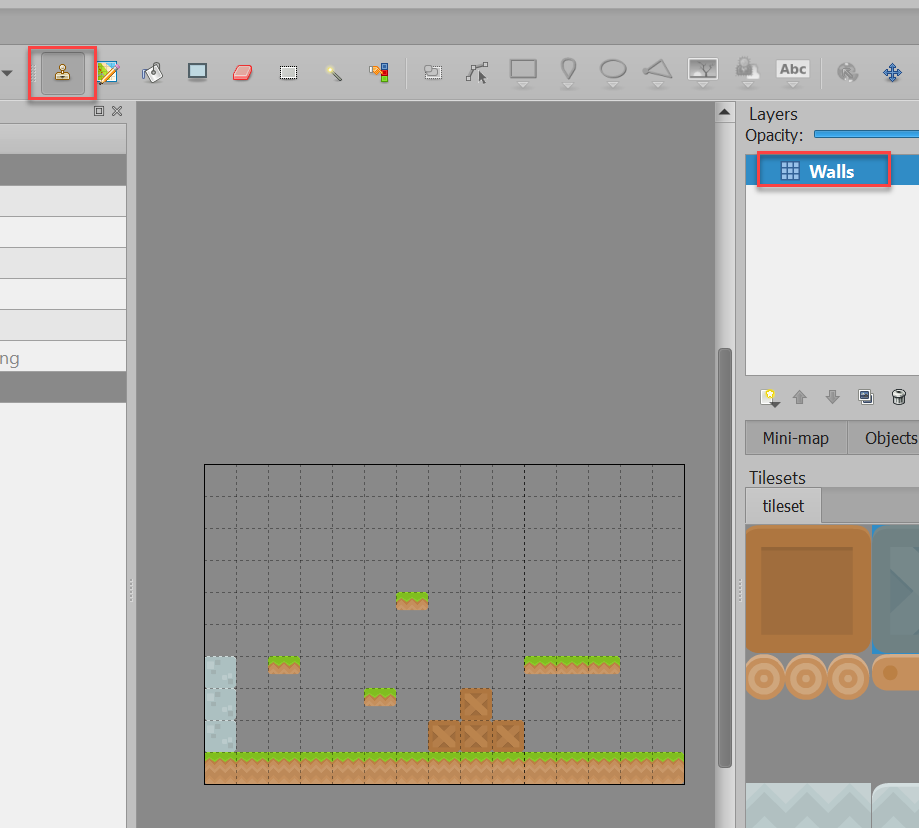
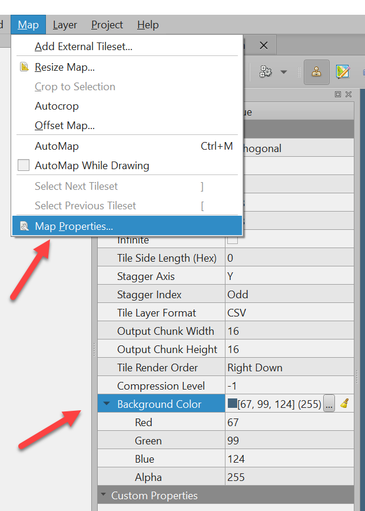

.. include:: <isonum.txt>

.. _platformers:

Platformers
===========

.. image:: platformer.png
    :width: 35%
    :class: right-image

In :ref:`sprites-and-walls` we learned how to keep sprites from moving through walls. How can we expand on that
to create a side-scrolling platformer game? This chapter has three goals to aid in that:

* Get an easier way to position our tiles and create a level
* Add in gravity
* Find a way to jump

Using the Tiled Map Editor
--------------------------

We learned how to lay out sprite walls via code, but wouldn't it be better to do that visually?
There's a great editor called Tiled. Arcade can load in files that Tiled saves and easily make
a ``SpriteList`` out of them.

To get started, download and install Tiled from here:
https://www.mapeditor.org/

Next, start up the program and create a new map. From the menu bar select File |rarr| New |rarr| New Map
and then you should get this window:

.. image:: new_map.png
   :width: 50%

When you create your map, make sure that you set the tile size to be the same as the size of your tiles.
All your tiles need to be the same size.
You can use your own same-sized tiles, or find some on the web.
I highly recommend the Game Asset packs from
`Kenney.nl <https://kenney.nl/assets?q=2d>`_. Those tile resources are 128x128 pixels.

To get started, create a small map.
I suggest 15 wide, by 10 high.
You can always make it bigger after you get things working.

Make sure tileset and map are stored in JSON format. Currently the Tiled program defaults to the TMX
format both for the map and the tileset.

.. image:: save_as_map.png
   :width: 75%

So great! We've got a map now. But we can't really draw on the map.
Before you can start drawing anything with your map, you'll need a **tileset**.
A tileset is a collection of tiles that you can use to 'paint' onto your map.

It is a little hidden, but there are a couple buttons in the lower right
that will create a new tileset. Either one works, but the big button only
shows up when you don't already have a tileset loaded.

Once you've clicked to create a tileset, you can either have a tileset made out of one
image that has all the tiles, or a collection of individual images. I usually
manage the sprites as a collection of individual files.

You can embed the tileset into your map file, or keep it as a separate file.
Keeping it as a separate file will allow you to reuse the tileset across multiple maps.

When you save the tileset, make sure you save it in JSON format:

You should have two tabs now. One for your map, one for your tileset.
Now we need to add our individual tile images to our tileset. Click the plus button:

You can select all the images in a folder by clicking Ctrl-A for "All". Then you'll have
those tiles in the tileset:

Next, draw out your map. Also, change the name of your layer from "Layer 1" to something like "Walls".
(That's what we'll use in our code examples.)

You should also select a background color for your map:

Once you've planned out a quick sample map,
make sure you save both the map and the tileset. If there is an asterisk (*)
in the tab at the top, the file is *not* saved.

Now, let's try to load it.

Loading the Tiled Map
---------------------

To get your map up and working, start with this code that supports
moving around a scrolling window:
https://api.arcade.academy/en/latest/examples/sprite_move_scrolling.html

Remove the code in ``setup`` that places the blocks, and replace it with
this code to load our map instead:

.. code-block:: python
    :caption: Loading tile map in the setup function

    # Set this to the name of your map.
    # Make sure it is saved in the same directory as your program.
    map_name = "level1.json"

    # Read in the tiled map
    self.tile_map = arcade.load_tilemap(map_name, scaling=TILE_SCALING)

    # Set wall SpriteList and any others that you have.
    self.wall_list = self.tile_map.sprite_lists["Walls"]
    # self.coin_list = self.tile_map.sprite_lists["Coins"]

    # Set the background color to what is specified in the map
    if self.tile_map.background_color:
        arcade.set_background_color(self.tile_map.background_color)

Right after that code (still in ``setup``), we need our physics engine.
If we want a side-scroller with gravity instead of a top-down
view, we replace ``SimplePhysicsEngine`` with ``PhysicsEnginePlatformer``. Then we also add
in a ``GRAVITY`` constant. Try setting it to 0.5 to start.

.. code-block:: python
    :caption: Platformer physics engine

    # Keep player from running through the wall_list layer
    self.physics_engine = arcade.PhysicsEnginePlatformer(
        self.player_sprite, self.wall_list, gravity_constant=GRAVITY
    )

Then, adjust your ``on_key_press`` method to support jumping.
The ``PhysicsEnginePlatformer`` has a built-in method called ``can_jump``
that looks to see if the player has a solid block right below her. If she does,
then the function returns true. This keeps the player from being able to jump
in the air. Set the ``JUMP_SPEED`` constant to 10 to start with, and adjust until
you get it where you like.

.. code-block:: python

    def on_key_press(self, key, modifiers):
        """ Called whenever a key is pressed. """

        # Does the player want to jump?
        if key == arcade.key.SPACE:
            # See if there is a floor below us
            if self.physics_engine.can_jump():
                self.player_sprite.change_y = JUMP_SPEED
        elif key == arcade.key.LEFT:
            self.player_sprite.change_x = -PLAYER_MOVEMENT_SPEED
        elif key == arcade.key.RIGHT:
            self.player_sprite.
            change_x = PLAYER_MOVEMENT_SPEED

A full listing:

.. literalinclude:: main_better.py
    :caption: platformer_example.py
    :language: python
    :linenos:

Additional Information
----------------------

* See the `Simple Platformer Tutorial <https://api.arcade.academy/en/latest/examples/platform_tutorial/index.html>`_.
* For more advanced usage, see `Platformer with Physics <https://api.arcade.academy/en/latest/tutorials/pymunk_platformer/index.html>`_.

