.. _lab-01:

Lab 1: First Program
====================

For this lab you will turn in via Scholar a BitBucket URL to the program that
you will create after following this tutorial.

.. image:: copy_url.png
	:width: 400px

This lab/tutorial has three parts:

* Part 1: Write your first program (easy)
* Part 2: Put your first program in version control, and upload it to the server
  (medium)
* Part 3: Learn to update and merge changes to your program (hard)

Part 1: First Program
---------------------

* Start PyCharm. If you've got it installed, just hit the "Window" key and
  start typing in "PyCharm".
* Create a "Pure Python" project. Select a project name like "CMSC 150". We'll
  use the same project for everything we do in class. Don't create any other
  projects. **Important:** Figure out where you want to save your project. If
  you've got your own computer you'll be hauling around, great. If you've got
  a flash drive, use that. You might want to try a network drive. (Simpson uses
  the drive H:) If you store it on a lab computer, you'll have more headaches
  later.
* Create a new directory. Call it ``Lab 01 - First Program``. We'll have a new
  directory for each lab. If you want to create a "scratch" program to play
  around with, put it in a new directory. Give your directory a good name,
  so you can go back and find the code easier.

.. image:: new_directory.png
	:width: 150px

* Right click on the directory you just created.
  Create a new "Python File". Call it ``lab_01.py`` Make sure it appears in the
  new directory.

.. image:: new_python_file.png
	:width: 450px

* Type in your program. We will use a function called ``print`` to print
  something to the screen. Like the sine and cosine functions you used in
  math, we follow the function name with parentheses. We put the
  function parameter inside. With a sine function, we put in an angle. With
  the ``print`` function, we put what we want to print. It has to be in quotes.

::

    print("Hello there")

* Note that case matters. The following will not work

::

	Print("Hello there")

* Great! Time to run it.
  Right-click on the program and select "Run 'lab_01.py'"
* See the output of your program at the bottom of the screen. Click the image
  below to make it better and note the:

  * Right margin. You can write code past this point, but don't.
  * Where you can hover your mouse for "hints" on how to make your code better.
  * Where you can quickly click to run your program again.

.. image:: pycharm_window.png

Great! Your first program was the easy part. Now, how do we turn it in? That
takes some work to get set up.

Part 2: Checking the Program into Version Control
-------------------------------------------------

In this section we will:

* Install SourceTree
* Create your project on the Bitbucket server
* Create your project on your local computer
* Link the two together

Installing SourceTree
^^^^^^^^^^^^^^^^^^^^^

Changes that you and other developers make to the code are stored in "code
repositories."

Just like the web can be browsed with different web browsers, code repositories
can be browsed with different clients. We'll use a client called SourceTree.

Download SourceTree from:

http://www.sourcetreeapp.com

SourceTree is a nice GUI application that helps work with our repositories.
It actually works on top of tools like *Git* and *Mercurial* to make them easier
to use. These tools are "command-line" tools that operate only by typing in
commands. They have no menus.
You can do a lot more by manually typing in commands on the command line,
but that is beyond the scope of this tutorial. And so we use SourceTree.

You will need to `create an account with Atlassian`_. Accounts ending in ``.edu``
can get extra features, so I recommend signing up with your school e-mail.

Installation of SourceTree should be straight-forward. However, when your first
run SourceTree it wants to do *more* setup. You'll see a screen like this:

.. image:: source_tree_setup_1.png
    :width: 400px

Then you will need to log in with that Atlassian account you created:

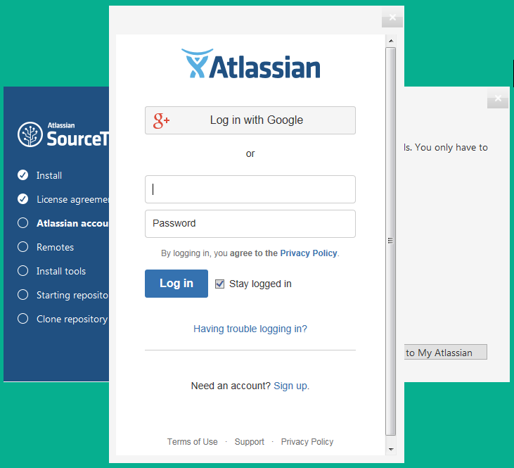

You could hook up Bitbucket here. But don't. Just skip this step:

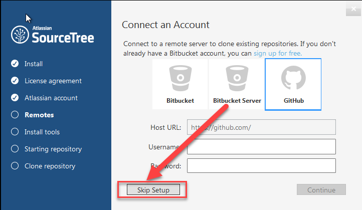

You probably don't have an SSH key. So skip this step. (I like how the text says
click "no" but there is not a button named "no.")

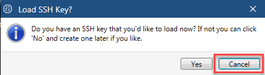

SourceTree is a pretty GUI on top of Git. So we need a copy of Git. Go ahead
and install it:

.. image:: source_tree_setup_5.png
    :width: 350px

Then do the same thing with Mercurial:

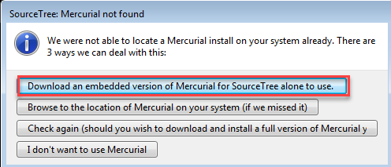

Creating Your Project in Bitbucket
^^^^^^^^^^^^^^^^^^^^^^^^^^^^^^^^^^

* Go to Bitbucket, select "Repositories" and "Create repository"

.. image:: new_bitbucket_repository.png

* Call your repository "CMSC 150 Firstname Lastname". Obviously, change the
  first name and last name to your name.
* Make sure the repository is set to "private" so that no one else copies your
  homework.
* Change the repository type to "Git"

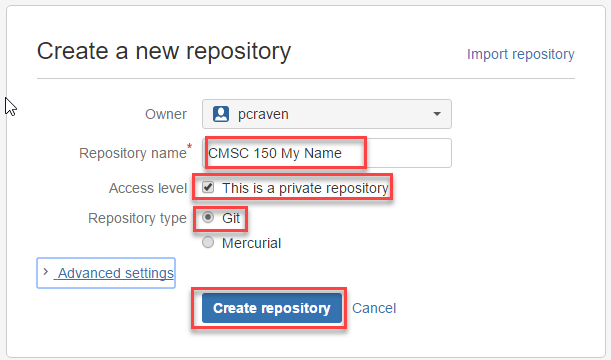

* Copy the repository address from here:

.. image:: get_repository_address.png

Create Your Project in SourceTree
^^^^^^^^^^^^^^^^^^^^^^^^^^^^^^^^^

* Open the SourceTree program on your computer.
* Click the Clone/New button.
* Select the "Create New Repository" tab.
* Click on the button with three dots, and browse to the folder where you
  stored your project. Select the "CMSC 150" folder, not the folder with
  Lab 01. We want *all* the labs to be part of this project, not just one.

.. image:: create_repository.png

* Now we need to commit our files. Once we do this, we can always go back and
  get this version again. The purple question mark means these files aren't
  being tracked. Click the top check box, and then all the files will get a
  checkbox and be set for tracking.
* Add a comment at the bottom. Don't leave it blank.
* Hit "Commit"

.. image:: first_commit.png

* Now we can see our commit if we click on the "master" branch

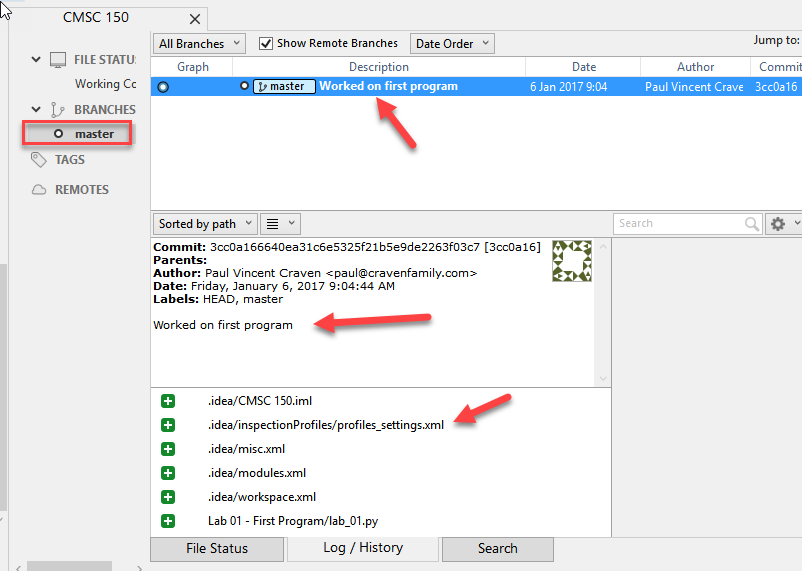

* Ok. This exists only on our computer. We want to move it to the server so
  other people can look at it, and we have a backup if we can't get to this
  computer. Select "Repository" then "Repository Settings". Select the "Remotes"
  tab, and then "Add"

.. image:: add_remote_1.png

* Check the "Default remote" box.
* Paste that address we copied from Bitbucket into the next field
* Hit "OK"

.. image:: add_remote_2.png

* Great, now we've told the computer where the server is. We need to push it
  there. How do we do that? Hit the "Push" button.

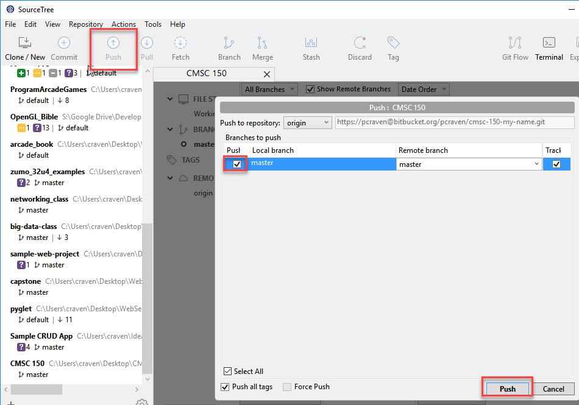

* Refresh the page on Bitbucket, and you can see that your code went to the
  server. But I can't see it yet. Please invite me to see your repository:

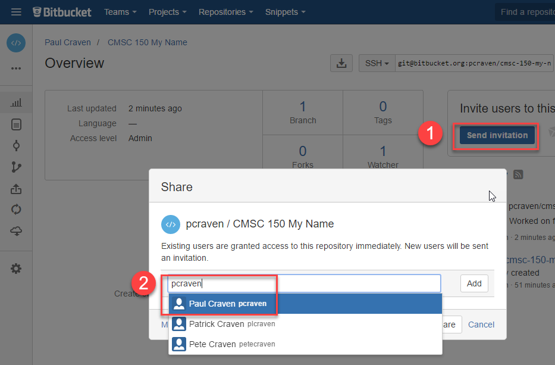

* Great! Aren't you glad we only have to do that once?

.. note::
   If you switch computers, you'll note that when you start SourceTree it will
   be blank. If you have your project on a flash drive or network drive,
   just select "File...Open" and point SourceTree to your project. If you
   don't have the files, select "Clone".

Part 3: Updating and Merging with Version Control
-------------------------------------------------

Updating Locally
^^^^^^^^^^^^^^^^

Ok, now it's time to update our program. Go back to our program and improve
it by printing multiple lines, while quoting Snoopy's famous story:

::

	print("It was a dark and stormy night.")
	print("Suddenly a shot rang out!")

Flip back to SourceTree. Select the "master" branch if you haven't already. Then
select "Uncommitted changes". You'll see all the files that have changed below.
Yellow is for files changed. Green is for new files. Purple for files that haven't
been added. Red for files deleted. Grey for missing files.

I select my Lab 01 file, and I can see the changes on the right. The lines
removed are in red, the new lines are in green. At first, this can be confusing
because you are seeing things that you removed. They are no longer part of the
file if they are in red.

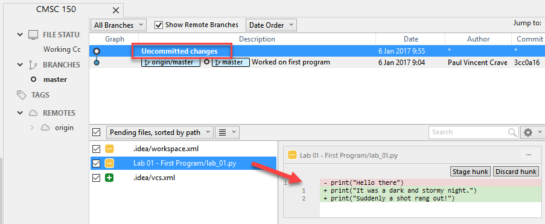

Ok, go ahead and hit the "Commit" button. Fill in a comment. Tell the server
to go ahead and push immediately. (If you forget this, just hit the push
button later.)

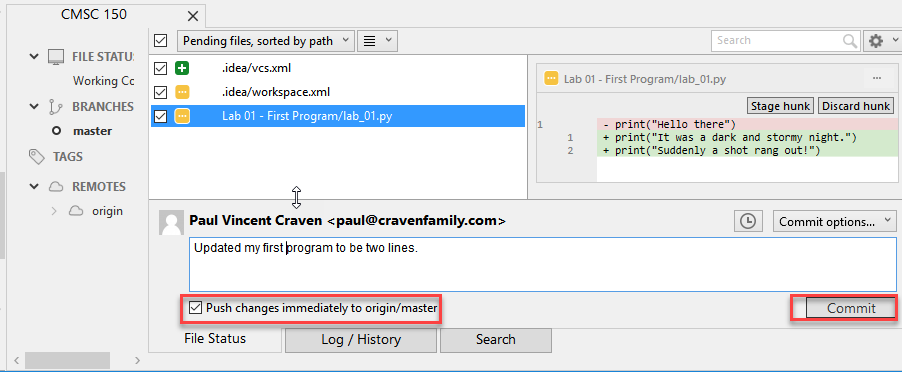

Editing Elsewhere
^^^^^^^^^^^^^^^^^
Find this file on the Bitbucket website. Hit the "Source" icon, and then
browse to the file. Let's try editing this on-line. We could just as easily
edit this on a different computer. Like if you had a home computer and a
work computer. Or two different people working on the same program.

.. image:: edit_online_1.png

Now let's edit this, and improve it by quoting
`A Wrinkle in Time <https://en.wikipedia.org/wiki/A_Wrinkle_in_Time>`_ instead.

.. image:: edit_online_2.png

Commit the change. Add a good comment, don't take the default. Don't create
a "pull request".

Pulling Changes
^^^^^^^^^^^^^^^

Next, let's pull those changes onto our computer with SourceTree:

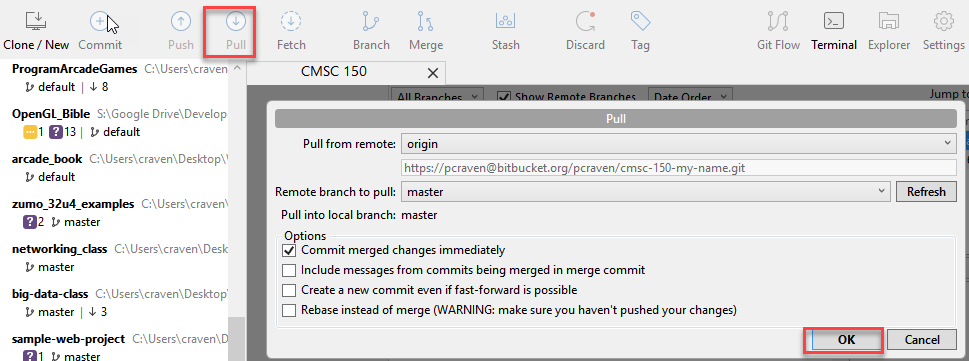

Great! Now you should see those changes on your local computer.

This works great until the same line of code is changed in two different places.
Try adding a line 4 on-line first, and a different line 4 on your computer.

When you try to push you get an angry message like this:

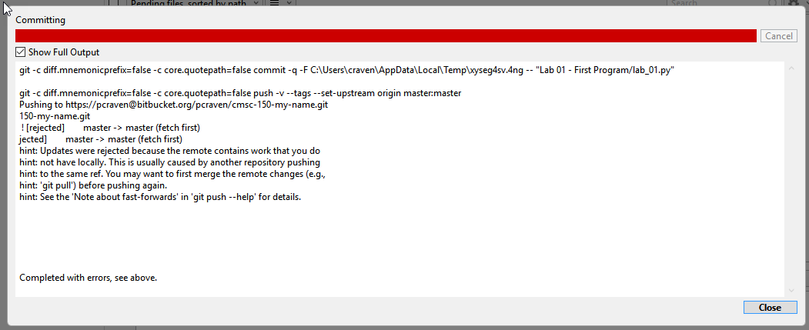

Usually students get this message late Sunday night when trying to upload their
homework. And now they can't What to do?

* Hit "Pull"
* Look at your "Uncommitted changed"
* Note the files that have a caution sign.
* To keep your changes and ignore the other changes, right-click select "Resolve
  Conflicts" and select "Resolve Using Mine"
* To keep the changes on the server and remove yours, right-click select
  "Resolve Conflicts" and select "Resolve Using Theirs"
* To manually resolve the conflicts, right-click select "Resolve Conflicts"
  and select "Mark Resolved". Both lines will be there, along with some
  delimiters that look kind of odd. You can edit the file in PyCharm.

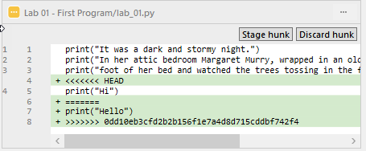

* After that, select "Commit" so that you commit your merge. (Easy to forget
  this ste.)
* Then you can push to the server.

Go ahead and try this out. I'll look for it online when I'm grading. It should
look like this:

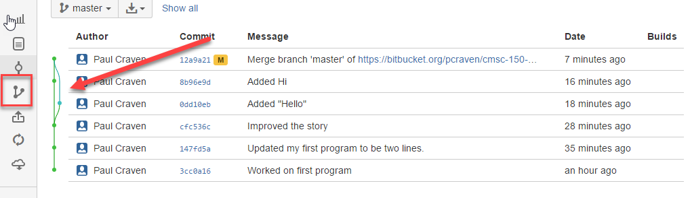

Make the Lab Yours
------------------

Ok, now it is time to make this lab yours. Write program that consists of
several print statements. Try these features out:

::

	print("You can print a statement surrounded by double quotes.")
	print('You can print a statement surrounded by single quotes.')

	print("If you want to print a double quote, you can by prepending it with")
	print("a slash. \"That's great!\" he said.")

	print("If you want to print a backslash, you can by prepending it with")
	print("a slash. So this \\ prints one backslash, and this \\\\ does two.")

	print("You can print a blank line with a empty print statement.")
	print()

	print("You can use a backlash n to print a new line. These\nare\non\nnew\nlines.")

Now make your *own* program. Don't just copy mine. Commit it. Push it. Copy
the URL. Turn it in via Scholar.

.. _Bitbucket: https://bitbucket.org/
.. _SourceTree: https://www.sourcetreeapp.com/
.. _create an account with Atlassian: https://id.atlassian.com/signup?application=mac&continue=https%3A%2F%2Fmy.atlassian.com%2Fproducts%2Findex