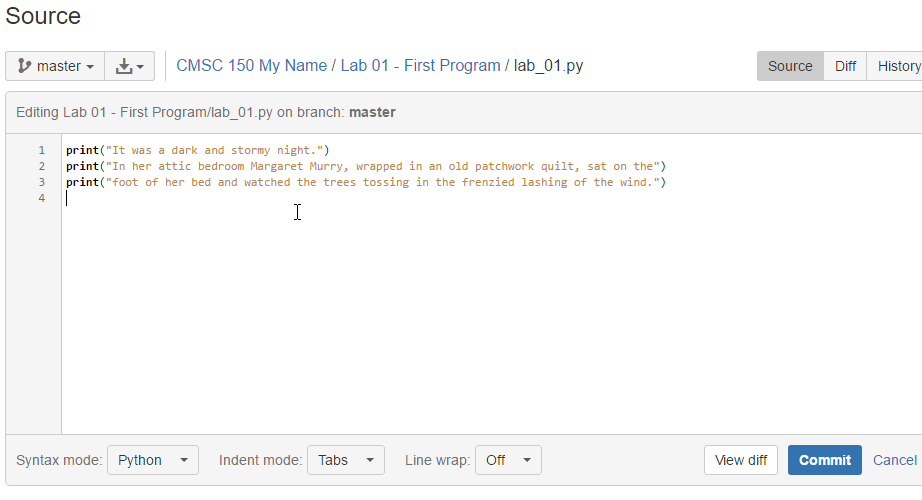

.. _lab-01:

Lab 1: First Program
====================

1. If you are installing on your own computer, install Python and set up the libraries. See :ref:`installing-python`.
2. If you are installing on your own computer, install PyCharm. See :ref:`installing-pycharm`.
3. If you are installing on your own computer, install Git. See :ref:`installing-git`.
4. If you are installing on your own computer, install SourceTree. See :ref:`installing-sourcetree`.
5. Fork the repository. See :ref:`fork-repository`.
6. Share the repository. See :ref:`share-repository`.
7. Clone the repository. :ref:`clone-repository`.
8. Create and run a test program that prints ``Hello``. See :ref:`print-hello-world`.
9. Commit and push the updated program to BitBucket. See :ref:`first-commit`.
10. Update your program to print something longer. Commit and push again. See :ref:`print-multiple-lines`.
11. Examine and try out different **escape codes**. See :ref:`escape-codes`.
12. Now make the lab *yours*. Figure out something of your own to print. Don't just use my examples. Make it longer
    than one line. Include at least one escape code.
13. Commit and push your lab.
14. Find your lab in in BitBucket. Go to "source" and find the directory it is in. Copy the URL, submit for grading.

Before turning in your program, double check:

* Did you remove the sample prints shown above, and make up your own print
  statements? At least four lines?
* Did you invite your instructor to the repository?
* Did you use proper spelling, capitalization, and grammar in the text that
  you printed to the screen?
* Hover over the PyCharm "hints" that are on the right side of your editor to
  see if there are suggestions on how to make your code better.

Copy the URL and turn it in via Scholar and you are done!

Editing Elsewhere
^^^^^^^^^^^^^^^^^
Find this file on the BitBucket website. Hit the "Source" icon, and then
browse to the file. Let's try editing this on-line. We could just as easily
edit this on a different computer. Like if you had a home computer and a
work computer. Or two different people working on the same program.

.. image:: edit_online_1.png

Now let's edit this, and improve it by quoting
`A Wrinkle in Time <https://en.wikipedia.org/wiki/A_Wrinkle_in_Time>`_ instead.

Commit the change. Add a good comment, don't take the default. Don't create
a "pull request".

Pulling Changes
^^^^^^^^^^^^^^^

Next, let's pull those changes onto our computer with SourceTree:

.. image:: pull.png

Great! Now you should see those changes on your local computer.

This works great until the same line of code is changed in two different places.
Try adding a line 4 on-line first, and a different line 4 on your computer.

When you try to push you get an angry message like this:

.. image:: failed_push.png

Usually students get this message late Sunday night when trying to upload their
homework. And now they can't What to do?

* Hit "Pull"
* Look at your "Uncommitted changed"
* Note the files that have a caution sign.
* To keep your changes and ignore the other changes, right-click select "Resolve
  Conflicts" and select "Resolve Using Mine"
* To keep the changes on the server and remove yours, right-click select
  "Resolve Conflicts" and select "Resolve Using Theirs"
* To manually resolve the conflicts, right-click select "Resolve Conflicts"
  and select "Mark Resolved". Both lines will be there, along with some
  delimiters that look kind of odd. You can edit the file in PyCharm.

.. image:: conflict.png

* After that, select "Commit" so that you commit your merge. (Easy to forget
  this step.)
* Then you can push to the server.

Go ahead and try this out. I'll look for it on-line when I'm grading. It should
look like this:

.. image:: see_merge_online.png
