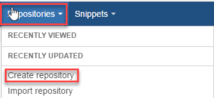
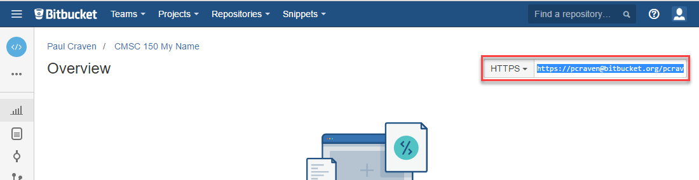
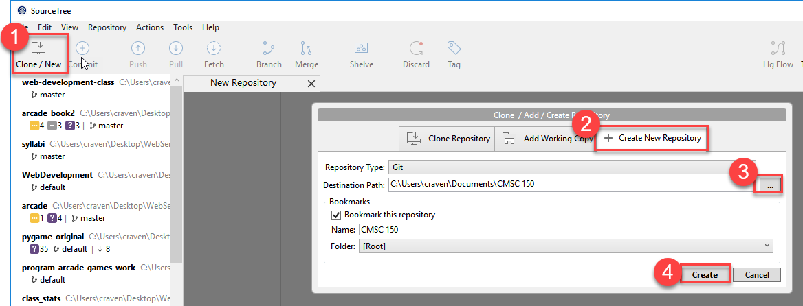
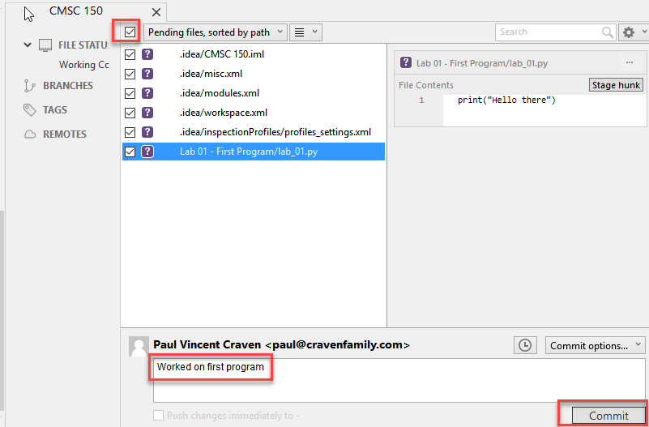
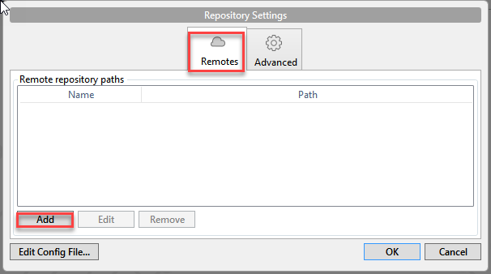
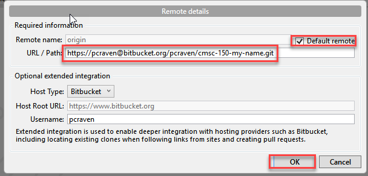
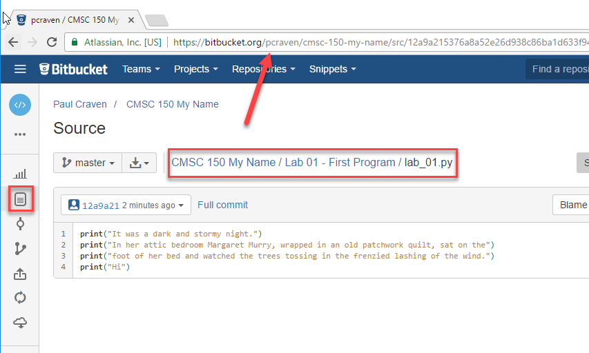

.. _lab-01:

Lab 1: First Program
====================

1. If you are installing on your own computer, install Python and set up the libraries. See :ref:`installing-python`.
2. If you are installing on your own computer, install PyCharm. See :ref:`installing-pycharm`.
3. If you are installing on your own computer, install Git. See :ref:`installing-git`.
4. If you are installing on your own computer, install SourceTree. See :ref:`installing-sourcetree`.
5. Fork the repository. See :ref:`fork-repository`.
6. Share the repository. See :ref:`share-repository`.
7. Clone the repository. :ref:`clone-repository`.
8. Create and run a test program that prints ``Hello``. See :ref:`print-function`.
9. Commit and push the updated program to BitBucket.

11. Commit and push
12. Find in BitBucket, copy URL, submit for grading.

Before turning in your program, double check:

* Did you remove the sample prints shown above, and make up your own print
  statements? At least four lines?
* Did you invite your instructor to the repository?
* Did you use proper spelling, capitalization, and grammar in the text that
  you printed to the screen?
* Hover over the PyCharm "hints" that are on the right side of your editor to
  see if there are suggestions on how to make your code better.

Copy the URL and turn it in via Scholar and you are done!

Old
---

.. _download Python: https://www.python.org/downloads/
.. _download PyCharm: https://www.jetbrains.com/pycharm/download/#section=windows
.. _student license: https://www.jetbrains.com/student/

* See the output of your program at the bottom of the screen. Click the image
  below to make it better and note the:

  * Right margin. You can write code past this point, but don't.
  * Where you can hover your mouse for "hints" on how to make your code better.
  * Where you can quickly click to run your program again.

.. image:: pycharm_window.png

Great! Your first program was the easy part. Now, how do we turn it in? That
takes some work to get set up.

Part 2: Checking the Program into Version Control
-------------------------------------------------

In this section we will:

* Install SourceTree
* Create your project on the BitBucket server
* Create your project on your local computer
* Link the two together

Once we get the version control set up, we'll use that same setup for the
rest of class.

Creating Your Project in BitBucket
^^^^^^^^^^^^^^^^^^^^^^^^^^^^^^^^^^

* Go to BitBucket, select "Repositories" and "Create repository"

* Call your repository "CMSC 150 Firstname Lastname". Obviously, change the
  first name and last name to your name.
* Make sure the repository is set to "private" so that no one else copies your
  homework.
* Change the repository type to "Git"

.. image:: create_repository2.png

* Copy the repository address from here:

Create Your Project in SourceTree
^^^^^^^^^^^^^^^^^^^^^^^^^^^^^^^^^

* Open the SourceTree program on your computer.
* Click the Clone/New button.
* Select the "Create New Repository" tab.
* Click on the button with three dots, and browse to the folder where you
  stored your project. Select the "CMSC 150" folder, not the folder with
  Lab 01. We want *all* the labs to be part of this project, not just one.

* Now we need to commit our files. Once we do this, we can always go back and
  get this version again. The purple question mark means these files aren't
  being tracked. Click the top check box, and then all the files will get a
  checkbox and be set for tracking.
* Add a comment at the bottom. Don't leave it blank.
* Hit "Commit"

* Now we can see our commit if we click on the "master" branch

.. image:: look_at_first_commit.png

* Ok. This exists only on our computer. We want to move it to the server so
  other people can look at it, and we have a backup if we can't get to this
  computer. Select "Repository" then "Repository Settings". Select the "Remotes"
  tab, and then "Add"

* Check the "Default remote" box.
* Paste that address we copied from BitBucket into the next field
* Hit "OK"

* Great, now we've told the computer where the server is. We need to push it
  there. How do we do that? Hit the "Push" button.

.. image:: push.png

* Great! Aren't you glad we only have to do that once?

.. note::
   If you switch computers, you'll note that when you start SourceTree it will
   be blank. If you have your project on a flash drive or network drive,
   just select "File...Open" and point SourceTree to your project. If you
   don't have the files, select "Clone".

Part 3: Updating and Merging with Version Control
-------------------------------------------------

Updating Locally
^^^^^^^^^^^^^^^^

Ok, now it's time to update our program. Go back to our program and improve
it by printing multiple lines, while quoting Snoopy's famous story:

::

	print("It was a dark and stormy night.")
	print("Suddenly a shot rang out!")

Flip back to SourceTree. Select the "master" branch if you haven't already. Then
select "Uncommitted changes". You'll see all the files that have changed below.
Yellow is for files changed. Green is for new files. Purple for files that haven't
been added. Red for files deleted. Grey for missing files.

I select my Lab 01 file, and I can see the changes on the right. The lines
removed are in red, the new lines are in green. At first, this can be confusing
because you are seeing things that you removed. They are no longer part of the
file if they are in red.

.. image:: change.png

Ok, go ahead and hit the "Commit" button. Fill in a comment. Tell the server
to go ahead and push immediately. (If you forget this, just hit the push
button later.)

.. image:: commit.png

Editing Elsewhere
^^^^^^^^^^^^^^^^^
Find this file on the BitBucket website. Hit the "Source" icon, and then
browse to the file. Let's try editing this on-line. We could just as easily
edit this on a different computer. Like if you had a home computer and a
work computer. Or two different people working on the same program.

.. image:: edit_online_1.png

Now let's edit this, and improve it by quoting
`A Wrinkle in Time <https://en.wikipedia.org/wiki/A_Wrinkle_in_Time>`_ instead.

.. image:: edit_online_2.png

Commit the change. Add a good comment, don't take the default. Don't create
a "pull request".

Pulling Changes
^^^^^^^^^^^^^^^

Next, let's pull those changes onto our computer with SourceTree:

.. image:: pull.png

Great! Now you should see those changes on your local computer.

This works great until the same line of code is changed in two different places.
Try adding a line 4 on-line first, and a different line 4 on your computer.

When you try to push you get an angry message like this:

.. image:: failed_push.png

Usually students get this message late Sunday night when trying to upload their
homework. And now they can't What to do?

* Hit "Pull"
* Look at your "Uncommitted changed"
* Note the files that have a caution sign.
* To keep your changes and ignore the other changes, right-click select "Resolve
  Conflicts" and select "Resolve Using Mine"
* To keep the changes on the server and remove yours, right-click select
  "Resolve Conflicts" and select "Resolve Using Theirs"
* To manually resolve the conflicts, right-click select "Resolve Conflicts"
  and select "Mark Resolved". Both lines will be there, along with some
  delimiters that look kind of odd. You can edit the file in PyCharm.

.. image:: conflict.png

* After that, select "Commit" so that you commit your merge. (Easy to forget
  this step.)
* Then you can push to the server.

Go ahead and try this out. I'll look for it on-line when I'm grading. It should
look like this:

.. image:: see_merge_online.png

Make the Lab Yours
------------------

Commit it. Push it. Copy
the URL from BitBucket. You'll click on the buttons and copy the URL as shown
below:

.. _BitBucket: https://bitbucket.org/
.. _SourceTree: https://www.sourcetreeapp.com/
.. _create an account with Atlassian: https://id.atlassian.com/signup?application=mac&continue=https%3A%2F%2Fmy.atlassian.com%2Fproducts%2Findex
