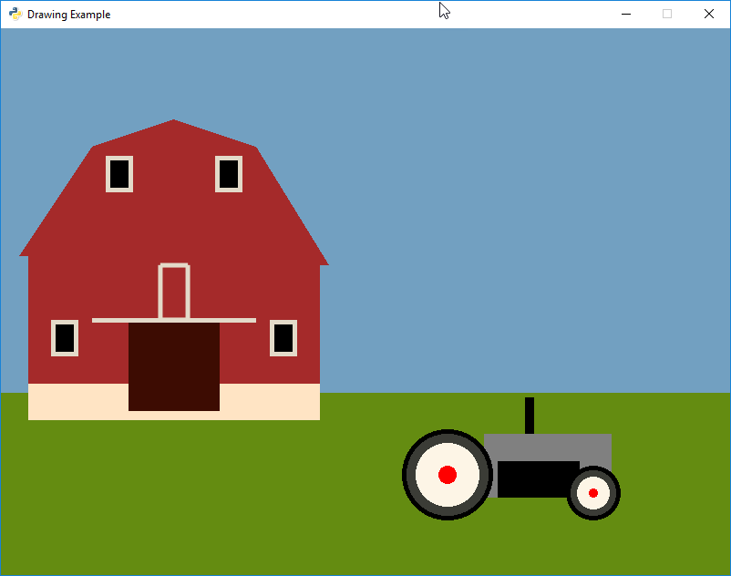

.. _lab-02:

Lab 2: Draw a Picture
=====================

Your assignment: Draw a pretty picture. The goal of this lab is to get practice
using functions to draw, and introduce computer graphics.

To get full credit:

* Use the same project and repository that you used for Lab 01. Create a new
  folder called ``Lab 02 - Draw a picture``. Don't put the Lab 02 folder in the
  Lab 01 folder. Do not create a new project or a new repository.
* You must use multiple colors.
* You must have a coherent picture.
  I am not interested in abstract art with random shapes.
* You must use multiple types of graphic functions
  (e.g. circles, rectangles, lines, etc.)
* Use blank lines in the code to break up sections. For example, when drawing
  a tree, put a blank line ahead of, and after.
* Use comments effectively. For example, when drawing a tree, put a comment at
  the start of those drawing commands that says ``# Draw a tree``. Remember
  to put one space after the ``#`` sign.
* Put spaces after commas for proper "style."

To select new colors use:

http://www.colorpicker.com/

Copy the values for Red, Green, and Blue.
Do not worry about colors for hue, Saturation, or Brilliance.

Please use comments and blank lines to make it easy to follow your program.
If you have 5 lines that draw a robot, group them together with blank lines
above and below. Then add a comment at the top telling the reader what you
are drawing.

Keep in mind the order of code. Shapes drawn first will be at the "back."
Shapes drawn later will be drawn on top of the other shapes.

Looking for ideas? At the page below, each time you refresh the page I show
various images created by students from prior years:

http://programarcadegames.com/

Also, here is an example program that shows you what I'm looking for:

.. literalinclude:: final_program.py
    :language: python
    :linenos:

Here are some images from prior years:

.. raw:: html

    <!-- Create your slider and add images -->
    

        
        
        
        
    

    <!-- Include slider JS file -->
    
    <!-- Create your slider -->
    
