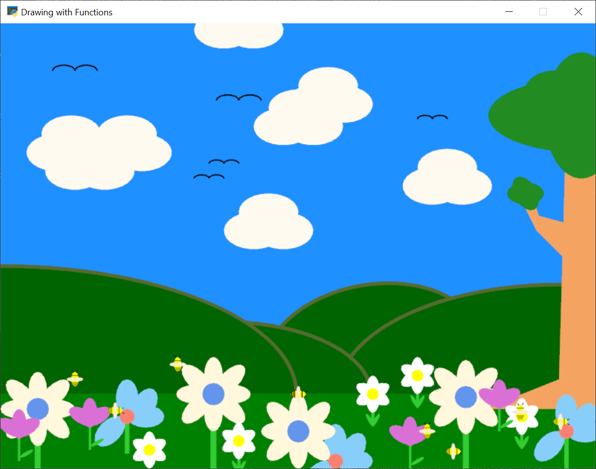
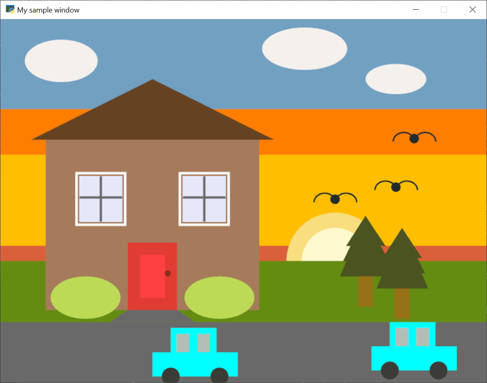
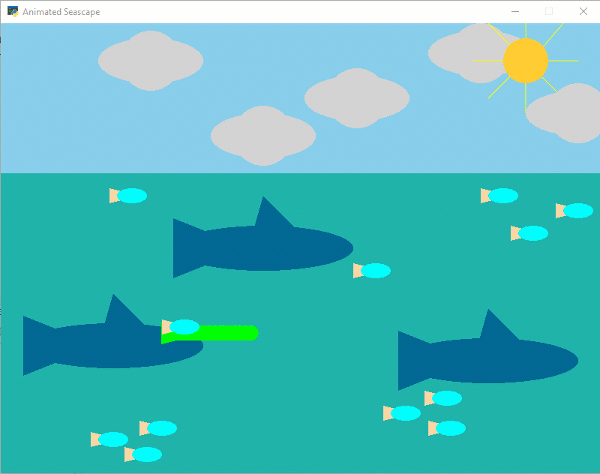

.. _lab-03:

Lab 3: Drawing with Functions
=============================

This lab uses what we learned in :ref:`creating_functions` and
:ref:`custom-drawing-function` to extend our ability to draw to the screen.

Requirements
------------

Your goal: Draw an image using functions.

Requirements for Drawing
^^^^^^^^^^^^^^^^^^^^^^^^

You can update your program from Lab 2, or create a new program. This lab is worth
20 points. See the point breakdown below.

Incorporate the following items:

* Find the folder for Lab 03 in PyCharm and start entering your code there.
  Feel free to use any code from Lab 02 you want, just copy it across.
* Make sure you are putting your program in the Lab 3 folder, and not just
  changing Lab 2 to have Lab 3 requirements.
* We are going to be following the instructions/example in :ref:`custom-drawing-function`.
* Put everything into a function as shown in :ref:`make_the_main_function`. 1 pt.
* Create three functions that draw something. (18 pts total, up to 6 pts
  per function)

  * Define the function and successfully call it. (1 pt)
  * Make your drawing function complex. 0 points for a one-line function that
    just draws a rectangle, 0 points for copying the example from the book,
    2 points for a cohesive multi-line function. (2 pts)
  * Pass in ``x`` and ``y`` parameters and successfully position the object
    as shown in :ref:`make_the_drawing_function`. (2 pts)
  * Make sure the image you draw is centered around the x and y, and not
    off-set. (1 pts)

 * Call at least one of the functions more than once, and in a different location. (1 pt.)

Double Check
^^^^^^^^^^^^

Make sure you don't put functions inside of functions. After the ``import``
statement, each function should
be listed out, one ``def`` after the other. But no ``def`` inside of another ``def``.

Make sure you have *three* functions that take in an ``(x, y)`` position to draw an object,
not just one.

The most frequent source of confusion on this lab, and way to lose points,
is a drawing function that is not centered around the specified (x, y).
You can confirm this is working by
drawing a point right at the x, y as the last line of your code. If the point
draws near the center of your item, you are good. If the point is nowhere near
the center, you need to re-center it.