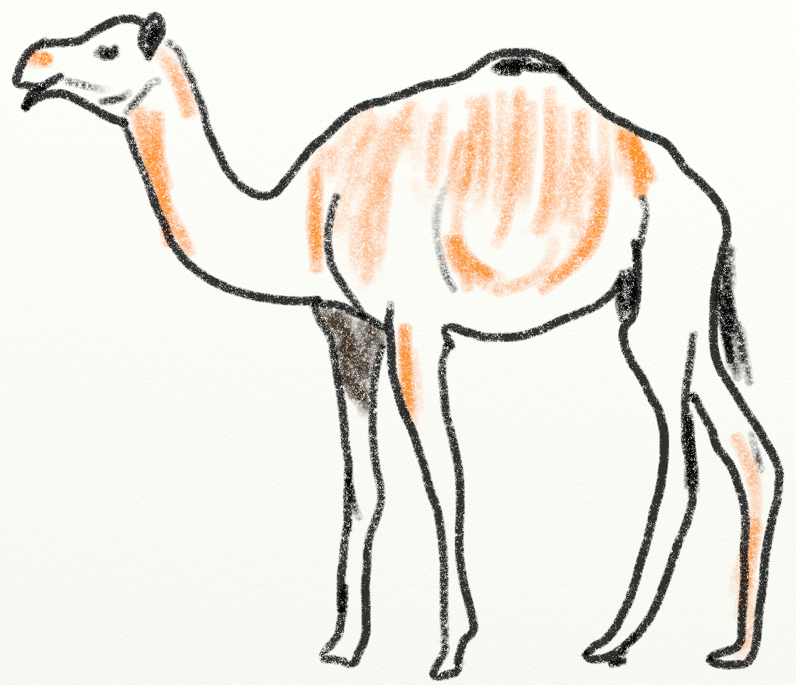

.. _lab-04:

Lab 4: Camel
============

Description of the Camel Game
-----------------------------

The idea for Camel originally came from the Heath Users Group and was published
in `More BASIC Computer Games`_ in 1979.

.. _More BASIC Computer Games: http://www.atariarchives.org/morebasicgames/showpage.php?page=24

The idea is to ride your camel across the desert while being chased. You need
to manage your thirst, how tired the camel is, and how far ahead of the natives
you are.

This is one of the first games I programmed on the Apple //e. The game is
flexible. I've had students create Star Wars themed versions of this game
where you need to ride a wampa across Hoth. It is easy to add sandstorms and
other random events to the game to make it more interesting. Even though it is
only a text-based game, I've found some students really get into playing it.
Once I had a professor come and complain when my students were too loud while
playing this game on the "big screen."

Sample Run of Camel
-------------------

Here is a sample run of the game:

.. code-block:: text

	Welcome to Camel!
	You have stolen a camel to make your way across the great Mobi desert.
	The natives want their camel back and are chasing you down! Survive your
	desert trek and outrun the natives.

	A. Drink from your canteen.
	B. Ahead moderate speed.
	C. Ahead full speed.
	D. Stop and rest.
	E. Status check.
	Q. Quit.
	Your choice? C

	You traveled 12 miles.

	A. Drink from your canteen.
	B. Ahead moderate speed.
	C. Ahead full speed.
	D. Stop and rest.
	E. Status check.
	Q. Quit.
	Your choice? C

	You traveled 17 miles.

	A. Drink from your canteen.
	B. Ahead moderate speed.
	C. Ahead full speed.
	D. Stop and rest.
	E. Status check.
	Q. Quit.
	Your choice? e

	Miles traveled:  29
	Drinks in canteen:  3
	The natives are 31 miles behind you.

	A. Drink from your canteen.
	B. Ahead moderate speed.
	C. Ahead full speed.
	D. Stop and rest.
	E. Status check.
	Q. Quit.
	Your choice? b

	You traveled 6 miles.

	...and so on until...

	A. Drink from your canteen.
	B. Ahead moderate speed.
	C. Ahead full speed.
	D. Stop and rest.
	E. Status check.
	Q. Quit.
	Your choice? C

	You traveled 12 miles.
	The natives are getting close!

	A. Drink from your canteen.
	B. Ahead moderate speed.
	C. Ahead full speed.
	D. Stop and rest.
	E. Status check.
	Q. Quit.
	Your choice? C

	You traveled 11 miles.
	The natives are getting close!
	You made it across the desert! You won!

Programming Guide
-----------------
Here are the steps to complete this lab. Feel free to modify and add to the lab.
Try the game with friends and family.

1. Create a new directory in your project for ``Lab 04 - Camel`` and a file
   called ``lab_04.py`` in that folder if the folder and file don't exist already.
2. In that file create a new ``main()`` function. Have it print the instructions
   to the screen. Do this with multiple ``print`` statements. Don't use one
   ``print`` statement and multiple ``\n`` characters to jam everything on one
   line.

.. code-block:: text

	Welcome to Camel!
	You have stolen a camel to make your way across the great Mobi desert.
	The natives want their camel back and are chasing you down! Survive your
	desert trek and out run the natives.

Call the ``main()`` function. Run and test the program.

3. Continue from the prior step and create a Boolean variable called ``done``
   and set to ``False``. Make sure this, and everything else, is in the
   ``main`` function.
4. Create a ``while`` loop that will keep looping while ``done`` is ``False``.
5. Inside the loop, print out the following:

.. code-block:: text

	A. Drink from your canteen.
	B. Ahead moderate speed.
	C. Ahead full speed.
	D. Stop for the night.
	E. Status check.
	Q. Quit.

6. Ask the user for their choice. Make sure to add a space before the quote so
   the user input doesn't run into your text. That is, it should look like:

.. code-block:: text

   What is your choice? Q

And not:

.. code-block:: text

   What is your choice?Q

7. If the user's choice is ``Q``, then set ``done`` to ``True``. By doing
   something like ``user_choice.upper()`` instead of just ``user_choice`` in
   your ``if`` statement you can make it case-insensitive. Also, print something
   to the user to let her know she quit the game. Users need feedback.
8. Test and make sure that you can quit out of the game, and that it works
   for both upper and lower case.
9. Before your main program loop, create variables for miles traveled, thirst,
   camel tiredness. Set these to zero. Creating accurate, descriptive variable
   names will make the rest of this lab less confusing.
10. Create a variable for the distance the natives have traveled and set it to
    -20. (Twenty miles back.) Understanding how we track the player's distance,
    the native's distance, and the difference between the two tends to confuse
    some people. See the videos at the end of this lab for some hints.

11. Create and set an initial number of drinks in the canteen. I use three.
12. Go back to inside your main program loop.
    Add an ``elif`` to the ``if`` that is checking for the quit command.
    See if the user is asking
    for status. If so, print out the miles traveled, the drinks in the canteen,
    and how far the natives are behind you. If you aren't sure how to calculate
    that, see the videos at the end of this lab. (Seriously. This is a section
    where a lot of people start down the wrong path.)

.. code-block:: text

	Miles traveled:  0
	Drinks in canteen:  3
	The natives are 10 miles behind you.

13. Add an ``elif`` in your main program loop and handle if the user wants to
    stop for the night. If the user does, reset the camel's tiredness to zero.
    Print that the camel is happy, and move the natives up a random amount from
    7 to 14 or so. Note: calculate random numbers IN the loop, just
    before you need them. A common mistake is to calculate the random numbers
    you need BEFORE the main loop. Causing your random numbers to stay the same
    the entire game.
14. Add an ``elif`` in your main program loop and handle if the user wants to
    go ahead full speed. If the user does, go forward a random amount between
    10 and 20 inclusive. Print how many miles the user traveled. Add 1 to
    thirst. Add a random 1 to 3 to camel tiredness. Move the natives up 7 to
    14 miles.
15. Add an ``elif`` in your main program loop and handle if the user wants to
    go ahead moderate speed. If the user does, go forward a random amount
    between 5 and 12 inclusive. Print how many miles the user traveled. Add 1
    to thirst. Add 1 to camel tiredness. Move the natives up 7 to 14 miles.
16. Add an ``elif`` in your main program loop and handle if the user wants to go
    ahead drink from the canteen. If the user does, make sure there are drinks
    in the canteen. If there are, subtract one drink and set the player's
    thirst to zero. Otherwise print an error.
17. In the loop, print "You are thirsty." if the user's thirst is above 4.
    Put this after your long ``if`` ... ``elif`` chain above.
18. Print "You died of thirst!" if the user's thirst is above 6. Set ``done``
    to ``True``. Make sure you create your code so that the program doesn't
    print both "Your are thirsty" and "You died of thirst!" Use ``elif``
    as appropriate.
19. Print "Your camel is getting tired." if the camel's tiredness is above 5.
20. Print "Your camel is dead." if the camel's tiredness is above 8. Like the
    prior steps, print one or the other. It is a good idea to include a check
    with the done variable so t hat you don't print that your camel is getting
    tired after you died of thirst.
21. If the natives have caught up, print that they caught the player and end
    the game.
22. Else if the natives are less than 15 miles behind, print "The natives are
    getting close!"
23. If the user has traveled 200 miles across the desert, print that they won
    and end the game. Make sure they aren't dead before declaring them a winner.
    If they land on mile marker 201 instead of 200, make sure they still win
    the game. See the videos below.
24. Add a one-in-twenty chance of finding an oasis. Print that the user found
    it, refill the canteen, reset player thirst, and rest the camel. If you
    aren't sure how to do this, see :ref:`random_chance`.
    Make sure a person can't find the oasis unless they are traveling.
    This will require you to think about where you are putting this code.
25. Play the game and tune the numbers so it is challenging but not impossible.
    Fix any bugs you find.

Hints
-----
* Remember that it is good idea to put blank lines between logical groupings of
  code in your program. For example, but a blank line after the instructions,
  and between each user command. Add comments where appropriate.
* It is considered better style to use ``while not done:`` instead of
  ``while done == False:``
* To prevent bad message combinations, such as printing "You died of thirst."
  and "You found an oasis!" on the same turn, use the ``and`` operator.
  Such as, ``if not done and thirst > 4:``
* Make sure you add blank lines to divide up sections of code. Don't double space the
  code. Add comments ahead of code sections.
* Watch the English and punctuation. Don't say ``you found an Oasis!``, say ``You found an oasis!``
* Occasionally people get confused about how to set a value back to zero. Study the code below:

.. code-block:: python

   # Yes, these set thirst to zero, but this is NOT the way to do it.
   thirst *= 0               # No
   thirst = thirst * 0       # No
   thirst = thirst - thirst  # No

   # This is the correct way to set thirst to zero
   thirst = 0                # Yes

Calculating How Far Back the Natives Are
^^^^^^^^^^^^^^^^^^^^^^^^^^^^^^^^^^^^^^^^

 .. raw:: html

 	<iframe width="560" height="315" src="https://www.youtube.com/embed/I9dJDDBe27c" frameborder="0" allowfullscreen></iframe>

Figuring Out The End of the Game
^^^^^^^^^^^^^^^^^^^^^^^^^^^^^^^^

 .. raw:: html

 	<iframe width="560" height="315" src="https://www.youtube.com/embed/tHjwHP-lD3I" frameborder="0" allowfullscreen></iframe>
