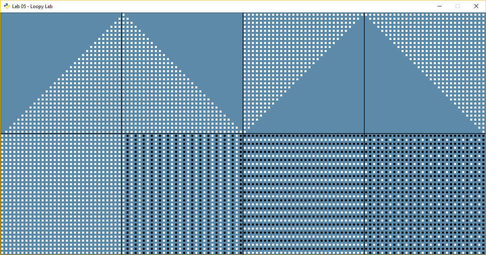
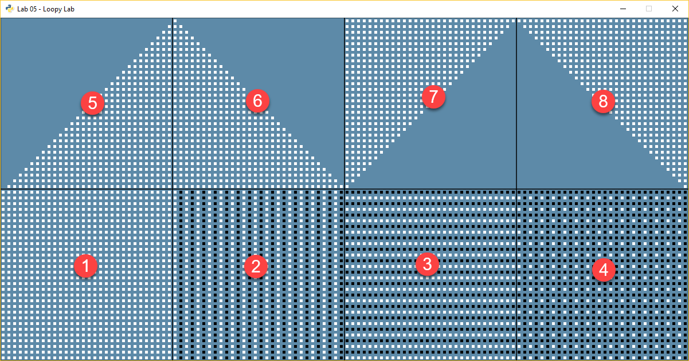

.. _lab-05:

Lab 5: Loopy Lab
================

The goal of this lab is to practice using nested ``for`` loops. We will create
a program that makes the following image:

For sanity's sake, let's give a number to each section.
Then when we ask questions we can say which section we are talking about.
Do **not** put the numbers in the final program. Here are the section numbers:

Great! All these items can be created using nested ``for`` loops.

Getting Started
---------------

Below is some code to get you started. Underneath each of the comments, fill in
the code required to make the pattern.

.. literalinclude:: loopy_lab_template.py

Scoring
-------

There are 20 possible points:

* Section 1: 2 pts
* Section 2: 2 pts
* Section 3: 2 pts
* Section 4: 2 pts
* Completing any section 1-4: 1 pt
* Section 5: 2 pts
* Section 6: 2 pts
* Section 7: 2 pts
* Section 8: 2 pts
* Completing any section 5-8: 1 pt
* Code Style: 2 pts (Should have no yellow lines on right side of PyCharm)

Hints
-----

* Each little square is a 5x5 pixel square.
* If the center of each square is 5 apart, you won't see an edge and it will
  look like one big square.
* Remember, row controls up and down, so it corresponds to y. Column corresponds
  to x.
* When working on sections 2-8, you can simple add to the x and/or y values
  to shift everything over. For example, just add 300 to all the x values in
  section 2, to put it in the second box.
* Each section is 300x300 pixels.
* Remember that the ``%`` sign is the modulus. It calculates the remainder. So::

    0 % 3 = 0
    1 % 3 = 1
    2 % 3 = 2
    3 % 3 = 0
    4 % 3 = 1
    5 % 3 = 2
    6 % 3 = 0

* You can count "backwards" by subtracting.

.. code-block:: python

    print("Count up!")
    for i in range(10):
        print(i)

    print()
    print("Count down, even if i is going up")
    for i in range(10):
        x = 9 - i
        print("i is", i, "and 9-i is", x)

This prints::

    Count up!
    0
    1
    2
    3
    4
    5
    6
    7
    8
    9

    Count down, even if i is going up
    i is 0 and 9-i is 9
    i is 1 and 9-i is 8
    i is 2 and 9-i is 7
    i is 3 and 9-i is 6
    i is 4 and 9-i is 5
    i is 5 and 9-i is 4
    i is 6 and 9-i is 3
    i is 7 and 9-i is 2
    i is 8 and 9-i is 1
    i is 9 and 9-i is 0
