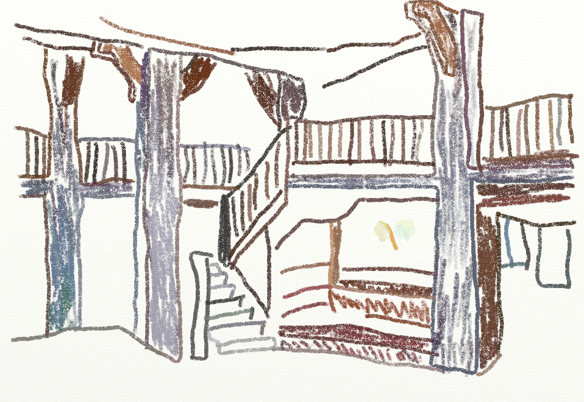
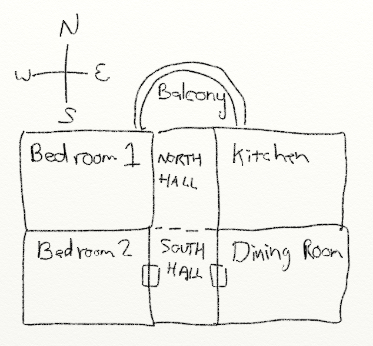
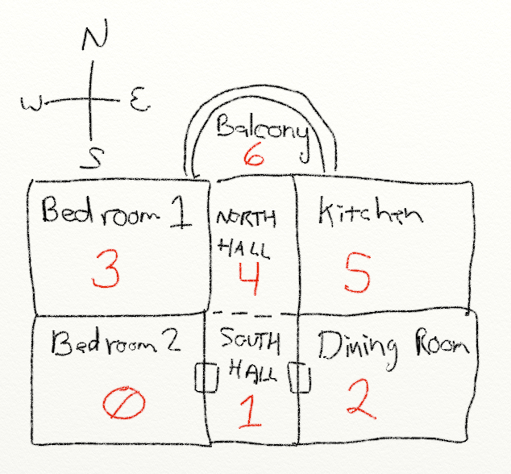

.. _lab-06:

Lab 6: Text Adventure
=====================

Description of the Adventure Game
---------------------------------
One of the first games I ever played was a text adventure called
`Colossal Cave Adventure`_. You can play the game on-line here_ to get an idea
what text adventure games are like. Seriously, give it a try. Otherwise it will
be hard to understand what we are trying to do here.

Arguably the most famous of this genre of game is the Zork_ series.

.. _Colossal Cave Adventure: https://en.wikipedia.org/wiki/Colossal_Cave_Adventure
.. _here: http://www.web-adventures.org/cgi-bin/webfrotz?s=Adventure
.. _Zork: https://en.wikipedia.org/wiki/Zork

The first "large" program I created myself was a text adventure. It is easy to
start an adventure like this. It is also a great way to practice using lists.
Our game for this lab will involve a list of rooms that can be navigated by
going north, east, south, or west. Each room will be a list with the room
description, and then what rooms are in each of the directions. See the section
below for a sample run:

Sample Run
----------

.. code-block:: text

    You are in a dusty castle room.
    Passages lead to the north and south.
    What direction? n

    You are in the armory.
    There is a room off to the south.
    What direction? s

    You are in a dusty castle room.
    Passages lead to the north and south.
    What direction? s

    You are in a torch-lit hallway.
    There are rooms to the east and west.
    What direction? e

    You are in a bedroom. A window overlooks the castle courtyard.
    A hallway is to the west.
    What direction? w

    You are in a torch-lit hallway.
    There are rooms to the east and west.
    What direction? w

    You are in the kitchen. It looks like a roast is being made for supper.
    A hallway is to the east.
    What direction? w

    Can't go that way.
    You are in the kitchen. It looks like a roast is being made for supper.
    A hallway is to the east.
    What direction?

Creating Your Dungeon
---------------------
Before you start, sketch out the dungeon that you want to create. It might look
something like this:

Next, number all of the rooms starting at zero.

Use this sketch to figure out how all the rooms connect. For example, room 0
connects to room 3 to the north, room 1 to the east, and no room to the south
and west.

Step-by-step Instructions
-------------------------

As a reminder, at the end of the year I do scan for duplicate homework. I keep
all homework assignments from prior semesters, and assignments from non-Simpson
students that I find on-line. I run a program that scans for duplicates.
Make sure your work is your own.

1.  Create a ``main`` function and call the ``main`` function.
2.  In the ``main`` function, create an empty array called ``room_list``.
    If you've forgotten, see :ref:`create-an-empty-list`.
3.  Create a variable called ``room``. Set it equal to an array with five elements.
    For the first element, create a string with a description of your first room.
    The last four elements will be the number of the next room if the user goes
    north, east, south, or west. Look at your sketch to see what numbers to use.
    Use ``None`` if no room hooks up in that direction. (Do not put ``None`` in quotes.
    Also, remember that Python is case sensitive so ``none`` won't work either.
    The keyword ``None`` is a special value that represents "nothing." Because
    sometimes you need a value, other than zero, that represents )
4.  Append this room to the room list. See :ref:`append_to_list` if you've forgotten how to do that.
5.  Repeat the prior two steps for each room you want to create. Just re-use
    the room variable.
6.  Create a variable called ``current_room``. Set it to zero.
7.  Print the ``room_list`` variable. Run the program. You should see a really long
    list of every room in your adventure. If you don't, make sure you are calling
    your ``main`` function at the end of your program, and that it isn't indented.
8.  Adjust your print statement to only print the first room (element zero) in the list.
    Note that at index 0 is the description, 1 is the room to the north, 2
    is the room to the east, etc.
    Run the program and confirm you get output similar to::

    ['You are in a room. There is a passage to the north.', 1, None, None, None]

9.  Using ``current_room`` and ``room_list``, print the current room the user
    is in. Since your first room is zero, the output should be the same as before.
10. Change the print statement so that you only print the description of the
    room, and not the rooms that hook up to it. Remember if you are printing a
    list in a list the index goes after the first index.
    Don't do this: ``[current_room[0]]``, do ``[current_room][0]``

.. code-block:: text

    You are in a room. There is a passage to the north.

11. Create a variable called ``done`` and set it to ``False``. Then put the
    printing of the room description in a ``while`` loop that repeats until ``done`` is
    set to ``True``. We won't set ``done`` to ``True`` yet though.
12. Before printing the description, add a code to print a blank line. This
    will make it visually separate each turn when playing the game.
13. After printing the room description, add a line of code that asks the user
    what they want to do. Use the ``input`` statement. Keep in mind that you will
    be entering letters, therefore you will *not* want to convert what the user enters
    to an integer or floating point number. This will be similar to how we got
    input in :ref:`lab-04`. The most frequent mistake I've seen students make is
    to have an ``input`` statement and not capture the return value. See
    :ref:`capturing_returned_values` if you have this issue.
14. Add an ``if`` statement to see if the user wants to go north.
    You should accept user input like "n" and "N" and "North" and
    "NoRtH". You may need
    to review :ref:`text-comparisons` and :ref:`multi-text-comparisons`.
15. If the user wants to go north, create a variable called ``next_room`` and
    get it equal to ``room_list[current_room][1]``, which should be the number
    for what room is to the north. (Remember, 0 is the description, 1 is north,
    2 is east, etc.)
16. Add another ``if`` statement to see if the next room is equal to ``None``. If
    it is, print "You can't go that way." *Otherwise* (how do you do 'otherwise'?) set ``current_room``
    equal to ``next_room``. Note: This new ``if`` statement is part of the
    ``if`` statement to go north. So make sure it is indented inside that
    ``if``.
17. Test your program. Can you go north to a new room?
18. Add ``elif`` statements to handle east, south, and west. Add an ``else``
    statement to let the user know the program doesn't understand what she typed.
19. It is a great idea to put blank lines between the code that handles each
    direction. I don't mean to print a blank line, but actually have blank
    lines in the code. That way you visually group the code into sections.
20. It is a great idea to add comments too, to each section.
21. Test your program. Make sure you have enough of a description that someone
    running the program will know what direction to go. Don't say "You are in the
    kitchen." Instead say "You are in the kitchen. There is a door to the north."
22. Add a quit command that ends the game.
23. Make sure that the program works for upper and lower case commands.
24. Have the program work if the user types in "north" or "n". Review
    :ref:`multi-text-comparisons` if needed.

Spend a little time to make this game interesting. Don't simply create an
"East room" and a "West room." That's boring.

Also spend a little time to double check spelling and grammar. Without a word
processor checking your writing, it is important to be careful. Pay particular note to:

* Students often capitalize words in this lab that should not be capitalized. In particular,
  see `when do you capitalize directions`_.
* Do not capitalize room names unless the room name is part of a title. Don't say "You are in the Living Room," because
  the word "living room" isn't normally capitalized.

.. _when do you capitalize directions: http://www.quickanddirtytips.com/education/grammar/when-do-you-capitalize-directions

Use ``\n`` to add carriage returns in your descriptions so they don't print all on
one line. Don't put spaces around the ``\n``, or the spaces will print.

What I like about this program is how easy it is to expand into a full game.
Using all eight cardinal directions (including "NorthWest"), along with "up"
and "down" is rather easy. Managing an inventory of objects that can exist in
rooms, be picked up, and dropped is also a matter of keeping lists.

Expanding this program into a full game is one of the two options for the final
lab in this course.
