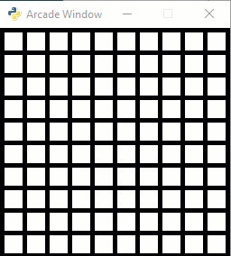

.. _lab-11:

Lab 11: Array-Backed Grids
==========================

Part 1
------

Start with the program at the end of :ref:`array-backed-grids`.
Modify it so that rather than just changing the block the user clicks on, also
change the blocks of the squares next to the user's click. (5 pts) If the user clicks
on an edge, make sure the program doesn't crash and still handles the click
appropriately. (5 pts)

    Example of working Lab 11

Part 2
------

Create another program, again starting with the code
at the end of :ref:`array-backed-grids`.

Write a loop that will count all of the cells that are selected in the grid
and print them out. Put this code at the end of your ``on_mouse_press`` function.
(2 pts)

.. code-block:: text
    :caption: Sample Output

    Total of 1 cells are selected.
    Total of 2 cells are selected.
    Total of 3 cells are selected.
    Total of 2 cells are selected.
    Total of 3 cells are selected.
    Total of 4 cells are selected.
    Total of 5 cells are selected.
    Total of 6 cells are selected.
    Total of 7 cells are selected.
    Total of 8 cells are selected.
    Total of 9 cells are selected.

Write another loop that will print how many cells are selected in each row:
(3 pts)

.. code-block:: text
    :caption: Sample Output

    Total of 7 cells are selected.
    Row 0 has 0 cells selected.
    Row 1 has 0 cells selected.
    Row 2 has 2 cells selected.
    Row 3 has 2 cells selected.
    Row 4 has 1 cells selected.
    Row 5 has 2 cells selected.
    Row 6 has 0 cells selected.
    Row 7 has 0 cells selected.
    Row 8 has 0 cells selected.
    Row 9 has 0 cells selected.

    Total of 8 cells are selected.
    Row 0 has 0 cells selected.
    Row 1 has 0 cells selected.
    Row 2 has 3 cells selected.
    Row 3 has 2 cells selected.
    Row 4 has 1 cells selected.
    Row 5 has 2 cells selected.
    Row 6 has 0 cells selected.
    Row 7 has 0 cells selected.
    Row 8 has 0 cells selected.
    Row 9 has 0 cells selected.

Update the code so that it prints the count in both rows and columns:
(1 pt)

.. code-block:: text
    :caption: Sample Output

    Total of 5 cells are selected.
    Row 0 has 1 cells selected.
    Row 1 has 1 cells selected.
    Row 2 has 1 cells selected.
    Row 3 has 1 cells selected.
    Row 4 has 1 cells selected.
    Row 5 has 0 cells selected.
    Row 6 has 0 cells selected.
    Row 7 has 0 cells selected.
    Row 8 has 0 cells selected.
    Row 9 has 0 cells selected.
    Column 0 has 5 cells selected.
    Column 1 has 0 cells selected.
    Column 2 has 0 cells selected.
    Column 3 has 0 cells selected.
    Column 4 has 0 cells selected.
    Column 5 has 0 cells selected.
    Column 6 has 0 cells selected.
    Column 7 has 0 cells selected.
    Column 8 has 0 cells selected.
    Column 9 has 0 cells selected.

Update the code so that the program will also print how many cells are
continuously selected in a row, if that number is greater than 2.
(4 pts)

To do this, create a new variable (like ``continuous_count``) that is reset to
zero for each row. If the current grid location is one, then add one to
``continuous_count``. If it is zero, check if ``continuous_count`` is greater
than 2. If so, print the count. Regardless, reset it back to zero.

You'll also need to do the same ``if`` after the loop with the row is done.

.. code-block:: text
    :caption: Sample Output

    Total of 18 cells are selected.
    Row 0 has 0 cells selected.
    There are 7 continuous blocks selected on row 1.
    Row 1 has 7 cells selected.
    Row 2 has 0 cells selected.
    There are 4 continuous blocks selected on row 3.
    Row 3 has 4 cells selected.
    Row 4 has 0 cells selected.
    There are 4 continuous blocks selected on row 5.
    Row 5 has 4 cells selected.
    There are 3 continuous blocks selected on row 6.
    Row 6 has 3 cells selected.
    Row 7 has 0 cells selected.
    Row 8 has 0 cells selected.
    Row 9 has 0 cells selected.
    Column 0 has 1 cells selected.
    Column 1 has 3 cells selected.
    Column 2 has 3 cells selected.
    Column 3 has 3 cells selected.
    Column 4 has 3 cells selected.
    Column 5 has 1 cells selected.
    Column 6 has 1 cells selected.
    Column 7 has 1 cells selected.
    Column 8 has 1 cells selected.
    Column 9 has 1 cells selected.