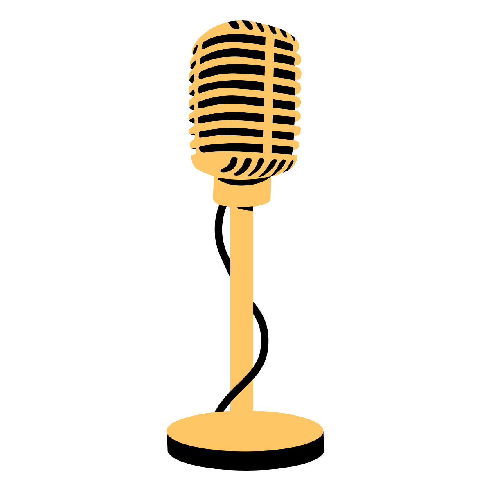

Voice-Over Talent
=================

Interested in helping people learning to code?
I'm putting together a set of volunteers to do voice-over for
introductory Python lessons.
The videos will be hosted for free
on YouTube with monitization turned off.
The lessons will cover the free on-line text available at:

https://learn.arcade.academy

The point of having multiple people do voice-overs is for
students find people  they identify with, to feel included in
the programming community, and to realize we can learn from anyone,
no matter who they are.

Questions and Answers
---------------------

**Do I get paid?**

Unfortunately no. *I'm* not getting money for putting the text, video, or audio on-line.
That means I have no extra money to pass along to you.

**Wait, you don't get paid?**

Ok, full disclaimer.
I *do* get paid as a Professor. Part of the my job does involve research and outreach.
I *do* get paid to teach computer science at Simpson College and I use this material
to do so.

I have gotten two paid semester-long sabbaticals (this semester and one six years ago),
with the stated intent to make free programming
materials available to the public.

I do *not* receive
extra money for posting materials on-line, doing videos, or contributing to the Arcade
library. I *do not* and *will not*
monitize these videos by including ads or putting them behind a pay-wall.

At one point I did self-publish a paper copy of similar work with ProgramArcadeGames.com as a book.
I did get money from that. Then I went with a publisher, sold fewer copies, and hardly got any
money. I may one day sell a book version of the website, but mainly as a service to those
who learn better by reading text on paper. I won't sell the videos.

**If there is no money, why do this?**

If you've used free resources on-line to lean how to program or find solutions to
programming problems, this is a great way to give back to the community. Personally,
I've found online resources to be a great aid in my programming.

**How am I identified?**

You can be credited with your contribution any way you wish.

As the internet is home to the occasional person who doesn't realize
or care that real humans are on the other end of the network connection,
my recommendation is to introduce yourself
at the beginning of the video with your first name only.
This will hopefully reduce the chance of doxxing.

If you are internet-famous and want to use your full name and link to your
Twitter or website, that's great! If you are internet-private and want to use
a pseudonym, we can do that too!

The main point is to help new programmers find people they identify with,
and feel like they are part of a welcoming community when they start their
journey on learning to program.

**What is the process?**

* First, send me an e-mail and let me know that you are interested.
* Second, I'll send you a section of the text to read.
* Third, record **one paragraph** of your audio.

  * Use a high-quality microphone.
  * Use a recording program like Audacity.
  * Adjust sound levels so that the db meter on audacity stays a bit below -6 db.
  * Record in an environment with minimal echo and background noise.

* Send the sample recording back to me. Once we have the recording working well,
  narrate the whole section.

  * I'll edit the audio. If you misspeak, just pause so I can make a clean
    edit, then start the sentence again.
  * Save the project, which should keep the audio in a loss-less format, and
    send to me.

* I'll edit the audio and combine it with video.
* Then I'll post it on-line.

**How long should this take?**

The audio portion is about 15 minutes. As I assume it will take a while to get
set up, and some sections might require a few takes, I'd guess about 45 minutes.

**Why should I trust you with my time?**

I've already done something very similar before, with success.

For my last college sabbatical from teaching six years ago, I created ProgramArcadeGames.com and accompanying videos.
This site has always
been ad-free. The videos are ad-free. The site still gets about 1,800 people using it each weekday
during the school year. The videos have had over a million views.

This Arcade Academy is an updated website using the Arcade library instead of PyGame, and will incorporate everything
I've learned since creating the original website. It already gets 400-500 users per day.

**What if I don't like what you've written?**

I'm open to constructive criticism of the written content. I'm happy to work
with to make sure the content is as good as it can be.

**What will the visuals be?**

I'll combine the audio with video of the code being written often with on-screen writing to highlight the code we are
talking about in. If we aren't talking though code, I'll use slides or some other visual to help readers understand
the topic.

**What will it look like?**

Take a look at this chapter:

https://learn.arcade.academy/chapters/04_print_statement/print_statement.html

And this video:

https://youtu.be/6KaRu3FS3AA