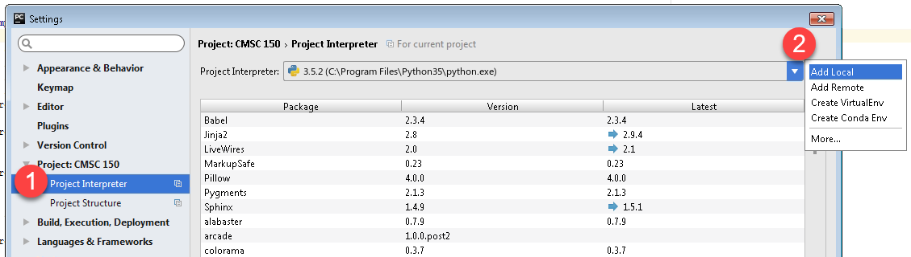

Appendix: Selecting Python
==========================

Our school computers have three different copies of Python installed. We need
to select the correct Python to run. This is how you do it.

Select File...Settings from the menu:

.. image:: project_settings.png

Next, select "Project Interpreter" from the left side.
Then select the gear icon on the right side, which will pop down a menu. Select
"Add Local."

Then browse to the Python interpreter that we want. See the path below. If you
are lucky, it might automatically select the interpreter for you.

.. image:: select_file.png

After you do this, the "run" option won't be available for a little while.
The computer will be reindexing all the commands. You can see this on the
bar at the bottom. When it is done, you should be able to run your programs.
